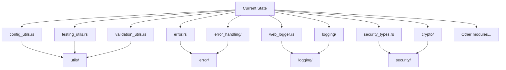

# Architectural Simplification Plan

## Executive Summary

This plan outlines a set of architectural simplifications for the DataFold project, focusing on merging utility modules, unifying error handling, consolidating logging, clarifying security boundaries, flattening redundant layers, and documenting module responsibilities. The goal is to reduce complexity, improve maintainability, and clarify module boundaries.

---

## 1. Current State Analysis

### Key Observations

- **Utility Modules:** Multiple utility files (`config_utils.rs`, `testing_utils.rs`, `validation_utils.rs`) can be merged or better organized.
- **Error Handling:** Both `error.rs` and `error_handling/` exist, potentially duplicating responsibilities.
- **Logging:** `web_logger.rs` and the `logging/` directory may overlap.
- **Security:** `security_types.rs` and `crypto/` may have unclear boundaries.
- **Redundant Layers:** Some modules may act as thin wrappers or unnecessary re-exports.

---

## 2. Proposed New Structure

### Directory Layout

- `utils/`
  - `config.rs`
  - `test.rs`
  - `validation.rs`
- `error/`
  - `mod.rs` (centralized error types, conversions, utilities)
- `logging/`
  - `outputs/`
    - `web.rs` (move `web_logger.rs` here)
  - `mod.rs`
- `security/`
  - `types.rs` (from `security_types.rs`)
  - `crypto/` (existing)
- Remove or flatten thin wrapper modules.

---

## 3. Migration Checklist

1. **Merge Utility Modules**
   - Create `utils/` directory.
   - Move and rename:
     - `config_utils.rs` → `utils/config.rs`
     - `testing_utils.rs` → `utils/test.rs`
     - `validation_utils.rs` → `utils/validation.rs`
   - Update all imports accordingly.

2. **Unify Error Handling**
   - Create `error/` directory.
   - Move `error.rs` and contents of `error_handling/` into `error/`.
   - Refactor to centralize error types and utilities.
   - Update imports.

3. **Consolidate Logging**
   - Move `web_logger.rs` into `logging/outputs/web.rs`.
   - Ensure all logging logic is under `logging/`.
   - Update imports.

4. **Clarify Security Boundaries**
   - Create `security/` directory.
   - Move `security_types.rs` to `security/types.rs`.
   - Review and clarify boundaries with `crypto/`.

5. **Flatten Redundant Layers**
   - Identify and remove thin wrapper modules.
   - Prefer direct imports over unnecessary re-exports.

6. **Document Module Responsibilities**
   - Add module-level doc comments to clarify each module’s purpose and boundaries.

---

## 4. Notes

- After migration, run all tests and update documentation as needed.
- Communicate changes to the team to ensure smooth adoption.

---

## 5. Rationale

This restructuring will:
- Reduce cognitive load for new contributors.
- Make module responsibilities explicit.
- Eliminate duplication and unnecessary indirection.
- Lay the groundwork for future scalability and maintainability.