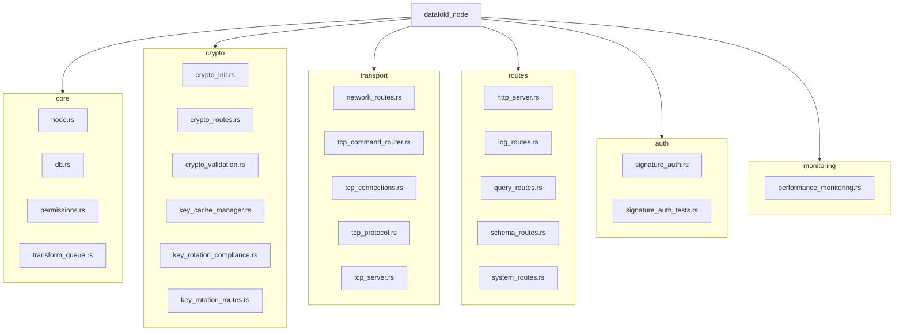

# Modular Reorganization Plan for `src/datafold_node/` (Revised)

## Current Situation

The `src/datafold_node/` directory contains a large number of files covering diverse concerns:
- Core node logic
- Cryptography and key management
- Networking (TCP, HTTP)
- API routes (HTTP)
- Signature authentication
- Monitoring and performance
- Permissions
- Tests and documentation

This makes the directory difficult to navigate and maintain.

---

## Revised Proposed Modular Structure

**Note:** To avoid confusion with the existing `src/network/` folder, network-related files in `src/datafold_node/` will be grouped under a new `transport/` submodule, which will contain TCP and node-specific networking logic.

```
src/datafold_node/
├── core/
│   ├── node.rs
│   ├── db.rs
│   ├── permissions.rs
│   ├── transform_queue.rs
│   └── mod.rs
├── crypto/
│   ├── crypto_init.rs
│   ├── crypto_routes.rs
│   ├── crypto_validation.rs
│   ├── key_cache_manager.rs
│   ├── key_rotation_compliance.rs
│   ├── key_rotation_routes.rs
│   └── mod.rs
├── transport/
│   ├── network_routes.rs
│   ├── tcp_command_router.rs
│   ├── tcp_connections.rs
│   ├── tcp_protocol.rs
│   ├── tcp_server.rs
│   └── mod.rs
├── routes/
│   ├── http_server.rs
│   ├── log_routes.rs
│   ├── query_routes.rs
│   ├── schema_routes.rs
│   ├── system_routes.rs
│   └── mod.rs
├── auth/
│   ├── signature_auth.rs
│   ├── signature_auth_tests.rs
│   └── mod.rs
├── monitoring/
│   ├── performance_monitoring.rs
│   └── mod.rs
├── config.rs
├── tests.rs
├── node.md
├── README_TCP_SERVER.md
├── mod.rs
```

### Details

- **core/**: Core node logic and state management.
- **crypto/**: All cryptography, key management, and compliance.
- **transport/**: Node-specific networking, TCP, and network route logic (distinct from shared networking code in `src/network/`).
- **routes/**: HTTP server and all API route handlers.
- **auth/**: Signature authentication and related tests.
- **monitoring/**: Performance and system monitoring.
- **config.rs**: Remains at the top level if used across submodules.
- **tests.rs**: Remains at the top level for integration/unit tests.
- **Documentation**: `node.md`, `README_TCP_SERVER.md` remain at the top level.

---

## Benefits

- **Avoids confusion** with the existing `src/network/` folder.
- **Improved discoverability**: Related files are grouped together.
- **Easier maintenance**: Clear boundaries for each concern.
- **Scalability**: New features can be added in the appropriate submodule.
- **Testability**: Tests can be grouped with their modules or in a dedicated `tests/` subdir.

---

## Mermaid Diagram



---

## Questions for Review

- Is the use of `transport/` for node-specific networking and TCP logic acceptable?
- Are there any files you would group differently?
- Should tests be grouped with modules or kept at the top level?
- Would you like to further split any of the proposed submodules?