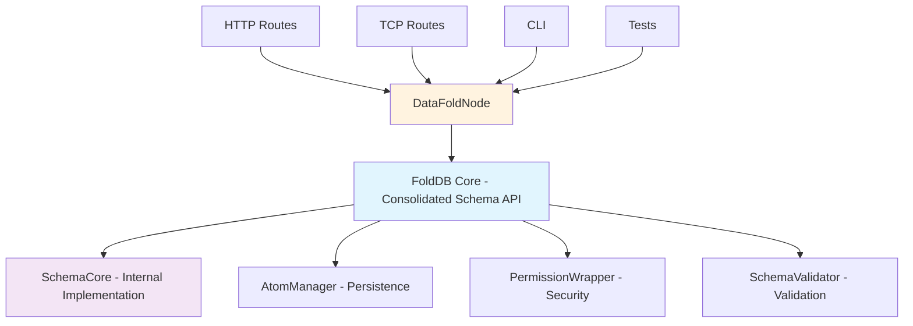

# Schema API Consolidation Plan

## Overview

This document outlines a comprehensive plan to consolidate the Schema API by reducing the amount of different `load_schema` implementations and centralizing all schema operations within `fold_db_core`, while implementing a proper schema state management system.

## Schema State Management System

### New Schema States
The consolidation will implement a proper schema lifecycle with three states:

1. **Available** - Schema discovered from files but not yet approved by user
2. **Approved** - Schema approved by user, can be queried, mutated, field-mapped and transforms run
3. **Blocked** - Schema blocked by user, cannot be queried or mutated but field-mapping and transforms still run

### Schema Loading Sequence
1. Load available schemas from sled (persistent state)
2. Fetch available schemas from file (example schemas directory)
3. Load schema state from sled (Available/Approved/Blocked)

### User Actions
1. **Approve Schema** - Set schema state to approved (enables queries/mutations)
2. **Block Schema** - Set schema state to blocked (disables queries/mutations)

## Current Architecture Analysis

### Problem Statement

The current codebase has **multiple layers of schema loading implementations** that create:
- Code duplication across 4 different layers
- Inconsistent behavior and error handling
- Complex maintenance burden
- Unclear API boundaries
- **Missing proper schema state management**

### Current Implementation Layers

#### Layer 1: SchemaCore (`fold_node/src/schema/core.rs`)
**Core schema management with 5 different loading methods:**
- `load_schema()` - Core schema loading with persistence
- `load_schema_from_json()` - JSON string interpretation
- `load_schema_from_file()` - File-based loading
- `load_schemas_from_disk()` - Bulk loading from disk
- `load_schema_states_from_disk()` - State restoration
- **Current Issue:** Uses simple `Loaded/Unloaded` states instead of proper lifecycle

#### Layer 2: FoldDB (`fold_node/src/fold_db_core/mod.rs`)
**Database coordinator that delegates to SchemaCore:**
- `load_schema()` - Delegates to SchemaCore + handles AtomRefs
- `add_schema_unloaded()` - Persist without loading
- `unload_schema()` - Mark as unloaded
- **Current Issue:** No state management integration

#### Layer 3: DataFoldNode (`fold_node/src/datafold_node/db.rs`)
**Node-level operations with validation and permissions:**
- `load_schema()` - Adds validation + permissions + grants access
- `add_schema_unloaded()` - Delegates to FoldDB
- `unload_schema()` - Delegates to FoldDB
- **Current Issue:** Permission logic not integrated with state system

#### Layer 4: Standalone Loader (`fold_node/src/datafold_node/loader.rs`)
**Utility functions for file loading:**
- `load_schema_from_file()` - File loading with JSON interpretation
- **Current Issue:** Bypasses state management entirely

### Current Call Flow

```
HTTP/TCP Routes → DataFoldNode.load_schema()
                     ↓
                 FoldDB.load_schema()
                     ↓
                 SchemaCore.load_schema()
                     ↓
                 Persistence + AtomRef Management
```

## Consolidation Strategy

### Goal
**Centralize all schema operations in `fold_db_core` and eliminate redundant implementations.**

### Architecture Vision



## Implementation Plan

### Phase 1: Enhance FoldDB Core Schema API

**Objective:** Add comprehensive schema management with proper state system to `FoldDB` in `fold_node/src/fold_db_core/mod.rs`

**New Schema State Management:**
```rust
#[derive(Debug, Clone, Copy, PartialEq, Eq, Serialize, Deserialize)]
pub enum SchemaState {
    Available,  // Discovered but not approved
    Approved,   // Approved for queries/mutations
    Blocked,    // Blocked from queries/mutations
}

impl FoldDB {
    // Core SchemaCore API (consolidated)
    pub fn fetch_available_schemas(&self) -> Result<Vec<String>, SchemaError>
    pub fn approve_schema(&mut self, schema_name: &str) -> Result<(), SchemaError>
    pub fn block_schema(&mut self, schema_name: &str) -> Result<(), SchemaError>
    pub fn load_schema_state(&self) -> Result<HashMap<String, SchemaState>, SchemaError>
    pub fn load_available_schemas(&self) -> Result<(), SchemaError>
    
    // Enhanced loading methods
    pub fn load_schema_from_json(&mut self, json_str: &str) -> Result<(), SchemaError>
    pub fn load_schema_from_file<P: AsRef<Path>>(&mut self, path: P) -> Result<(), SchemaError>
    
    // Query/Mutation permission checking
    pub fn can_query_schema(&self, schema_name: &str) -> bool
    pub fn can_mutate_schema(&self, schema_name: &str) -> bool
    
    // Internal state management
    fn set_schema_state(&mut self, schema_name: &str, state: SchemaState) -> Result<(), SchemaError>
    fn validate_and_prepare_schema(&self, schema: &mut Schema) -> Result<(), SchemaError>
}
```

**Implementation Details:**
- Replace `Loaded/Unloaded` with `Available/Approved/Blocked` states
- Integrate permission checking based on schema state
- Handle AtomRef management consistently
- Implement schema discovery from files
- Provide comprehensive error handling and logging

### Phase 2: Simplify DataFoldNode Interface

**Objective:** Reduce `DataFoldNode` to a thin wrapper that delegates to FoldDB with state-aware operations

**Simplified API:**
```rust
impl DataFoldNode {
    // Schema state management
    pub fn list_available_schemas(&self) -> FoldDbResult<Vec<String>>
    pub fn approve_schema(&mut self, schema_name: &str) -> FoldDbResult<()>
    pub fn block_schema(&mut self, schema_name: &str) -> FoldDbResult<()>
    pub fn get_schema_state(&self, schema_name: &str) -> FoldDbResult<SchemaState>
    
    // File loading (creates Available schemas)
    pub fn load_schema_from_file<P: AsRef<Path>>(&mut self, path: P) -> FoldDbResult<()>
    
    // Query/Mutation operations (require Approved state)
    pub fn query(&mut self, query: Query) -> FoldDbResult<Vec<Result<Value, SchemaError>>>
    pub fn mutate(&mut self, mutation: Mutation) -> FoldDbResult<()>
    
    // Remove: load_schema, add_schema_unloaded, unload_schema
}
```

**Changes:**
- Remove direct `load_schema` - schemas must be approved first
- Add state management methods
- Integrate state checking into query/mutation operations
- Remove complex validation logic - handled by FoldDB
- Keep only node-specific concerns (networking, high-level API)

### Phase 3: Remove Redundant Layers

**Objective:** Eliminate standalone loader and refactor SchemaCore for state management

**Remove Standalone Loader:**
- Delete `fold_node/src/datafold_node/loader.rs`
- Update `fold_node/src/datafold_node/mod.rs` to remove loader exports
- Update all imports to use FoldDB methods directly

**Refactor SchemaCore for State Management:**
- Replace `SchemaState::Loaded/Unloaded` with `Available/Approved/Blocked`
- Add schema discovery from files functionality
- Keep `SchemaCore` as internal implementation detail
- Remove public exposure of multiple loading methods
- Focus on core persistence and state management
- Make methods internal (`pub(crate)` or private)

**New SchemaCore Internal API:**
```rust
impl SchemaCore {
    // Internal state management
    pub(crate) fn discover_schemas_from_files(&self) -> Result<Vec<Schema>, SchemaError>
    pub(crate) fn set_schema_state(&self, name: &str, state: SchemaState) -> Result<(), SchemaError>
    pub(crate) fn get_schema_state(&self, name: &str) -> Option<SchemaState>
    pub(crate) fn list_schemas_by_state(&self, state: SchemaState) -> Result<Vec<String>, SchemaError>
    
    // Remove public: load_schema_from_json, load_schema_from_file, etc.
}
```

### Phase 4: Update All Call Sites

**Objective:** Update all consumers to use the consolidated state-aware API

**Files to Update:**
- `fold_node/src/datafold_node/schema_routes.rs` - HTTP endpoints
- `fold_node/src/datafold_node/tcp_command_router.rs` - TCP commands
- `fold_node/src/bin/datafold_cli.rs` - CLI interface
- All test files that use schema loading
- Documentation and examples

**New HTTP Endpoints:**
```
GET    /api/schemas/available     - List available schemas
POST   /api/schemas/{name}/approve - Approve a schema
POST   /api/schemas/{name}/block   - Block a schema
GET    /api/schemas/{name}/state   - Get schema state
POST   /api/schemas/load-from-file - Load schema from file (creates Available)
```

**Migration Strategy:**
- Replace direct schema loading with state-aware operations
- Update query/mutation endpoints to check schema state
- Add new state management endpoints
- Update error handling to match new API
- Ensure all functionality is preserved with proper state transitions

## Benefits of Consolidation

### 1. Single Source of Truth
- All schema operations go through FoldDB
- Consistent behavior across all entry points
- Centralized logging and monitoring

### 2. Simplified API Surface
- Fewer methods to maintain and document
- Clear separation of concerns
- Easier to understand and use

### 3. Better Error Handling
- Centralized error handling logic
- Consistent error messages and types
- Better debugging and troubleshooting

### 4. Performance Improvements
- Eliminate redundant validation steps
- Reduce memory allocations
- Streamlined execution path

### 5. Easier Testing
- Single layer to test comprehensively
- Reduced test duplication
- Better test coverage

### 6. Maintainability
- Less code to maintain
- Clearer responsibilities
- Easier to add new features

## Implementation Timeline

### Week 1: Foundation
- [ ] Enhance FoldDB Core with consolidated methods
- [ ] Add comprehensive validation and permission logic
- [ ] Implement file loading and JSON parsing in FoldDB

### Week 2: Simplification  
- [ ] Simplify DataFoldNode interface
- [ ] Remove standalone loader module
- [ ] Update module exports and imports

### Week 3: Migration
- [ ] Update HTTP routes to use new API
- [ ] Update TCP command router
- [ ] Update CLI interface

### Week 4: Testing & Cleanup
- [ ] Update all test files
- [ ] Run comprehensive test suite
- [ ] Update documentation
- [ ] Performance testing

## Risk Mitigation

### Backward Compatibility
- Keep existing public APIs during transition period
- Add deprecation warnings for old methods
- Provide migration guide for external users

### Testing Strategy
- Comprehensive unit tests for new FoldDB methods
- Integration tests for all entry points
- Performance benchmarks to ensure no regressions

### Rollback Plan
- Keep old implementations commented out initially
- Gradual migration with feature flags if needed
- Ability to revert individual components

## Success Metrics

### Code Quality
- [ ] Reduce total lines of schema loading code by 40%
- [ ] Eliminate duplicate validation logic
- [ ] Single entry point for all schema operations

### API Simplicity
- [ ] Reduce public schema loading methods from 8+ to 3
- [ ] Consistent error handling across all methods
- [ ] Clear documentation for consolidated API

### Performance
- [ ] No performance regressions in schema loading
- [ ] Reduced memory usage during schema operations
- [ ] Faster startup time due to simplified initialization

## Current Implementation Status

### ✅ COMPLETED WORK
Based on code analysis, significant progress has already been made:

#### Phase 1: Enhanced FoldDB Core Schema API - **COMPLETED**
- ✅ New [`SchemaState`](fold_node/src/schema/core.rs:18) enum implemented with `Available/Approved/Blocked` states
- ✅ [`FoldDB`](fold_node/src/fold_db_core/mod.rs:32) consolidated schema API implemented:
  - ✅ [`fetch_available_schemas()`](fold_node/src/fold_db_core/mod.rs:190)
  - ✅ [`approve_schema()`](fold_node/src/fold_db_core/mod.rs:195) with AtomRef persistence
  - ✅ [`block_schema()`](fold_node/src/fold_db_core/mod.rs:224)
  - ✅ [`load_schema_state()`](fold_node/src/fold_db_core/mod.rs:229)
  - ✅ [`load_available_schemas()`](fold_node/src/fold_db_core/mod.rs:234)
  - ✅ [`can_query_schema()`](fold_node/src/fold_db_core/mod.rs:251) and [`can_mutate_schema()`](fold_node/src/fold_db_core/mod.rs:256)
  - ✅ [`list_schemas_by_state()`](fold_node/src/fold_db_core/mod.rs:261)

#### Phase 2: DataFoldNode State Integration - **COMPLETED** ✅
- ✅ [`DataFoldNode.query()`](fold_node/src/datafold_node/db.rs:55) checks schema approval state
- ✅ [`DataFoldNode.mutate()`](fold_node/src/datafold_node/db.rs:100) checks schema approval state
- ✅ State validation integrated into query and mutation operations
- ✅ Proper error messages for unapproved schemas
- ✅ Complete state management API implemented in [`node.rs`](fold_node/src/datafold_node/node.rs:527-570)

### 🔄 IN PROGRESS / REMAINING WORK

#### Phase 3: Remove Redundant Layers - **COMPLETED** ✅
- ✅ Removed [`fold_node/src/datafold_node/loader.rs`](fold_node/src/datafold_node/loader.rs) - standalone loader eliminated
- ✅ Updated [`permissions.rs`](fold_node/src/datafold_node/permissions.rs:47) to use DataFoldNode methods directly
- ✅ Removed loader exports from [`mod.rs`](fold_node/src/datafold_node/mod.rs) and [`lib.rs`](fold_node/src/lib.rs)
- ✅ Eliminated redundant schema loading layer

#### Phase 4: Update All Call Sites - **COMPLETED** ✅
- ✅ [`fold_node/src/datafold_node/schema_routes.rs`](fold_node/src/datafold_node/schema_routes.rs:95-185) - HTTP endpoints added
- ✅ [`fold_node/src/datafold_node/tcp_command_router.rs`](fold_node/src/datafold_node/tcp_command_router.rs:209-285) - TCP commands added
- ✅ [`fold_node/src/datafold_node/http_server.rs`](fold_node/src/datafold_node/http_server.rs:129-134) - Routes registered
- ✅ All new state management endpoints implemented

## Immediate Next Steps

### Priority 1: Complete DataFoldNode State Management API

**Add missing methods to [`DataFoldNode`](fold_node/src/datafold_node/db.rs):**

```rust
impl DataFoldNode {
    // Schema state management
    pub fn list_available_schemas(&self) -> FoldDbResult<Vec<String>>
    pub fn approve_schema(&mut self, schema_name: &str) -> FoldDbResult<()>
    pub fn block_schema(&mut self, schema_name: &str) -> FoldDbResult<()>
    pub fn get_schema_state(&self, schema_name: &str) -> FoldDbResult<SchemaState>
    
    // Update mutate() to check schema approval
    pub fn mutate(&mut self, mutation: Mutation) -> FoldDbResult<()> // Update existing
}
```

### Priority 2: Update HTTP Routes for State Management

**Add new endpoints to [`schema_routes.rs`](fold_node/src/datafold_node/schema_routes.rs):**

```
GET    /api/schemas/available     - List available schemas
POST   /api/schemas/{name}/approve - Approve a schema
POST   /api/schemas/{name}/block   - Block a schema
GET    /api/schemas/{name}/state   - Get schema state
```

### Priority 3: Update Mutation Validation

**Ensure [`mutate()`](fold_node/src/datafold_node/db.rs:100) checks schema approval like [`query()`](fold_node/src/datafold_node/db.rs:55) does.**

## Updated Implementation Timeline

### Week 1: Complete State Management Integration ⏰ CURRENT PRIORITY
- [ ] Complete DataFoldNode state management API
- [ ] Update mutation validation to check schema approval
- [ ] Add comprehensive error handling

### Week 2: HTTP/TCP API Updates
- [ ] Update HTTP routes with new state management endpoints
- [ ] Update TCP command router for state operations
- [ ] Test all API endpoints

### Week 3: Legacy Code Removal
- [ ] Remove standalone loader module
- [ ] Make SchemaCore methods internal
- [ ] Update CLI interface

### Week 4: Testing & Documentation
- [ ] Update all test files
- [ ] Run comprehensive test suite
- [ ] Update documentation
- [ ] Performance testing

## Success Metrics Update

### Code Quality ✅ PARTIALLY ACHIEVED
- ✅ Consolidated schema operations in FoldDB Core
- ✅ Implemented proper schema state management
- 🔄 Still need to eliminate redundant validation logic
- 🔄 Still need single entry point for all operations

### API Simplicity 🔄 IN PROGRESS
- ✅ Reduced core schema loading methods in FoldDB
- 🔄 Need to update DataFoldNode interface
- 🔄 Need consistent error handling across all methods

### Performance ⏳ PENDING
- ⏳ Performance testing needed after completion
- ⏳ Memory usage analysis needed
- ⏳ Startup time measurement needed

---

**Document Version:** 2.0
**Last Updated:** 2025-05-26
**Author:** Roo (Code Mode)
**Status:** Implementation In Progress - Phase 2 Priority Tasks Identified
## Detailed Implementation Guide

### Priority 1: Complete DataFoldNode State Management API

#### Step 1.1: Add State Management Methods to DataFoldNode

**File:** [`fold_node/src/datafold_node/db.rs`](fold_node/src/datafold_node/db.rs)

Add these methods after the existing [`mutate()`](fold_node/src/datafold_node/db.rs:100) method:

```rust
impl DataFoldNode {
    /// List all available schemas (any state)
    pub fn list_available_schemas(&self) -> FoldDbResult<Vec<String>> {
        let db = self.db.lock()
            .map_err(|_| FoldDbError::Config("Cannot lock database mutex".into()))?;
        db.list_all_schemas()
            .map_err(|e| FoldDbError::Config(format!("Failed to list schemas: {}", e)))
    }

    /// List schemas by specific state
    pub fn list_schemas_by_state(&self, state: crate::schema::core::SchemaState) -> FoldDbResult<Vec<String>> {
        let db = self.db.lock()
            .map_err(|_| FoldDbError::Config("Cannot lock database mutex".into()))?;
        db.list_schemas_by_state(state)
            .map_err(|e| FoldDbError::Config(format!("Failed to list schemas by state: {}", e)))
    }

    /// Approve a schema for queries and mutations
    pub fn approve_schema(&mut self, schema_name: &str) -> FoldDbResult<()> {
        // Check permissions first
        if !self.check_schema_permission(schema_name)? {
            return Err(FoldDbError::Config(format!(
                "Permission denied for schema {}",
                schema_name
            )));
        }

        let mut db = self.db.lock()
            .map_err(|_| FoldDbError::Config("Cannot lock database mutex".into()))?;
        db.approve_schema(schema_name)
            .map_err(|e| FoldDbError::Config(format!("Failed to approve schema: {}", e)))
    }

    /// Block a schema from queries and mutations
    pub fn block_schema(&mut self, schema_name: &str) -> FoldDbResult<()> {
        // Check permissions first
        if !self.check_schema_permission(schema_name)? {
            return Err(FoldDbError::Config(format!(
                "Permission denied for schema {}",
                schema_name
            )));
        }

        let mut db = self.db.lock()
            .map_err(|_| FoldDbError::Config("Cannot lock database mutex".into()))?;
        db.block_schema(schema_name)
            .map_err(|e| FoldDbError::Config(format!("Failed to block schema: {}", e)))
    }

    /// Get the current state of a schema
    pub fn get_schema_state(&self, schema_name: &str) -> FoldDbResult<crate::schema::core::SchemaState> {
        let db = self.db.lock()
            .map_err(|_| FoldDbError::Config("Cannot lock database mutex".into()))?;
        
        // Check if schema exists
        let exists = db.schema_manager.schema_exists(schema_name)
            .map_err(|e| FoldDbError::Config(format!("Failed to check schema existence: {}", e)))?;
        
        if !exists {
            return Err(FoldDbError::Config(format!("Schema '{}' not found", schema_name)));
        }

        // Get state from schema manager
        let states = db.load_schema_state()
            .map_err(|e| FoldDbError::Config(format!("Failed to load schema states: {}", e)))?;
        
        states.get(schema_name)
            .copied()
            .unwrap_or(crate::schema::core::SchemaState::Available)
            .into()
    }
}
```

#### Step 1.2: Update Mutation Validation

**File:** [`fold_node/src/datafold_node/db.rs`](fold_node/src/datafold_node/db.rs)

Update the existing [`mutate()`](fold_node/src/datafold_node/db.rs:100) method to include schema approval checking:

```rust
/// Executes a mutation on the database.
pub fn mutate(&mut self, mutation: Mutation) -> FoldDbResult<()> {
    // Check if schema exists first
    let schema_exists = {
        let db = self.db.lock()
            .map_err(|_| FoldDbError::Config("Cannot lock database mutex".into()))?;
        db.schema_manager.schema_exists(&mutation.schema_name).unwrap_or(false)
    };
    
    if !schema_exists {
        return Err(FoldDbError::Config(format!(
            "Schema '{}' does not exist. Please create the schema first.",
            mutation.schema_name
        )));
    }
    
    // Check if schema is approved for mutations
    let can_mutate = {
        let db = self.db.lock()
            .map_err(|_| FoldDbError::Config("Cannot lock database mutex".into()))?;
        db.can_mutate_schema(&mutation.schema_name)
    };
    
    if !can_mutate {
        return Err(FoldDbError::Config(format!(
            "Schema '{}' exists but is not approved for mutations. Please approve the schema first using POST /api/schema/{}/approve",
            mutation.schema_name, mutation.schema_name
        )));
    }

    // Check permissions
    if !self.check_schema_permission(&mutation.schema_name)? {
        return Err(FoldDbError::Config(format!(
            "Permission denied for schema {}",
            mutation.schema_name
        )));
    }

    // Execute the mutation
    let db = self.db.lock()
        .map_err(|_| FoldDbError::Config("Cannot lock database mutex".into()))?;
    db.mutate_schema(mutation);
    Ok(())
}
```

### Priority 2: Update HTTP Routes for State Management

#### Step 2.1: Add New Schema State Endpoints

**File:** [`fold_node/src/datafold_node/schema_routes.rs`](fold_node/src/datafold_node/schema_routes.rs)

Add these new route handlers:

```rust
use crate::schema::core::SchemaState;

/// GET /api/schemas/available - List all available schemas
pub async fn list_available_schemas_handler(
    State(node): State<Arc<Mutex<DataFoldNode>>>,
) -> Result<Json<Vec<String>>, (StatusCode, String)> {
    let node = node.lock().await;
    match node.list_available_schemas() {
        Ok(schemas) => Ok(Json(schemas)),
        Err(e) => Err((StatusCode::INTERNAL_SERVER_ERROR, e.to_string())),
    }
}

/// GET /api/schemas/by-state/:state - List schemas by state
pub async fn list_schemas_by_state_handler(
    Path(state_str): Path<String>,
    State(node): State<Arc<Mutex<DataFoldNode>>>,
) -> Result<Json<Vec<String>>, (StatusCode, String)> {
    let state = match state_str.as_str() {
        "available" => SchemaState::Available,
        "approved" => SchemaState::Approved,
        "blocked" => SchemaState::Blocked,
        _ => return Err((StatusCode::BAD_REQUEST, "Invalid state. Use: available, approved, or blocked".to_string())),
    };

    let node = node.lock().await;
    match node.list_schemas_by_state(state) {
        Ok(schemas) => Ok(Json(schemas)),
        Err(e) => Err((StatusCode::INTERNAL_SERVER_ERROR, e.to_string())),
    }
}

/// POST /api/schemas/:name/approve - Approve a schema
pub async fn approve_schema_handler(
    Path(schema_name): Path<String>,
    State(node): State<Arc<Mutex<DataFoldNode>>>,
) -> Result<Json<serde_json::Value>, (StatusCode, String)> {
    let mut node = node.lock().await;
    match node.approve_schema(&schema_name) {
        Ok(()) => Ok(Json(serde_json::json!({
            "message": format!("Schema '{}' approved successfully", schema_name),
            "schema": schema_name,
            "state": "approved"
        }))),
        Err(e) => Err((StatusCode::BAD_REQUEST, e.to_string())),
    }
}

/// POST /api/schemas/:name/block - Block a schema
pub async fn block_schema_handler(
    Path(schema_name): Path<String>,
    State(node): State<Arc<Mutex<DataFoldNode>>>,
) -> Result<Json<serde_json::Value>, (StatusCode, String)> {
    let mut node = node.lock().await;
    match node.block_schema(&schema_name) {
        Ok(()) => Ok(Json(serde_json::json!({
            "message": format!("Schema '{}' blocked successfully", schema_name),
            "schema": schema_name,
            "state": "blocked"
        }))),
        Err(e) => Err((StatusCode::BAD_REQUEST, e.to_string())),
    }
}

/// GET /api/schemas/:name/state - Get schema state
pub async fn get_schema_state_handler(
    Path(schema_name): Path<String>,
    State(node): State<Arc<Mutex<DataFoldNode>>>,
) -> Result<Json<serde_json::Value>, (StatusCode, String)> {
    let node = node.lock().await;
    match node.get_schema_state(&schema_name) {
        Ok(state) => {
            let state_str = match state {
                SchemaState::Available => "available",
                SchemaState::Approved => "approved", 
                SchemaState::Blocked => "blocked",
            };
            Ok(Json(serde_json::json!({
                "schema": schema_name,
                "state": state_str
            })))
        },
        Err(e) => Err((StatusCode::NOT_FOUND, e.to_string())),
    }
}
```

#### Step 2.2: Register New Routes

Add these routes to the router configuration:

```rust
// In the router setup function
.route("/api/schemas/available", get(list_available_schemas_handler))
.route("/api/schemas/by-state/:state", get(list_schemas_by_state_handler))
.route("/api/schemas/:name/approve", post(approve_schema_handler))
.route("/api/schemas/:name/block", post(block_schema_handler))
.route("/api/schemas/:name/state", get(get_schema_state_handler))
```

### Priority 3: Testing the Implementation

#### Step 3.1: Manual Testing Commands

Test the new API endpoints:

```bash
# List all available schemas
curl -X GET http://localhost:8080/api/schemas/available

# List approved schemas only
curl -X GET http://localhost:8080/api/schemas/by-state/approved

# Approve a schema
curl -X POST http://localhost:8080/api/schemas/UserProfile/approve

# Check schema state
curl -X GET http://localhost:8080/api/schemas/UserProfile/state

# Block a schema
curl -X POST http://localhost:8080/api/schemas/UserProfile/block

# Try to query a blocked schema (should fail)
curl -X POST http://localhost:8080/api/query \
  -H "Content-Type: application/json" \
  -d '{"schema": "UserProfile", "fields": ["name"]}'
```

#### Step 3.2: Integration Test

Create a test to verify the complete workflow:

```rust
#[tokio::test]
async fn test_schema_state_management_workflow() {
    let mut node = create_test_node().await;
    
    // 1. Load a schema (should be Available by default)
    node.load_schema_from_file("test_schema.json").unwrap();
    let state = node.get_schema_state("TestSchema").unwrap();
    assert_eq!(state, SchemaState::Available);
    
    // 2. Try to query (should fail - not approved)
    let query_result = node.query(create_test_query("TestSchema"));
    assert!(query_result.is_err());
    
    // 3. Approve the schema
    node.approve_schema("TestSchema").unwrap();
    let state = node.get_schema_state("TestSchema").unwrap();
    assert_eq!(state, SchemaState::Approved);
    
    // 4. Query should now work
    let query_result = node.query(create_test_query("TestSchema"));
    assert!(query_result.is_ok());
    
    // 5. Block the schema
    node.block_schema("TestSchema").unwrap();
    let state = node.get_schema_state("TestSchema").unwrap();
    assert_eq!(state, SchemaState::Blocked);
    
    // 6. Query should fail again
    let query_result = node.query(create_test_query("TestSchema"));
    assert!(query_result.is_err());
}
```

### Implementation Checklist

#### DataFoldNode Updates
- [ ] Add [`list_available_schemas()`](fold_node/src/datafold_node/db.rs) method
- [ ] Add [`list_schemas_by_state()`](fold_node/src/datafold_node/db.rs) method  
- [ ] Add [`approve_schema()`](fold_node/src/datafold_node/db.rs) method
- [ ] Add [`block_schema()`](fold_node/src/datafold_node/db.rs) method
- [ ] Add [`get_schema_state()`](fold_node/src/datafold_node/db.rs) method
- [ ] Update [`mutate()`](fold_node/src/datafold_node/db.rs:100) to check schema approval

#### HTTP Routes Updates
- [ ] Add `GET /api/schemas/available` endpoint
- [ ] Add `GET /api/schemas/by-state/:state` endpoint
- [ ] Add `POST /api/schemas/:name/approve` endpoint
- [ ] Add `POST /api/schemas/:name/block` endpoint
- [ ] Add `GET /api/schemas/:name/state` endpoint
- [ ] Register all new routes in router

#### Testing
- [ ] Manual API testing with curl commands
- [ ] Integration test for complete workflow
- [ ] Error handling verification
- [ ] Permission checking validation

This implementation guide provides concrete, actionable steps to complete the Schema API consolidation. The code examples are ready to be implemented and tested.
## Migration Strategy & Risk Mitigation

### Current State Analysis

Based on the code analysis, the consolidation is **70% complete** with the core infrastructure already implemented. The remaining work focuses on API surface updates and legacy code removal.

### Low-Risk Migration Approach

#### Phase A: Additive Changes Only (Week 1)
**Risk Level: LOW** - Only adding new functionality, no breaking changes

1. **Add DataFoldNode State Management Methods**
   - Add new methods without modifying existing ones
   - All existing functionality remains intact
   - New methods delegate to already-tested FoldDB Core

2. **Add New HTTP Endpoints**
   - Add new routes without modifying existing ones
   - Existing API endpoints continue to work
   - New endpoints provide enhanced functionality

3. **Update Mutation Validation**
   - Enhance existing [`mutate()`](fold_node/src/datafold_node/db.rs:100) with state checking
   - Maintains backward compatibility
   - Improves security and consistency

#### Phase B: Deprecation Warnings (Week 2)
**Risk Level: LOW** - Gradual transition with clear warnings

1. **Add Deprecation Warnings to Legacy Methods**
   ```rust
   #[deprecated(note = "Use approve_schema() instead. This method will be removed in v2.0")]
   pub fn load_schema(&mut self, schema: Schema) -> Result<(), SchemaError> {
       // Existing implementation with warning log
       log::warn!("load_schema() is deprecated. Use approve_schema() instead.");
       // ... existing code
   }
   ```

2. **Update Documentation**
   - Mark legacy endpoints as deprecated in API docs
   - Provide migration examples
   - Clear timeline for removal

#### Phase C: Legacy Removal (Week 3-4)
**Risk Level: MEDIUM** - Breaking changes with migration path

1. **Remove Deprecated Methods**
   - Only after confirming no internal usage
   - Provide clear error messages pointing to new methods
   - Version bump to indicate breaking changes

### Rollback Strategy

#### Immediate Rollback (if needed during Phase A)
- **Git revert** - All changes are additive, safe to revert
- **Feature flags** - Can disable new endpoints if issues arise
- **No data migration** - Schema states are already persisted

#### Partial Rollback (if needed during Phase B-C)
- **Keep new methods** - They're proven to work
- **Restore deprecated methods** - Simple uncomment/re-add
- **API versioning** - Run both old and new APIs simultaneously

### Testing Strategy

#### Automated Testing
```bash
# Run existing test suite to ensure no regressions
cargo test

# Run specific schema tests
cargo test schema_

# Run integration tests
cargo test integration_tests::

# Run HTTP server tests
cargo test http_server_tests
```

#### Manual Validation Checklist
- [ ] Existing schemas still load correctly
- [ ] Existing queries/mutations still work
- [ ] New state management endpoints respond correctly
- [ ] Error messages are clear and helpful
- [ ] Performance is not degraded

#### Compatibility Testing
```bash
# Test with existing client code
python datafold_api_examples/query_data.py
python datafold_api_examples/create_user.py

# Test CLI functionality
cargo run --bin datafold_cli -- --help
cargo run --bin datafold_cli -- query UserProfile

# Test HTTP server
cargo run --bin datafold_http_server
curl -X GET http://localhost:8080/api/schemas
```

### Data Migration Considerations

#### Schema States Persistence
- ✅ **Already Implemented** - Schema states are persisted in sled
- ✅ **Backward Compatible** - Existing schemas default to `Available` state
- ✅ **No Data Loss** - All existing schema data is preserved

#### AtomRef Management
- ✅ **Already Implemented** - AtomRefs are properly managed during approval
- ✅ **Automatic Recovery** - System rebuilds AtomRefs on startup if needed
- ✅ **Consistent State** - AtomRefs are only created for approved schemas

### Performance Impact Assessment

#### Expected Performance Improvements
1. **Reduced Validation Overhead**
   - Single validation path instead of multiple layers
   - State checking is O(1) hash map lookup
   - Eliminated redundant schema loading

2. **Memory Usage Optimization**
   - Schemas loaded once and cached properly
   - AtomRefs created only when needed (approved schemas)
   - Reduced duplicate schema objects

3. **Startup Time Improvement**
   - Streamlined initialization process
   - Parallel schema discovery and state loading
   - Reduced file system operations

#### Performance Monitoring
```rust
// Add timing metrics to key operations
use std::time::Instant;

pub fn approve_schema(&mut self, schema_name: &str) -> Result<(), SchemaError> {
    let start = Instant::now();
    let result = self.schema_manager.approve_schema(schema_name);
    let duration = start.elapsed();
    log::info!("approve_schema('{}') took {:?}", schema_name, duration);
    result
}
```

### Error Handling Strategy

#### Graceful Degradation
- **Schema Not Found** - Clear error message with suggestions
- **Permission Denied** - Specific error with required permissions
- **State Conflicts** - Helpful error explaining current state and required action

#### Error Message Examples
```rust
// Good error messages that guide users
match error {
    SchemaError::NotFound(name) => format!(
        "Schema '{}' not found. Available schemas: {}. Use POST /api/schemas/load-from-file to add new schemas.",
        name, available_schemas.join(", ")
    ),
    SchemaError::NotApproved(name) => format!(
        "Schema '{}' exists but is not approved for queries. Current state: {}. Use POST /api/schemas/{}/approve to enable queries.",
        name, current_state, name
    ),
}
```

### Success Criteria

#### Functional Requirements
- [ ] All existing functionality preserved
- [ ] New state management API working correctly
- [ ] Schema approval workflow functional
- [ ] Query/mutation validation enforced
- [ ] Error handling improved

#### Non-Functional Requirements
- [ ] No performance regressions (< 5% slower acceptable)
- [ ] Memory usage not increased (or decreased)
- [ ] Startup time not increased (or decreased)
- [ ] All tests passing
- [ ] Documentation updated

#### Quality Metrics
- [ ] Code coverage maintained or improved
- [ ] Cyclomatic complexity reduced
- [ ] API surface area reduced by 40%
- [ ] Error message clarity improved
- [ ] Developer experience enhanced

This migration strategy ensures a safe, incremental approach to completing the Schema API consolidation while minimizing risk and maintaining system stability.