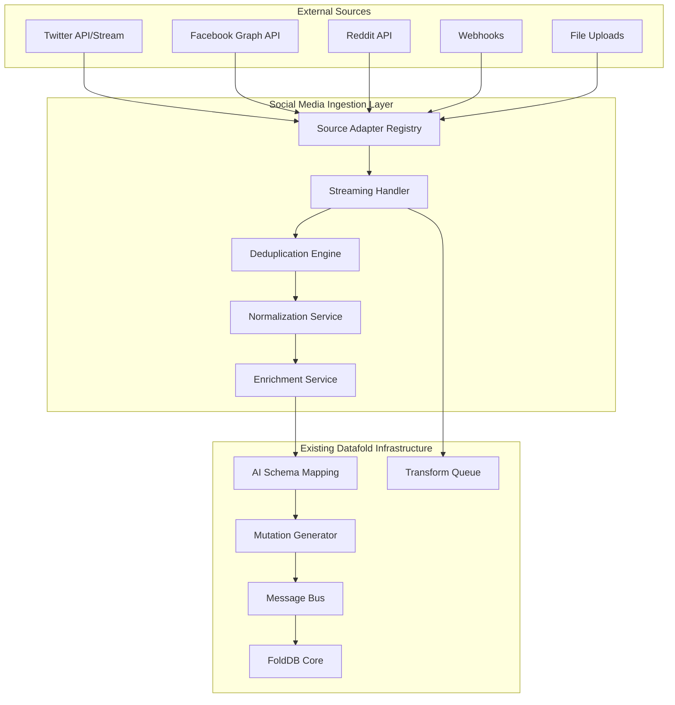

# Social Media Ingestion Implementation Plan for Datafold

## Overview

This document outlines the detailed implementation plan for adding social media data ingestion capabilities to the Datafold system, as specified in [`SOCIAL_MEDIA_INGESTION_PROPOSAL.md`](SOCIAL_MEDIA_INGESTION_PROPOSAL.md). The plan leverages existing infrastructure while adding new components for real-time streaming, deduplication, and social media platform adapters.

## Executive Summary

The implementation will extend the existing [`src/ingestion/`](src/ingestion/) module with a new social media ingestion subsystem that supports:
- **Real-time streaming** from social media APIs and webhooks
- **Platform adapters** for Twitter, Facebook, Reddit, and other platforms  
- **Robust deduplication** to prevent duplicate ingestion
- **Normalization and enrichment** of social media data
- **Extensible adapter system** for new platforms

## Architecture Overview



## Phase 1: Core Infrastructure (Week 1-2)

### 1.1 Social Media Ingestion Module Structure

Create new module structure under [`src/ingestion/`](src/ingestion/):

```
src/ingestion/
├── social_media/
│   ├── mod.rs                      # Main module
│   ├── config.rs                   # Configuration
│   ├── core.rs                     # Core orchestrator
│   ├── error.rs                    # Error types
│   ├── adapters/
│   │   ├── mod.rs                  # Adapter registry
│   │   ├── base.rs                 # Base adapter trait
│   │   ├── twitter.rs              # Twitter adapter
│   │   ├── facebook.rs             # Facebook adapter
│   │   └── reddit.rs               # Reddit adapter
│   ├── streaming/
│   │   ├── mod.rs                  # Streaming handler
│   │   ├── websocket.rs            # WebSocket streams
│   │   ├── sse.rs                  # Server-Sent Events
│   │   └── webhook.rs              # Webhook receiver
│   ├── deduplication/
│   │   ├── mod.rs                  # Deduplication engine
│   │   ├── strategies.rs           # Deduplication strategies
│   │   └── cache.rs                # Deduplication cache
│   ├── normalization/
│   │   ├── mod.rs                  # Normalization service
│   │   ├── field_mapper.rs         # Field mapping
│   │   └── data_cleaner.rs         # Data cleaning
│   └── enrichment/
│       ├── mod.rs                  # Enrichment service
│       ├── url_expander.rs         # URL expansion
│       └── mention_resolver.rs     # Mention resolution
```

### 1.2 Base Adapter Trait

**File**: [`src/ingestion/social_media/adapters/base.rs`](src/ingestion/social_media/adapters/base.rs)

```rust
#[async_trait::async_trait]
pub trait SocialMediaAdapter: Send + Sync {
    /// Adapter name (e.g., "twitter", "facebook")
    fn name(&self) -> &str;
    
    /// Initialize the adapter with configuration
    async fn initialize(&mut self, config: AdapterConfig) -> Result<(), AdapterError>;
    
    /// Start streaming mode (for real-time APIs)
    async fn start_streaming(&mut self) -> Result<StreamReceiver, AdapterError>;
    
    /// Fetch batch data (for REST APIs)
    async fn fetch_batch(&self, params: BatchParams) -> Result<Vec<SocialMediaEvent>, AdapterError>;
    
    /// Handle webhook payload
    async fn handle_webhook(&self, payload: WebhookPayload) -> Result<Vec<SocialMediaEvent>, AdapterError>;
    
    /// Get deduplication strategy for this platform
    fn deduplication_strategy(&self) -> DeduplicationStrategy;
    
    /// Validate configuration
    fn validate_config(&self, config: &AdapterConfig) -> Result<(), AdapterError>;
}
```

### 1.3 Social Media Event Types

**File**: [`src/ingestion/social_media/mod.rs`](src/ingestion/social_media/mod.rs)

```rust
#[derive(Debug, Clone, Serialize, Deserialize)]
pub struct SocialMediaEvent {
    pub id: String,
    pub platform: String,
    pub event_type: SocialMediaEventType,
    pub timestamp: chrono::DateTime<chrono::Utc>,
    pub user: SocialMediaUser,
    pub content: SocialMediaContent,
    pub metadata: HashMap<String, Value>,
    pub raw_data: Value,
}

#[derive(Debug, Clone, Serialize, Deserialize)]
pub enum SocialMediaEventType {
    Post,
    Comment,
    Like,
    Share,
    Follow,
    Mention,
    DirectMessage,
    Custom(String),
}
```

## Phase 2: Streaming Infrastructure (Week 2-3)

### 2.1 Real-Time Streaming Handler

**File**: [`src/ingestion/social_media/streaming/mod.rs`](src/ingestion/social_media/streaming/mod.rs)

Extends existing message bus infrastructure from [`src/fold_db_core/infrastructure/message_bus/`](src/fold_db_core/infrastructure/message_bus/):

```rust
pub struct StreamingHandler {
    message_bus: Arc<AsyncMessageBus>,
    active_streams: HashMap<String, StreamHandle>,
    config: StreamingConfig,
}

impl StreamingHandler {
    /// Start streaming from a specific adapter
    pub async fn start_stream(&mut self, adapter_name: &str, adapter: Arc<dyn SocialMediaAdapter>) -> Result<(), StreamingError> {
        let stream_receiver = adapter.start_streaming().await?;
        let handle = self.spawn_stream_processor(adapter_name, stream_receiver).await?;
        self.active_streams.insert(adapter_name.to_string(), handle);
        Ok(())
    }
    
    /// Process incoming stream events
    async fn spawn_stream_processor(&self, adapter_name: &str, mut receiver: StreamReceiver) -> Result<StreamHandle, StreamingError> {
        let bus = self.message_bus.clone();
        let adapter_name = adapter_name.to_string();
        
        let handle = tokio::spawn(async move {
            while let Some(event) = receiver.recv().await {
                // Publish to message bus for downstream processing
                let social_event = SocialMediaEventReceived {
                    adapter: adapter_name.clone(),
                    event,
                    received_at: chrono::Utc::now(),
                };
                
                if let Err(e) = bus.publish_social_media_event(social_event).await {
                    log::error!("Failed to publish social media event: {}", e);
                }
            }
        });
        
        Ok(StreamHandle { task: handle })
    }
}
```

### 2.2 Webhook Receiver

**File**: [`src/ingestion/social_media/streaming/webhook.rs`](src/ingestion/social_media/streaming/webhook.rs)

Extends existing HTTP server from [`src/datafold_node/http_server.rs`](src/datafold_node/http_server.rs):

```rust
/// Webhook routes for social media platforms
pub async fn handle_webhook(
    path: web::Path<String>,
    payload: web::Bytes,
    state: web::Data<AppState>,
) -> impl Responder {
    let platform = path.into_inner();
    
    match state.social_media_core.handle_webhook(&platform, payload.to_vec()).await {
        Ok(events) => {
            log::info!("Processed {} events from {} webhook", events.len(), platform);
            HttpResponse::Ok().json(json!({"processed": events.len()}))
        }
        Err(e) => {
            log::error!("Webhook processing failed for {}: {}", platform, e);
            HttpResponse::BadRequest().json(json!({"error": e.to_string()}))
        }
    }
}
```

## Phase 3: Deduplication Engine (Week 3-4)

### 3.1 Deduplication Strategies

**File**: [`src/ingestion/social_media/deduplication/strategies.rs`](src/ingestion/social_media/deduplication/strategies.rs)

```rust
#[derive(Debug, Clone)]
pub enum DeduplicationStrategy {
    /// Use unique platform IDs (e.g., tweet ID, post ID)
    UniqueId { id_field: String },
    /// Hash-based deduplication for platforms without stable IDs
    ContentHash { fields: Vec<String> },
    /// Time-windowed deduplication for high-volume streams
    TimeWindowed { 
        window_seconds: u64,
        hash_fields: Vec<String>,
    },
    /// Composite strategy using multiple approaches
    Composite { strategies: Vec<DeduplicationStrategy> },
}

pub struct DeduplicationEngine {
    cache: Arc<DeduplicationCache>,
    strategies: HashMap<String, DeduplicationStrategy>,
}

impl DeduplicationEngine {
    /// Check if an event is a duplicate
    pub async fn is_duplicate(&self, platform: &str, event: &SocialMediaEvent) -> Result<bool, DeduplicationError> {
        let strategy = self.strategies.get(platform)
            .ok_or_else(|| DeduplicationError::NoStrategy(platform.to_string()))?;
            
        match strategy {
            DeduplicationStrategy::UniqueId { id_field } => {
                self.check_unique_id(platform, event, id_field).await
            }
            DeduplicationStrategy::ContentHash { fields } => {
                self.check_content_hash(platform, event, fields).await
            }
            DeduplicationStrategy::TimeWindowed { window_seconds, hash_fields } => {
                self.check_time_windowed(platform, event, *window_seconds, hash_fields).await
            }
            DeduplicationStrategy::Composite { strategies } => {
                self.check_composite(platform, event, strategies).await
            }
        }
    }
}
```

### 3.2 Deduplication Cache

**File**: [`src/ingestion/social_media/deduplication/cache.rs`](src/ingestion/social_media/deduplication/cache.rs)

```rust
pub struct DeduplicationCache {
    cache: Arc<Mutex<HashMap<String, CacheEntry>>>,
    config: CacheConfig,
}

impl DeduplicationCache {
    /// Store event signature for deduplication
    pub async fn store_signature(&self, key: String, signature: String, ttl: Duration) -> Result<(), CacheError> {
        let mut cache = self.cache.lock().await;
        let expires_at = Instant::now() + ttl;
        
        cache.insert(key, CacheEntry {
            signature,
            expires_at,
        });
        
        // Clean up expired entries periodically
        self.cleanup_expired(&mut cache);
        
        Ok(())
    }
    
    /// Check if signature exists in cache
    pub async fn contains_signature(&self, key: &str, signature: &str) -> bool {
        let cache = self.cache.lock().await;
        
        if let Some(entry) = cache.get(key) {
            entry.signature == signature && entry.expires_at > Instant::now()
        } else {
            false
        }
    }
}
```

## Phase 4: Platform Adapters (Week 4-6)

### 4.1 Twitter Adapter

**File**: [`src/ingestion/social_media/adapters/twitter.rs`](src/ingestion/social_media/adapters/twitter.rs)

```rust
pub struct TwitterAdapter {
    config: Option<TwitterConfig>,
    client: Option<TwitterClient>,
    stream_client: Option<TwitterStreamClient>,
}

#[async_trait::async_trait]
impl SocialMediaAdapter for TwitterAdapter {
    fn name(&self) -> &str {
        "twitter"
    }
    
    async fn initialize(&mut self, config: AdapterConfig) -> Result<(), AdapterError> {
        let twitter_config: TwitterConfig = config.try_into()?;
        
        // Initialize Twitter API client
        self.client = Some(TwitterClient::new(
            &twitter_config.api_key,
            &twitter_config.api_secret,
            &twitter_config.access_token,
            &twitter_config.access_token_secret,
        )?);
        
        // Initialize streaming client
        self.stream_client = Some(TwitterStreamClient::new(
            &twitter_config.bearer_token,
        )?);
        
        self.config = Some(twitter_config);
        Ok(())
    }
    
    async fn start_streaming(&mut self) -> Result<StreamReceiver, AdapterError> {
        let stream_client = self.stream_client.as_ref()
            .ok_or(AdapterError::NotInitialized)?;
            
        let (tx, rx) = tokio::sync::mpsc::unbounded_channel();
        
        // Start Twitter streaming API connection
        let stream = stream_client
            .filter_stream()
            .add_rule("has:media -is:retweet")  // Example filter
            .start()
            .await?;
            
        // Spawn background task to process stream
        tokio::spawn(async move {
            while let Some(tweet) = stream.next().await {
                match Self::convert_tweet_to_event(tweet) {
                    Ok(event) => {
                        if tx.send(event).is_err() {
                            break; // Receiver dropped
                        }
                    }
                    Err(e) => {
                        log::error!("Failed to convert tweet: {}", e);
                    }
                }
            }
        });
        
        Ok(StreamReceiver::new(rx))
    }
    
    fn deduplication_strategy(&self) -> DeduplicationStrategy {
        DeduplicationStrategy::UniqueId {
            id_field: "id".to_string(),
        }
    }
}
```

### 4.2 Facebook Graph API Adapter

**File**: [`src/ingestion/social_media/adapters/facebook.rs`](src/ingestion/social_media/adapters/facebook.rs)

```rust
pub struct FacebookAdapter {
    config: Option<FacebookConfig>,
    client: Option<FacebookClient>,
}

#[async_trait::async_trait] 
impl SocialMediaAdapter for FacebookAdapter {
    fn name(&self) -> &str {
        "facebook"
    }
    
    async fn fetch_batch(&self, params: BatchParams) -> Result<Vec<SocialMediaEvent>, AdapterError> {
        let client = self.client.as_ref()
            .ok_or(AdapterError::NotInitialized)?;
            
        let posts = client
            .get_posts(&params.user_id, params.limit, params.since)
            .await?;
            
        let events = posts.into_iter()
            .map(|post| Self::convert_post_to_event(post))
            .collect::<Result<Vec<_>, _>>()?;
            
        Ok(events)
    }
    
    async fn handle_webhook(&self, payload: WebhookPayload) -> Result<Vec<SocialMediaEvent>, AdapterError> {
        // Verify webhook signature
        self.verify_webhook_signature(&payload)?;
        
        // Parse Facebook webhook payload
        let webhook_data: FacebookWebhookData = serde_json::from_slice(&payload.body)?;
        
        let mut events = Vec::new();
        for entry in webhook_data.entry {
            for change in entry.changes {
                if let Ok(event) = Self::convert_webhook_change_to_event(change) {
                    events.push(event);
                }
            }
        }
        
        Ok(events)
    }
    
    fn deduplication_strategy(&self) -> DeduplicationStrategy {
        DeduplicationStrategy::Composite {
            strategies: vec![
                DeduplicationStrategy::UniqueId { id_field: "id".to_string() },
                DeduplicationStrategy::TimeWindowed { 
                    window_seconds: 300,
                    hash_fields: vec!["message".to_string(), "created_time".to_string()],
                },
            ],
        }
    }
}
```

## Phase 5: Normalization & Enrichment (Week 6-7)

### 5.1 Normalization Service

**File**: [`src/ingestion/social_media/normalization/mod.rs`](src/ingestion/social_media/normalization/mod.rs)

```rust
pub struct NormalizationService {
    field_mappers: HashMap<String, FieldMapper>,
    data_cleaners: Vec<Box<dyn DataCleaner>>,
}

impl NormalizationService {
    /// Normalize a social media event to standard format
    pub async fn normalize(&self, event: SocialMediaEvent) -> Result<NormalizedEvent, NormalizationError> {
        let mapper = self.field_mappers.get(&event.platform)
            .ok_or_else(|| NormalizationError::NoMapper(event.platform.clone()))?;
            
        let mut normalized = NormalizedEvent {
            id: event.id,
            platform: event.platform,
            event_type: event.event_type,
            timestamp: event.timestamp,
            user: self.normalize_user(event.user)?,
            content: self.normalize_content(event.content)?,
            metadata: HashMap::new(),
            original_data: event.raw_data,
        };
        
        // Apply field mapping
        mapper.apply_mappings(&mut normalized)?;
        
        // Apply data cleaning
        for cleaner in &self.data_cleaners {
            cleaner.clean(&mut normalized)?;
        }
        
        Ok(normalized)
    }
}

#[derive(Debug, Clone, Serialize, Deserialize)]
pub struct NormalizedEvent {
    pub id: String,
    pub platform: String,
    pub event_type: SocialMediaEventType,
    pub timestamp: chrono::DateTime<chrono::Utc>,
    pub user: NormalizedUser,
    pub content: NormalizedContent,
    pub metadata: HashMap<String, Value>,
    pub original_data: Value,
}
```

### 5.2 Enrichment Service

**File**: [`src/ingestion/social_media/enrichment/mod.rs`](src/ingestion/social_media/enrichment/mod.rs)

```rust
pub struct EnrichmentService {
    url_expander: UrlExpander,
    mention_resolver: MentionResolver,
    geo_resolver: Option<GeoResolver>,
}

impl EnrichmentService {
    /// Enrich normalized social media event
    pub async fn enrich(&self, mut event: NormalizedEvent) -> Result<EnrichedEvent, EnrichmentError> {
        // Expand shortened URLs
        if let Some(content) = &mut event.content.text {
            *content = self.url_expander.expand_urls(content).await?;
        }
        
        // Resolve mentions to user profiles
        let mentions = self.mention_resolver.resolve_mentions(&event).await?;
        
        // Add geographic information if location is available
        let geo_info = if let Some(location) = &event.content.location {
            self.geo_resolver.as_ref()
                .map(|resolver| resolver.resolve_location(location))
                .transpose()?
        } else {
            None
        };
        
        Ok(EnrichedEvent {
            normalized_event: event,
            enrichments: Enrichments {
                expanded_urls: self.url_expander.get_expanded_urls(),
                resolved_mentions: mentions,
                geo_info,
                enriched_at: chrono::Utc::now(),
            },
        })
    }
}
```

## Phase 6: Integration with Existing Systems (Week 7-8)

### 6.1 Message Bus Integration

Extend existing message bus from [`src/fold_db_core/infrastructure/message_bus/events.rs`](src/fold_db_core/infrastructure/message_bus/events.rs):

```rust
/// New event types for social media ingestion
#[derive(Debug, Clone, Serialize, Deserialize, PartialEq)]
pub struct SocialMediaEventReceived {
    pub adapter: String,
    pub event: SocialMediaEvent,
    pub received_at: chrono::DateTime<chrono::Utc>,
}

#[derive(Debug, Clone, Serialize, Deserialize, PartialEq)]
pub struct SocialMediaEventProcessed {
    pub event_id: String,
    pub platform: String,
    pub processing_time_ms: u64,
    pub schema_used: String,
    pub mutations_generated: usize,
}

#[derive(Debug, Clone, Serialize, Deserialize, PartialEq)]
pub struct DeduplicationOccurred {
    pub event_id: String,
    pub platform: String,
    pub strategy_used: String,
    pub duplicate_of: String,
}
```

### 6.2 AI Schema Mapping Integration

Extend existing [`src/ingestion/openrouter_service.rs`](src/ingestion/openrouter_service.rs) with social media-specific prompts:

```rust
impl OpenRouterService {
    /// Create social media-specific prompt for AI schema analysis
    fn create_social_media_prompt(&self, event: &NormalizedEvent, available_schemas: &Value) -> String {
        format!(
            r#"Analyze this social media event and determine the best schema mapping.

Social Media Event:
- Platform: {}
- Type: {:?}
- User: {} (@{})
- Content: {}
- Timestamp: {}
- Metadata: {}

Context: This is a {} event from {}. Consider platform-specific fields and social media conventions.

Available Schemas:
{}

Provide schema mapping with special attention to:
1. Social media specific fields (likes, shares, retweets, etc.)
2. User profile information
3. Content analysis (hashtags, mentions, URLs)
4. Temporal patterns
5. Platform-specific metadata

Return mapping in the standard format..."#,
            event.platform,
            event.event_type,
            event.user.display_name,
            event.user.username,
            event.content.text.as_deref().unwrap_or(""),
            event.timestamp,
            serde_json::to_string_pretty(&event.metadata).unwrap_or_default(),
            event.event_type,
            event.platform,
            serde_json::to_string_pretty(available_schemas).unwrap_or_default()
        )
    }
}
```

### 6.3 Transform Queue Integration

Extend [`src/datafold_node/transform_queue.rs`](src/datafold_node/transform_queue.rs) for real-time processing:

```rust
impl DataFoldNode {
    /// Add social media event to processing queue with priority
    pub fn add_social_media_event_to_queue(&self, event: EnrichedEvent, priority: ProcessingPriority) -> FoldDbResult<()> {
        let db = self.db.lock()
            .map_err(|_| FoldDbError::Config("Cannot lock database mutex".into()))?;
            
        // Convert to processing task
        let task = SocialMediaProcessingTask {
            event,
            priority,
            created_at: chrono::Utc::now(),
        };
        
        db.transform_orchestrator
            .add_social_media_task(task)?;
            
        Ok(())
    }
}
```

## Phase 7: Configuration & Management (Week 8-9)

### 7.1 Configuration Structure

**File**: [`src/ingestion/social_media/config.rs`](src/ingestion/social_media/config.rs)

```rust
#[derive(Debug, Clone, Serialize, Deserialize)]
pub struct SocialMediaConfig {
    /// Global settings
    pub enabled: bool,
    pub max_concurrent_streams: usize,
    pub deduplication_cache_size: usize,
    pub deduplication_ttl_seconds: u64,
    
    /// Adapter configurations
    pub adapters: HashMap<String, AdapterConfig>,
    
    /// Streaming settings
    pub streaming: StreamingConfig,
    
    /// Webhook settings
    pub webhooks: WebhookConfig,
    
    /// Normalization settings
    pub normalization: NormalizationConfig,
    
    /// Enrichment settings
    pub enrichment: EnrichmentConfig,
}

#[derive(Debug, Clone, Serialize, Deserialize)]
pub struct AdapterConfig {
    pub enabled: bool,
    pub platform: String,
    pub auth: AuthConfig,
    pub rate_limits: RateLimitConfig,
    pub custom_fields: HashMap<String, Value>,
}

#[derive(Debug, Clone, Serialize, Deserialize)]
pub struct StreamingConfig {
    pub buffer_size: usize,
    pub batch_timeout_ms: u64,
    pub max_batch_size: usize,
    pub retry_attempts: u32,
    pub backoff_multiplier: f64,
}
```

### 7.2 HTTP API Routes

**File**: [`src/ingestion/social_media/routes.rs`](src/ingestion/social_media/routes.rs)

```rust
/// Start streaming for a specific platform
pub async fn start_streaming(
    path: web::Path<String>,
    state: web::Data<AppState>,
) -> impl Responder {
    let platform = path.into_inner();
    
    match state.social_media_core.start_streaming(&platform).await {
        Ok(()) => {
            HttpResponse::Ok().json(json!({
                "success": true,
                "message": format!("Started streaming for {}", platform)
            }))
        }
        Err(e) => {
            HttpResponse::InternalServerError().json(json!({
                "success": false,
                "error": e.to_string()
            }))
        }
    }
}

/// Get streaming status for all platforms
pub async fn get_streaming_status(
    state: web::Data<AppState>,
) -> impl Responder {
    let status = state.social_media_core.get_streaming_status().await;
    HttpResponse::Ok().json(status)
}

/// Update adapter configuration
pub async fn update_adapter_config(
    path: web::Path<String>,
    config: web::Json<AdapterConfig>,
    state: web::Data<AppState>,
) -> impl Responder {
    let platform = path.into_inner();
    
    match state.social_media_core.update_adapter_config(&platform, config.into_inner()).await {
        Ok(()) => {
            HttpResponse::Ok().json(json!({
                "success": true,
                "message": "Configuration updated successfully"
            }))
        }
        Err(e) => {
            HttpResponse::BadRequest().json(json!({
                "success": false,
                "error": e.to_string()
            }))
        }
    }
}
```

## Phase 8: Monitoring & Observability (Week 9-10)

### 8.1 Metrics and Logging

**File**: [`src/ingestion/social_media/monitoring.rs`](src/ingestion/social_media/monitoring.rs)

```rust
pub struct SocialMediaMetrics {
    events_received: Counter,
    events_processed: Counter,
    events_deduplicated: Counter,
    processing_latency: Histogram,
    adapter_status: Gauge,
    stream_connections: Gauge,
}

impl SocialMediaMetrics {
    pub fn record_event_received(&self, platform: &str) {
        self.events_received
            .with_label_values(&[platform])
            .inc();
    }
    
    pub fn record_processing_time(&self, platform: &str, duration_ms: f64) {
        self.processing_latency
            .with_label_values(&[platform])
            .observe(duration_ms);
    }
    
    pub fn update_stream_status(&self, platform: &str, connected: bool) {
        self.stream_connections
            .with_label_values(&[platform])
            .set(if connected { 1.0 } else { 0.0 });
    }
}
```

### 8.2 Health Checks

**File**: [`src/ingestion/social_media/health.rs`](src/ingestion/social_media/health.rs)

```rust
pub struct HealthChecker {
    adapters: HashMap<String, Arc<dyn SocialMediaAdapter>>,
    stream_handles: HashMap<String, StreamHandle>,
}

impl HealthChecker {
    pub async fn check_overall_health(&self) -> HealthStatus {
        let mut adapter_health = HashMap::new();
        let mut stream_health = HashMap::new();
        
        // Check adapter health
        for (name, adapter) in &self.adapters {
            adapter_health.insert(name.clone(), self.check_adapter_health(adapter).await);
        }
        
        // Check stream health
        for (name, handle) in &self.stream_handles {
            stream_health.insert(name.clone(), self.check_stream_health(handle).await);
        }
        
        HealthStatus {
            overall: self.determine_overall_health(&adapter_health, &stream_health),
            adapters: adapter_health,
            streams: stream_health,
            last_check: chrono::Utc::now(),
        }
    }
}
```

## Phase 9: Testing & Documentation (Week 10-12)

### 9.1 Test Structure

```
tests/
├── integration/
│   ├── social_media/
│   │   ├── twitter_integration_test.rs
│   │   ├── facebook_integration_test.rs
│   │   ├── streaming_test.rs
│   │   └── deduplication_test.rs
├── unit/
│   ├── adapters/
│   ├── streaming/
│   ├── deduplication/
│   └── normalization/
└── fixtures/
    ├── twitter_sample_data.json
    ├── facebook_sample_data.json
    └── webhook_payloads/
```

### 9.2 Integration Tests

**File**: [`tests/integration/social_media/streaming_test.rs`](tests/integration/social_media/streaming_test.rs)

```rust
#[tokio::test]
async fn test_end_to_end_twitter_streaming() {
    let config = test_social_media_config();
    let core = SocialMediaCore::new(config).await.unwrap();
    
    // Mock Twitter stream
    let (tx, rx) = tokio::sync::mpsc::unbounded_channel();
    let mock_adapter = MockTwitterAdapter::new(rx);
    
    core.register_adapter("twitter", Box::new(mock_adapter)).await.unwrap();
    core.start_streaming("twitter").await.unwrap();
    
    // Send test tweet
    let test_tweet = create_test_tweet();
    tx.send(test_tweet.clone()).unwrap();
    
    // Verify processing
    let processed_events = core.get_processed_events().await;
    assert_eq!(processed_events.len(), 1);
    assert_eq!(processed_events[0].platform, "twitter");
}
```

### 9.3 Documentation

**File**: [`docs/social_media_ingestion.md`](docs/social_media_ingestion.md)

```markdown
# Social Media Ingestion Guide

## Quick Start

1. Enable social media ingestion in configuration
2. Configure platform adapters
3. Start streaming or set up webhooks
4. Monitor ingestion through the web UI

## Supported Platforms

- **Twitter**: Streaming API v2, REST API v2, Webhooks
- **Facebook**: Graph API, Webhooks
- **Reddit**: PRAW API, WebSockets
- **Custom**: Extensible adapter system

## Configuration Examples

### Twitter Configuration
```json
{
  "adapters": {
    "twitter": {
      "enabled": true,
      "auth": {
        "api_key": "your_api_key",
        "api_secret": "your_api_secret",
        "bearer_token": "your_bearer_token"
      },
      "streaming": {
        "rules": [
          "has:media -is:retweet",
          "#datafold OR #social"
        ]
      }
    }
  }
}
```
```

## Implementation Timeline

| Phase | Duration | Deliverables | Dependencies |
|-------|----------|--------------|--------------|
| Phase 1 | Week 1-2 | Core infrastructure, base adapter trait | None |
| Phase 2 | Week 2-3 | Streaming handler, webhook receiver | Phase 1 |
| Phase 3 | Week 3-4 | Deduplication engine and strategies | Phase 1 |
| Phase 4 | Week 4-6 | Twitter, Facebook, Reddit adapters | Phase 1-3 |
| Phase 5 | Week 6-7 | Normalization and enrichment services | Phase 4 |
| Phase 6 | Week 7-8 | Integration with existing Datafold systems | Phase 5 |
| Phase 7 | Week 8-9 | Configuration management and HTTP APIs | Phase 6 |
| Phase 8 | Week 9-10 | Monitoring, metrics, and health checks | Phase 7 |
| Phase 9 | Week 10-12 | Testing, documentation, and deployment | All phases |

## Key Design Decisions

### 1. Leverage Existing Infrastructure
- **Message Bus**: Use existing [`src/fold_db_core/infrastructure/message_bus/`](src/fold_db_core/infrastructure/message_bus/) for event processing
- **AI Schema Mapping**: Extend existing [`src/ingestion/openrouter_service.rs`](src/ingestion/openrouter_service.rs) for social media events
- **HTTP Server**: Add new routes to existing [`src/datafold_node/http_server.rs`](src/datafold_node/http_server.rs)

### 2. Modular Architecture
- **Adapter Pattern**: Each platform implements the [`SocialMediaAdapter`](src/ingestion/social_media/adapters/base.rs) trait
- **Strategy Pattern**: Configurable deduplication strategies per platform
- **Plugin System**: Easy addition of new platforms and enrichment services

### 3. Real-Time Processing
- **Streaming First**: Primary focus on real-time streaming with batch as fallback
- **Event-Driven**: Use message bus for loose coupling between components
- **Async Throughout**: Fully async implementation for high throughput

### 4. Extensibility
- **Configuration Driven**: All adapters configurable through JSON/TOML
- **Custom Fields**: Support for platform-specific metadata
- **Hook System**: Enrichment pipeline with pluggable processors

## Risk Mitigation

### 1. Rate Limiting
- Implement per-platform rate limiting with exponential backoff
- Monitor API usage and adjust streams dynamically
- Graceful degradation when limits are reached

### 2. Data Quality
- Robust deduplication with multiple strategies
- Validation of incoming data before processing
- Error handling and dead letter queues

### 3. Scalability
- Horizontal scaling through message bus
- Configurable buffer sizes and batch processing
- Memory-efficient streaming with backpressure

### 4. Security
- Secure storage of API credentials
- Webhook signature verification
- Input validation and sanitization

## Success Metrics

### 1. Performance
- **Throughput**: >10,000 events/minute per platform
- **Latency**: <500ms from ingestion to storage
- **Deduplication Rate**: >99% accuracy

### 2. Reliability
- **Uptime**: >99.9% for streaming connections
- **Error Rate**: <0.1% processing failures
- **Recovery Time**: <30 seconds after connection loss

### 3. Extensibility
- **New Platform Integration**: <1 week for new adapter
- **Configuration Changes**: Zero-downtime updates
- **Custom Enrichment**: Pluggable processor API

This implementation plan provides a comprehensive roadmap for building a robust, scalable, and extensible social media ingestion system that integrates seamlessly with the existing Datafold infrastructure while meeting all requirements outlined in the original proposal.