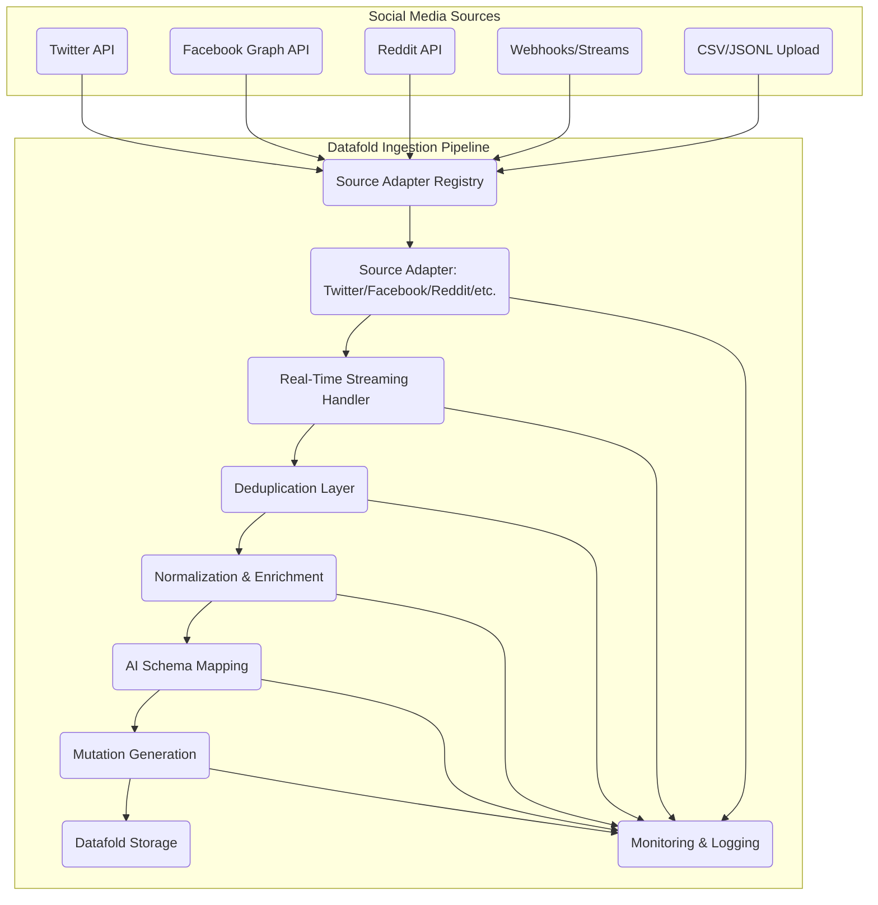

# Social Media Data Ingestion Proposal for Datafold

## 1. Key Requirements

- **Source Diversity:** REST APIs, webhooks, streaming APIs (WebSockets, SSE), file uploads.
- **Real-Time Streaming:** Support for continuous ingestion from streaming APIs and webhooks, with low-latency processing.
- **Deduplication:** Robust deduplication layer to prevent duplicate social media events (using unique IDs, hashes, or time-windowed logic).
- **Schema Flexibility:** AI-powered mapping to Datafold schemas.
- **Extensibility:** Adapter/plugin system for new platforms.
- **Normalization & Enrichment:** Clean, deduplicate, and enrich data.
- **Monitoring & Error Handling:** Centralized logging, error tracking, and retry logic.

---

## 2. Architecture Diagram

---

## 3. Detailed Plan

### Step 1: Source Adapter Trait/Interface
- Each adapter supports both batch and streaming modes.
- Streaming handler manages connections (WebSockets, long polling, etc.) and pushes events to the pipeline.

### Step 2: Real-Time Streaming Handler
- Manages event loop for streaming APIs and webhooks.
- Buffers and batches events for downstream processing.

### Step 3: Deduplication Layer
- Deduplication strategies:
  - Use unique social media event IDs (e.g., tweet ID, post ID).
  - Hash-based deduplication for platforms without stable IDs.
  - Time-windowed deduplication for high-volume streams.
- Configurable per-adapter.

### Step 4: Normalization & Enrichment
- Standardize fields (timestamps, user IDs, text).
- Enrich with metadata (e.g., resolve mentions, expand URLs).

### Step 5: AI Schema Mapping & Mutation Generation
- Pass normalized, deduplicated data to existing AI-powered schema mapping and mutation generator.

### Step 6: Monitoring, Logging, and Error Handling
- Centralized logging for all pipeline stages.
- Error tracking, retry logic, and UI for monitoring.

### Step 7: Extensibility & Configuration
- UI/config for adding adapters, setting API keys, and scheduling.
- Documentation for building new adapters.

---

## 4. Implementation Notes

- The pipeline should be modular, allowing new adapters and deduplication strategies to be plugged in with minimal changes.
- Real-time streaming and deduplication are first-class citizens in the architecture.
- The deduplication layer should be highly configurable to accommodate the nuances of different social media platforms.
- Monitoring and logging should provide visibility into each stage of the pipeline for debugging and operational excellence.

---

*This document serves as a design reference for implementing robust, extensible, and real-time social media data ingestion in Datafold.*