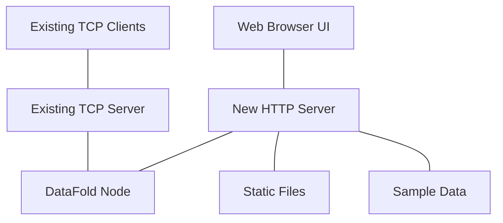

# DataFold UI Revised Implementation Plan

Based on our discussions, this document outlines the revised implementation plan for creating a user-friendly UI for DataFold using the simplified approach with separate servers.

## 1. Overview

We will create a user-friendly UI for DataFold that allows loading schemas, mutations, and queries with a clean interface and Rust backend. The implementation will use separate servers for TCP and HTTP to maintain backward compatibility while providing a modern web interface.



## 2. Component Architecture

### 2.1 Server Components

1. **Existing TCP Server**
   - Remains unchanged
   - Continues to serve existing TCP clients
   - Maintains all current functionality

2. **New HTTP Server**
   - Serves static files for the UI
   - Provides REST API endpoints
   - Acts as a client to the TCP server
   - Manages sample data

3. **Shared DataFold Node**
   - Core data storage and operations
   - Accessed by both servers

### 2.2 Frontend Components

1. **Schema Management UI**
   - Visual schema representation
   - Form-based schema creation/editing
   - One-click sample schema loading

2. **Query Builder UI**
   - Intuitive field selection
   - Visual filter building
   - One-click sample query loading

3. **Mutation Builder UI**
   - Form-based data entry
   - Validation based on schema
   - One-click sample mutation loading

4. **Sample Data Library**
   - Categorized samples
   - Preview functionality
   - One-click loading

5. **Results Viewer**
   - Formatted display
   - Table view option
   - Export functionality

## 3. Implementation Details

### 3.1 HTTP Server Implementation

We will create a new HTTP server using the Actix Web framework:

```rust
use actix_web::{web, App, HttpServer, HttpResponse, Responder};
use actix_files::Files;
use std::sync::{Arc, Mutex};
use serde_json::Value;

struct AppState {
    tcp_client: TcpClient,
    sample_manager: SampleManager,
}

#[actix_web::main]
async fn main() -> std::io::Result<()> {
    // Create TCP client
    let tcp_client = TcpClient::new("127.0.0.1:9000").await?;
    
    // Create sample manager
    let sample_manager = SampleManager::new();
    
    // Create shared state
    let app_state = web::Data::new(Arc::new(Mutex::new(AppState {
        tcp_client,
        sample_manager,
    })));
    
    // Start HTTP server
    HttpServer::new(move || {
        App::new()
            .app_data(app_state.clone())
            // Static files
            .service(Files::new("/", "./static").index_file("index.html"))
            // API routes
            .service(web::scope("/api")
                .route("/schemas", web::get().to(list_schemas))
                .route("/schema/{name}", web::get().to(get_schema))
                .route("/schema", web::post().to(create_schema))
                .route("/schema/{name}", web::put().to(update_schema))
                .route("/schema/{name}", web::delete().to(delete_schema))
                .route("/query", web::post().to(execute_query))
                .route("/mutation", web::post().to(execute_mutation))
                // Sample routes
                .route("/samples/schemas", web::get().to(list_schema_samples))
                .route("/samples/queries", web::get().to(list_query_samples))
                .route("/samples/mutations", web::get().to(list_mutation_samples))
                .route("/samples/schema/{name}", web::get().to(get_schema_sample))
                .route("/samples/query/{name}", web::get().to(get_query_sample))
                .route("/samples/mutation/{name}", web::get().to(get_mutation_sample))
            )
    })
    .bind("127.0.0.1:9001")?
    .run()
    .await
}
```

### 3.2 TCP Client Implementation

We will implement a TCP client to communicate with the existing TCP server:

```rust
struct TcpClient {
    connection: TcpStream,
}

impl TcpClient {
    async fn new(addr: &str) -> Result<Self, Error> {
        let connection = TcpStream::connect(addr).await?;
        Ok(Self { connection })
    }
    
    async fn send_request(&mut self, request: Value) -> Result<Value, Error> {
        // Serialize the request
        let request_bytes = serde_json::to_vec(&request)?;
        
        // Send the request length
        self.connection.write_u32(request_bytes.len() as u32).await?;
        
        // Send the request
        self.connection.write_all(&request_bytes).await?;
        
        // Read the response length
        let response_len = self.connection.read_u32().await? as usize;
        
        // Read the response
        let mut response_bytes = vec![0u8; response_len];
        self.connection.read_exact(&mut response_bytes).await?;
        
        // Deserialize the response
        let response = serde_json::from_slice(&response_bytes)?;
        
        Ok(response)
    }
}
```

### 3.3 Sample Data Management

We will implement a sample manager to handle sample data:

```rust
struct SampleManager {
    schemas: HashMap<String, Value>,
    queries: HashMap<String, Value>,
    mutations: HashMap<String, Value>,
}

impl SampleManager {
    fn new() -> Self {
        let mut manager = Self {
            schemas: HashMap::new(),
            queries: HashMap::new(),
            mutations: HashMap::new(),
        };
        
        manager.load_samples();
        manager
    }
    
    fn load_samples(&mut self) {
        // Load sample schemas from files
        let schema_dir = Path::new("samples/schemas");
        for entry in fs::read_dir(schema_dir).unwrap() {
            let entry = entry.unwrap();
            let path = entry.path();
            
            if path.is_file() && path.extension().unwrap_or_default() == "json" {
                let name = path.file_stem().unwrap().to_str().unwrap().to_string();
                let content = fs::read_to_string(&path).unwrap();
                let schema: Value = serde_json::from_str(&content).unwrap();
                
                self.schemas.insert(name, schema);
            }
        }
        
        // Load sample queries and mutations similarly
        // ...
    }
    
    fn get_schema_sample(&self, name: &str) -> Option<&Value> {
        self.schemas.get(name)
    }
    
    fn list_schema_samples(&self) -> Vec<String> {
        self.schemas.keys().cloned().collect()
    }
    
    // Similar methods for queries and mutations
    // ...
}
```

### 3.4 API Endpoint Implementations

We will implement the API endpoints to handle requests from the UI:

```rust
async fn list_schemas(state: web::Data<Arc<Mutex<AppState>>>) -> impl Responder {
    let mut app_state = state.lock().unwrap();
    
    // Create request for TCP server
    let request = json!({
        "operation": "list_schemas"
    });
    
    // Send request to TCP server
    match app_state.tcp_client.send_request(request).await {
        Ok(response) => HttpResponse::Ok().json(response),
        Err(e) => HttpResponse::InternalServerError().json(json!({
            "error": format!("Failed to list schemas: {}", e)
        }))
    }
}

async fn get_schema_sample(
    path: web::Path<String>,
    state: web::Data<Arc<Mutex<AppState>>>
) -> impl Responder {
    let app_state = state.lock().unwrap();
    let name = path.into_inner();
    
    if let Some(sample) = app_state.sample_manager.get_schema_sample(&name) {
        HttpResponse::Ok().json(sample)
    } else {
        HttpResponse::NotFound().json(json!({
            "error": format!("Sample schema '{}' not found", name)
        }))
    }
}

// Similar implementations for other endpoints
// ...
```

### 3.5 Frontend Implementation

We will enhance the existing UI files in `fold_node/src/datafold_node/static/` to create a more intuitive and user-friendly interface:

```javascript
// schema.js - Enhanced schema management
async function loadSchemaList() {
    try {
        const response = await fetch('/api/schemas');
        const schemas = await response.json();
        
        const schemaListDiv = document.getElementById('schemaList');
        schemaListDiv.innerHTML = '';
        
        if (schemas.length === 0) {
            schemaListDiv.innerHTML = '<div class="status">No schemas loaded</div>';
        } else {
            schemas.forEach(schema => {
                const schemaItem = createSchemaItem(schema);
                schemaListDiv.appendChild(schemaItem);
            });
        }
    } catch (error) {
        displayError('Failed to load schemas: ' + error.message);
    }
}

// samples.js - Sample data library
async function loadSampleSchemas() {
    try {
        const response = await fetch('/api/samples/schemas');
        const samples = await response.json();
        
        const sampleListDiv = document.getElementById('sampleSchemaList');
        sampleListDiv.innerHTML = '';
        
        samples.forEach(name => {
            const sampleItem = document.createElement('div');
            sampleItem.className = 'sample-item';
            sampleItem.innerHTML = `
                <h3>${name}</h3>
                <div class="sample-actions">
                    <button class="btn btn-primary" onclick="previewSampleSchema('${name}')">Preview</button>
                    <button class="btn btn-success" onclick="loadSampleSchema('${name}')">Load</button>
                </div>
            `;
            sampleListDiv.appendChild(sampleItem);
        });
    } catch (error) {
        displayError('Failed to load sample schemas: ' + error.message);
    }
}

async function loadSampleSchema(name) {
    try {
        const response = await fetch(`/api/samples/schema/${name}`);
        const schema = await response.json();
        
        // Load the schema into the editor
        document.getElementById('schemaInput').value = JSON.stringify(schema, null, 2);
        
        // Show success message
        displayMessage(`Sample schema '${name}' loaded successfully`);
    } catch (error) {
        displayError('Failed to load sample schema: ' + error.message);
    }
}

// Similar implementations for queries and mutations
// ...
```

## 4. Sample Data Implementation

We will create sample data files based on the designs in `datafold_sample_data_design.md`. These files will be stored in the following directory structure:

```
samples/
├── schemas/
│   ├── UserProfile.json
│   ├── ProductCatalog.json
│   ├── BlogPost.json
│   ├── SocialMediaPost.json
│   └── FinancialTransaction.json
├── queries/
│   ├── BasicUserQuery.json
│   ├── FilteredUserQuery.json
│   ├── ProductCategoryQuery.json
│   ├── RecentBlogPostsQuery.json
│   ├── PopularSocialPostsQuery.json
│   └── TransactionHistoryQuery.json
└── mutations/
    ├── CreateUser.json
    ├── UpdateUser.json
    ├── CreateProduct.json
    ├── UpdateProductInventory.json
    ├── CreateBlogPost.json
    ├── DeleteBlogPost.json
    ├── CreateSocialPost.json
    ├── AddLikeToSocialPost.json
    ├── CreateFinancialTransaction.json
    └── UpdateTransactionStatus.json
```

## 5. UI Enhancements

Based on the mockups in `datafold_ui_mockups.md`, we will implement the following UI enhancements:

### 5.1 Schema Management

- Visual schema representation
- Form-based schema creation/editing
- One-click sample schema loading
- Import/export functionality

### 5.2 Query Builder

- Schema selection dropdown
- Field selection with checkboxes
- Visual filter builder
- One-click sample query loading

### 5.3 Mutation Builder

- Schema selection dropdown
- Mutation type selection
- Form-based data entry with validation
- One-click sample mutation loading

### 5.4 Sample Data Library

- Categorized sample browser
- Preview functionality
- One-click loading
- Related sample suggestions

### 5.5 Results Viewer

- Formatted JSON display
- Table view for query results
- Export functionality
- History of previous results

## 6. Implementation Timeline

### Phase 1: HTTP Server and TCP Client (Week 1)

1. **Day 1-2: HTTP Server Setup**
   - Create basic HTTP server with Actix Web
   - Implement static file serving
   - Set up project structure

2. **Day 3-4: TCP Client Implementation**
   - Implement TCP client for communication with TCP server
   - Add connection pooling
   - Implement error handling

3. **Day 5: API Endpoint Scaffolding**
   - Create basic API endpoints
   - Implement request/response handling
   - Add logging and error reporting

### Phase 2: Sample Data Management (Week 2)

1. **Day 1-2: Sample Manager Implementation**
   - Create sample manager structure
   - Implement sample loading from files
   - Add sample retrieval methods

2. **Day 3-4: Sample Data Creation**
   - Create sample schema files
   - Create sample query files
   - Create sample mutation files

3. **Day 5: Sample API Endpoints**
   - Implement sample listing endpoints
   - Implement sample retrieval endpoints
   - Add sample preview functionality

### Phase 3: Frontend UI Enhancements (Week 3)

1. **Day 1-2: Schema Management UI**
   - Enhance schema list view
   - Implement schema detail view
   - Add schema editor

2. **Day 3-4: Query and Mutation UI**
   - Implement query builder
   - Implement mutation builder
   - Add validation and error handling

3. **Day 5: Sample Library UI**
   - Create sample browser interface
   - Implement preview functionality
   - Add one-click loading

### Phase 4: Integration and Testing (Week 4)

1. **Day 1-2: Integration**
   - Connect all components
   - Implement error handling
   - Add loading states

2. **Day 3-4: Testing**
   - Test all functionality
   - Fix bugs
   - Optimize performance

3. **Day 5: Documentation and Finalization**
   - Create user documentation
   - Add tooltips and help text
   - Final polish and cleanup

## 7. Conclusion

This revised implementation plan provides a clear roadmap for creating a user-friendly UI for DataFold using the simplified approach with separate servers. By keeping the existing TCP server unchanged and implementing a new HTTP server for the UI, we can maintain backward compatibility while providing a modern, intuitive interface for managing schemas, queries, and mutations.

The plan includes detailed implementation steps for each component, a timeline for development, and a focus on creating a clean, easy-to-use UI with one-click sample loading. This approach reduces complexity, minimizes risk, and provides a clear path to a successful implementation.