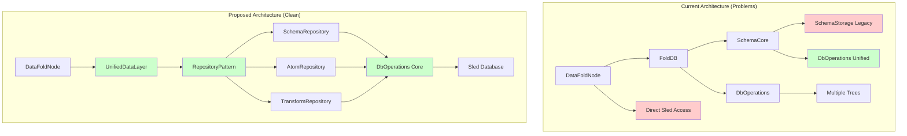

# Database Operations Architecture Improvement Plan

## Executive Summary

This document outlines a comprehensive plan to improve the database operations and data access patterns in the DataFold project. The current architecture suffers from mixed legacy/unified approaches, inconsistent error handling, and excessive code duplication. This plan proposes a unified repository pattern with clear separation of concerns, improved performance, and better maintainability.

## Current Architecture Analysis

### Identified Problems

#### 1. Mixed Legacy/Unified Approaches
The codebase shows clear evidence of a transition from legacy patterns to unified operations, but both approaches coexist:

- **Legacy Approach**: [`SchemaStorage`](fold_node/src/schema/storage.rs:11) with direct sled access
- **Unified Approach**: [`DbOperations`](fold_node/src/db_operations/core.rs:8) with structured operations
- **Hybrid Usage**: [`SchemaCore`](fold_node/src/schema/core.rs:66) uses both approaches conditionally

```rust
// Current problematic pattern in SchemaCore
fn persist_states(&self) -> Result<(), SchemaError> {
    if let Some(_db_ops) = &self.db_ops {
        // Use unified operations
        self.persist_states_unified()
    } else {
        // Use legacy storage
        let available = self.available.lock()...
        self.storage.persist_states(&available)
    }
}
```

#### 2. Multiple Database Access Layers
At least 3 different ways to access the database exist:

1. **Direct Sled Access**: Raw database operations scattered throughout
2. **DbOperations Layer**: Structured but incomplete abstraction
3. **Legacy Storage**: Schema-specific storage patterns

#### 3. Inconsistent Error Handling
Different layers use incompatible error types:

- [`SchemaError`](fold_node/src/schema/core.rs:1) for schema operations
- [`FoldDbError`](fold_node/src/datafold_node/db.rs:4) for node operations  
- [`sled::Error`](fold_node/src/fold_db_core/mod.rs:49) for database operations

#### 4. Repetitive Serialization/Deserialization
Each operation module reimplements similar JSON serialization patterns:

```rust
// Repeated pattern across multiple files
let bytes = serde_json::to_vec(item)
    .map_err(|e| SchemaError::InvalidData(format!("Failed to serialize: {}", e)))?;
self.tree.insert(key.as_bytes(), bytes)
    .map_err(|e| SchemaError::InvalidData(format!("Failed to store: {}", e)))?;
```

#### 5. Lock Contention Issues
Heavy use of [`Mutex`](fold_node/src/schema/core.rs:68) locks throughout the system:

```rust
// Current problematic locking in DataFoldNode
let db = self.db.lock()
    .map_err(|_| FoldDbError::Config("Cannot lock database mutex".into()))?;
```

#### 6. Schema Management Complexity
[`SchemaCore`](fold_node/src/schema/core.rs:66) has multiple initialization paths and discovery methods:

- `init_default()`
- `new()`
- `new_with_trees()`
- `new_with_db_ops()`

## Proposed Architecture

### Architecture Diagram



### Core Principles

1. **Single Responsibility**: Each repository handles one domain
2. **DRY (Don't Repeat Yourself)**: Eliminate code duplication
3. **Consistent Error Handling**: Unified error types
4. **Performance**: Reduced lock contention and connection pooling
5. **Testability**: Repository pattern enables easy unit testing

## Implementation Plan

### Phase 1: Consolidate Database Access Patterns

**Goal**: Eliminate the mixed legacy/unified approaches and create a single, consistent data access layer.

#### 1.1 Create Unified Repository Pattern

Create a new data layer module with consistent interfaces:

```rust
// New: fold_node/src/data_layer/mod.rs
pub mod repository;
pub mod serialization;
pub mod error;
pub mod connection_pool;
pub mod transaction;

pub use repository::Repository;
pub use error::DataLayerError;
pub use connection_pool::DatabasePool;
```

#### 1.2 Define Repository Trait

```rust
// New: fold_node/src/data_layer/repository.rs
pub trait Repository<T, K> {
    type Error;
    
    fn get(&self, key: &K) -> Result<Option<T>, Self::Error>;
    fn store(&self, key: &K, item: &T) -> Result<(), Self::Error>;
    fn list(&self) -> Result<Vec<K>, Self::Error>;
    fn delete(&self, key: &K) -> Result<(), Self::Error>;
    fn exists(&self, key: &K) -> Result<bool, Self::Error>;
}
```

#### 1.3 Unified Error Type

```rust
// New: fold_node/src/data_layer/error.rs
#[derive(Debug, thiserror::Error)]
pub enum DataLayerError {
    #[error("Serialization error: {0}")]
    Serialization(#[from] serde_json::Error),
    #[error("Database error: {0}")]
    Database(#[from] sled::Error),
    #[error("Not found: {0}")]
    NotFound(String),
    #[error("Invalid data: {0}")]
    InvalidData(String),
    #[error("Lock error: {0}")]
    Lock(String),
}
```

#### 1.4 Implement Schema Repository

```rust
// New: fold_node/src/data_layer/schema_repository.rs
pub struct SchemaRepository {
    db_ops: Arc<DbOperations>,
}

impl Repository<Schema, String> for SchemaRepository {
    type Error = DataLayerError;
    
    fn get(&self, schema_name: &String) -> Result<Option<Schema>, Self::Error> {
        self.db_ops.get_schema(schema_name)
            .map_err(|e| DataLayerError::Database(e.into()))
    }
    
    fn store(&self, schema_name: &String, schema: &Schema) -> Result<(), Self::Error> {
        self.db_ops.store_schema(schema_name, schema)
            .map_err(|e| DataLayerError::Database(e.into()))
    }
    
    fn list(&self) -> Result<Vec<String>, Self::Error> {
        self.db_ops.list_all_schemas()
            .map_err(|e| DataLayerError::Database(e.into()))
    }
    
    fn delete(&self, schema_name: &String) -> Result<(), Self::Error> {
        // Implementation for schema deletion
        todo!("Implement schema deletion")
    }
    
    fn exists(&self, schema_name: &String) -> Result<bool, Self::Error> {
        Ok(self.get(schema_name)?.is_some())
    }
}

// State management methods
impl SchemaRepository {
    pub fn get_state(&self, schema_name: &str) -> Result<Option<SchemaState>, DataLayerError> {
        self.db_ops.get_schema_state(schema_name)
            .map_err(Into::into)
    }
    
    pub fn set_state(&self, schema_name: &str, state: SchemaState) -> Result<(), DataLayerError> {
        self.db_ops.store_schema_state(schema_name, state)
            .map_err(Into::into)
    }
    
    pub fn list_by_state(&self, state: SchemaState) -> Result<Vec<String>, DataLayerError> {
        self.db_ops.list_schemas_by_state(state)
            .map_err(Into::into)
    }
}
```

### Phase 2: Eliminate Redundant Serialization Code

**Goal**: Create reusable serialization utilities and reduce code duplication.

#### 2.1 Generic Serialization Utilities

```rust
// New: fold_node/src/data_layer/serialization.rs
use serde::{Serialize, de::DeserializeOwned};
use super::error::DataLayerError;

pub trait Serializable: Serialize + DeserializeOwned {}
impl<T: Serialize + DeserializeOwned> Serializable for T {}

pub struct SerializationHelper;

impl SerializationHelper {
    pub fn serialize<T: Serializable>(item: &T) -> Result<Vec<u8>, DataLayerError> {
        serde_json::to_vec(item).map_err(DataLayerError::Serialization)
    }
    
    pub fn deserialize<T: Serializable>(bytes: &[u8]) -> Result<T, DataLayerError> {
        serde_json::from_slice(bytes).map_err(DataLayerError::Serialization)
    }
    
    pub fn store_item<T: Serializable>(
        tree: &sled::Tree, 
        key: &str, 
        item: &T
    ) -> Result<(), DataLayerError> {
        let bytes = Self::serialize(item)?;
        tree.insert(key.as_bytes(), bytes)?;
        tree.flush()?;
        Ok(())
    }
    
    pub fn get_item<T: Serializable>(
        tree: &sled::Tree, 
        key: &str
    ) -> Result<Option<T>, DataLayerError> {
        match tree.get(key.as_bytes())? {
            Some(bytes) => Ok(Some(Self::deserialize(&bytes)?)),
            None => Ok(None),
        }
    }
    
    pub fn list_items<T: Serializable>(
        tree: &sled::Tree
    ) -> Result<Vec<(String, T)>, DataLayerError> {
        let mut items = Vec::new();
        for result in tree.iter() {
            let (key, value) = result?;
            let key_str = String::from_utf8_lossy(&key).to_string();
            let item = Self::deserialize(&value)?;
            items.push((key_str, item));
        }
        Ok(items)
    }
}
```

### Phase 3: Reduce Lock Contention

**Goal**: Minimize mutex usage and implement more efficient concurrency patterns.

#### 3.1 Replace Heavy Mutex Usage with Arc<RwLock>

```rust
// Updated: fold_node/src/schema/core.rs
use std::sync::{Arc, RwLock};

pub struct SchemaCore {
    /// Use RwLock for better read concurrency
    schemas: Arc<RwLock<HashMap<String, Schema>>>,
    available: Arc<RwLock<HashMap<String, (Schema, SchemaState)>>>,
    repository: SchemaRepository,
}

impl SchemaCore {
    pub fn get_schema(&self, schema_name: &str) -> Result<Option<Schema>, DataLayerError> {
        // Try memory first (fast read lock)
        {
            let schemas = self.schemas.read()
                .map_err(|_| DataLayerError::Lock("Schema lock poisoned".into()))?;
            if let Some(schema) = schemas.get(schema_name) {
                return Ok(Some(schema.clone()));
            }
        }
        
        // Fall back to repository
        self.repository.get(&schema_name.to_string())
    }
    
    pub fn list_loaded_schemas(&self) -> Result<Vec<String>, DataLayerError> {
        let schemas = self.schemas.read()
            .map_err(|_| DataLayerError::Lock("Schema lock poisoned".into()))?;
        Ok(schemas.keys().cloned().collect())
    }
}
```

#### 3.2 Implement Connection Pooling Pattern

```rust
// New: fold_node/src/data_layer/connection_pool.rs
pub struct DatabasePool {
    db: Arc<sled::Db>,
    repositories: Arc<RepositoryRegistry>,
}

pub struct RepositoryRegistry {
    schema_repo: SchemaRepository,
    atom_repo: AtomRepository,
    transform_repo: TransformRepository,
}

impl DatabasePool {
    pub fn new(path: &str) -> Result<Self, DataLayerError> {
        let db = Arc::new(sled::open(path)?);
        let db_ops = Arc::new(DbOperations::new((*db).clone())?);
        
        let repositories = Arc::new(RepositoryRegistry {
            schema_repo: SchemaRepository::new(db_ops.clone()),
            atom_repo: AtomRepository::new(db_ops.clone()),
            transform_repo: TransformRepository::new(db_ops.clone()),
        });
        
        Ok(Self { db, repositories })
    }
    
    pub fn schemas(&self) -> &SchemaRepository {
        &self.repositories.schema_repo
    }
    
    pub fn atoms(&self) -> &AtomRepository {
        &self.repositories.atom_repo
    }
    
    pub fn transforms(&self) -> &TransformRepository {
        &self.repositories.transform_repo
    }
    
    pub fn stats(&self) -> Result<DatabaseStats, DataLayerError> {
        // Provide database statistics
        Ok(DatabaseStats {
            total_schemas: self.schemas().list()?.len(),
            total_atoms: self.atoms().count()?,
            total_transforms: self.transforms().list()?.len(),
        })
    }
}

#[derive(Debug)]
pub struct DatabaseStats {
    pub total_schemas: usize,
    pub total_atoms: usize,
    pub total_transforms: usize,
}
```

### Phase 4: Simplify Schema Management

**Goal**: Consolidate the multiple schema discovery and initialization paths.

#### 4.1 Unified Schema Service

```rust
// New: fold_node/src/data_layer/schema_service.rs
pub struct SchemaService {
    repository: SchemaRepository,
    discovery: SchemaDiscovery,
}

pub struct SchemaDiscovery {
    available_schemas_dir: PathBuf,
    data_schemas_dir: PathBuf,
}

impl SchemaService {
    pub fn new(repository: SchemaRepository) -> Self {
        Self {
            repository,
            discovery: SchemaDiscovery {
                available_schemas_dir: PathBuf::from("available_schemas"),
                data_schemas_dir: PathBuf::from("data/schemas"),
            },
        }
    }
    
    pub async fn initialize(&self) -> Result<SchemaLoadingReport, DataLayerError> {
        let mut report = SchemaLoadingReport::new();
        
        // Single discovery method that handles all sources
        let discovered = self.discovery.discover_all_sources().await?;
        
        for (source, schemas) in discovered {
            for schema in schemas {
                match self.repository.store(&schema.name, &schema) {
                    Ok(_) => {
                        report.add_success(&schema.name, source);
                        self.repository.set_state(&schema.name, SchemaState::Available)?;
                    }
                    Err(e) => report.add_failure(&schema.name, e.to_string()),
                }
            }
        }
        
        Ok(report)
    }
    
    pub fn approve_schema(&self, schema_name: &str) -> Result<(), DataLayerError> {
        // Validate schema exists
        if !self.repository.exists(&schema_name.to_string())? {
            return Err(DataLayerError::NotFound(format!("Schema '{}' not found", schema_name)));
        }
        
        // Set approved state
        self.repository.set_state(schema_name, SchemaState::Approved)
    }
    
    pub fn block_schema(&self, schema_name: &str) -> Result<(), DataLayerError> {
        self.repository.set_state(schema_name, SchemaState::Blocked)
    }
    
    pub fn get_status(&self) -> Result<SchemaLoadingReport, DataLayerError> {
        // Generate comprehensive status report
        let all_schemas = self.repository.list()?;
        let mut report = SchemaLoadingReport::new();
        
        for schema_name in all_schemas {
            if let Some(state) = self.repository.get_state(&schema_name)? {
                report.add_schema_with_state(&schema_name, state);
            }
        }
        
        Ok(report)
    }
}

impl SchemaDiscovery {
    pub async fn discover_all_sources(&self) -> Result<Vec<(SchemaSource, Vec<Schema>)>, DataLayerError> {
        let mut results = Vec::new();
        
        // Discover from available_schemas directory
        if let Ok(schemas) = self.discover_from_directory(&self.available_schemas_dir).await {
            results.push((SchemaSource::AvailableDirectory, schemas));
        }
        
        // Discover from data/schemas directory
        if let Ok(schemas) = self.discover_from_directory(&self.data_schemas_dir).await {
            results.push((SchemaSource::DataDirectory, schemas));
        }
        
        Ok(results)
    }
    
    async fn discover_from_directory(&self, dir: &PathBuf) -> Result<Vec<Schema>, DataLayerError> {
        let mut schemas = Vec::new();
        
        if let Ok(entries) = std::fs::read_dir(dir) {
            for entry in entries.flatten() {
                let path = entry.path();
                if path.extension().map(|e| e == "json").unwrap_or(false) {
                    if let Ok(schema) = self.load_schema_from_file(&path).await {
                        schemas.push(schema);
                    }
                }
            }
        }
        
        Ok(schemas)
    }
    
    async fn load_schema_from_file(&self, path: &PathBuf) -> Result<Schema, DataLayerError> {
        let contents = std::fs::read_to_string(path)
            .map_err(|e| DataLayerError::InvalidData(format!("Failed to read file: {}", e)))?;
        
        // Try direct Schema deserialization first
        if let Ok(schema) = serde_json::from_str::<Schema>(&contents) {
            return Ok(schema);
        }
        
        // Fall back to JsonSchemaDefinition interpretation
        let json_schema: JsonSchemaDefinition = serde_json::from_str(&contents)
            .map_err(|e| DataLayerError::Serialization(e))?;
        
        // Convert JsonSchemaDefinition to Schema
        self.interpret_json_schema(json_schema)
    }
    
    fn interpret_json_schema(&self, json_schema: JsonSchemaDefinition) -> Result<Schema, DataLayerError> {
        // Implementation for converting JsonSchemaDefinition to Schema
        // This would contain the logic currently in SchemaCore::interpret_schema
        todo!("Implement JSON schema interpretation")
    }
}
```

### Phase 5: Implement Transaction Support

**Goal**: Add proper transaction support for complex operations.

#### 5.1 Transaction Manager

```rust
// New: fold_node/src/data_layer/transaction.rs
pub struct Transaction {
    db: Arc<sled::Db>,
    operations: Vec<TransactionOperation>,
}

enum TransactionOperation {
    Insert { tree: String, key: Vec<u8>, value: Vec<u8> },
    Delete { tree: String, key: Vec<u8> },
    Update { tree: String, key: Vec<u8>, value: Vec<u8> },
}

impl Transaction {
    pub fn new(db: Arc<sled::Db>) -> Self {
        Self {
            db,
            operations: Vec::new(),
        }
    }
    
    pub fn insert<T: Serializable>(
        &mut self, 
        tree_name: &str, 
        key: &str, 
        value: &T
    ) -> Result<(), DataLayerError> {
        let serialized = SerializationHelper::serialize(value)?;
        self.operations.push(TransactionOperation::Insert {
            tree: tree_name.to_string(),
            key: key.as_bytes().to_vec(),
            value: serialized,
        });
        Ok(())
    }
    
    pub fn update<T: Serializable>(
        &mut self, 
        tree_name: &str, 
        key: &str, 
        value: &T
    ) -> Result<(), DataLayerError> {
        let serialized = SerializationHelper::serialize(value)?;
        self.operations.push(TransactionOperation::Update {
            tree: tree_name.to_string(),
            key: key.as_bytes().to_vec(),
            value: serialized,
        });
        Ok(())
    }
    
    pub fn delete(&mut self, tree_name: &str, key: &str) {
        self.operations.push(TransactionOperation::Delete {
            tree: tree_name.to_string(),
            key: key.as_bytes().to_vec(),
        });
    }
    
    pub fn commit(self) -> Result<(), DataLayerError> {
        // Execute all operations atomically
        for op in self.operations {
            match op {
                TransactionOperation::Insert { tree, key, value } => {
                    let tree_handle = self.db.open_tree(&tree)?;
                    tree_handle.insert(key, value)?;
                }
                TransactionOperation::Update { tree, key, value } => {
                    let tree_handle = self.db.open_tree(&tree)?;
                    tree_handle.insert(key, value)?; // sled treats insert as upsert
                }
                TransactionOperation::Delete { tree, key } => {
                    let tree_handle = self.db.open_tree(&tree)?;
                    tree_handle.remove(key)?;
                }
            }
        }
        
        self.db.flush()?;
        Ok(())
    }
    
    pub fn rollback(self) {
        // In sled, we don't need explicit rollback since operations
        // are only committed when commit() is called
        drop(self);
    }
}

// Usage example for complex operations
impl SchemaService {
    pub fn approve_schema_with_atoms(&self, schema_name: &str) -> Result<(), DataLayerError> {
        let mut tx = Transaction::new(self.repository.db_ops.db().clone());
        
        // Update schema state
        tx.insert("schema_states", schema_name, &SchemaState::Approved)?;
        
        // Create atom refs for schema fields
        if let Some(schema) = self.repository.get(&schema_name.to_string())? {
            for (field_name, field) in &schema.fields {
                let atom_ref_key = format!("{}:{}", schema_name, field_name);
                tx.insert("atom_refs", &atom_ref_key, field)?;
            }
        }
        
        tx.commit()
    }
}
```

## Migration Strategy

### Phase 1: Foundation (Week 1-2)
1. **Create new data layer module structure**
   - Implement repository traits and error types
   - Create serialization utilities
   - Set up connection pooling

2. **Implement core repositories**
   - SchemaRepository with full CRUD operations
   - AtomRepository for atom management
   - TransformRepository for transform operations

### Phase 2: Integration (Week 3-4)
1. **Update SchemaCore to use new repositories**
   - Replace direct sled access with repository calls
   - Migrate from Mutex to RwLock for better concurrency
   - Consolidate initialization methods

2. **Update FoldDB to use unified data layer**
   - Replace direct DbOperations calls with repository pattern
   - Implement transaction support for complex operations

### Phase 3: Migration (Week 5-6)
1. **Update DataFoldNode database operations**
   - Replace mutex-heavy patterns with repository calls
   - Implement proper error handling with unified error types

2. **Remove legacy code**
   - Delete SchemaStorage and related legacy patterns
   - Remove conditional legacy/unified code paths
   - Clean up unused imports and dependencies

### Phase 4: Optimization (Week 7-8)
1. **Performance improvements**
   - Implement caching strategies
   - Optimize database queries
   - Add connection pooling optimizations

2. **Testing and validation**
   - Comprehensive unit tests for all repositories
   - Integration tests for complex operations
   - Performance benchmarks

## Expected Benefits

### 1. Code Quality Improvements
- **Reduced Duplication**: Eliminate repetitive serialization code
- **Consistent Patterns**: Single way to access database operations
- **Better Error Handling**: Unified error types across all operations
- **Improved Testability**: Repository pattern enables easy mocking

### 2. Performance Improvements
- **Reduced Lock Contention**: RwLock instead of Mutex for read-heavy operations
- **Connection Pooling**: Efficient database connection management
- **Caching**: In-memory caching for frequently accessed data
- **Transaction Support**: Atomic operations for complex workflows

### 3. Maintainability Improvements
- **Single Responsibility**: Each repository handles one domain
- **Clear Interfaces**: Well-defined contracts for data operations
- **Easier Debugging**: Centralized error handling and logging
- **Future-Proof**: Easy to extend with new data types

### 4. Developer Experience
- **Consistent APIs**: Same patterns across all data operations
- **Better Documentation**: Clear interfaces and examples
- **Easier Testing**: Mock repositories for unit tests
- **Reduced Cognitive Load**: Less complexity in understanding data flow

## Risk Assessment

### Low Risk
- **Repository Pattern Implementation**: Well-established pattern
- **Serialization Utilities**: Straightforward refactoring
- **Error Type Consolidation**: Mechanical changes

### Medium Risk
- **Lock Replacement**: Requires careful testing for race conditions
- **Schema Discovery Consolidation**: Complex logic migration
- **Transaction Implementation**: New functionality requiring validation

### High Risk
- **Legacy Code Removal**: Potential for breaking existing functionality
- **Performance Changes**: Need thorough benchmarking
- **Migration Coordination**: Requires careful sequencing

### Mitigation Strategies
1. **Incremental Migration**: Implement new patterns alongside existing code
2. **Comprehensive Testing**: Unit and integration tests for all changes
3. **Performance Monitoring**: Benchmark before and after changes
4. **Rollback Plan**: Keep legacy code until new implementation is validated

## Success Metrics

### Code Quality Metrics
- **Lines of Code Reduction**: Target 20-30% reduction in database-related code
- **Cyclomatic Complexity**: Reduce complexity in database operations
- **Code Duplication**: Eliminate repetitive serialization patterns

### Performance Metrics
- **Query Response Time**: Maintain or improve current performance
- **Memory Usage**: Reduce memory footprint through better caching
- **Lock Contention**: Measure reduction in lock wait times

### Maintainability Metrics
- **Test Coverage**: Achieve 90%+ coverage for data layer
- **Documentation**: Complete API documentation for all repositories
- **Developer Onboarding**: Reduce time to understand data access patterns

## Conclusion

This architectural improvement plan addresses the core issues in the current database operations while providing a clear path forward. The repository pattern with unified error handling and transaction support will significantly improve code quality, performance, and maintainability.

The phased approach ensures minimal disruption to existing functionality while providing immediate benefits as each phase is completed. The expected outcomes include reduced code duplication, improved performance, and a more maintainable codebase that will be easier to extend and debug.

Implementation should begin with Phase 1 to establish the foundation, followed by careful migration of existing code to use the new patterns. Regular testing and performance monitoring throughout the process will ensure the improvements deliver the expected benefits without introducing regressions.