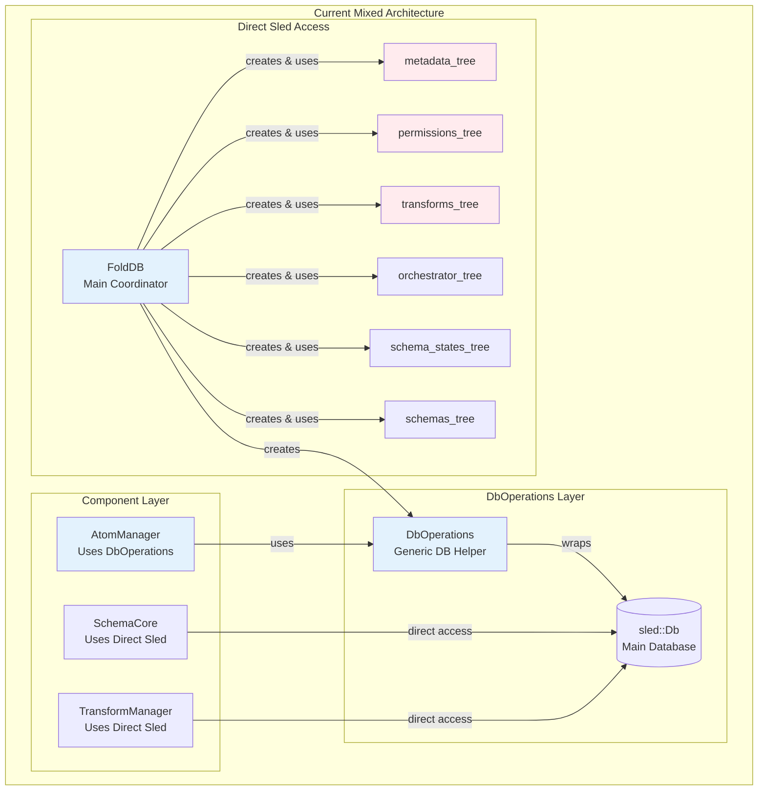
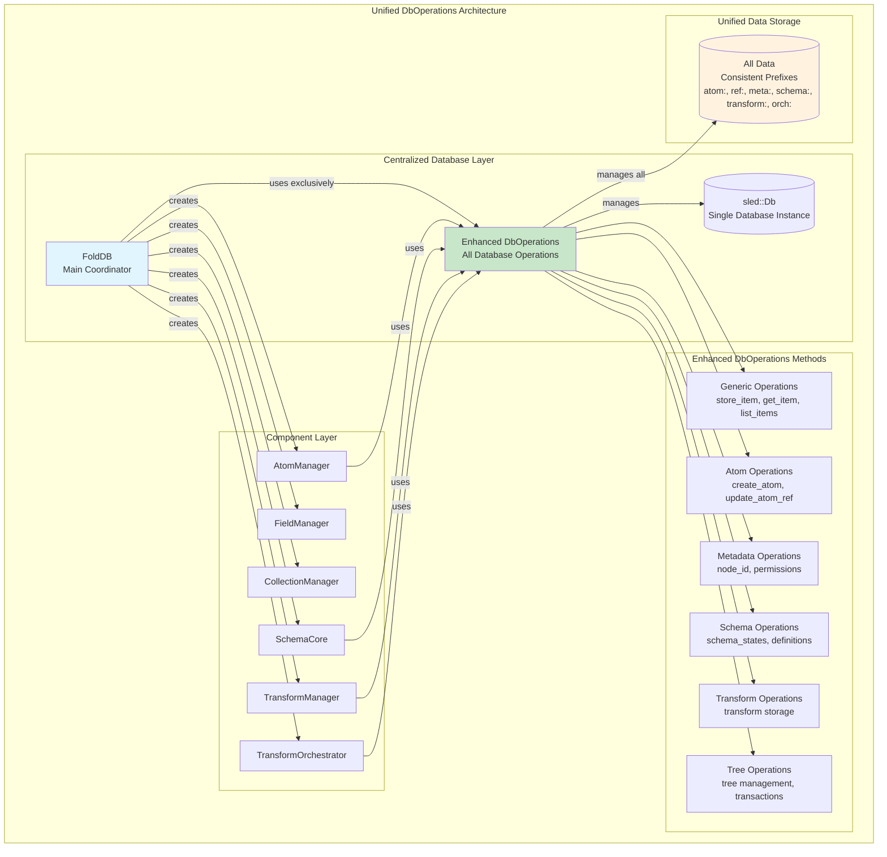

# DbOperations Architecture Analysis & Unified Access Implementation Plan

## Executive Summary

This document analyzes the current relationship between `DbOperations` and `FoldDB` in the DataFold system and proposes a unified database access architecture. The current system has inconsistent database access patterns that create maintenance complexity and unclear responsibilities. We recommend implementing **Option A: Unified DbOperations** to standardize all database operations through a single, enhanced abstraction layer.

## Current Architecture Analysis

### Current State

The DataFold system currently uses a mixed approach for database access:



### Current Issues

1. **Inconsistent Access Patterns**: Some components use `DbOperations`, others access sled directly
2. **Dual Database Abstraction**: Both `FoldDB` and `DbOperations` manage database operations
3. **Maintenance Complexity**: Changes require understanding multiple access patterns
4. **Unclear Responsibilities**: No clear ownership of database operations
5. **Code Duplication**: Similar database operations implemented in multiple places

### Current DbOperations Capabilities

The existing `DbOperations` struct provides:

```rust
pub struct DbOperations {
    pub(crate) db: sled::Db,
}

impl DbOperations {
    // Generic operations
    pub fn store_item<T: Serialize>(&self, key: &str, item: &T) -> Result<(), SchemaError>
    pub fn get_item<T: DeserializeOwned>(&self, key: &str) -> Result<Option<T>, SchemaError>
    
    // Atom-specific operations
    pub fn create_atom(...) -> Result<Atom, SchemaError>
    pub fn update_atom_ref(...) -> Result<AtomRef, SchemaError>
    pub fn update_atom_ref_collection(...) -> Result<AtomRefCollection, SchemaError>
    pub fn update_atom_ref_range(...) -> Result<AtomRefRange, SchemaError>
}
```

## Proposed Architecture: Unified DbOperations

### Target Architecture



### Benefits of Unified Approach

1. **Single Source of Truth**: All database operations go through `DbOperations`
2. **Consistent Error Handling**: Unified error types and handling patterns
3. **Easier Testing**: Mock `DbOperations` for comprehensive testing
4. **Better Maintainability**: Changes to database logic in one place
5. **Performance Optimization**: Centralized caching and optimization opportunities
6. **Transaction Support**: Easier to implement cross-component transactions

## Implementation Plan

### Phase 1: Enhance DbOperations (Week 1-2)

#### 1.1 Extend DbOperations Interface

Create enhanced `DbOperations` with all required operations:

```rust
pub struct DbOperations {
    db: sled::Db,
    // Cached trees for performance
    metadata_tree: sled::Tree,
    permissions_tree: sled::Tree,
    transforms_tree: sled::Tree,
    orchestrator_tree: sled::Tree,
    schema_states_tree: sled::Tree,
    schemas_tree: sled::Tree,
}

impl DbOperations {
    // Enhanced constructor
    pub fn new(db: sled::Db) -> Result<Self, sled::Error> {
        let metadata_tree = db.open_tree("metadata")?;
        let permissions_tree = db.open_tree("node_id_schema_permissions")?;
        let transforms_tree = db.open_tree("transforms")?;
        let orchestrator_tree = db.open_tree("orchestrator_state")?;
        let schema_states_tree = db.open_tree("schema_states")?;
        let schemas_tree = db.open_tree("schemas")?;
        
        Ok(Self {
            db,
            metadata_tree,
            permissions_tree,
            transforms_tree,
            orchestrator_tree,
            schema_states_tree,
            schemas_tree,
        })
    }
    
    // Metadata operations
    pub fn get_node_id(&self) -> Result<String, SchemaError>
    pub fn set_node_id(&self, node_id: &str) -> Result<(), SchemaError>
    pub fn get_schema_permissions(&self, node_id: &str) -> Result<Vec<String>, SchemaError>
    pub fn set_schema_permissions(&self, node_id: &str, schemas: &[String]) -> Result<(), SchemaError>
    
    // Schema operations
    pub fn store_schema_state(&self, schema_name: &str, state: SchemaState) -> Result<(), SchemaError>
    pub fn get_schema_state(&self, schema_name: &str) -> Result<Option<SchemaState>, SchemaError>
    pub fn list_schemas_by_state(&self, state: SchemaState) -> Result<Vec<String>, SchemaError>
    pub fn store_schema(&self, schema_name: &str, schema: &Schema) -> Result<(), SchemaError>
    pub fn get_schema(&self, schema_name: &str) -> Result<Option<Schema>, SchemaError>
    
    // Transform operations
    pub fn store_transform(&self, transform_id: &str, transform: &Transform) -> Result<(), SchemaError>
    pub fn get_transform(&self, transform_id: &str) -> Result<Option<Transform>, SchemaError>
    pub fn list_transforms(&self) -> Result<Vec<String>, SchemaError>
    pub fn delete_transform(&self, transform_id: &str) -> Result<(), SchemaError>
    
    // Orchestrator operations
    pub fn store_orchestrator_state(&self, key: &str, state: &OrchestratorState) -> Result<(), SchemaError>
    pub fn get_orchestrator_state(&self, key: &str) -> Result<Option<OrchestratorState>, SchemaError>
    
    // Transaction support
    pub fn transaction<F, R>(&self, f: F) -> Result<R, SchemaError>
    where
        F: FnOnce(&TransactionContext) -> Result<R, SchemaError>
    
    // Batch operations
    pub fn batch_store<T: Serialize>(&self, items: &[(String, T)]) -> Result<(), SchemaError>
    pub fn batch_get<T: DeserializeOwned>(&self, keys: &[String]) -> Result<Vec<Option<T>>, SchemaError>
}
```

#### 1.2 Create Migration Utilities

```rust
pub struct DbMigration {
    old_db: sled::Db,
    new_db_ops: DbOperations,
}

impl DbMigration {
    pub fn migrate_metadata(&self) -> Result<(), SchemaError>
    pub fn migrate_permissions(&self) -> Result<(), SchemaError>
    pub fn migrate_schemas(&self) -> Result<(), SchemaError>
    pub fn migrate_transforms(&self) -> Result<(), SchemaError>
    pub fn verify_migration(&self) -> Result<bool, SchemaError>
}
```

### Phase 2: Update FoldDB (Week 2-3)

#### 2.1 Refactor FoldDB Constructor

```rust
impl FoldDB {
    pub fn new(path: &str) -> sled::Result<Self> {
        let db = sled::open(path)?;
        let db_ops = Arc::new(DbOperations::new(db)?);
        
        // All components now use db_ops
        let atom_manager = AtomManager::new(Arc::clone(&db_ops));
        let field_manager = FieldManager::new(atom_manager.clone());
        let collection_manager = CollectionManager::new(field_manager.clone());
        let schema_manager = Arc::new(
            SchemaCore::new_with_db_ops(path, Arc::clone(&db_ops))?
        );
        
        // Create closures that use db_ops
        let db_ops_clone = Arc::clone(&db_ops);
        let get_atom_fn = Arc::new(move |aref_uuid: &str| {
            atom_manager.get_latest_atom(aref_uuid)
        });
        
        let transform_manager = Arc::new(TransformManager::new_with_db_ops(
            Arc::clone(&db_ops),
            get_atom_fn,
            // ... other closures
        ));
        
        let orchestrator = Arc::new(TransformOrchestrator::new_with_db_ops(
            transform_manager.clone(),
            Arc::clone(&db_ops)
        ));
        
        Ok(Self {
            db_ops,
            atom_manager,
            field_manager,
            collection_manager,
            schema_manager,
            transform_manager,
            transform_orchestrator: orchestrator,
            permission_wrapper: PermissionWrapper::new(),
        })
    }
}
```

#### 2.2 Update FoldDB Methods

Replace direct tree access with `DbOperations` calls:

```rust
impl FoldDB {
    pub fn get_node_id(&self) -> Result<String, sled::Error> {
        self.db_ops.get_node_id()
            .map_err(|e| sled::Error::Unsupported(e.to_string()))
    }
    
    pub fn get_schema_permissions(&self, node_id: &str) -> Vec<String> {
        self.db_ops.get_schema_permissions(node_id)
            .unwrap_or_default()
    }
    
    pub fn set_schema_permissions(&self, node_id: &str, schemas: &[String]) -> sled::Result<()> {
        self.db_ops.set_schema_permissions(node_id, schemas)
            .map_err(|e| sled::Error::Unsupported(e.to_string()))
    }
}
```

### Phase 3: Update Component Managers (Week 3-4)

#### 3.1 Update SchemaCore

```rust
impl SchemaCore {
    pub fn new_with_db_ops(path: &str, db_ops: Arc<DbOperations>) -> Result<Self, SchemaError> {
        let mut core = Self {
            db_ops,
            schemas: HashMap::new(),
            schema_states: HashMap::new(),
            available_schemas_path: format!("{}/available_schemas", path),
        };
        
        // Load existing data using db_ops
        core.load_schema_states_from_db()?;
        core.load_schemas_from_db()?;
        
        Ok(core)
    }
    
    fn load_schema_states_from_db(&mut self) -> Result<(), SchemaError> {
        // Use db_ops.list_schemas_by_state() and db_ops.get_schema_state()
    }
    
    pub fn approve_schema(&mut self, schema_name: &str) -> Result<(), SchemaError> {
        self.db_ops.store_schema_state(schema_name, SchemaState::Approved)?;
        self.schema_states.insert(schema_name.to_string(), SchemaState::Approved);
        Ok(())
    }
}
```

#### 3.2 Update TransformManager

```rust
impl TransformManager {
    pub fn new_with_db_ops(
        db_ops: Arc<DbOperations>,
        get_atom_fn: Arc<dyn Fn(&str) -> Result<Atom, Box<dyn std::error::Error>> + Send + Sync>,
        // ... other parameters
    ) -> Self {
        Self {
            db_ops,
            transforms: HashMap::new(),
            get_atom_fn,
            // ... other fields
        }
    }
    
    pub fn register_transform(&mut self, transform: Transform) -> Result<(), SchemaError> {
        let transform_id = transform.id.clone();
        self.db_ops.store_transform(&transform_id, &transform)?;
        self.transforms.insert(transform_id, transform);
        Ok(())
    }
}
```

#### 3.3 Update TransformOrchestrator

```rust
impl TransformOrchestrator {
    pub fn new_with_db_ops(
        transform_manager: Arc<TransformManager>,
        db_ops: Arc<DbOperations>,
    ) -> Self {
        Self {
            transform_manager,
            db_ops,
            state: HashMap::new(),
        }
    }
    
    pub fn save_state(&self) -> Result<(), SchemaError> {
        for (key, state) in &self.state {
            self.db_ops.store_orchestrator_state(key, state)?;
        }
        Ok(())
    }
}
```

### Phase 4: Testing & Validation (Week 4-5)

#### 4.1 Create Comprehensive Tests

```rust
#[cfg(test)]
mod unified_db_tests {
    use super::*;
    
    fn create_test_db_ops() -> DbOperations {
        let db = sled::Config::new().temporary(true).open().unwrap();
        DbOperations::new(db).unwrap()
    }
    
    #[test]
    fn test_unified_metadata_operations() {
        let db_ops = create_test_db_ops();
        
        // Test node_id operations
        let node_id = "test-node-123";
        db_ops.set_node_id(node_id).unwrap();
        assert_eq!(db_ops.get_node_id().unwrap(), node_id);
        
        // Test permissions operations
        let schemas = vec!["Schema1".to_string(), "Schema2".to_string()];
        db_ops.set_schema_permissions(node_id, &schemas).unwrap();
        assert_eq!(db_ops.get_schema_permissions(node_id).unwrap(), schemas);
    }
    
    #[test]
    fn test_unified_schema_operations() {
        let db_ops = create_test_db_ops();
        
        // Test schema state operations
        db_ops.store_schema_state("TestSchema", SchemaState::Approved).unwrap();
        assert_eq!(
            db_ops.get_schema_state("TestSchema").unwrap(),
            Some(SchemaState::Approved)
        );
        
        let approved_schemas = db_ops.list_schemas_by_state(SchemaState::Approved).unwrap();
        assert!(approved_schemas.contains(&"TestSchema".to_string()));
    }
    
    #[test]
    fn test_transaction_support() {
        let db_ops = create_test_db_ops();
        
        let result = db_ops.transaction(|ctx| {
            ctx.store_schema_state("Schema1", SchemaState::Approved)?;
            ctx.store_schema_state("Schema2", SchemaState::Approved)?;
            Ok(())
        });
        
        assert!(result.is_ok());
        assert_eq!(
            db_ops.get_schema_state("Schema1").unwrap(),
            Some(SchemaState::Approved)
        );
    }
    
    #[test]
    fn test_folddb_integration() {
        let temp_dir = tempfile::tempdir().unwrap();
        let folddb = FoldDB::new(temp_dir.path().to_str().unwrap()).unwrap();
        
        // Test that all operations work through unified interface
        let node_id = folddb.get_node_id().unwrap();
        assert!(!node_id.is_empty());
        
        folddb.set_schema_permissions(&node_id, &["TestSchema".to_string()]).unwrap();
        let permissions = folddb.get_schema_permissions(&node_id);
        assert_eq!(permissions, vec!["TestSchema".to_string()]);
    }
}
```

#### 4.2 Performance Benchmarks

```rust
#[cfg(test)]
mod performance_tests {
    use super::*;
    use std::time::Instant;
    
    #[test]
    fn benchmark_unified_vs_direct_access() {
        // Compare performance of unified DbOperations vs direct sled access
        let iterations = 10000;
        
        // Benchmark unified access
        let db_ops = create_test_db_ops();
        let start = Instant::now();
        for i in 0..iterations {
            db_ops.store_item(&format!("key_{}", i), &format!("value_{}", i)).unwrap();
        }
        let unified_duration = start.elapsed();
        
        // Benchmark direct access
        let db = sled::Config::new().temporary(true).open().unwrap();
        let start = Instant::now();
        for i in 0..iterations {
            db.insert(format!("key_{}", i), format!("value_{}", i)).unwrap();
        }
        let direct_duration = start.elapsed();
        
        println!("Unified: {:?}, Direct: {:?}", unified_duration, direct_duration);
        // Ensure unified access is within acceptable performance range
        assert!(unified_duration.as_millis() < direct_duration.as_millis() * 2);
    }
}
```

### Phase 5: Migration & Deployment (Week 5-6)

#### 5.1 Create Migration Script

```rust
pub fn migrate_to_unified_db(old_db_path: &str, new_db_path: &str) -> Result<(), SchemaError> {
    let old_db = sled::open(old_db_path)?;
    let new_db = sled::open(new_db_path)?;
    let new_db_ops = DbOperations::new(new_db)?;
    
    let migration = DbMigration {
        old_db,
        new_db_ops,
    };
    
    migration.migrate_metadata()?;
    migration.migrate_permissions()?;
    migration.migrate_schemas()?;
    migration.migrate_transforms()?;
    
    if !migration.verify_migration()? {
        return Err(SchemaError::InvalidData("Migration verification failed".to_string()));
    }
    
    Ok(())
}
```

#### 5.2 Backward Compatibility

```rust
impl DbOperations {
    // Provide backward compatibility methods during transition
    pub fn get_legacy_tree(&self, tree_name: &str) -> Result<sled::Tree, sled::Error> {
        self.db.open_tree(tree_name)
    }
    
    // Deprecated methods with warnings
    #[deprecated(note = "Use unified DbOperations methods instead")]
    pub fn direct_db_access(&self) -> &sled::Db {
        &self.db
    }
}
```

## Risk Assessment & Mitigation

### High Risk Items

1. **Data Migration Complexity**
   - **Risk**: Data loss during migration from direct sled access to unified approach
   - **Mitigation**: Comprehensive backup strategy, incremental migration, extensive testing

2. **Performance Impact**
   - **Risk**: Additional abstraction layer may impact performance
   - **Mitigation**: Performance benchmarks, caching strategies, optimization

3. **Breaking Changes**
   - **Risk**: Large refactor may break existing functionality
   - **Mitigation**: Comprehensive test suite, backward compatibility layer, phased rollout

### Medium Risk Items

1. **Component Integration**
   - **Risk**: Complex dependencies between components may cause integration issues
   - **Mitigation**: Careful dependency mapping, incremental updates, integration tests

2. **Error Handling Consistency**
   - **Risk**: Different error types across components may cause confusion
   - **Mitigation**: Unified error handling strategy, comprehensive error mapping

### Low Risk Items

1. **API Changes**
   - **Risk**: Public API changes may affect external users
   - **Mitigation**: Maintain public API compatibility, deprecation warnings

## Success Metrics

### Technical Metrics

1. **Code Quality**
   - Reduce database access patterns from 2 to 1
   - Eliminate direct sled tree usage in components
   - Achieve 95%+ test coverage for DbOperations

2. **Performance**
   - Maintain <5% performance overhead vs direct access
   - Reduce database operation latency variance
   - Improve transaction success rate

3. **Maintainability**
   - Reduce database-related code duplication by 80%
   - Centralize all database operations in DbOperations
   - Simplify component initialization logic

### Business Metrics

1. **Development Velocity**
   - Reduce time to implement new database features by 50%
   - Decrease database-related bug reports by 70%
   - Improve developer onboarding time for database operations

2. **System Reliability**
   - Increase database operation success rate
   - Reduce data consistency issues
   - Improve error recovery mechanisms

## Timeline Summary

| Phase | Duration | Key Deliverables |
|-------|----------|------------------|
| Phase 1 | Week 1-2 | Enhanced DbOperations interface, migration utilities |
| Phase 2 | Week 2-3 | Refactored FoldDB constructor and methods |
| Phase 3 | Week 3-4 | Updated component managers (SchemaCore, TransformManager, etc.) |
| Phase 4 | Week 4-5 | Comprehensive testing and performance validation |
| Phase 5 | Week 5-6 | Migration scripts and deployment |

**Total Duration**: 6 weeks

## Conclusion

The unified DbOperations architecture will significantly improve the DataFold system's maintainability, consistency, and reliability. While the migration requires substantial effort, the long-term benefits of having a single, well-tested database abstraction layer far outweigh the implementation costs.

The proposed approach provides:
- **Consistency**: Single pattern for all database operations
- **Maintainability**: Centralized database logic
- **Testability**: Easy to mock and test database operations
- **Performance**: Optimized caching and transaction support
- **Reliability**: Unified error handling and recovery

This architecture positions the DataFold system for future growth and makes it easier to implement advanced features like distributed transactions, caching strategies, and database optimization.