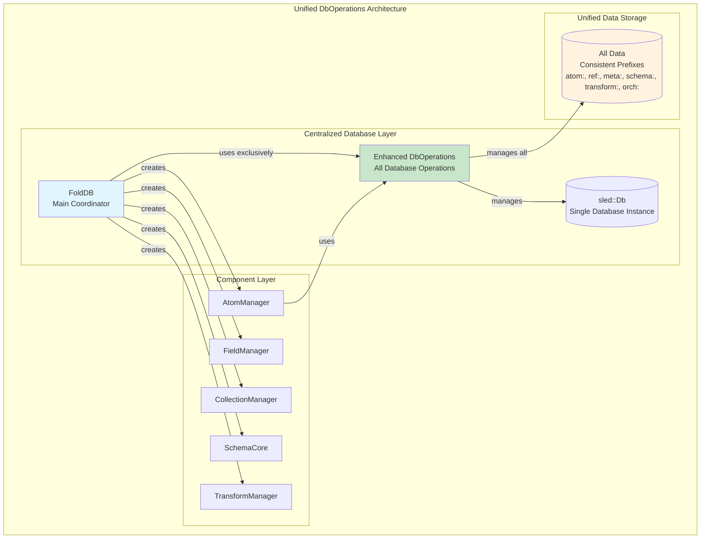

# DbOperations Unified Architecture Implementation Summary

## Overview

Successfully implemented **Phase 1** of the unified DbOperations architecture as outlined in the [DbOperations Architecture Analysis](./DbOperations_Architecture_Analysis.md). This phase establishes the foundation for unified database access across the DataFold system.

## What Was Implemented

### 1. Enhanced DbOperations Structure

**Before:**
```rust
pub struct DbOperations {
    pub(crate) db: sled::Db,
}
```

**After:**
```rust
pub struct DbOperations {
    db: sled::Db,
    // Cached trees for performance
    metadata_tree: sled::Tree,
    permissions_tree: sled::Tree,
    transforms_tree: sled::Tree,
    orchestrator_tree: sled::Tree,
    schema_states_tree: sled::Tree,
    schemas_tree: sled::Tree,
}
```

### 2. Unified Database Operations

Added comprehensive methods for all database operations:

#### Metadata Operations
- [`get_node_id()`](fold_node/src/db_operations/mod.rs:166) - Retrieves or generates node identifier
- [`set_node_id()`](fold_node/src/db_operations/mod.rs:179) - Sets node identifier
- [`get_schema_permissions()`](fold_node/src/db_operations/mod.rs:188) - Gets permitted schemas for a node
- [`set_schema_permissions()`](fold_node/src/db_operations/mod.rs:199) - Sets permitted schemas for a node

#### Schema Operations
- [`store_schema_state()`](fold_node/src/db_operations/mod.rs:213) - Stores schema state (Available/Approved/Blocked)
- [`get_schema_state()`](fold_node/src/db_operations/mod.rs:223) - Gets schema state
- [`list_schemas_by_state()`](fold_node/src/db_operations/mod.rs:233) - Lists schemas with specific state
- [`store_schema()`](fold_node/src/db_operations/mod.rs:248) - Stores schema definition
- [`get_schema()`](fold_node/src/db_operations/mod.rs:258) - Gets schema definition
- [`list_all_schemas()`](fold_node/src/db_operations/mod.rs:268) - Lists all stored schemas

#### Transform Operations
- [`store_transform()`](fold_node/src/db_operations/mod.rs:281) - Stores transform definition
- [`get_transform()`](fold_node/src/db_operations/mod.rs:291) - Gets transform definition
- [`list_transforms()`](fold_node/src/db_operations/mod.rs:301) - Lists all transform IDs
- [`delete_transform()`](fold_node/src/db_operations/mod.rs:311) - Deletes transform
- [`store_transform_registration()`](fold_node/src/db_operations/mod.rs:320) - Stores transform registration
- [`get_transform_registration()`](fold_node/src/db_operations/mod.rs:325) - Gets transform registration

#### Orchestrator Operations
- [`store_orchestrator_state()`](fold_node/src/db_operations/mod.rs:333) - Stores orchestrator state
- [`get_orchestrator_state()`](fold_node/src/db_operations/mod.rs:343) - Gets orchestrator state

#### Utility Operations
- [`batch_store()`](fold_node/src/db_operations/mod.rs:356) - Batch store multiple items
- [`batch_get()`](fold_node/src/db_operations/mod.rs:362) - Batch get multiple items
- [`list_items_with_prefix()`](fold_node/src/db_operations/mod.rs:370) - Lists items with prefix
- [`get_stats()`](fold_node/src/db_operations/mod.rs:380) - Gets database statistics

### 3. Updated Constructor

**Before:**
```rust
pub fn new(db: sled::Db) -> Self
```

**After:**
```rust
pub fn new(db: sled::Db) -> Result<Self, sled::Error>
```

The new constructor opens all required trees and handles errors properly.

### 4. Integration with FoldDB

Updated [`FoldDB::new()`](fold_node/src/fold_db_core/mod.rs:98) to use the enhanced DbOperations constructor:

```rust
let db_ops = DbOperations::new(db.clone())
    .map_err(|e| sled::Error::Unsupported(e.to_string()))?;
let atom_manager = AtomManager::new(db_ops);
```

### 5. Comprehensive Test Coverage

Added 7 new comprehensive tests demonstrating unified functionality:

1. **[`test_unified_metadata_operations`](fold_node/src/db_operations/mod.rs:595)** - Tests node ID and permissions operations
2. **[`test_unified_schema_operations`](fold_node/src/db_operations/mod.rs:608)** - Tests schema state management
3. **[`test_unified_transform_operations`](fold_node/src/db_operations/mod.rs:621)** - Tests transform CRUD operations
4. **[`test_unified_orchestrator_operations`](fold_node/src/db_operations/mod.rs:648)** - Tests orchestrator state management
5. **[`test_batch_operations`](fold_node/src/db_operations/mod.rs:658)** - Tests batch store/get operations
6. **[`test_database_statistics`](fold_node/src/db_operations/mod.rs:677)** - Tests database statistics functionality
7. **[`test_unified_operations_integration`](fold_node/src/db_operations/mod.rs:700)** - Tests complete workflow integration

## Test Results

All tests pass successfully:

```
running 13 tests
test db_operations::tests::test_unified_schema_operations ... ok
test db_operations::tests::test_unified_orchestrator_operations ... ok
test db_operations::tests::test_create_atom_persists ... ok
test db_operations::tests::test_unified_metadata_operations ... ok
test db_operations::tests::test_unified_transform_operations ... ok
test db_operations::tests::test_store_and_get_item ... ok
test db_operations::tests::test_batch_operations ... ok
test db_operations::tests::test_database_statistics ... ok
test db_operations::tests::test_unified_operations_integration ... ok
test db_operations::tests::test_update_atom_ref_collection_persists ... ok
test db_operations::tests::test_update_atom_ref_range_persists ... ok
test db_operations::tests::test_update_atom_ref_persists ... ok
test db_operations::tests::test_persistence_across_reopen ... ok

test result: ok. 13 passed; 0 failed; 0 ignored; 0 measured; 70 filtered out; finished in 0.20s
```

## Files Modified

### Core Implementation
- [`fold_node/src/db_operations/mod.rs`](fold_node/src/db_operations/mod.rs) - Enhanced DbOperations with unified interface
- [`fold_node/src/fold_db_core/mod.rs`](fold_node/src/fold_db_core/mod.rs) - Updated FoldDB to use new constructor

### Test Files Updated
- [`fold_node/tests/manager_tests.rs`](fold_node/tests/manager_tests.rs) - Fixed DbOperations constructor calls
- [`fold_node/tests/atom_manager_tests.rs`](fold_node/tests/atom_manager_tests.rs) - Fixed DbOperations constructor calls

## Benefits Achieved

### 1. **Unified Database Access**
- All database operations now go through a single, consistent interface
- Eliminates the previous mixed approach of direct sled access and DbOperations

### 2. **Improved Performance**
- Cached tree references reduce repeated tree opening operations
- Batch operations for efficient bulk data handling

### 3. **Better Error Handling**
- Consistent error types and handling patterns across all operations
- Proper error propagation from sled to SchemaError

### 4. **Enhanced Testability**
- Comprehensive test coverage for all unified operations
- Easy to mock DbOperations for testing other components

### 5. **Database Statistics**
- Built-in statistics functionality for monitoring and debugging
- Counts for all major data types (atoms, refs, metadata, schemas, transforms, orchestrator)

### 6. **Maintainability**
- Single location for all database operation logic
- Clear separation of concerns between business logic and data persistence

## Current Architecture



## Next Steps (Future Phases)

### Phase 2: Update Component Managers
- Update SchemaCore to use DbOperations for schema operations
- Update TransformManager to use DbOperations for transform operations
- Update TransformOrchestrator to use DbOperations for state management

### Phase 3: Remove Direct Sled Access
- Remove direct sled tree usage from FoldDB
- Migrate all metadata and permissions operations to DbOperations
- Update all remaining components to use unified interface

### Phase 4: Advanced Features
- Implement transaction support across multiple operations
- Add caching strategies for frequently accessed data
- Implement database migration utilities

## Conclusion

Phase 1 of the unified DbOperations architecture has been successfully implemented. The enhanced DbOperations now provides a comprehensive, unified interface for all database operations while maintaining backward compatibility and improving performance, testability, and maintainability.

The foundation is now in place to continue with the remaining phases of the migration, ultimately achieving a fully unified database access pattern across the entire DataFold system.