# Fold DB Core Architecture

**Version**: 2.0  
**Last Updated**: June 2025  
**Author**: Engineering Team

---

## Table of Contents

1. [Overview](#overview)
2. [System Architecture](#system-architecture)
3. [Schema Management](#schema-management)
4. [Field Type System](#field-type-system)
5. [Atom and AtomRef System](#atom-and-atomref-system)
6. [Data Flow Architecture](#data-flow-architecture)
7. [Transform System](#transform-system)
8. [Storage and Persistence](#storage-and-persistence)
9. [Component Interactions](#component-interactions)
10. [Logging and Observability](#logging-and-observability)
11. [Source Code References](#source-code-references)

---

## Overview

Fold DB is a distributed database system built in Rust that provides schema-based data management with versioning, permissions, and transformations. The core architecture is designed around atomic data storage with references, flexible schema management, and real-time data transformations.

### Key Design Principles

- **Atomic Data Storage**: All data is stored as versioned atoms with immutable history
- **Schema-Driven**: Strong schema validation with lifecycle management
- **Permission-Based**: Fine-grained field-level access control
- **Transform-Capable**: Real-time data transformation using custom DSL
- **Range-Optimized**: Support for range-based data partitioning and querying

---

## System Architecture

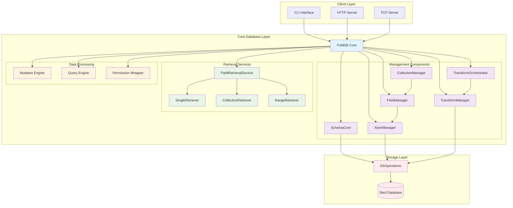
```mermaid
graph TB
    subgraph "Client Layer"
        CLI[CLI Interface]
        HTTP[HTTP Server]
        TCP[TCP Server]
    end
    
    subgraph "Core Database Layer"
        FoldDB[FoldDB Core]
        
        subgraph "Management Components"
            SM[SchemaCore]
            AM[AtomManager]
            FM[FieldManager]
            CM[CollectionManager]
            TM[TransformManager]
            TO[TransformOrchestrator]
        end
        
        subgraph "Retrieval Services"
            FRS[FieldRetrievalService]
            SR[SingleRetriever]
            CR[CollectionRetriever]
            RR[RangeRetriever]
        end
        
        subgraph "Data Processing"
            MUT[Mutation Engine]
            QRY[Query Engine]
            PERM[Permission Wrapper]
        end
    end
    
    subgraph "Storage Layer"
        DBOPS[DbOperations]
        SLED[(Sled Database)]
    end
    
    CLI --> FoldDB
    HTTP --> FoldDB
    TCP --> FoldDB
    
    FoldDB --> SM
    FoldDB --> AM
    FoldDB --> FM
    FoldDB --> CM
    FoldDB --> TM
    FoldDB --> TO
    FoldDB --> FRS
    FoldDB --> MUT
    FoldDB --> QRY
    FoldDB --> PERM
    
    FRS --> SR
    FRS --> CR
    FRS --> RR
    
    SM --> DBOPS
    AM --> DBOPS
    FM --> AM
    CM --> FM
    TM --> DBOPS
    TO --> TM
    
    DBOPS --> SLED
    
    classDef core fill:#e1f5fe
    classDef management fill:#f3e5f5
    classDef retrieval fill:#e8f5e8
    classDef processing fill:#fff3e0
    classDef storage fill:#ffebee
    
    class FoldDB core
    class SM,AM,FM,CM,TM,TO management
    class FRS,SR,CR,RR retrieval
    class MUT,QRY,PERM processing
    class DBOPS,SLED storage
```

---

## Schema Management

### Schema Lifecycle

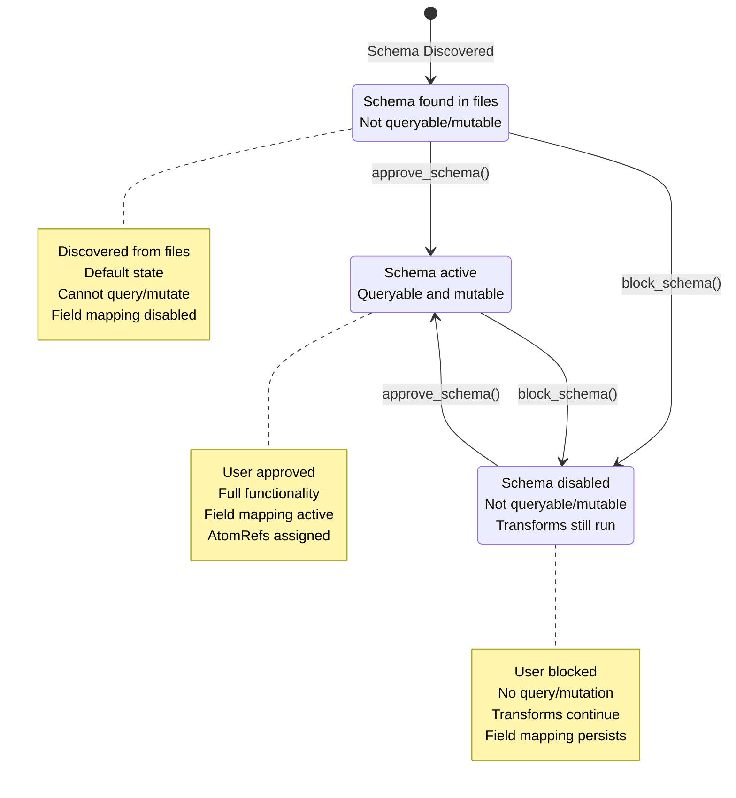
```mermaid
stateDiagram-v2
    [*] --> Available : Schema Discovered
    Available --> Approved : approve_schema()
    Available --> Blocked : block_schema()
    Approved --> Blocked : block_schema()
    Blocked --> Approved : approve_schema()
    
    Available : Schema found in files<br/>Not queryable/mutable
    Approved : Schema active<br/>Queryable and mutable
    Blocked : Schema disabled<br/>Not queryable/mutable<br/>Transforms still run
    
    note right of Available
        Discovered from files
        Default state
        Cannot query/mutate
        Field mapping disabled
    end note
    
    note right of Approved
        User approved
        Full functionality
        Field mapping active
        AtomRefs assigned
    end note
    
    note right of Blocked
        User blocked
        No query/mutation
        Transforms continue
        Field mapping persists
    end note
```

### Schema Type Hierarchy

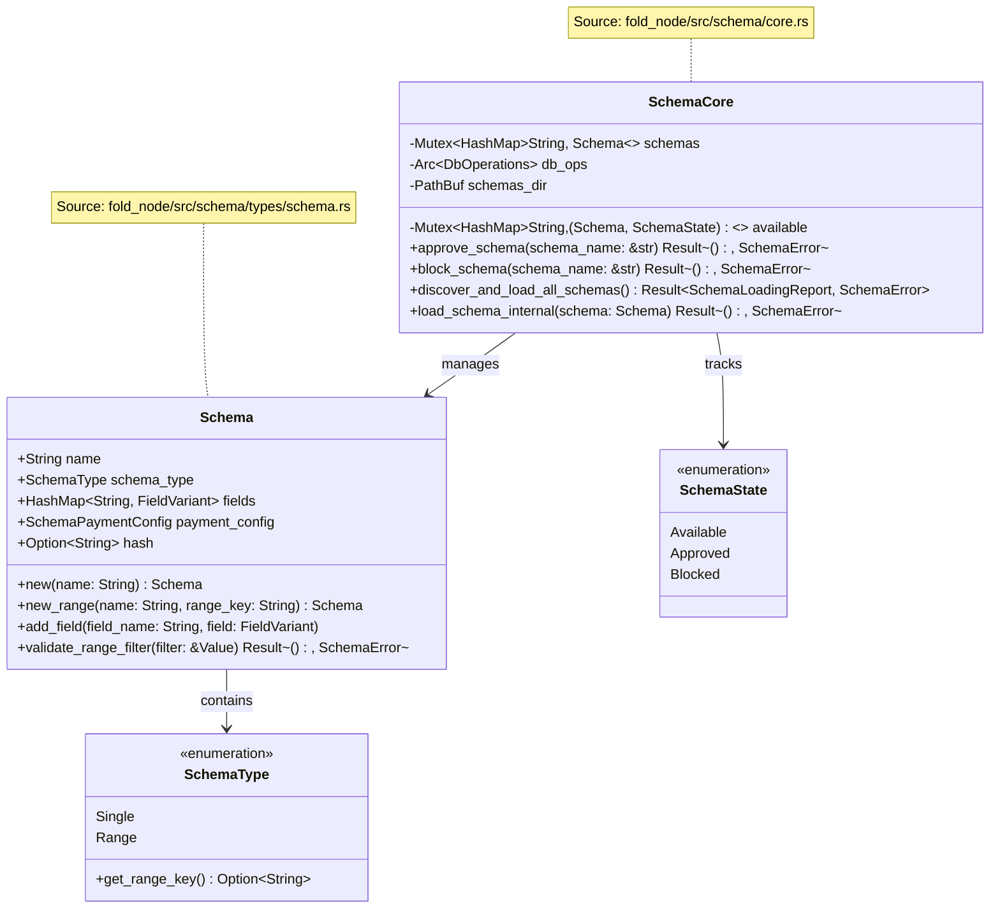
```mermaid
classDiagram
    class Schema {
        +String name
        +SchemaType schema_type
        +HashMap~String, FieldVariant~ fields
        +SchemaPaymentConfig payment_config
        +Option~String~ hash
        +new(name: String) Schema
        +new_range(name: String, range_key: String) Schema
        +add_field(field_name: String, field: FieldVariant)
        +validate_range_filter(filter: &Value) Result~(), SchemaError~
    }
    
    class SchemaType {
        <<enumeration>>
        Single
        Range
        +get_range_key() Option~String~
    }
    
    class SchemaCore {
        -Mutex~HashMap~String, Schema~~ schemas
        -Mutex~HashMap~String, (Schema, SchemaState)~~ available
        -Arc~DbOperations~ db_ops
        -PathBuf schemas_dir
        +approve_schema(schema_name: &str) Result~(), SchemaError~
        +block_schema(schema_name: &str) Result~(), SchemaError~
        +discover_and_load_all_schemas() Result~SchemaLoadingReport, SchemaError~
        +load_schema_internal(schema: Schema) Result~(), SchemaError~
    }
    
    class SchemaState {
        <<enumeration>>
        Available
        Approved
        Blocked
    }
    
    Schema --> SchemaType : contains
    SchemaCore --> Schema : manages
    SchemaCore --> SchemaState : tracks
    
    note for Schema "Source: fold_node/src/schema/types/schema.rs"
    note for SchemaCore "Source: fold_node/src/schema/core.rs"
```

---

## Field Type System

### Field Variant Hierarchy

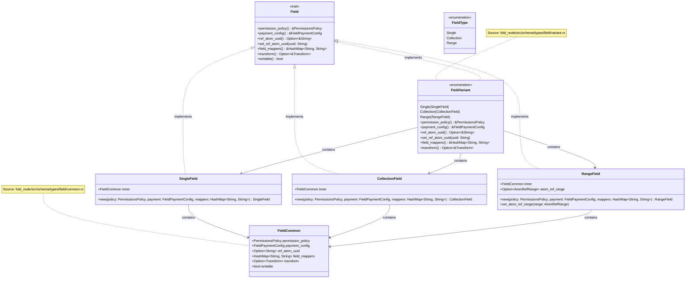
```mermaid
classDiagram
    class FieldVariant {
        <<enumeration>>
        Single(SingleField)
        Collection(CollectionField)
        Range(RangeField)
        +permission_policy() &PermissionsPolicy
        +payment_config() &FieldPaymentConfig
        +ref_atom_uuid() Option~&String~
        +set_ref_atom_uuid(uuid: String)
        +field_mappers() &HashMap~String, String~
        +transform() Option~&Transform~
    }
    
    class Field {
        <<trait>>
        +permission_policy() &PermissionsPolicy
        +payment_config() &FieldPaymentConfig
        +ref_atom_uuid() Option~&String~
        +set_ref_atom_uuid(uuid: String)
        +field_mappers() &HashMap~String, String~
        +transform() Option~&Transform~
        +writable() bool
    }
    
    class FieldCommon {
        +PermissionsPolicy permission_policy
        +FieldPaymentConfig payment_config
        +Option~String~ ref_atom_uuid
        +HashMap~String, String~ field_mappers
        +Option~Transform~ transform
        +bool writable
    }
    
    class SingleField {
        +FieldCommon inner
        +new(policy: PermissionsPolicy, payment: FieldPaymentConfig, mappers: HashMap~String, String~) SingleField
    }
    
    class CollectionField {
        +FieldCommon inner
        +new(policy: PermissionsPolicy, payment: FieldPaymentConfig, mappers: HashMap~String, String~) CollectionField
    }
    
    class RangeField {
        +FieldCommon inner
        +Option~AtomRefRange~ atom_ref_range
        +new(policy: PermissionsPolicy, payment: FieldPaymentConfig, mappers: HashMap~String, String~) RangeField
        +set_atom_ref_range(range: AtomRefRange)
    }
    
    class FieldType {
        <<enumeration>>
        Single
        Collection
        Range
    }
    
    Field <|.. FieldVariant : implements
    Field <|.. SingleField : implements
    Field <|.. CollectionField : implements
    Field <|.. RangeField : implements
    
    FieldVariant --> SingleField : contains
    FieldVariant --> CollectionField : contains
    FieldVariant --> RangeField : contains
    
    SingleField --> FieldCommon : contains
    CollectionField --> FieldCommon : contains
    RangeField --> FieldCommon : contains
    
    note for FieldVariant "Source: fold_node/src/schema/types/field/variant.rs"
    note for FieldCommon "Source: fold_node/src/schema/types/field/common.rs"
```

### Field Type Capabilities

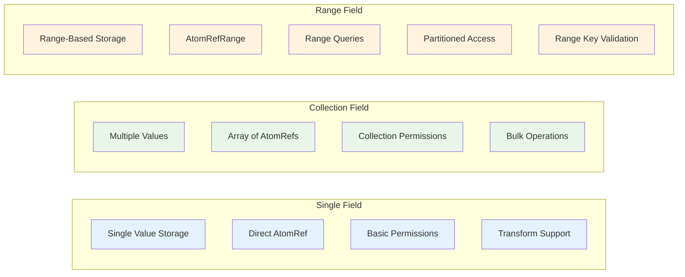
```mermaid
graph LR
    subgraph "Single Field"
        S1[Single Value Storage]
        S2[Direct AtomRef]
        S3[Basic Permissions]
        S4[Transform Support]
    end
    
    subgraph "Collection Field"
        C1[Multiple Values]
        C2[Array of AtomRefs]
        C3[Collection Permissions]
        C4[Bulk Operations]
    end
    
    subgraph "Range Field"
        R1[Range-Based Storage]
        R2[AtomRefRange]
        R3[Range Queries]
        R4[Partitioned Access]
        R5[Range Key Validation]
    end
    
    classDef single fill:#e3f2fd
    classDef collection fill:#e8f5e8
    classDef range fill:#fff3e0
    
    class S1,S2,S3,S4 single
    class C1,C2,C3,C4 collection
    class R1,R2,R3,R4,R5 range
```

---

## Atom and AtomRef System

### Atom Lifecycle and Versioning

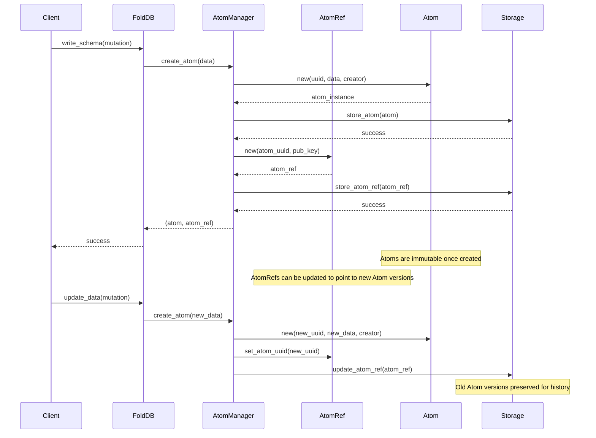
```mermaid
sequenceDiagram
    participant Client
    participant FoldDB
    participant AtomManager
    participant AtomRef
    participant Atom
    participant Storage
    
    Client->>FoldDB: write_schema(mutation)
    FoldDB->>AtomManager: create_atom(data)
    
    AtomManager->>Atom: new(uuid, data, creator)
    Atom-->>AtomManager: atom_instance
    AtomManager->>Storage: store_atom(atom)
    Storage-->>AtomManager: success
    
    AtomManager->>AtomRef: new(atom_uuid, pub_key)
    AtomRef-->>AtomManager: atom_ref
    AtomManager->>Storage: store_atom_ref(atom_ref)
    Storage-->>AtomManager: success
    
    AtomManager-->>FoldDB: (atom, atom_ref)
    FoldDB-->>Client: success
    
    Note over Atom: Atoms are immutable once created
    Note over AtomRef: AtomRefs can be updated to point to new Atom versions
    
    Client->>FoldDB: update_data(mutation)
    FoldDB->>AtomManager: create_atom(new_data)
    AtomManager->>Atom: new(new_uuid, new_data, creator)
    AtomManager->>AtomRef: set_atom_uuid(new_uuid)
    AtomManager->>Storage: update_atom_ref(atom_ref)
    
    Note over Storage: Old Atom versions preserved for history
```

### AtomRef Type Relationships

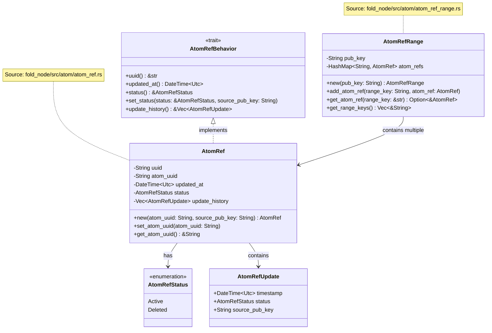
```mermaid
classDiagram
    class AtomRef {
        -String uuid
        -String atom_uuid
        -DateTime~Utc~ updated_at
        -AtomRefStatus status
        -Vec~AtomRefUpdate~ update_history
        +new(atom_uuid: String, source_pub_key: String) AtomRef
        +set_atom_uuid(atom_uuid: String)
        +get_atom_uuid() &String
    }
    
    class AtomRefRange {
        -String pub_key
        -HashMap~String, AtomRef~ atom_refs
        +new(pub_key: String) AtomRefRange
        +add_atom_ref(range_key: String, atom_ref: AtomRef)
        +get_atom_ref(range_key: &str) Option~&AtomRef~
        +get_range_keys() Vec~&String~
    }
    
    class AtomRefBehavior {
        <<trait>>
        +uuid() &str
        +updated_at() DateTime~Utc~
        +status() &AtomRefStatus
        +set_status(status: &AtomRefStatus, source_pub_key: String)
        +update_history() &Vec~AtomRefUpdate~
    }
    
    class AtomRefStatus {
        <<enumeration>>
        Active
        Deleted
    }
    
    class AtomRefUpdate {
        +DateTime~Utc~ timestamp
        +AtomRefStatus status
        +String source_pub_key
    }
    
    AtomRefBehavior <|.. AtomRef : implements
    AtomRef --> AtomRefStatus : has
    AtomRef --> AtomRefUpdate : contains
    AtomRefRange --> AtomRef : contains multiple
    
    note for AtomRef "Source: fold_node/src/atom/atom_ref.rs"
    note for AtomRefRange "Source: fold_node/src/atom/atom_ref_range.rs"
```

### AtomRef Storage Patterns

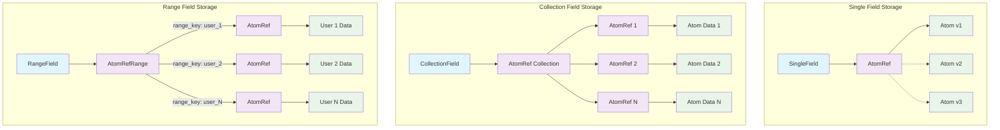
```mermaid
graph TB
    subgraph "Single Field Storage"
        SF[SingleField] --> AR1[AtomRef]
        AR1 --> A1[Atom v1]
        AR1 -.-> A2[Atom v2]
        AR1 -.-> A3[Atom v3]
    end
    
    subgraph "Collection Field Storage"
        CF[CollectionField] --> ARC[AtomRef Collection]
        ARC --> AR2[AtomRef 1]
        ARC --> AR3[AtomRef 2]
        ARC --> AR4[AtomRef N]
        AR2 --> A4[Atom Data 1]
        AR3 --> A5[Atom Data 2]
        AR4 --> A6[Atom Data N]
    end
    
    subgraph "Range Field Storage"
        RF[RangeField] --> ARR[AtomRefRange]
        ARR --> |"range_key: user_1"| AR5[AtomRef]
        ARR --> |"range_key: user_2"| AR6[AtomRef]
        ARR --> |"range_key: user_N"| AR7[AtomRef]
        AR5 --> A7[User 1 Data]
        AR6 --> A8[User 2 Data]
        AR7 --> A9[User N Data]
    end
    
    classDef field fill:#e1f5fe
    classDef atomref fill:#f3e5f5
    classDef atom fill:#e8f5e8
    
    class SF,CF,RF field
    class AR1,AR2,AR3,AR4,AR5,AR6,AR7,ARC,ARR atomref
    class A1,A2,A3,A4,A5,A6,A7,A8,A9 atom
```

---

## Data Flow Architecture

### Complete Data Mutation Flow

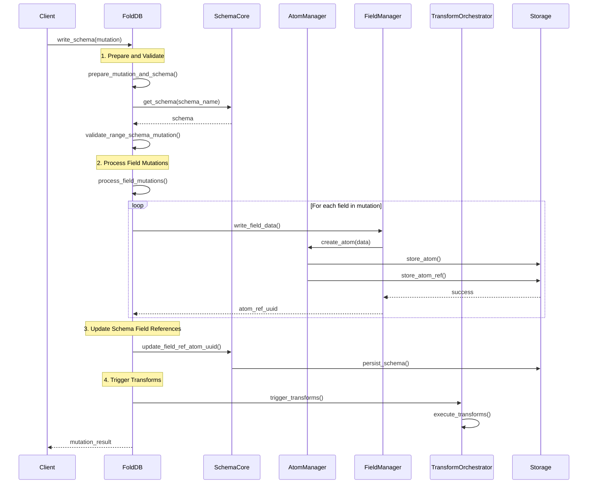
```mermaid
sequenceDiagram
    participant Client
    participant FoldDB
    participant SchemaCore
    participant AtomManager
    participant FieldManager
    participant TransformOrchestrator
    participant Storage
    
    Client->>FoldDB: write_schema(mutation)
    
    Note over FoldDB: 1. Prepare and Validate
    FoldDB->>FoldDB: prepare_mutation_and_schema()
    FoldDB->>SchemaCore: get_schema(schema_name)
    SchemaCore-->>FoldDB: schema
    FoldDB->>FoldDB: validate_range_schema_mutation()
    
    Note over FoldDB: 2. Process Field Mutations
    FoldDB->>FoldDB: process_field_mutations()
    
    loop For each field in mutation
        FoldDB->>FieldManager: write_field_data()
        FieldManager->>AtomManager: create_atom(data)
        AtomManager->>Storage: store_atom()
        AtomManager->>Storage: store_atom_ref()
        Storage-->>FieldManager: success
        FieldManager-->>FoldDB: atom_ref_uuid
    end
    
    Note over FoldDB: 3. Update Schema Field References
    FoldDB->>SchemaCore: update_field_ref_atom_uuid()
    SchemaCore->>Storage: persist_schema()
    
    Note over FoldDB: 4. Trigger Transforms
    FoldDB->>TransformOrchestrator: trigger_transforms()
    TransformOrchestrator->>TransformOrchestrator: execute_transforms()
    
    FoldDB-->>Client: mutation_result
```

### Query Processing Flow

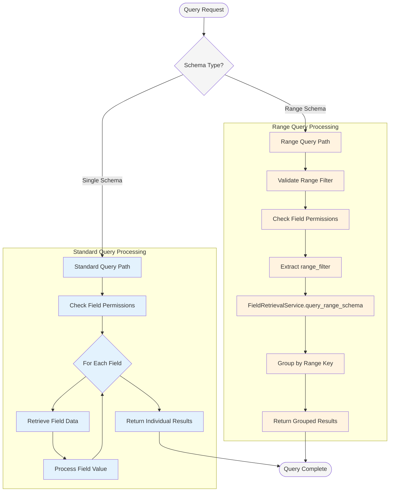
```mermaid
flowchart TD
    Start([Query Request]) --> RouteCheck{Schema Type?}
    
    RouteCheck -->|Range Schema| RangeQuery[Range Query Path]
    RouteCheck -->|Single Schema| StandardQuery[Standard Query Path]
    
    subgraph "Range Query Processing"
        RangeQuery --> ValidateRange[Validate Range Filter]
        ValidateRange --> CheckRangePerms[Check Field Permissions]
        CheckRangePerms --> ExtractRangeFilter[Extract range_filter]
        ExtractRangeFilter --> RangeRetrieval[FieldRetrievalService.query_range_schema]
        RangeRetrieval --> GroupResults[Group by Range Key]
        GroupResults --> ReturnGrouped[Return Grouped Results]
    end
    
    subgraph "Standard Query Processing"
        StandardQuery --> CheckPerms[Check Field Permissions]
        CheckPerms --> FieldLoop{For Each Field}
        FieldLoop --> GetField[Retrieve Field Data]
        GetField --> ProcessField[Process Field Value]
        ProcessField --> FieldLoop
        FieldLoop --> ReturnIndividual[Return Individual Results]
    end
    
    ReturnGrouped --> End([Query Complete])
    ReturnIndividual --> End
    
    classDef range fill:#fff3e0
    classDef standard fill:#e3f2fd
    classDef common fill:#f5f5f5
    
    class RangeQuery,ValidateRange,CheckRangePerms,ExtractRangeFilter,RangeRetrieval,GroupResults,ReturnGrouped range
    class StandardQuery,CheckPerms,FieldLoop,GetField,ProcessField,ReturnIndividual standard
    class Start,RouteCheck,End common
```

### Permission and Payment Flow

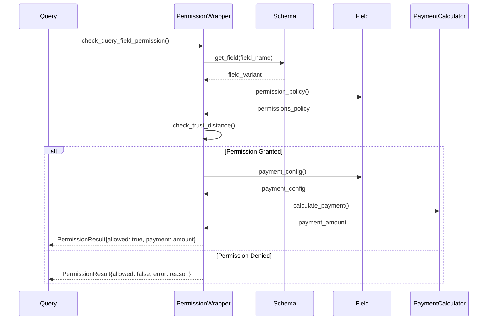
```mermaid
sequenceDiagram
    participant Query
    participant PermissionWrapper
    participant Schema
    participant Field
    participant PaymentCalculator
    
    Query->>PermissionWrapper: check_query_field_permission()
    
    PermissionWrapper->>Schema: get_field(field_name)
    Schema-->>PermissionWrapper: field_variant
    
    PermissionWrapper->>Field: permission_policy()
    Field-->>PermissionWrapper: permissions_policy
    
    PermissionWrapper->>PermissionWrapper: check_trust_distance()
    
    alt Permission Granted
        PermissionWrapper->>Field: payment_config()
        Field-->>PermissionWrapper: payment_config
        PermissionWrapper->>PaymentCalculator: calculate_payment()
        PaymentCalculator-->>PermissionWrapper: payment_amount
        PermissionWrapper-->>Query: PermissionResult{allowed: true, payment: amount}
    else Permission Denied
        PermissionWrapper-->>Query: PermissionResult{allowed: false, error: reason}
    end
```

---

## Transform System

### Transform Architecture

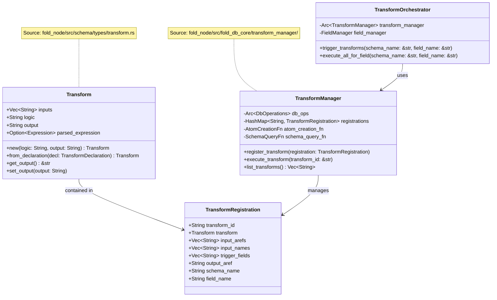
```mermaid
classDiagram
    class Transform {
        +Vec~String~ inputs
        +String logic
        +String output
        +Option~Expression~ parsed_expression
        +new(logic: String, output: String) Transform
        +from_declaration(decl: TransformDeclaration) Transform
        +get_output() &str
        +set_output(output: String)
    }
    
    class TransformRegistration {
        +String transform_id
        +Transform transform
        +Vec~String~ input_arefs
        +Vec~String~ input_names
        +Vec~String~ trigger_fields
        +String output_aref
        +String schema_name
        +String field_name
    }
    
    class TransformManager {
        -Arc~DbOperations~ db_ops
        -HashMap~String, TransformRegistration~ registrations
        -AtomCreationFn atom_creation_fn
        -SchemaQueryFn schema_query_fn
        +register_transform(registration: TransformRegistration)
        +execute_transform(transform_id: &str)
        +list_transforms() Vec~String~
    }
    
    class TransformOrchestrator {
        -Arc~TransformManager~ transform_manager
        -FieldManager field_manager
        +trigger_transforms(schema_name: &str, field_name: &str)
        +execute_all_for_field(schema_name: &str, field_name: &str)
    }
    
    Transform --> TransformRegistration : contained in
    TransformManager --> TransformRegistration : manages
    TransformOrchestrator --> TransformManager : uses
    
    note for Transform "Source: fold_node/src/schema/types/transform.rs"
    note for TransformManager "Source: fold_node/src/fold_db_core/transform_manager/"
```

### Transform Execution Flow

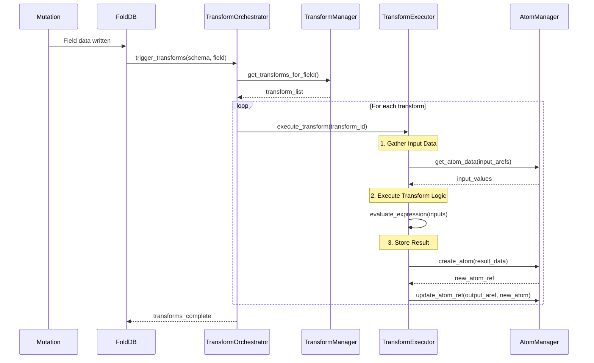
```mermaid
sequenceDiagram
    participant Mutation
    participant FoldDB
    participant TransformOrchestrator
    participant TransformManager
    participant TransformExecutor
    participant AtomManager
    
    Mutation->>FoldDB: Field data written
    FoldDB->>TransformOrchestrator: trigger_transforms(schema, field)
    
    TransformOrchestrator->>TransformManager: get_transforms_for_field()
    TransformManager-->>TransformOrchestrator: transform_list
    
    loop For each transform
        TransformOrchestrator->>TransformExecutor: execute_transform(transform_id)
        
        Note over TransformExecutor: 1. Gather Input Data
        TransformExecutor->>AtomManager: get_atom_data(input_arefs)
        AtomManager-->>TransformExecutor: input_values
        
        Note over TransformExecutor: 2. Execute Transform Logic
        TransformExecutor->>TransformExecutor: evaluate_expression(inputs)
        
        Note over TransformExecutor: 3. Store Result
        TransformExecutor->>AtomManager: create_atom(result_data)
        AtomManager-->>TransformExecutor: new_atom_ref
        
        TransformExecutor->>AtomManager: update_atom_ref(output_aref, new_atom)
    end
    
    TransformOrchestrator-->>FoldDB: transforms_complete
```

---

## Storage and Persistence

### Database Operations Layer

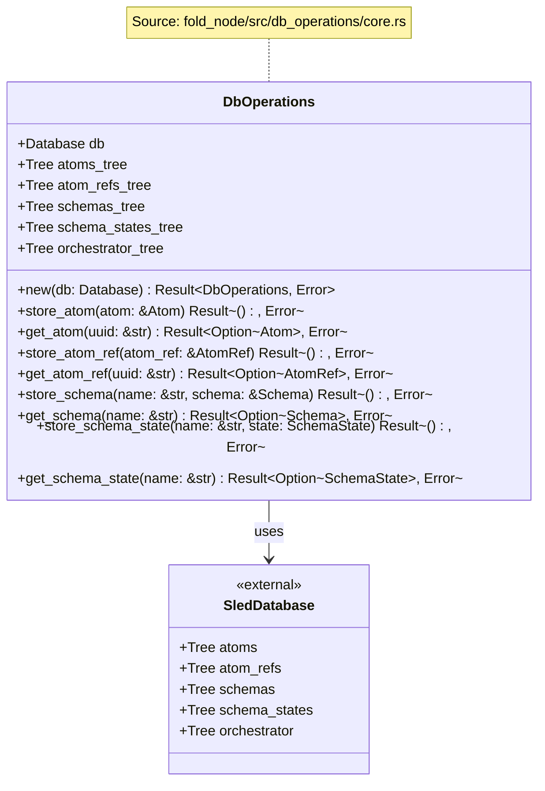
```mermaid
classDiagram
    class DbOperations {
        +Database db
        +Tree atoms_tree
        +Tree atom_refs_tree
        +Tree schemas_tree
        +Tree schema_states_tree
        +Tree orchestrator_tree
        +new(db: Database) Result~DbOperations, Error~
        +store_atom(atom: &Atom) Result~(), Error~
        +get_atom(uuid: &str) Result~Option~Atom~, Error~
        +store_atom_ref(atom_ref: &AtomRef) Result~(), Error~
        +get_atom_ref(uuid: &str) Result~Option~AtomRef~, Error~
        +store_schema(name: &str, schema: &Schema) Result~(), Error~
        +get_schema(name: &str) Result~Option~Schema~, Error~
        +store_schema_state(name: &str, state: SchemaState) Result~(), Error~
        +get_schema_state(name: &str) Result~Option~SchemaState~, Error~
    }
    
    class SledDatabase {
        <<external>>
        +Tree atoms
        +Tree atom_refs
        +Tree schemas
        +Tree schema_states
        +Tree orchestrator
    }
    
    DbOperations --> SledDatabase : uses
    
    note for DbOperations "Source: fold_node/src/db_operations/core.rs"
```

### Storage Tree Structure


```mermaid
graph TB
    subgraph "Sled Database Trees"
        AT[atoms]
        ART[atom_refs]
        ST[schemas]
        SST[schema_states]
        OT[orchestrator]
        MT[metadata]
        UT[utility]
    end
    
    subgraph "Data Organization"
        AT --> A1["uuid1 -> Atom{data, version, creator}"]
        AT --> A2["uuid2 -> Atom{data, version, creator}"]
        
        ART --> AR1["aref_uuid1 -> AtomRef{atom_uuid, status}"]
        ART --> AR2["aref_uuid2 -> AtomRef{atom_uuid, status}"]
        
        ST --> S1["schema_name1 -> Schema{fields, config}"]
        ST --> S2["schema_name2 -> Schema{fields, config}"]
        
        SST --> SS1["schema_name1 -> SchemaState::Approved"]
        SST --> SS2["schema_name2 -> SchemaState::Available"]
        
        OT --> T1["transform_id1 -> TransformRegistration"]
        OT --> T2["transform_id2 -> TransformRegistration"]
    end
    
    classDef tree fill:#e8f5e8
    classDef data fill:#fff3e0
    
    class AT,ART,ST,SST,OT,MT,UT tree
    class A1,A2,AR1,AR2,S1,S2,SS1,SS2,T1,T2 data
```

---

## Component Interactions

### Core Component Communication

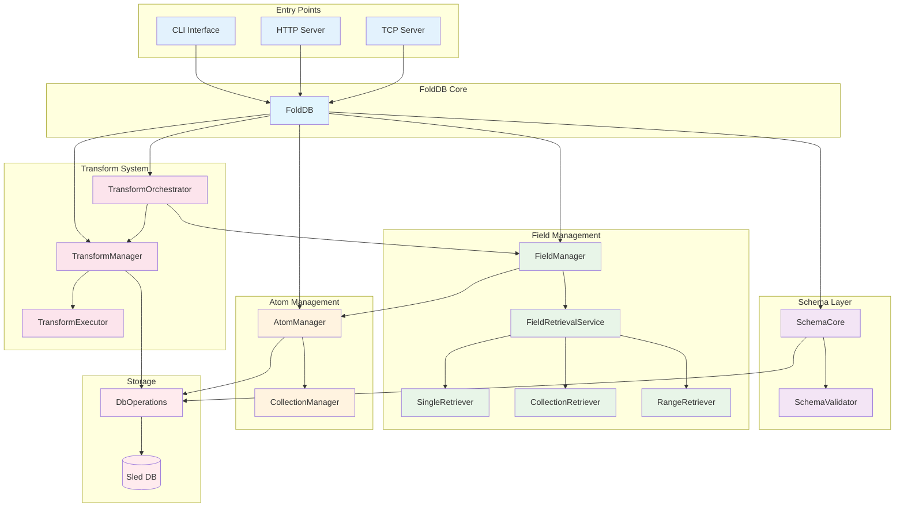
```mermaid
graph TD
    subgraph "Entry Points"
        CLI[CLI Interface]
        HTTP[HTTP Server]
        TCP[TCP Server]
    end
    
    subgraph "FoldDB Core"
        DB[FoldDB]
    end
    
    subgraph "Schema Layer"
        SC[SchemaCore]
        SV[SchemaValidator]
    end
    
    subgraph "Field Management"
        FM[FieldManager]
        FRS[FieldRetrievalService]
        SR[SingleRetriever]
        CR[CollectionRetriever]
        RR[RangeRetriever]
    end
    
    subgraph "Atom Management"
        AM[AtomManager]
        CM[CollectionManager]
    end
    
    subgraph "Transform System"
        TM[TransformManager]
        TO[TransformOrchestrator]
        TE[TransformExecutor]
    end
    
    subgraph "Storage"
        DBO[DbOperations]
        SLED[(Sled DB)]
    end
    
    CLI --> DB
    HTTP --> DB
    TCP --> DB
    
    DB --> SC
    DB --> FM
    DB --> AM
    DB --> TM
    DB --> TO
    
    SC --> SV
    SC --> DBO
    
    FM --> AM
    FM --> FRS
    FRS --> SR
    FRS --> CR
    FRS --> RR
    
    AM --> CM
    AM --> DBO
    
    TM --> TE
    TM --> DBO
    TO --> TM
    TO --> FM
    
    DBO --> SLED
    
    classDef entry fill:#e3f2fd
    classDef core fill:#e1f5fe
    classDef schema fill:#f3e5f5
    classDef field fill:#e8f5e8
    classDef atom fill:#fff3e0
    classDef transform fill:#fce4ec
    classDef storage fill:#ffebee
    
    class CLI,HTTP,TCP entry
    class DB core
    class SC,SV schema
    class FM,FRS,SR,CR,RR field
    class AM,CM atom
    class TM,TO,TE transform
    class DBO,SLED storage
```

### Data Access Patterns

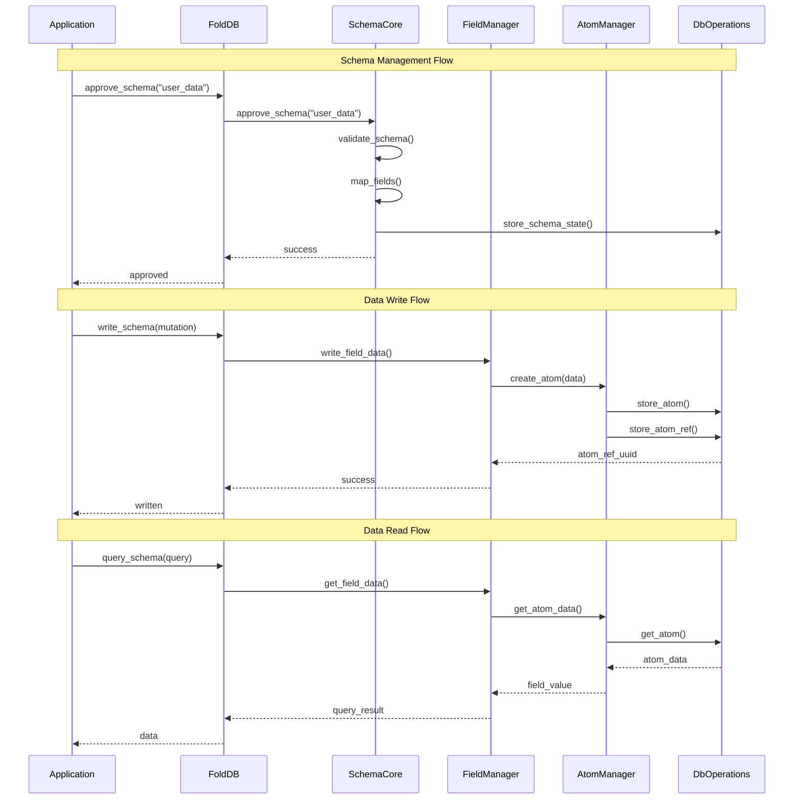
```mermaid
sequenceDiagram
    participant App as Application
    participant DB as FoldDB
    participant SC as SchemaCore
    participant FM as FieldManager
    participant AM as AtomManager
    participant Storage as DbOperations
    
    Note over App,Storage: Schema Management Flow
    App->>DB: approve_schema("user_data")
    DB->>SC: approve_schema("user_data")
    SC->>SC: validate_schema()
    SC->>SC: map_fields()
    SC->>Storage: store_schema_state()
    SC-->>DB: success
    DB-->>App: approved
    
    Note over App,Storage: Data Write Flow
    App->>DB: write_schema(mutation)
    DB->>FM: write_field_data()
    FM->>AM: create_atom(data)
    AM->>Storage: store_atom()
    AM->>Storage: store_atom_ref()
    Storage-->>FM: atom_ref_uuid
    FM-->>DB: success
    DB-->>App: written
    
    Note over App,Storage: Data Read Flow
    App->>DB: query_schema(query)
    DB->>FM: get_field_data()
    FM->>AM: get_atom_data()
    AM->>Storage: get_atom()
    Storage-->>AM: atom_data
    AM-->>FM: field_value
    FM-->>DB: query_result
    DB-->>App: data
```

---

## Logging and Observability

The DataFold logging system provides comprehensive observability across all components with feature-specific filtering, multiple output formats, and runtime configuration management.

### Architecture Integration

The logging system is integrated throughout the DataFold architecture:

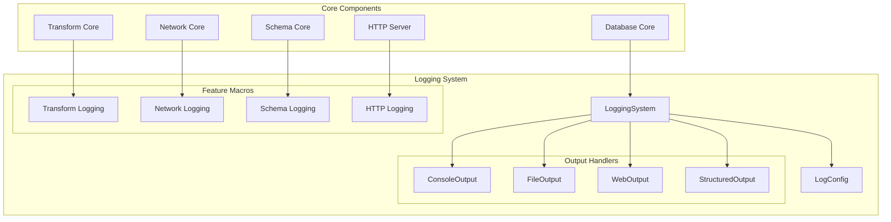
```mermaid
graph TB
    subgraph "Logging System"
        LS[LoggingSystem]
        LC[LogConfig]
        
        subgraph "Output Handlers"
            CO[ConsoleOutput]
            FO[FileOutput]
            WO[WebOutput]
            SO[StructuredOutput]
        end
        
        subgraph "Feature Macros"
            TL[Transform Logging]
            NL[Network Logging]
            SL[Schema Logging]
            HL[HTTP Logging]
        end
    end
    
    subgraph "Core Components"
        TC[Transform Core]
        NC[Network Core]
        SC[Schema Core]
        HC[HTTP Server]
        DBC[Database Core]
    end
    
    TC --> TL
    NC --> NL
    SC --> SL
    HC --> HL
    DBC --> LS
    
    LS --> LC
    LS --> CO
    LS --> FO
    LS --> WO
    LS --> SO
```

### Feature-Specific Logging

Each major component has dedicated logging targets and macros:

#### Transform System Logging
- **Target**: `datafold_node::transform`
- **Macros**: [`log_transform_debug!`](../fold_node/src/logging/features.rs), [`log_transform_info!`](../fold_node/src/logging/features.rs), [`log_transform_warn!`](../fold_node/src/logging/features.rs), [`log_transform_error!`](../fold_node/src/logging/features.rs)
- **Use Cases**: AST parsing, expression evaluation, transform execution monitoring

```rust
log_transform_info!("Transform execution completed",
                   transform_id = %transform.id,
                   duration_ms = duration.as_millis(),
                   records_processed = output.len());
```

#### Network System Logging
- **Target**: `datafold_node::network`
- **Macros**: [`log_network_debug!`](../fold_node/src/logging/features.rs), [`log_network_info!`](../fold_node/src/logging/features.rs), [`log_network_warn!`](../fold_node/src/logging/features.rs), [`log_network_error!`](../fold_node/src/logging/features.rs)
- **Use Cases**: Peer discovery, connection management, P2P protocol events

```rust
log_network_info!("Peer connection established",
                 peer_id = %peer.id,
                 address = %peer.address,
                 latency_ms = connection.latency());
```

#### Schema System Logging
- **Target**: `datafold_node::schema`
- **Macros**: [`log_schema_debug!`](../fold_node/src/logging/features.rs), [`log_schema_info!`](../fold_node/src/logging/features.rs), [`log_schema_warn!`](../fold_node/src/logging/features.rs), [`log_schema_error!`](../fold_node/src/logging/features.rs)
- **Use Cases**: Schema validation, field type checking, schema lifecycle events

```rust
log_schema_error!("Schema validation failed",
                 schema_name = %schema.name,
                 field_path = %error.field_path,
                 validation_error = %error.message);
```

#### HTTP Server Logging
- **Target**: `datafold_node::http_server`
- **Macros**: [`log_http_debug!`](../fold_node/src/logging/features.rs), [`log_http_info!`](../fold_node/src/logging/features.rs), [`log_http_warn!`](../fold_node/src/logging/features.rs), [`log_http_error!`](../fold_node/src/logging/features.rs)
- **Use Cases**: Request/response logging, API endpoint monitoring, performance tracking

```rust
log_http_info!("Request completed",
              method = %req.method(),
              path = %req.path(),
              status = response.status(),
              duration_ms = timer.elapsed().as_millis());
```

### Configuration Management

#### Static Configuration
Logging behavior is configured via [`config/logging.toml`](../config/logging.toml):

```toml
[general]
default_level = "INFO"
enable_correlation_ids = true

[features]
transform = "DEBUG"
network = "INFO"
schema = "INFO"
http_server = "INFO"

[outputs.console]
enabled = true
level = "INFO"
colors = true

[outputs.file]
enabled = true
path = "logs/datafold.log"
level = "DEBUG"
```

#### Runtime Configuration
Log levels can be adjusted without restarting via HTTP API:

```bash
# Update feature-specific log level
curl -X POST /api/logs/features \
  -d '{"feature": "transform", "level": "TRACE"}'

# Reload configuration from file
curl -X POST /api/logs/reload
```

### Output Types and Integration

#### Console Output
- **Purpose**: Development and debugging
- **Features**: Colored output, configurable formatting
- **Implementation**: [`ConsoleOutput`](../fold_node/src/logging/outputs/console.rs)

#### File Output
- **Purpose**: Persistent logging for production
- **Features**: Log rotation, structured formatting
- **Implementation**: [`FileOutput`](../fold_node/src/logging/outputs/file.rs)

#### Web Streaming Output
- **Purpose**: Real-time monitoring via web interface
- **Features**: Live log streaming, filtering capabilities
- **Implementation**: [`WebOutput`](../fold_node/src/logging/outputs/web.rs)
- **HTTP Endpoint**: `/api/logs/stream` (Server-Sent Events)

#### Structured JSON Output
- **Purpose**: Integration with monitoring systems (ELK, Splunk, etc.)
- **Features**: Machine-readable format, rich metadata
- **Implementation**: [`StructuredOutput`](../fold_node/src/logging/outputs/structured.rs)

### Performance Monitoring

The logging system includes built-in performance monitoring utilities:

#### Performance Timer
```rust
use fold_node::logging::features::{PerformanceTimer, LogFeature};

let timer = PerformanceTimer::new(LogFeature::Transform, "user_calculation".to_string());
let result = perform_calculation().await?;
timer.finish(); // Automatically logs duration
```

#### Correlation IDs
Request tracking across components:
```rust
// Automatically generated correlation IDs
log_http_info!("Request started", correlation_id = "req_abc123");
log_schema_debug!("Validating schema", correlation_id = "req_abc123");
log_transform_info!("Transform completed", correlation_id = "req_abc123");
```

### Observability Integration

#### Metrics Collection
Structured logs can be processed by monitoring systems:

```json
{
  "timestamp": "2025-06-02T21:13:03.456Z",
  "level": "INFO",
  "target": "datafold_node::transform",
  "message": "Transform completed successfully",
  "fields": {
    "transform_id": "user_score_calc",
    "duration_ms": 45,
    "records_processed": 1000,
    "correlation_id": "req_abc123"
  }
}
```

#### Health Monitoring
System health events are logged with standardized fields:

```rust
log::info!(
    target: "datafold_node::health",
    "System health check",
    status = "healthy",
    cpu_percent = 35.2,
    memory_percent = 42.1,
    active_connections = 127,
    uptime_seconds = 3600
);
```

### Migration and Best Practices

#### Migration from Standard Logging
The system provides backward compatibility with standard `log` crate while encouraging migration to feature-specific macros:

```bash
# Analyze existing code for migration opportunities
python scripts/migrate_logging.py fold_node/src/ --report

# Generate migration suggestions
python scripts/migrate_logging.py fold_node/src/ --detailed --output migration.md
```

#### Best Practices
1. **Use Feature-Specific Macros**: Prefer `log_transform_info!` over `log::info!` for better filtering
2. **Structured Logging**: Include relevant context fields for better searchability
3. **Performance Awareness**: Use appropriate log levels to minimize overhead
4. **Correlation IDs**: Include correlation IDs for request tracking across components

For comprehensive logging documentation, see [`docs/LOGGING_GUIDE.md`](LOGGING_GUIDE.md).

## Source Code References

### Core Components

| Component | Source File | Key Responsibilities |
|-----------|-------------|---------------------|
| [`FoldDB`](fold_node/src/fold_db_core/mod.rs:33) | `fold_node/src/fold_db_core/mod.rs` | Main database coordinator |
| [`SchemaCore`](fold_node/src/schema/core.rs:65) | `fold_node/src/schema/core.rs` | Schema lifecycle management |
| [`AtomManager`](fold_node/src/fold_db_core/atom_manager.rs) | `fold_node/src/fold_db_core/atom_manager.rs` | Atom creation and versioning |
| [`FieldManager`](fold_node/src/fold_db_core/field_manager.rs) | `fold_node/src/fold_db_core/field_manager.rs` | Field data operations |
| [`DbOperations`](fold_node/src/db_operations/core.rs) | `fold_node/src/db_operations/core.rs` | Storage abstraction layer |

### Schema System

| Component | Source File | Key Responsibilities |
|-----------|-------------|---------------------|
| [`Schema`](fold_node/src/schema/types/schema.rs:35) | `fold_node/src/schema/types/schema.rs` | Schema definition structure |
| [`FieldVariant`](fold_node/src/schema/types/field/variant.rs:13) | `fold_node/src/schema/types/field/variant.rs` | Field type enumeration |
| [`SingleField`](fold_node/src/schema/types/field/single_field.rs) | `fold_node/src/schema/types/field/single_field.rs` | Single value field implementation |
| [`RangeField`](fold_node/src/schema/types/field/range_field.rs) | `fold_node/src/schema/types/field/range_field.rs` | Range-based field implementation |
| [`SchemaState`](fold_node/src/schema/core.rs:45) | `fold_node/src/schema/core.rs` | Schema lifecycle states |

### Atom System

| Component | Source File | Key Responsibilities |
|-----------|-------------|---------------------|
| [`AtomRef`](fold_node/src/atom/atom_ref.rs:9) | `fold_node/src/atom/atom_ref.rs` | Reference to atom versions |
| [`AtomRefRange`](fold_node/src/atom/atom_ref_range.rs) | `fold_node/src/atom/atom_ref_range.rs` | Range-based atom references |
| [`AtomRefBehavior`](fold_node/src/atom/atom_ref_behavior.rs) | `fold_node/src/atom/atom_ref_behavior.rs` | Common atom reference operations |
| [`AtomRefStatus`](fold_node/src/atom/atom_ref_types.rs:5) | `fold_node/src/atom/atom_ref_types.rs` | Atom reference status tracking |

### Data Flow

| Component | Source File | Key Responsibilities |
|-----------|-------------|---------------------|
| [`Mutation`](fold_node/src/schema/types/operations.rs) | `fold_node/src/schema/types/operations.rs` | Data write operations |
| [`Query`](fold_node/src/schema/types/operations.rs) | `fold_node/src/schema/types/operations.rs` | Data read operations |
| [`write_schema()`](fold_node/src/fold_db_core/mutation.rs:10) | `fold_node/src/fold_db_core/mutation.rs` | Mutation processing logic |
| [`query_schema()`](fold_node/src/fold_db_core/query.rs:77) | `fold_node/src/fold_db_core/query.rs` | Query processing logic |

### Transform System

| Component | Source File | Key Responsibilities |
|-----------|-------------|---------------------|
| [`Transform`](fold_node/src/schema/types/transform.rs:54) | `fold_node/src/schema/types/transform.rs` | Transform definition structure |
| [`TransformManager`](fold_node/src/fold_db_core/transform_manager/manager.rs) | `fold_node/src/fold_db_core/transform_manager/` | Transform execution management |
| [`TransformOrchestrator`](fold_node/src/fold_db_core/transform_orchestrator.rs) | `fold_node/src/fold_db_core/transform_orchestrator.rs` | Transform coordination |

### Field Retrieval

| Component | Source File | Key Responsibilities |
|-----------|-------------|---------------------|
| [`FieldRetrievalService`](fold_node/src/fold_db_core/field_retrieval/service.rs) | `fold_node/src/fold_db_core/field_retrieval/service.rs` | Field data retrieval coordination |
| [`RangeRetriever`](fold_node/src/fold_db_core/field_retrieval/range_retriever.rs) | `fold_node/src/fold_db_core/field_retrieval/range_retriever.rs` | Range field data retrieval |
| [`SingleRetriever`](fold_node/src/fold_db_core/field_retrieval/single_retriever.rs) | `fold_node/src/fold_db_core/field_retrieval/single_retriever.rs` | Single field data retrieval |

---

## Key Design Patterns

### 1. **State Management Pattern**
- Schema lifecycle managed through explicit state transitions
- Immutable atoms with mutable references (AtomRef)
- Version history preservation for audit trails

### 2. **Strategy Pattern**
- Different field types (Single, Collection, Range) with unified interface
- Pluggable retrieval strategies for different data access patterns
- Configurable permission and payment policies per field

### 3. **Command Pattern**
- Mutations as structured commands with validation
- Transform operations as executable commands
- Atomic operation guarantees through command execution

### 4. **Observer Pattern**
- Transform system triggers on field mutations
- Event-driven transform orchestration
- Automatic dependency resolution for transform chains

### 5. **Repository Pattern**
- DbOperations as data access abstraction
- Consistent CRUD operations across different data types
- Storage engine independence through abstraction layer

---

This architectural documentation provides a comprehensive view of the Fold DB core system, designed to help developers understand the system's structure, data flow, and component relationships. Each diagram represents a key aspect of the system architecture, with references to the actual source code for detailed implementation understanding.