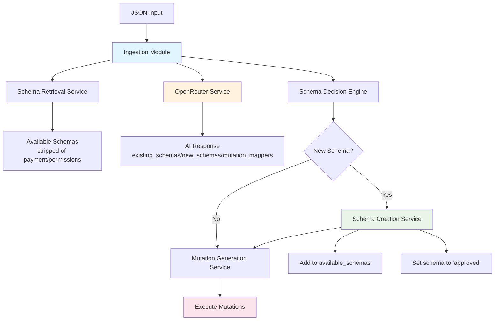

# Ingestion Module Architecture Plan

## Overview

This document outlines the architecture for creating an ingestion module that:
1. Takes in a JSON
2. Gets all available schemas in JSON format (stripped of payment and permissions keys)
3. Sends the sample data JSON, available schemas, and a prompt to OpenRouter API
4. If it's a new schema, puts the new schema in 'available_schemas', sets it to 'approved', then creates mutations to put the new JSON data in

## Architecture Diagram



## Core Components

### 1. Ingestion Module (`fold_node/src/ingestion/mod.rs`)
- Main orchestrator that coordinates the entire ingestion process
- Handles the 4-step workflow
- Integrates with existing `SchemaCore` and `Mutation` systems

### 2. OpenRouter Service (`fold_node/src/ingestion/openrouter_service.rs`)
- Handles communication with OpenRouter API
- Configurable API key through environment variables or config
- Formats prompts and parses AI responses
- Error handling for API failures

### 3. Schema Stripping Service (`fold_node/src/ingestion/schema_stripper.rs`)
- Removes payment and permissions keys from schemas
- Converts `Schema` objects to clean JSON format
- Preserves essential schema structure for AI analysis

### 4. Mutation Generator (`fold_node/src/ingestion/mutation_generator.rs`)
- Creates `Mutation` objects from AI responses
- Maps JSON field paths to schema field paths
- Handles different `MutationType` variants
- **Used for both existing and new schemas**

## Integration Points

### With Existing Schema System:
- Uses `SchemaCore::discover_and_load_all_schemas()` to get available schemas
- Uses `SchemaCore::load_schema_internal()` for new schemas
- Uses `SchemaCore::approve_schema()` to set schemas to approved
- Uses `SchemaCore::set_schema_state()` for state management

### With Mutation System:
- Creates `Mutation` objects compatible with existing system
- Uses `FoldDB::write_schema()` for execution
- Integrates with permission and payment systems

## AI Service Integration

### OpenRouter API Format
The AI service will expect responses in this exact format:
```json
{
  "existing_schemas": ["schema_name_1", "schema_name_2"],
  "new_schemas": {
    "name": "new_schema_name",
    "fields": { /* field definitions */ }
  },
  "mutation_mappers": {
    "path.to.field": "schema.field",
    "nested.path[0].value": "schema.collection_field[\"item_key\"]",
    "simple_field": "schema.simple_field"
  }
}
```

### Mutation Mapper Format Details
- **JSON field path**: Uses dot notation with array indices, e.g., `path.to.field[0].subfield`
- **Schema field path**: Uses schema.field format with optional keys, e.g., `schema.field["optional_key"]`
- **Examples**:
  - `"user.name"` → `"UserSchema.name"`
  - `"items[0].price"` → `"ProductSchema.price"`
  - `"metadata.tags[1]"` → `"MetadataSchema.tags["tag_value"]"`

### Prompt Template
```
Tell me which of these schemas to use for this sample json data. If none are available, then create a new one. Return the value in this format:
{
  existing_schemas: [<list_of_schema_names>],
  new_schemas: <single_schema_definition>,
  mutation_mappers: {json_field_path: schema_field_path}
}

Where:
- existing_schemas is an array of schema names that match the input data
- new_schemas is a single schema definition if no existing schemas match
- mutation_mappers maps JSON paths (like "path.field[0]") to schema paths (like "schema.field[\"key\"]")

Sample JSON Data:
{sample_json}

Available Schemas:
{available_schemas}
```

## Configuration

### Environment Variables:
- `FOLD_OPENROUTER_API_KEY` - OpenRouter API key
- `OPENROUTER_MODEL` - Model to use (default: "anthropic/claude-3.5-sonnet")
- `INGESTION_ENABLED` - Enable/disable ingestion module

### Config Integration:
- Extend `NodeConfig` to include ingestion settings
- Add ingestion configuration to existing config system

## HTTP API Endpoints

Add to `http_server.rs`:
```rust
.route("/api/ingestion/process", web::post().to(ingestion_routes::process_json))
.route("/api/ingestion/status", web::get().to(ingestion_routes::get_status))
```

### API Request Format:
```json
{
  "data": { /* JSON data to ingest */ },
  "auto_execute": true, // Optional: auto-execute mutations
  "trust_distance": 0   // Optional: trust distance for mutations
}
```

### API Response Format:
```json
{
  "success": true,
  "schema_used": "existing_schema_name",
  "new_schema_created": false,
  "mutations_generated": 3,
  "mutations_executed": 3,
  "errors": []
}
```

## Error Handling

### Custom Error Types:
- `IngestionError::OpenRouterError` - API communication failures
- `IngestionError::SchemaParsingError` - Invalid AI responses
- `IngestionError::MutationGenerationError` - Failed mutation creation
- `IngestionError::ConfigurationError` - Missing API keys or config
- `IngestionError::SchemaCreationError` - Failed to create new schema

## File Structure

```
fold_node/src/ingestion/
├── mod.rs                    # Main module exports
├── core.rs                   # Main IngestionCore struct
├── openrouter_service.rs     # OpenRouter API integration
├── schema_stripper.rs        # Schema cleaning service
├── mutation_generator.rs     # Mutation creation logic (for both new and existing schemas)
├── error.rs                  # Custom error types
├── config.rs                 # Configuration structures
└── routes.rs                 # HTTP route handlers
```

## Dependencies to Add

Add to `Cargo.toml`:
```toml
[dependencies]
reqwest = { version = "0.11", features = ["json"] }
tokio = { version = "1.0", features = ["full"] }
```

## Implementation Flow

### 1. JSON Input Processing
```rust
pub async fn process_json_ingestion(
    input_json: Value,
    auto_execute: bool,
    trust_distance: u32
) -> Result<IngestionResult, IngestionError>
```

### 2. Schema Retrieval and Stripping
```rust
pub fn get_stripped_schemas(&self) -> Result<Vec<Value>, IngestionError>
```

### 3. OpenRouter API Call
```rust
pub async fn get_schema_recommendation(
    &self,
    sample_json: &Value,
    available_schemas: &[Value]
) -> Result<AIResponse, IngestionError>
```

### 4. Schema Creation (if needed)
```rust
pub fn create_new_schema(
    &self,
    schema_definition: Value
) -> Result<String, IngestionError>
```

### 5. Mutation Generation (for both new and existing schemas)
```rust
pub fn generate_mutations(
    &self,
    schema_name: &str,
    json_data: &Value,
    mutation_mappers: &Value,
    trust_distance: u32
) -> Result<Vec<Mutation>, IngestionError>
```

### 6. Mutation Execution
```rust
pub fn execute_mutations(
    &self,
    mutations: Vec<Mutation>
) -> Result<Vec<MutationResult>, IngestionError>
```

## Testing Strategy

### Unit Tests:
- Mock OpenRouter service for testing
- Test schema stripping functionality
- Test mutation generation logic for both scenarios
- Test error handling scenarios

### Integration Tests:
- End-to-end ingestion workflow
- Integration with existing schema system
- Real OpenRouter API testing (optional)

## Security Considerations

- API key management and secure storage
- Input validation for JSON data
- Rate limiting for OpenRouter API calls
- Permission validation for schema creation and mutations

## Performance Considerations

- Caching of stripped schemas
- Async processing for API calls
- Batch processing support for multiple JSON inputs
- Connection pooling for OpenRouter API

## Future Enhancements

- Support for multiple AI providers
- Schema versioning and migration
- Batch ingestion processing
- Real-time ingestion streaming
- Schema suggestion learning from user feedback