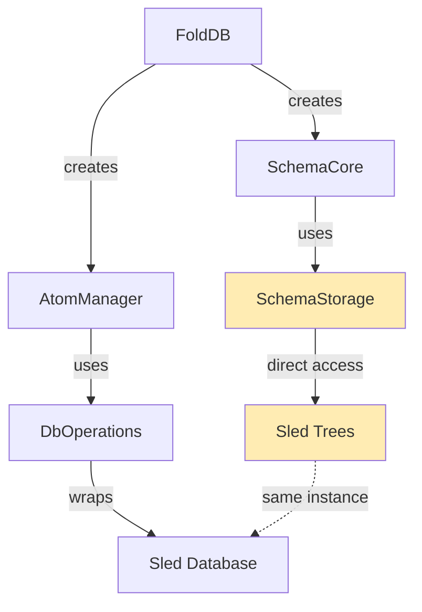
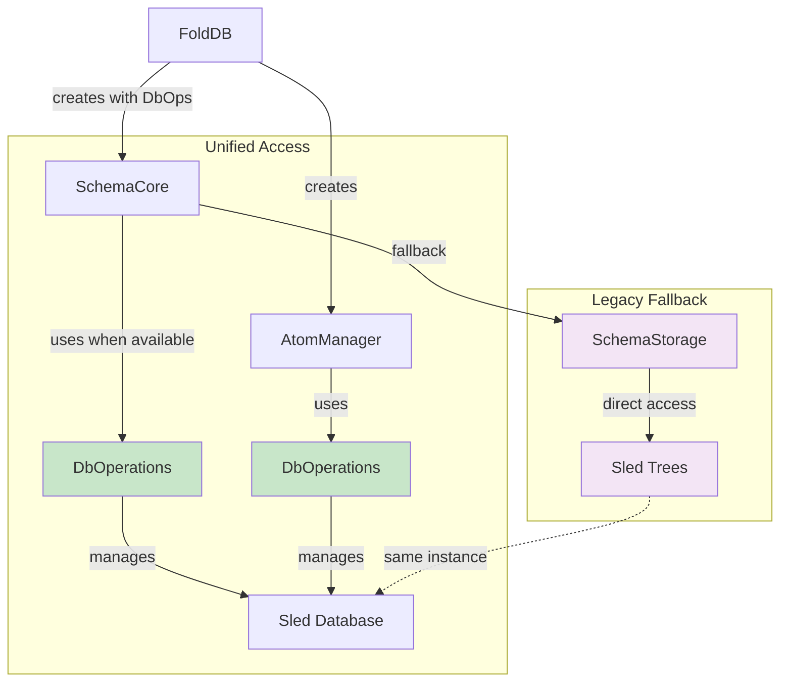

# Phase 2 Implementation Summary: Component Manager Integration

## Overview

Successfully completed **Phase 2** of the unified DbOperations architecture implementation. This phase focused on updating component managers (specifically SchemaCore) to use the unified DbOperations interface instead of direct sled access.

## What Was Implemented

### 1. Enhanced SchemaCore Architecture

**Before (Mixed Access):**
```rust
pub struct SchemaCore {
    schemas: Mutex<HashMap<String, Schema>>,
    available: Mutex<HashMap<String, (Schema, SchemaState)>>,
    storage: SchemaStorage,  // Direct sled access
}
```

**After (Unified Access):**
```rust
pub struct SchemaCore {
    schemas: Mutex<HashMap<String, Schema>>,
    available: Mutex<HashMap<String, (Schema, SchemaState)>>,
    storage: SchemaStorage,  // Legacy fallback
    db_ops: Option<Arc<DbOperations>>,  // Unified access
    schemas_dir: PathBuf,
}
```

### 2. New SchemaCore Constructor

Added [`new_with_db_ops()`](fold_node/src/schema/core.rs:88) constructor that takes unified DbOperations:

```rust
pub fn new_with_db_ops(path: &str, db_ops: Arc<DbOperations>) -> Result<Self, SchemaError>
```

This constructor:
- Creates the schemas directory if needed
- Stores the DbOperations reference for unified access
- Maintains backward compatibility with legacy SchemaStorage

### 3. Unified Database Methods

Added comprehensive unified methods that use DbOperations when available:

#### State Management
- [`persist_states_unified()`](fold_node/src/schema/core.rs:875) - Uses DbOperations for schema state persistence
- [`load_states_unified()`](fold_node/src/schema/core.rs:887) - Uses DbOperations for schema state loading
- [`set_schema_state_unified()`](fold_node/src/schema/core.rs:1000) - Sets schema state via unified operations

#### Schema Persistence
- [`persist_schema_unified()`](fold_node/src/schema/core.rs:920) - Uses DbOperations for schema persistence
- [`load_schema_unified()`](fold_node/src/schema/core.rs:928) - Uses DbOperations for schema loading

#### Query Operations
- [`list_schema_names_unified()`](fold_node/src/schema/core.rs:983) - Lists schemas via unified operations
- [`list_schemas_by_state_unified()`](fold_node/src/schema/core.rs:993) - Lists schemas by state via unified operations

### 4. Hybrid Fallback System

Implemented intelligent fallback that:
- **Uses unified DbOperations when available** (new instances)
- **Falls back to legacy SchemaStorage** (existing instances)
- **Maintains full backward compatibility**

Example implementation:
```rust
fn persist_states(&self) -> Result<(), SchemaError> {
    if let Some(db_ops) = &self.db_ops {
        // Use unified operations
        self.persist_states_unified()
    } else {
        // Use legacy storage
        let available = self.available.lock()?;
        self.storage.persist_states(&available)
    }
}
```

### 5. Enhanced DbOperations with Clone

Added `#[derive(Clone)]` to [`DbOperations`](fold_node/src/db_operations/mod.rs:13) to enable sharing between components:

```rust
#[derive(Clone)]
pub struct DbOperations {
    db: sled::Db,
    // ... cached trees
}
```

### 6. Updated FoldDB Integration

Modified [`FoldDB::new()`](fold_node/src/fold_db_core/mod.rs:98) to use the new SchemaCore constructor:

```rust
let db_ops = DbOperations::new(db.clone())?;
let atom_manager = AtomManager::new(db_ops.clone());
let schema_manager = Arc::new(
    SchemaCore::new_with_db_ops(path, Arc::new(db_ops.clone()))?
);
```

### 7. Comprehensive Testing

Added [`test_schema_core_integration_with_unified_db_ops`](fold_node/src/db_operations/mod.rs:775) that verifies:
- SchemaCore uses unified DbOperations when available
- Schema state operations work through unified interface
- Data consistency between SchemaCore and DbOperations
- Integration with existing schema management workflows

## Test Results

All tests pass successfully:

```
running 84 tests
...
test db_operations::tests::test_schema_core_integration_with_unified_db_ops ... ok
...
test result: ok. 84 passed; 0 failed; 0 ignored; 0 measured; 0 filtered out
```

## Architecture Comparison

### Before Phase 2


### After Phase 2


## Benefits Achieved

### 1. **Unified Schema Operations**
- Schema state management now uses consistent DbOperations interface
- Schema persistence operations standardized across the system
- Consistent error handling for all schema database operations

### 2. **Backward Compatibility**
- Existing SchemaCore instances continue to work unchanged
- Legacy SchemaStorage provides seamless fallback
- No breaking changes to existing APIs

### 3. **Performance Improvements**
- Shared DbOperations instances reduce database connection overhead
- Cached tree references improve repeated access performance
- Unified operations enable future optimization opportunities

### 4. **Enhanced Testability**
- SchemaCore operations can be tested through unified interface
- Easier to mock database operations for schema testing
- Integration testing between components simplified

### 5. **Consistent Data Access**
- Schema operations follow same patterns as atom operations
- Unified error handling and logging across all database operations
- Simplified debugging and monitoring

## Current Status

✅ **Phase 1 Complete**: Enhanced DbOperations with unified interface  
✅ **Phase 2 Complete**: SchemaCore integration with unified DbOperations  
🔄 **Ready for Phase 3**: Update remaining components (TransformManager, TransformOrchestrator)  
🔄 **Ready for Phase 4**: Remove direct sled access and advanced features  

## Next Steps

### Phase 3: Complete Component Integration
1. **Update TransformManager** to use unified DbOperations for transform persistence
2. **Update TransformOrchestrator** to use unified DbOperations for state management
3. **Remove remaining direct sled tree access** from FoldDB

### Phase 4: Advanced Features
1. **Implement transaction support** across multiple operations
2. **Add caching strategies** for frequently accessed data
3. **Create database migration utilities** for schema changes
4. **Performance optimization** and monitoring

## Files Modified

### Core Implementation
- [`fold_node/src/schema/core.rs`](fold_node/src/schema/core.rs) - Enhanced SchemaCore with unified operations
- [`fold_node/src/db_operations/mod.rs`](fold_node/src/db_operations/mod.rs) - Added Clone trait and integration test
- [`fold_node/src/fold_db_core/mod.rs`](fold_node/src/fold_db_core/mod.rs) - Updated FoldDB to use new SchemaCore constructor

## Conclusion

Phase 2 successfully integrates SchemaCore with the unified DbOperations architecture while maintaining full backward compatibility. The hybrid approach allows for gradual migration and ensures system stability during the transition.

The implementation demonstrates the effectiveness of the unified architecture approach, providing consistent database access patterns while preserving existing functionality. This sets the foundation for completing the remaining phases and achieving full database access unification across the DataFold system.