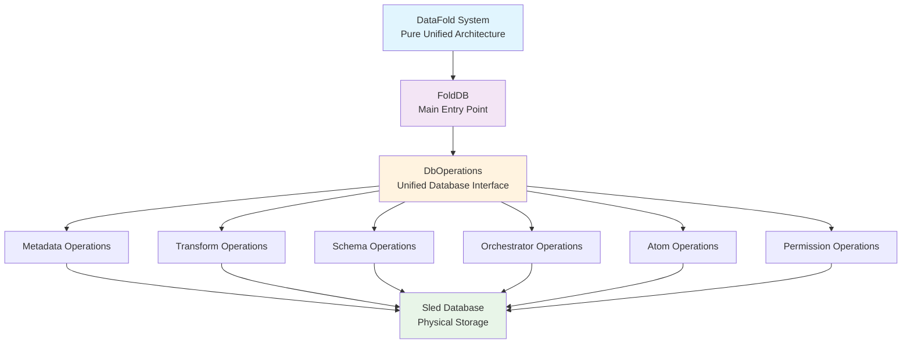
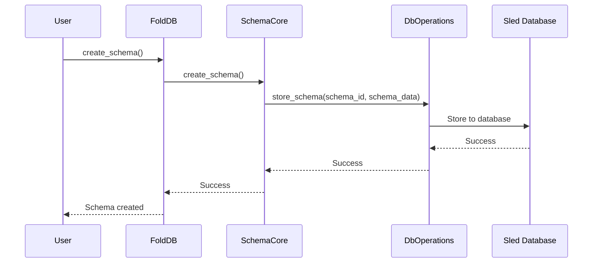
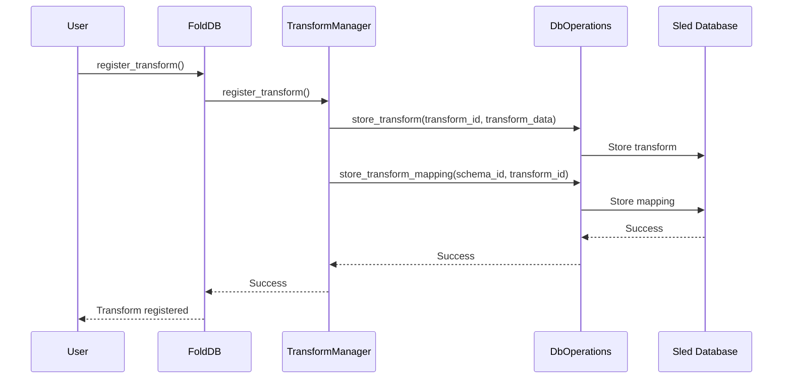
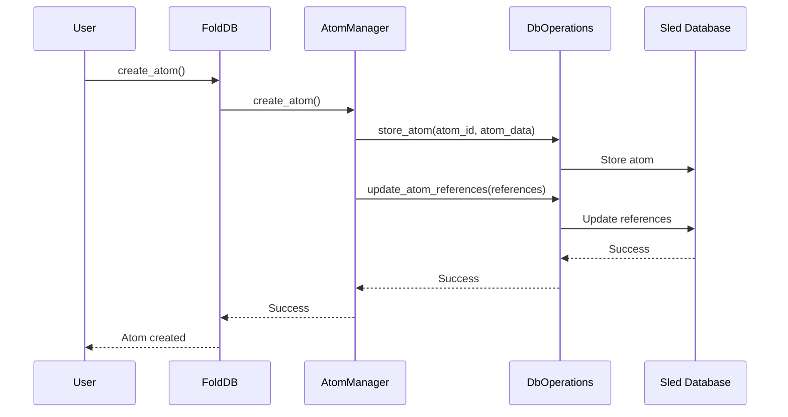
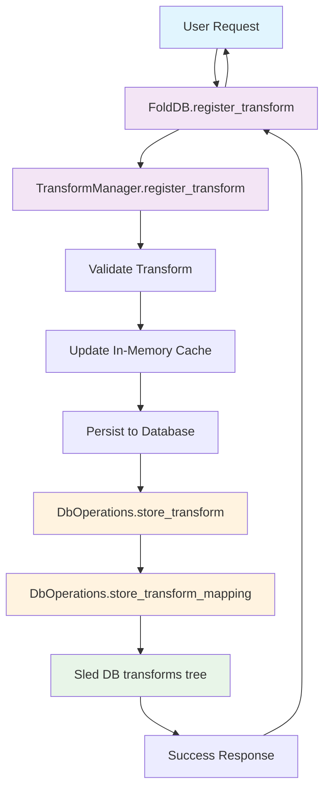
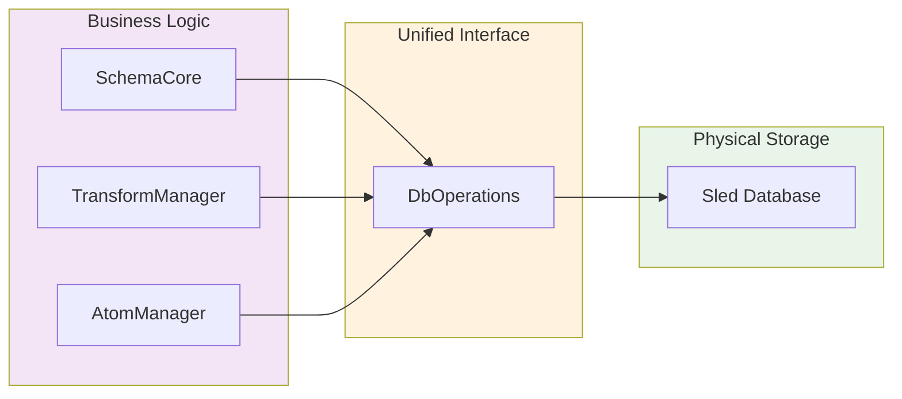
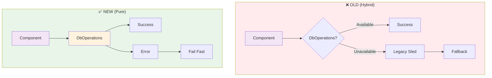
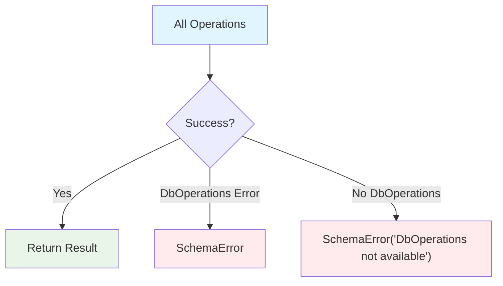
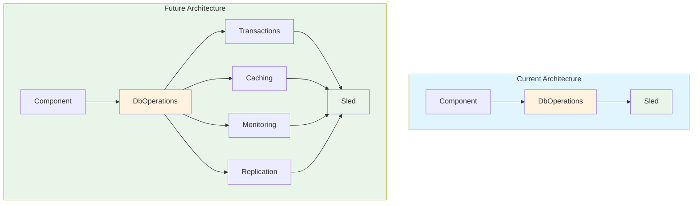

# Pure Unified Operations Architecture Diagram

## High-Level Architecture Overview



## Component Architecture Detail

```mermaid
graph TB
    subgraph FoldDB["FoldDB (Main Application Layer)"]
        SC[SchemaCore<br/>new(DbOperations)]
        TM[TransformManager<br/>new(DbOperations)]
        AM[AtomManager<br/>new(DbOperations)]
    end
    
    subgraph DbOps["DbOperations (Single Source of Truth)"]
        subgraph SchemaOps["Schema Operations"]
            SSS[store_schema_state]
            GSS[get_schema_state]
            LSS[list_schemas_by_state]
            DSS[delete_schema_state]
        end
        
        subgraph TransformOps["Transform Operations"]
            ST[store_transform]
            GT[get_transform]
            LT[list_transforms]
            DT[delete_transform]
            STM[store_transform_mapping]
        end
        
        subgraph MetadataOps["Metadata Operations"]
            SI[store_item]
            GI[get_item]
            DI[delete_item]
            LK[list_keys]
        end
        
        subgraph OrchestratorOps["Orchestrator Operations"]
            SOS[store_orchestrator_state]
            GOS[get_orchestrator_state]
            LOK[list_orchestrator_keys]
        end
        
        subgraph AtomOps["Atom Operations"]
            CA[create_atom]
            UAR[update_atom_ref]
            UARC[update_atom_ref_*]
        end
        
        subgraph PermOps["Permission Operations"]
            GSP[get_schema_permissions]
            SSP[set_schema_permissions]
        end
    end
    
    subgraph SledDB["Sled Database (Physical Storage)"]
        MT[metadata tree]
        TT[transforms tree]
        ST2[schemas tree]
        OT[orchestrator tree]
        PT[permissions tree]
        AT[atoms tree]
        RT[ranges tree]
    end
    
    SC --> DbOps
    TM --> DbOps
    AM --> DbOps
    
    SchemaOps --> SledDB
    TransformOps --> SledDB
    MetadataOps --> SledDB
    OrchestratorOps --> SledDB
    AtomOps --> SledDB
    PermOps --> SledDB
    
    style FoldDB fill:#e1f5fe
    style DbOps fill:#fff3e0
    style SledDB fill:#e8f5e8
    style SC fill:#f3e5f5
    style TM fill:#f3e5f5
    style AM fill:#f3e5f5
```

## Data Flow Architecture

```mermaid
flowchart TD
    subgraph AppLayer["Application Layer"]
        UR[User Request] --> FM[FoldDB.method]
        FM --> CM[Component.method]
    end
    
    subgraph BizLayer["Business Logic Layer"]
        subgraph Components["Components"]
            SC2[SchemaCore<br/>• Schema logic<br/>• Validation<br/>• State mgmt]
            TM2[TransformManager<br/>• Transform validation<br/>• Registration<br/>• Execution]
            AM2[AtomManager<br/>• Atom logic<br/>• Reference mgmt]
        end
        
        Note1[ALL OPERATIONS GO THROUGH<br/>UNIFIED INTERFACE]
    end
    
    subgraph DbLayer["Database Abstraction Layer"]
        DbOps2[DbOperations<br/>• Single point of database access<br/>• Consistent error handling<br/>• Transaction support (future)<br/>• Caching layer (future)<br/>• Monitoring & metrics (future)]
    end
    
    subgraph StorageLayer["Storage Layer"]
        SledDB2[Sled Database<br/>• Embedded key-value store<br/>• ACID transactions<br/>• Crash-safe persistence<br/>• Multiple trees for data organization]
    end
    
    CM --> Components
    SC2 --> DbOps2
    TM2 --> DbOps2
    AM2 --> DbOps2
    DbOps2 --> SledDB2
    
    style AppLayer fill:#e1f5fe
    style BizLayer fill:#f3e5f5
    style DbLayer fill:#fff3e0
    style StorageLayer fill:#e8f5e8
    style Note1 fill:#ffeb3b,color:#000
```

## Operation Flow Examples

### Schema Operations Flow


### Transform Operations Flow


### Atom Operations Flow


### Transform Registration Flow (Detailed)


## Key Architecture Principles

### 1. Single Source of Truth


### 2. No Fallback Paths


### 3. Consistent Error Handling


### 4. Future-Ready Design


## Benefits of Pure Unified Architecture

### 1. **Simplicity**
- Single constructor per component
- Single database access path
- No conditional logic for fallbacks

### 2. **Consistency**
- All operations use same interface
- Predictable error handling
- Uniform behavior across components

### 3. **Maintainability**
- Clear dependency requirements
- Easier debugging and testing
- Reduced code complexity

### 4. **Extensibility**
- Ready for advanced features
- Clean foundation for transactions
- Unified caching and monitoring

This pure unified architecture provides a clean, maintainable, and extensible foundation for the DataFold system with no legacy fallback paths remaining.