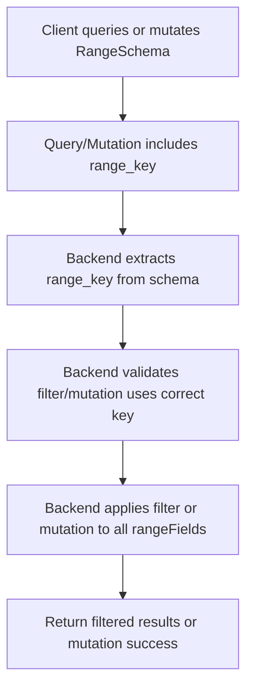

# Plan: Make RangeSchema Queriable and Mutable with `range_key`

## 1. Query Semantics

- **Expose `range_key` in Schema Metadata**
  - Add a method to `Schema` to retrieve the `range_key` if the schema is of type `Range`.
  - Ensure schema API returns the `range_key` in metadata.

- **Query Filter Format**
  - The filter for a RangeSchema must include the `range_key` as a field, e.g.:
    ```json
    {
      "range_filter": {
        "user_id": 123
      }
    }
    ```
  - Backend validates that the filter uses the correct key (the one defined in the schema).
  - Error if the filter does not match the schema's `range_key`.

- **Backend Logic**
  - When applying a filter to a RangeSchema, extract the `range_key` from the schema.
  - Ensure the filter uses the correct key.
  - Apply the filter to the range field data.

- **Testing**
  - Add/update tests to:
    - Query a RangeSchema using the `range_key`.
    - Ensure correct data is returned.
    - Error if the wrong key is used.

---

## 2. Mutation Semantics

- **Mutation Payload Structure**
  - The mutation payload for a RangeSchema must include the `range_key` at the top level.
  - The backend will apply this value to all fields.

- **Backend Logic**
  - Enforce that all fields in the schema are rangeFields.
  - Enforce that the range_key value is the same for all fields and matches the value provided in the mutation.
  - Reject mutations if any field is not a rangeField or if the range_key values differ.

- **Testing**
  - Add/update tests to:
    - Mutate a RangeSchema with all fields as rangeFields and a consistent range_key (should succeed).
    - Mutate a RangeSchema with a non-rangeField (should fail).
    - Mutate a RangeSchema with inconsistent range_key values (should fail).

---

## Mermaid Diagram



---

## Next Steps

- Confirm this plan is satisfactory.
- Switch to code mode to implement the solution.