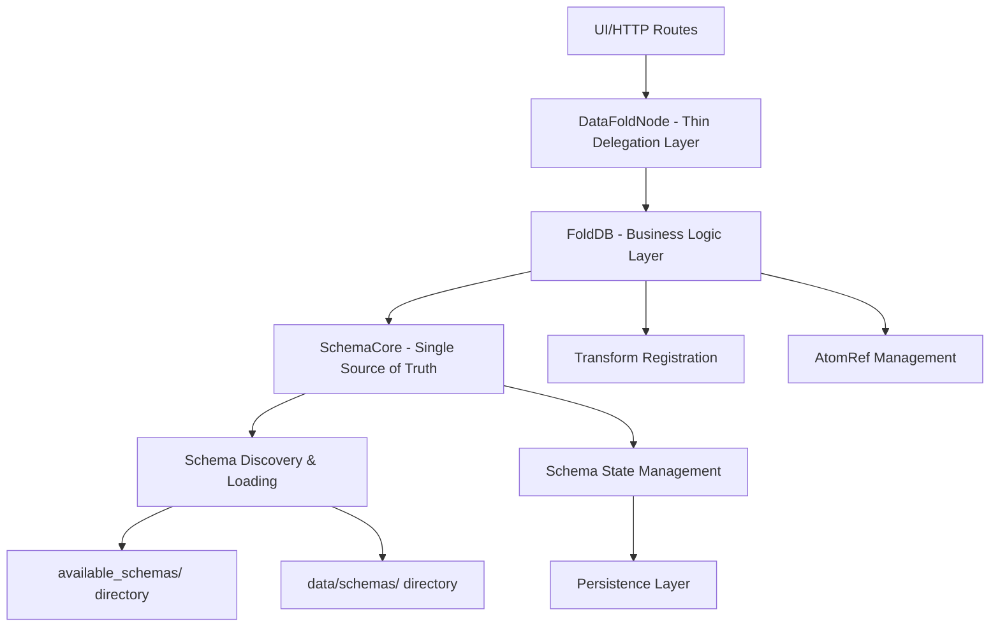

# Schema Loading Consolidation Plan

## Problem Statement

The current schema loading architecture has multiple confusing paths that cause UI persistence bugs and make debugging difficult. Schema loading happens in several disconnected places:

- UI routes call node methods directly
- SchemaCore has multiple discovery methods
- FoldDB delegates to SchemaCore but adds its own layer  
- Node initialization loads sample schemas separately
- Different loading paths don't stay in sync, causing persistence issues

## Goal

**Use SchemaCore as the single source of truth** for all schema discovery, loading, and state management. Push all schema loading logic down to SchemaCore and have upper layers (DataFoldNode, FoldDB, HTTP routes) simply delegate to SchemaCore methods.

## Current Architecture Analysis

### Current Schema Loading Flow
```
UI/HTTP Routes → DataFoldNode → FoldDB → SchemaCore
                     ↓
                SampleManager (separate path)
                     ↓
            available_schemas/ directory
```

### Current Problems
1. **Multiple Loading Paths**:
   - [`SchemaCore::discover_schemas_from_files()`](fold_node/src/schema/core.rs:278)
   - [`SchemaCore::discover_available_schemas()`](fold_node/src/schema/core.rs:310)
   - [`SchemaCore::fetch_available_schemas()`](fold_node/src/schema/core.rs:359)
   - [`SchemaCore::load_available_schemas_from_directory()`](fold_node/src/schema/core.rs:343)
   - [`FoldDB::fetch_available_schemas()`](fold_node/src/fold_db_core/mod.rs:193) - duplicates SchemaCore
   - [`DataFoldNode::load()`](fold_node/src/datafold_node/node.rs:111) - separate sample loading

2. **Inconsistent State Management**:
   - UI calls bypass SchemaCore's state management
   - Sample schemas loaded separately from file-based schemas
   - Discovery and loading are separate operations that can desync

3. **Bypassed SchemaCore**:
   - HTTP routes sometimes call DataFoldNode/FoldDB instead of going through SchemaCore
   - Sample loading in DataFoldNode bypasses SchemaCore's discovery methods
   - State management scattered across layers

## Proposed Architecture

### New Unified Schema Loading Flow - SchemaCore Centric


### Key Principles
1. **SchemaCore as Single Source of Truth**: All schema operations go through SchemaCore
2. **Thin Upper Layers**: DataFoldNode and FoldDB simply delegate to SchemaCore
3. **Unified Discovery in SchemaCore**: One method discovers from file directories only
4. **Centralized State Management**: SchemaCore manages all schema states
5. **Simple Delegation**: Upper layers don't duplicate SchemaCore functionality
6. **No Sample Manager**: Remove SampleManager dependency entirely

## Implementation Plan

### Phase 1: Enhance SchemaCore as Central Schema Manager

#### 1.1 Consolidate Schema Discovery in SchemaCore

```rust
impl SchemaCore {
    /// Single entry point for all schema discovery and loading
    /// Consolidates all existing discovery methods (no sample manager)
    pub fn discover_and_load_all_schemas(&self) -> Result<SchemaLoadingReport, SchemaError> {
        // 1. Discover from available_schemas/ directory (existing)
        // 2. Discover from data/schemas/ directory (existing)
        // 3. Load existing states from persistence (existing)
        // 4. Reconcile states and resolve conflicts
        // 5. Return comprehensive status report
    }
    
    /// Initialize schema system - called during node startup
    pub fn initialize_schema_system(&self) -> Result<(), SchemaError> {
        self.discover_and_load_all_schemas()?;
        Ok(())
    }
    
    /// Get comprehensive schema status for UI
    pub fn get_schema_status(&self) -> Result<SchemaLoadingReport, SchemaError> {
        // Return current state without rediscovery
    }
}
```

#### 1.2 Schema Loading Report Structure

```rust
#[derive(Debug, Serialize, Deserialize)]
pub struct SchemaLoadingReport {
    /// All schemas discovered from any source
    pub discovered_schemas: Vec<String>,
    /// Schemas currently loaded (approved state)
    pub loaded_schemas: Vec<String>,
    /// Schemas that failed to load with error messages
    pub failed_schemas: Vec<(String, String)>,
    /// Current state of all known schemas
    pub schema_states: HashMap<String, SchemaState>,
    /// Source where each schema was discovered
    pub loading_sources: HashMap<String, SchemaSource>,
    /// Timestamp of last discovery operation
    pub last_updated: chrono::DateTime<chrono::Utc>,
}

#[derive(Debug, Serialize, Deserialize)]
pub enum SchemaSource {
    AvailableDirectory,  // available_schemas/
    DataDirectory,       // data/schemas/
    Persistence,         // Previously saved state
}
```

### Phase 2: Simplify Upper Layers to Pure Delegation

#### 2.1 FoldDB - Remove Duplicate Methods

**Remove these methods** (delegate to SchemaCore):
- `fetch_available_schemas()` → `schema_manager.discover_and_load_all_schemas()`
- `load_available_schemas()` → `schema_manager.initialize_schema_system()`

**Keep these methods** (business logic that SchemaCore shouldn't handle):
- `approve_schema()` - with transform registration and AtomRef management
- `block_schema()` - with transform cleanup
- Transform orchestration
- AtomRef persistence

#### 2.2 DataFoldNode - Pure Delegation (Remove SampleManager)

**Remove complex sample loading logic** from [`DataFoldNode::load()`](fold_node/src/datafold_node/node.rs:116)

**Current complex loading:**
```rust
// Remove this entire section:
let sample_manager = SampleManager::new().await?;
let mut sample_schemas: Vec<_> = sample_manager.schemas.values().cloned().collect();
sample_schemas.sort_by_key(|v| v.get("name").and_then(|n| n.as_str()).unwrap_or("").to_string());
for schema_value in sample_schemas {
    let schema: Schema = serde_json::from_value(schema_value)
        .map_err(|e| FoldDbError::Config(format!("Failed to deserialize sample schema: {}", e)))?;
    info!("Adding sample schema to node as available: {}", schema.name);
    node.add_schema_available(schema)?;
}
```

**Replace with simple delegation:**
```rust
impl DataFoldNode {
    pub async fn load(config: NodeConfig) -> FoldDbResult<Self> {
        info!("Loading DataFoldNode from config");
        let node = Self::new(config)?;
        
        // Delegate to SchemaCore through FoldDB
        let db = node.db.lock()
            .map_err(|_| FoldDbError::Config("Cannot lock database mutex".into()))?;
        db.schema_manager.initialize_schema_system()
            .map_err(|e| FoldDbError::Config(format!("Failed to initialize schemas: {}", e)))?;
        
        info!("DataFoldNode loaded with schema system initialized");
        Ok(node)
    }
    
    /// Delegate to SchemaCore for schema status
    pub fn get_schema_status(&self) -> FoldDbResult<SchemaLoadingReport> {
        let db = self.db.lock()
            .map_err(|_| FoldDbError::Config("Cannot lock database mutex".into()))?;
        db.schema_manager.get_schema_status()
            .map_err(|e| FoldDbError::Config(format!("Failed to get schema status: {}", e)))
    }
}
```

### Phase 3: Simplify HTTP Routes to Delegate to SchemaCore

#### 3.1 Simplified Schema Endpoints

**Replace multiple confusing endpoints with:**
```rust
// Single status endpoint that gets everything from SchemaCore
GET /schemas/status -> node.get_schema_status() -> schema_core.get_schema_status()

// Single refresh endpoint
POST /schemas/refresh -> schema_core.discover_and_load_all_schemas()

// Keep existing state management (but delegate to SchemaCore)
POST /schema/{name}/approve -> folddb.approve_schema() -> schema_core.approve_schema()
POST /schema/{name}/block -> folddb.block_schema() -> schema_core.block_schema()
GET /schema/{name}/state -> schema_core.get_schema_state()
```

#### 3.2 Remove Redundant Endpoints

**Remove these confusing endpoints:**
- `/schemas/available` (replaced by `/schemas/status`)
- `/schemas/by-state/{state}` (included in status)
- `/schema/{name}/load` (replaced by approve workflow)

### Phase 4: Ensure Persistence Test Compatibility

#### 4.1 Persistence Requirements

Based on [`tests/integration_tests/persistence_tests.rs`](tests/integration_tests/persistence_tests.rs:1):
- Schema states must persist across node restarts
- Transform fields must maintain proper AtomRef mappings
- Schema approval workflow must work correctly

#### 4.2 Compatibility Measures

1. **State Persistence**: `discover_and_load_all_schemas()` in SchemaCore must:
   - Load existing schema states from disk first (using existing `load_states()`)
   - Preserve approved/blocked states for existing schemas
   - Only set new schemas to Available state

2. **AtomRef Preservation**: When loading persisted schemas:
   - Use existing `load_schema_states_from_disk()` functionality
   - Restore field-level `ref_atom_uuid` values
   - Maintain transform registration through FoldDB layer

3. **Backward Compatibility**:
   - Keep existing HTTP endpoints (delegate to SchemaCore)
   - Maintain current schema state behavior
   - Preserve all functionality during transition

## Implementation Steps

### Step 1: Enhance SchemaCore with Unified Discovery
- Add `SchemaLoadingReport` and `SchemaSource` types to SchemaCore
- Implement `discover_and_load_all_schemas()` in SchemaCore (consolidate existing methods)
- Implement `initialize_schema_system()` in SchemaCore
- Remove any SampleManager dependencies

### Step 2: Update Node Initialization to Remove SampleManager
- Modify [`DataFoldNode::load()`](fold_node/src/datafold_node/node.rs:111) to delegate to SchemaCore
- Remove all SampleManager creation and sample loading logic from DataFoldNode
- Remove SampleManager from HTTP server if only used for schemas
- Test that persistence tests still pass

### Step 3: Update HTTP Routes to Delegate
- Modify routes to call SchemaCore methods through delegation chain
- Add new `/schemas/status` endpoint
- Remove sample-related endpoints if they exist
- Keep old endpoints for backward compatibility (mark as deprecated)

### Step 4: Clean Up Duplicate Methods and SampleManager
- Remove `fetch_available_schemas()` from FoldDB (delegate to SchemaCore)
- Remove `load_available_schemas()` from FoldDB (delegate to SchemaCore)
- Remove SampleManager from codebase if only used for schemas
- Update tests to use SchemaCore directly where appropriate

### Step 5: Final Testing and Cleanup
- Run all persistence tests
- Verify UI schema loading works correctly
- Test node restart scenarios
- Remove any unused SampleManager code
- Performance testing for large schema sets

## Benefits

### 1. Simplified Architecture
- **SchemaCore as single source of truth** for all schema operations
- **Thin delegation layers** - no duplicate logic in upper layers
- **Clear separation of concerns** - SchemaCore handles discovery/state, FoldDB handles business logic

### 2. Better Debugging
- **One place to debug schema loading issues** - all logic in SchemaCore
- **Comprehensive status reporting** from SchemaCore
- **Clear delegation chain** - easy to trace issues

### 3. Improved UI Experience
- **Consistent schema state** - UI always gets state from SchemaCore
- **Reliable persistence behavior** - SchemaCore manages all persistence
- **Single status endpoint** - UI gets everything from one call

### 4. Enhanced Reliability
- **Atomic schema operations** in SchemaCore
- **Proper state synchronization** - all state changes go through SchemaCore
- **Reduced race conditions** - single point of control

### 5. Leverages Existing Architecture
- **Uses existing SchemaCore methods** - builds on proven functionality
- **Minimal code changes** - mostly removing duplicate methods
- **Preserves existing persistence logic** - no risk to working persistence

## Risk Mitigation

### 1. Backward Compatibility
- **Keep existing HTTP endpoints** during transition (delegate to SchemaCore)
- **Maintain current schema state behavior** - use existing SchemaCore methods
- **Gradual migration approach** - remove duplicates after delegation works

### 2. Persistence Safety
- **Use existing persistence methods** in SchemaCore - no changes to working code
- **Load existing states first** - existing `load_states()` functionality
- **Comprehensive testing** of delegation chain

### 3. Performance Considerations
- **Leverage existing efficient methods** in SchemaCore
- **No additional overhead** - removing duplicate work
- **Single discovery operation** instead of multiple scattered calls

## Success Criteria

1. **Persistence Tests Pass**: All existing persistence tests continue to work
2. **UI Consistency**: Schema loading from UI works reliably through SchemaCore
3. **Single Source of Truth**: All schema operations go through SchemaCore
4. **Simplified Debugging**: Schema loading issues can be debugged in SchemaCore
5. **Performance**: Schema loading performance is maintained or improved
6. **Code Simplification**: Duplicate methods removed from upper layers

## Next Steps

1. **Review this revised plan** - SchemaCore-centric approach
2. **Begin implementation with Step 1** - enhance SchemaCore with sample integration
3. **Iterative testing and refinement** - ensure persistence tests pass at each step
4. **Full deployment and validation** - remove duplicate methods after delegation works