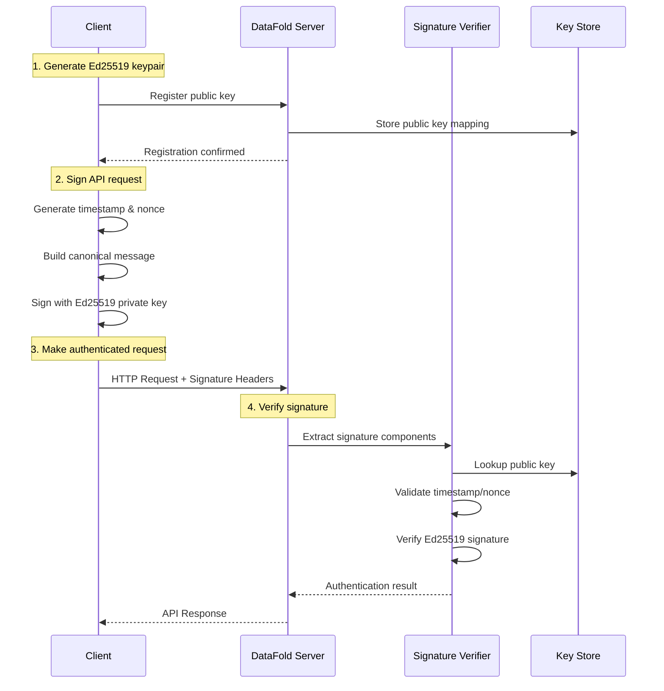

# Authentication System Overview

DataFold's signature authentication system provides secure, stateless authentication for all API operations using industry-standard cryptographic protocols.

## 🔐 How It Works

DataFold implements **RFC 9421 HTTP Message Signatures** with **Ed25519** digital signatures to provide cryptographically secure authentication without requiring server-side sessions or API tokens.

### Authentication Flow



### Key Components

| Component | Purpose | Format | Example |
|-----------|---------|--------|---------|
| **Client ID** | Unique client identifier | String (64 chars max) | `"datafold-client-123-v1"` |
| **Ed25519 Keypair** | Cryptographic identity | 32-byte keys | Private key (secret), Public key (registered) |
| **Signature Headers** | Request authentication | HTTP headers | `Signature-Input`, `Signature` |
| **Message Canonicalization** | Request integrity | RFC 9421 format | Standardized message format |
| **Replay Protection** | Prevent request reuse | Timestamp + Nonce | Unix timestamp + UUID4 |

## 🛡️ Security Features

### Cryptographic Security
- **Ed25519 Signatures**: Provides 128-bit security level with small key sizes
- **Deterministic**: Same message and key always produce the same signature
- **Fast**: High-performance signing and verification
- **Side-Channel Resistant**: Constant-time implementation prevents timing attacks

### Request Integrity
- **Complete Message Signing**: Method, URI, headers, and body are all authenticated
- **Tamper Detection**: Any modification to the request invalidates the signature
- **Content Digest**: SHA-256 hash of request body prevents body tampering
- **Header Protection**: Critical headers are included in signature calculation

### Replay Protection
- **Time-Based Validation**: Requests expire after configurable time window (default: 5 minutes)
- **Nonce Uniqueness**: UUID4 nonces prevent immediate replay attacks
- **Clock Skew Tolerance**: Configurable tolerance for client/server time differences
- **Distributed Nonce Storage**: Redis support for multi-server deployments

### Standards Compliance
- **RFC 9421**: Full implementation of HTTP Message Signatures standard
- **RFC 9530**: Content-Digest header implementation
- **IANA Registry**: Uses standardized signature component identifiers
- **Cross-Platform**: Consistent behavior across all client implementations

## 🚀 Benefits

### For Developers
- **No Token Management**: No API keys to store, rotate, or secure
- **Stateless**: No server-side session state to manage
- **Standards-Based**: Uses well-established cryptographic standards
- **Cross-Platform**: Same authentication works everywhere
- **Debuggable**: Clear signature components make troubleshooting easier

### For Security Teams
- **Strong Cryptography**: Ed25519 provides excellent security with small keys
- **Request Integrity**: Complete request authentication prevents tampering
- **Replay Protection**: Built-in protection against replay attacks
- **Audit Trail**: Complete signature metadata for compliance and monitoring
- **No Secrets in Transit**: Private keys never leave the client

### for Operations Teams
- **Scalable**: Stateless design scales horizontally without coordination
- **Performance**: Fast cryptographic operations with minimal overhead
- **Monitoring**: Rich metrics and logging for operational visibility
- **Configuration**: Flexible security profiles for different environments
- **Standards**: Based on proven IETF standards

## 📋 Signature Components

DataFold signs the following HTTP request components:

### Required Components (Always Signed)
```http
"@method"        - HTTP method (GET, POST, PUT, DELETE, etc.)
"@target-uri"    - Complete request URI including query parameters
"content-type"   - MIME type of request body
"content-digest" - SHA-256 hash of request body (if present)
```

### Optional Components (Conditionally Signed)
```http
"authorization"  - Include if Bearer token present (defense in depth)
"@authority"     - Host header value (redundant with @target-uri)
"@path"          - Path component only (subset of @target-uri)
"@query"         - Query parameters only (subset of @target-uri)
"date"           - HTTP Date header (supplementary to created parameter)
```

### DataFold Custom Headers
```http
"x-datafold-client-id"  - Client identification
"x-datafold-user-id"    - User identification (if applicable)
"x-datafold-metadata"   - Application-specific metadata
```

## ⚙️ Configuration Profiles

DataFold supports multiple security profiles for different environments:

### Strict Profile (High Security)
```yaml
time_validation:
  allowed_window_secs: 60        # 1 minute window
  clock_skew_tolerance_secs: 5   # 5 seconds tolerance
  max_future_timestamp_secs: 10  # 10 seconds future tolerance

nonce_validation:
  required: true
  ttl_seconds: 90               # Nonce storage TTL
  format: "uuid4"               # UUID4 format requirement
```

### Standard Profile (Default Production)
```yaml
time_validation:
  allowed_window_secs: 300       # 5 minute window
  clock_skew_tolerance_secs: 30  # 30 seconds tolerance
  max_future_timestamp_secs: 60  # 1 minute future tolerance

nonce_validation:
  required: true
  ttl_seconds: 360              # Nonce storage TTL
  format: "uuid4"               # UUID4 format requirement
```

### Lenient Profile (Development/Testing)
```yaml
time_validation:
  allowed_window_secs: 600       # 10 minute window
  clock_skew_tolerance_secs: 120 # 2 minutes tolerance
  max_future_timestamp_secs: 300 # 5 minutes future tolerance

nonce_validation:
  required: true
  ttl_seconds: 720              # Extended nonce storage
  format: "uuid4"               # UUID4 format requirement
```

## 🔄 Comparison with Other Auth Methods

| Feature | DataFold Signatures | API Keys | OAuth 2.0 | JWT Tokens |
|---------|-------------------|----------|-----------|------------|
| **Server State** | Stateless | Token storage | Session state | Validation key |
| **Expiration** | Per-request | Manual rotation | Token refresh | Built-in expiry |
| **Revocation** | Immediate | Database update | Token revoke | Blacklisting |
| **Request Integrity** | ✅ Full request | ❌ Header only | ❌ Header only | ❌ Header only |
| **Replay Protection** | ✅ Built-in | ❌ None | ❌ Depends | ⚠️ Limited |
| **Standards** | RFC 9421 | Custom | RFC 6749 | RFC 7519 |
| **Complexity** | Medium | Low | High | Medium |

## 📈 Performance Characteristics

### Signing Performance
- **Ed25519 Signing**: ~0.1ms per signature on modern hardware
- **Message Canonicalization**: ~0.5ms for typical HTTP requests
- **Total Client Overhead**: <1ms per request
- **Memory Usage**: <1KB per signature operation

### Verification Performance
- **Ed25519 Verification**: ~0.3ms per signature on modern hardware
- **Nonce Lookup**: <1ms with in-memory store, <5ms with Redis
- **Total Server Overhead**: <2ms per request
- **Throughput**: >1000 verifications per second per core

### Scalability
- **Horizontal Scaling**: Fully stateless, scales linearly
- **Connection Pooling**: No connection limits from authentication
- **Cache Requirements**: Only nonce storage (TTL-based cleanup)
- **Database Load**: Minimal (only public key lookups)

## 🔧 Integration Requirements

### Client Requirements
- **Ed25519 Library**: Cryptographic operations
- **HTTP Client**: Standard HTTP request capabilities
- **JSON Processing**: Request/response serialization
- **Base64 Encoding**: Signature encoding/decoding

### Server Requirements
- **Public Key Storage**: Database for registered keys
- **Nonce Storage**: In-memory or Redis for replay protection
- **Time Synchronization**: NTP for accurate timestamps
- **HTTP Parsing**: Standard HTTP request processing

## 🔗 Related Documentation

- **[Getting Started Guide](getting-started.md)** - Step-by-step implementation
- **[Key Management](key-management.md)** - Key generation and security
- **[Request Signing](request-signing.md)** - Detailed signing process
- **[Troubleshooting](troubleshooting.md)** - Common issues and solutions
- **[Security Best Practices](../guides/security-best-practices.md)** - Production security guidelines

## 📞 Support

For questions about the authentication system:

- **Integration Help**: [Getting Started Guide](getting-started.md)
- **Security Questions**: [Security Best Practices](../guides/security-best-practices.md)
- **Technical Issues**: [Troubleshooting Guide](troubleshooting.md)
- **Enterprise Support**: [Contact Sales](mailto:sales@datafold.com)

---

**Next**: Learn how to implement authentication with the [Getting Started Guide](getting-started.md).