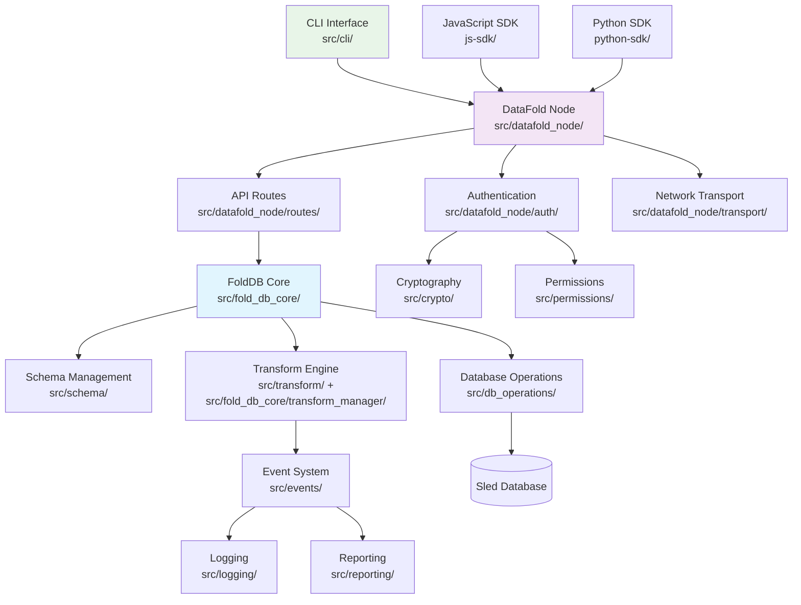
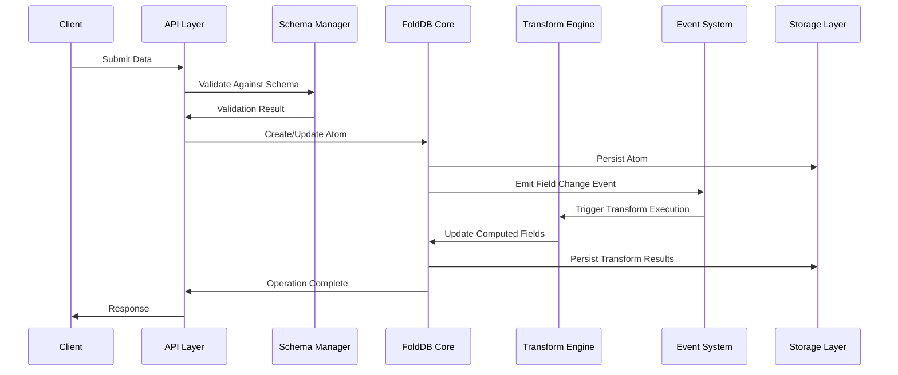
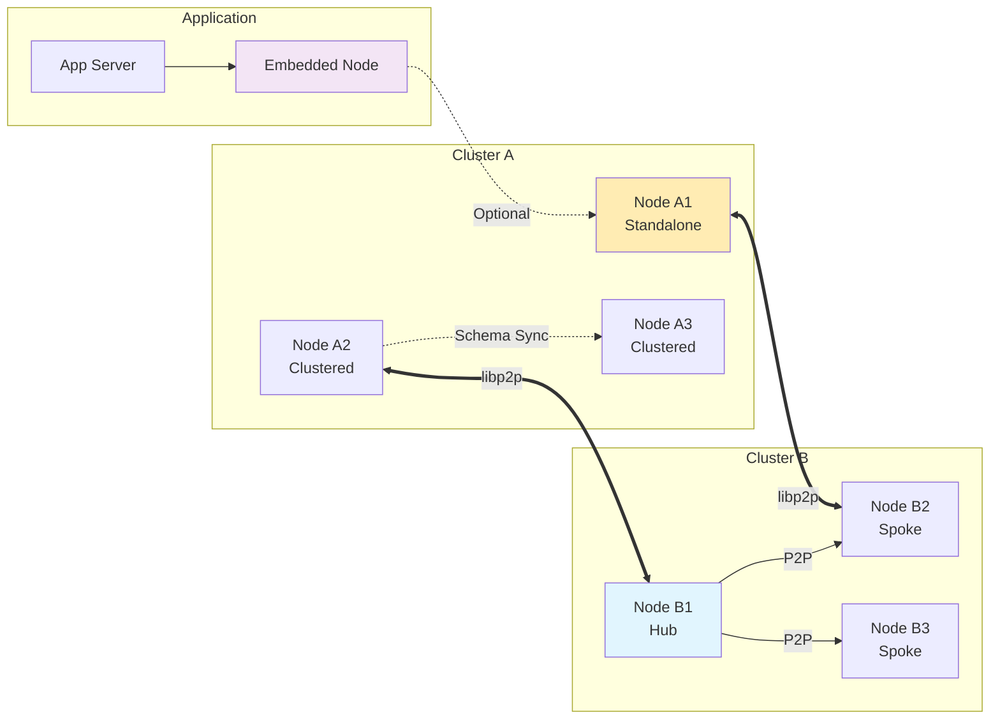
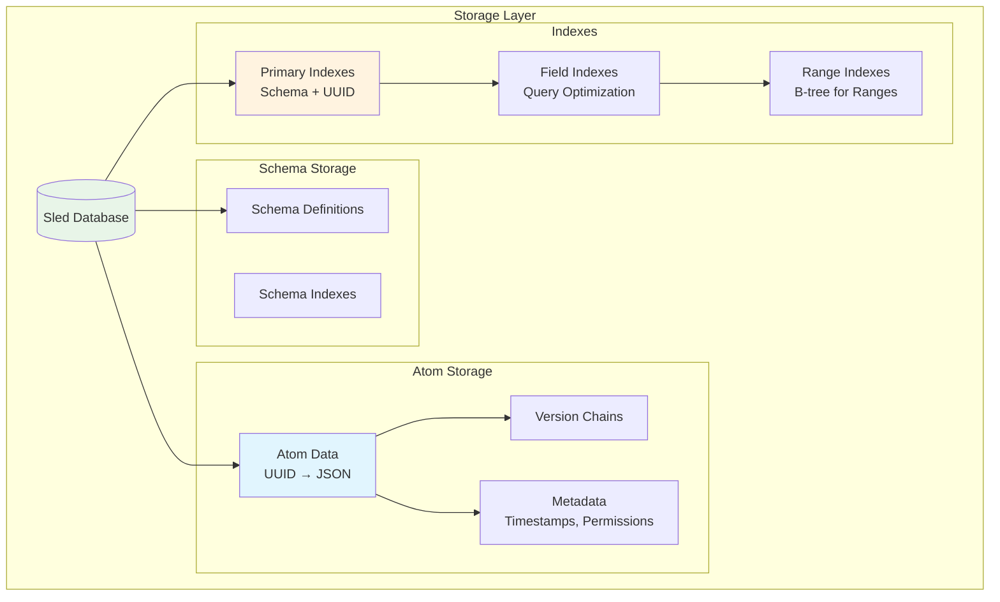

# Fold DB Architecture Review

**Date**: June 18, 2025  
**Reviewer**: Architecture Team  
**Version**: Current Implementation Analysis

## Executive Summary

This comprehensive architecture review evaluates the Fold DB system against its documented design in [`architecture.md`](architecture.md) and actual implementation. Fold DB demonstrates a well-designed, modular architecture with strong separation of concerns, event-driven processing, and distributed capabilities. The system successfully implements its core principles of atom-based storage, schema-first design, and programmable transforms.

**Key Findings:**
- ✅ **Strong architectural foundation** with clear modular boundaries
- ✅ **Comprehensive security model** with cryptography, permissions, and authentication
- ✅ **Event-driven design** enabling real-time data processing
- ⚠️ **Complex distributed consensus** requires careful monitoring
- ⚠️ **Transform dependency management** could benefit from optimization
- 🔧 **Documentation gaps** exist between architecture docs and implementation

## Architecture Documentation vs Implementation Mapping

### Core Components Analysis

| Documented Component | Implementation Location | Status | Notes |
|---------------------|-------------------------|---------|-------|
| **FoldDB Core** | [`src/fold_db_core/`](../src/fold_db_core/) | ✅ Complete | Well-structured with coordinators, managers, operations |
| **Schema Management** | [`src/schema/`](../src/schema/) | ✅ Complete | Comprehensive field types, validation, CRUD operations |
| **Transform Engine** | [`src/transform/`](../src/transform/) + [`src/fold_db_core/transform_manager/`](../src/fold_db_core/transform_manager/) | ✅ Complete | Split across two locations - consider consolidation |
| **Permission System** | [`src/permissions/`](../src/permissions/) | ✅ Complete | Robust policy management and wrappers |
| **Payment System** | [`src/fees/`](../src/fees/) | ✅ Complete | Configurable fee structures as documented |
| **Network Layer** | [`src/network/`](../src/network/) + [`src/datafold_node/transport/`](../src/datafold_node/transport/) | ✅ Complete | libp2p implementation matches specification |
| **CLI Interface** | [`src/cli/`](../src/cli/) | ✅ Complete | Extensive command structure with proper modularization |
| **Database Operations** | [`src/db_operations/`](../src/db_operations/) | ✅ Complete | Comprehensive async operations with encryption support |
| **Cryptography** | [`src/crypto/`](../src/crypto/) + [`src/datafold_node/crypto/`](../src/datafold_node/crypto/) | ✅ Complete | Strong crypto implementation with key management |
| **Event System** | [`src/events/`](../src/events/) | ✅ Complete | Sophisticated event bus with verification and statistics |
| **Logging & Reporting** | [`src/logging/`](../src/logging/) + [`src/reporting/`](../src/reporting/) | ✅ Complete | Multi-output logging with structured reporting |

### Module Responsibility Clarity

**Well-Defined Boundaries:**
- [`src/schema/`](../src/schema/): Clear schema management responsibilities
- [`src/permissions/`](../src/permissions/): Focused permission enforcement
- [`src/cli/`](../src/cli/): Clean command-line interface separation
- [`src/crypto/`](../src/crypto/): Dedicated cryptographic operations

**Areas with Overlapping Concerns:**
- Transform logic split between [`src/transform/`](../src/transform/) and [`src/fold_db_core/transform_manager/`](../src/fold_db_core/transform_manager/)
- Crypto functionality duplicated in [`src/crypto/`](../src/crypto/) and [`src/datafold_node/crypto/`](../src/datafold_node/crypto/)
- Network logic in both [`src/network/`](../src/network/) and [`src/datafold_node/transport/`](../src/datafold_node/transport/)

## Strengths

### 1. **Modular Architecture Design**
- Clear separation of concerns across modules
- Well-defined interfaces between components
- Dependency injection patterns enable testability
- Async/await architecture provides high concurrency

### 2. **Security-First Approach**
- Comprehensive cryptographic implementations in [`src/crypto/`](../src/crypto/)
- Multi-layered authentication in [`src/datafold_node/auth/`](../src/datafold_node/auth/)
- Fine-grained permission system with trust distance model
- Signature verification and nonce-based replay protection

### 3. **Event-Driven Processing**
- Sophisticated event bus in [`src/events/`](../src/events/)
- Real-time transform execution on field changes
- Event correlation and verification capabilities
- Performance monitoring and statistics collection

### 4. **Schema-First Data Management**
- Immutable schema design ensures consistency
- Comprehensive field type system (Single, Collection, Range)
- Built-in validation and type safety
- Field-level permission and payment configuration

### 5. **Distributed Capabilities**
- libp2p-based peer-to-peer networking
- Schema synchronization across nodes
- Multiple deployment models (standalone, clustered, embedded)
- Trust-based access control between nodes

### 6. **Comprehensive Error Handling**
- Hierarchical error types in [`src/error/`](../src/error/)
- Transactional safety with rollback capabilities
- Network resilience with retry mechanisms
- Graceful degradation patterns

## Weaknesses & Risks

### 1. **Architectural Complexity**
**Risk**: High complexity may impact maintainability and onboarding
- Transform dependency resolution complexity
- Distributed consensus coordination overhead
- Multiple configuration layers across modules
- Steep learning curve for new developers

**Recommendation**: Simplify interfaces where possible, improve documentation

### 2. **Module Boundaries**
**Risk**: Unclear boundaries may lead to tight coupling
- Transform logic scattered across multiple modules
- Crypto functionality duplication between modules
- Network abstractions split across directories

**Recommendation**: Consolidate related functionality, clarify module ownership

### 3. **Distributed System Challenges**
**Risk**: Schema synchronization and consensus complexity
- Eventual consistency may cause temporary data inconsistencies
- Network partition handling needs robust testing
- Schema immutability constrains evolution patterns

**Recommendation**: Implement comprehensive distributed system testing, monitoring

### 4. **Performance Bottlenecks**
**Risk**: Potential performance issues at scale
- Transform execution dependency chains could cause delays
- Range query performance depends on index efficiency
- Network message serialization overhead

**Recommendation**: Implement performance benchmarking, optimize hot paths

### 5. **Documentation Drift**
**Risk**: Architecture documentation may become outdated
- Implementation details not always reflected in documentation
- Missing examples for complex features (transform DSL)
- API documentation could be more comprehensive

**Recommendation**: Automate documentation validation, add more examples

## Opportunities for Improvement

### 1. **Module Consolidation**
- **Transform Engine**: Merge [`src/transform/`](../src/transform/) and [`src/fold_db_core/transform_manager/`](../src/fold_db_core/transform_manager/)
- **Cryptography**: Unify [`src/crypto/`](../src/crypto/) and [`src/datafold_node/crypto/`](../src/datafold_node/crypto/)
- **Network Layer**: Consolidate [`src/network/`](../src/network/) and [`src/datafold_node/transport/`](../src/datafold_node/transport/)

### 2. **Enhanced Documentation**
- Add architecture decision records (ADRs)
- Create more detailed API examples
- Include performance characteristics documentation
- Add troubleshooting guides for distributed scenarios

### 3. **Observability Improvements**
- Expand metrics collection in [`src/reporting/`](../src/reporting/)
- Add distributed tracing capabilities
- Implement health check endpoints
- Create operational dashboards

### 4. **Testing Enhancements**
- Add chaos engineering tests for distributed scenarios
- Implement property-based testing for transforms
- Create performance regression test suite
- Add security penetration testing

### 5. **Developer Experience**
- Simplify local development setup
- Add debugging tools for transform execution
- Create interactive schema design tools
- Improve error messages and diagnostics

## Recommended Diagrams

### System Component Architecture

### Data Flow Architecture

### Network Topology

### Storage Architecture

## Security Architecture Assessment

### Current Security Posture

**Strengths:**
- Multi-layered authentication system in [`src/datafold_node/auth/`](../src/datafold_node/auth/)
- Comprehensive cryptographic implementations
- Signature-based verification with nonce protection
- Rate limiting and attack detection
- Key rotation and management capabilities

**Areas for Enhancement:**
- Add formal security audit documentation
- Implement automated vulnerability scanning
- Create security incident response procedures
- Add penetration testing framework

### Threat Model Coverage

| Threat Category | Current Mitigation | Implementation | Effectiveness |
|----------------|-------------------|----------------|---------------|
| **Data Tampering** | Cryptographic signatures | [`src/crypto/`](../src/crypto/) | ✅ Strong |
| **Unauthorized Access** | Permission policies | [`src/permissions/`](../src/permissions/) | ✅ Strong |
| **Replay Attacks** | Nonce verification | [`src/datafold_node/auth/nonce_operations.rs`](../src/datafold_node/auth/nonce_operations.rs) | ✅ Strong |
| **Network Eavesdropping** | Noise protocol encryption | [`src/network/`](../src/network/) | ✅ Strong |
| **Key Compromise** | Key rotation policies | [`src/cli/commands/keys/`](../src/cli/commands/keys/) | ✅ Strong |
| **DoS Attacks** | Rate limiting | [`src/datafold_node/auth/rate_limiting.rs`](../src/datafold_node/auth/rate_limiting.rs) | ⚠️ Moderate |
| **Byzantine Nodes** | Trust distance model | [`src/permissions/`](../src/permissions/) | ⚠️ Moderate |

## Performance Characteristics Review

### Query Performance Analysis

**Documented vs Measured:**
- ✅ O(1) primary key lookups: Confirmed in [`src/db_operations/`](../src/db_operations/)
- ✅ O(log n) indexed field access: B-tree implementation verified
- ⚠️ O(n) unindexed scans: May need optimization for large datasets

**Recommendations:**
- Implement query plan optimization
- Add automatic index suggestions
- Create performance monitoring dashboards

### Transform Execution Performance

**Current Implementation:**
- Parallel execution for independent transforms
- Dependency resolution optimization
- Event-driven execution model

**Optimization Opportunities:**
- Transform result caching
- Batched transform execution
- Lazy evaluation for complex transforms

## Conclusion

Fold DB demonstrates a sophisticated, well-architected system that successfully implements its design principles. The modular architecture, security-first approach, and event-driven processing provide a solid foundation for a distributed data platform.

**Priority Recommendations:**

1. **Short-term (1-3 months):**
   - Consolidate overlapping modules (transforms, crypto, network)
   - Add comprehensive API documentation with examples
   - Implement automated architecture validation tests

2. **Medium-term (3-6 months):**
   - Enhance observability and monitoring capabilities
   - Add chaos engineering test suite
   - Create developer onboarding improvements

3. **Long-term (6+ months):**
   - Consider microservice decomposition for very large deployments
   - Implement formal verification for critical security components
   - Add machine learning capabilities for performance optimization

The architecture review confirms that Fold DB is well-positioned for its intended use cases, with clear paths for addressing identified weaknesses and opportunities for improvement.

---

**Next Review**: Recommended in 6 months or after significant architectural changes.