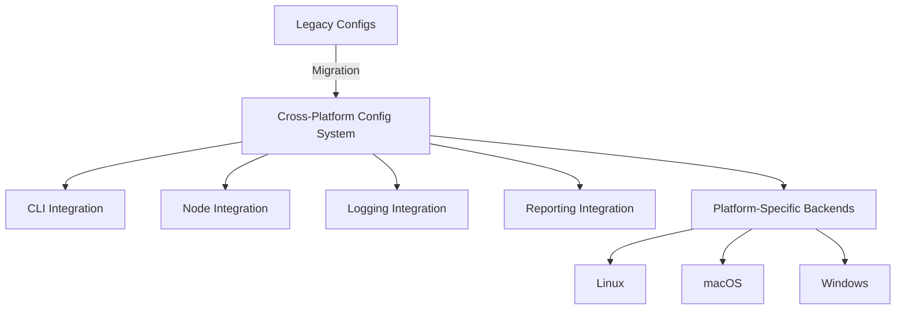

# PBI 27-6: Documentation & Deployment Plan

## Documentation Structure

- **Create new directory:** `docs/config/`
- **Create/Update files:**
  - [`docs/config/architecture.md`](architecture.md) — System architecture, diagrams, platform-specific notes
  - [`docs/config/api.md`](api.md) — API reference for all public interfaces
  - [`docs/config/integration.md`](integration.md) — Integration patterns, migration, logging, reporting
  - [`docs/config/deployment.md`](deployment.md) — Deployment, migration, troubleshooting, tuning
  - [`docs/config/security.md`](security.md) — Security features, best practices
- **Update main docs:**
  - Reference new system in [`docs/README.md`](../README.md) and **fully replace** [`docs/unified-configuration.md`](../unified-configuration.md) (deprecate old file)
  - Update [`docs/api-reference.md`](../api-reference.md) and [`docs/developer-guide.md`](../developer-guide.md) as needed

---

## Content Outline

### A. Architecture Documentation
- Overview of cross-platform configuration system
- Architectural diagram (Mermaid)
- Platform-specific implementations (Linux, macOS, Windows)
- Public API summary (traits, structs, main methods)
- Integration points (CLI, node, logging, reporting)

### B. Integration Guides
- CLI configuration migration (from legacy to new system)
- Node configuration integration patterns
- Logging configuration alignment
- Unified reporting integration (reference PBI 26)
- Example migration scripts and before/after config samples

### C. Developer Documentation
- API reference for:
  - [`ConfigurationProvider`](../../src/config/cross_platform.rs)
  - [`Config`](../../src/config/cross_platform.rs)
  - [`ConfigurationManager`](../../src/config/cross_platform.rs)
  - [`EnhancedConfigurationManager`](../../src/config/enhanced.rs)
  - Migration utilities ([`ConfigMigrationManager`](../../src/config/migration.rs))
- Code examples for loading, saving, validating, and migrating configs
- Configuration format specifications and schemas
- Platform-specific development notes
- Security best practices

### D. Deployment Documentation
- Deployment guides for Linux, macOS, Windows
- Configuration migration procedures (step-by-step)
- Troubleshooting guide (common errors, recovery)
- Performance tuning and optimization

### E. User Documentation
- User guide for configuration management (CLI and node)
- Configuration file formats and options
- Migration guide from legacy configs
- Security features and user best practices

### F. Final Integration and Cleanup
- Update main project documentation to reference new system
- Update README with migration and usage notes
- Document completed PBI 27 implementation in delivery logs
- Prepare deployment artifacts (sample configs, migration scripts)

---

## Mermaid Diagram Example

---

## Documentation Style & Patterns

- Use Markdown with clear section headings, code blocks, and tables
- Include practical code examples (Rust, CLI commands, config snippets)
- Use Mermaid for diagrams
- Reference related docs (e.g., unified-configuration.md, migration-guide.md)
- Follow the style of [`docs/architecture.md`](../architecture.md) and [`docs/api-reference.md`](../api-reference.md)

---

## Action Steps

1. **Create `docs/config/` and all required files.**
2. **Draft each documentation file according to the outline above.**
3. **Update main documentation and references.**
4. **Prepare sample configuration files and migration scripts as deployment artifacts.**
5. **Review for completeness, clarity, and production readiness.**

---

**Note:** Per direction, the new documentation will fully replace `unified-configuration.md` and deprecate the old file.