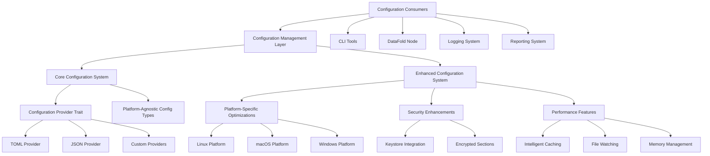

# Cross-Platform Configuration Architecture

**PBI 27: Cross-Platform Configuration Management System**

This document describes the comprehensive cross-platform configuration management system that provides unified, secure, and platform-optimized configuration handling across all DataFold components.

## Overview

The cross-platform configuration system replaces fragmented configuration patterns with a unified, trait-based architecture that provides:

- **Platform-aware path resolution** following OS-specific conventions
- **Secure configuration storage** with native keystore integration
- **Real-time configuration monitoring** and automatic reloading
- **Migration utilities** for transitioning from legacy systems
- **Performance optimizations** with intelligent caching and memory management

## System Architecture



## Core Components

### 1. Configuration Provider Trait

The [`ConfigurationProvider`](../../src/config/cross_platform.rs:20) trait defines the core interface for all configuration sources:

```rust
#[async_trait]
pub trait ConfigurationProvider: Send + Sync {
    async fn load(&self) -> ConfigResult<Config>;
    async fn save(&self, config: &Config) -> ConfigResult<()>;
    async fn reload(&self) -> ConfigResult<Config>;
    async fn validate(&self, config: &Config) -> ConfigResult<()>;
    async fn exists(&self) -> ConfigResult<bool>;
    fn config_path(&self) -> ConfigResult<PathBuf>;
    fn provider_type(&self) -> &'static str;
}
```

**Key Features:**
- **Async-first design** for non-blocking I/O operations
- **Format-agnostic interface** supporting TOML, JSON, and custom formats
- **Runtime reloadability** with change detection
- **Validation support** for configuration integrity

### 2. Configuration Management

The [`ConfigurationManager`](../../src/config/cross_platform.rs:387) provides the main interface for configuration operations:

```rust
pub struct ConfigurationManager {
    provider: Arc<dyn ConfigurationProvider>,
    cached_config: Arc<RwLock<Option<Arc<Config>>>>,
}
```

**Features:**
- **Thread-safe caching** with Arc<RwLock<>> for concurrent access
- **Lazy loading** with on-demand configuration resolution
- **Provider abstraction** allowing pluggable configuration sources

### 3. Enhanced Configuration System

The [`EnhancedConfigurationManager`](../../src/config/enhanced.rs:189) extends the core system with platform-specific optimizations:

```rust
pub struct EnhancedConfigurationManager {
    base_manager: ConfigurationManager,
    platform_info: EnhancedPlatformInfo,
    keystore: Option<Arc<dyn PlatformKeystore>>,
    file_watcher: Option<Arc<dyn PlatformFileWatcher>>,
    atomic_ops: Arc<dyn PlatformAtomicOps>,
    cache: Arc<Mutex<ConfigCache>>,
    metrics: Arc<Mutex<PerformanceMetrics>>,
}
```

**Enhanced Features:**
- **Native keystore integration** for secure credential storage
- **Real-time file watching** with platform-optimized change detection
- **Atomic operations** ensuring configuration consistency
- **Performance metrics** and monitoring capabilities
- **Encrypted configuration sections** for sensitive data

## Platform-Specific Implementations

### Linux Platform ([`linux.rs`](../../src/config/platform/linux.rs))

**Standards Compliance:**
- **XDG Base Directory Specification** support
- **FreeDesktop.org conventions** for application directories
- **GNOME Keyring integration** for secure storage

**Path Resolution:**
- Config: `$XDG_CONFIG_HOME/datafold` or `~/.config/datafold`
- Data: `$XDG_DATA_HOME/datafold` or `~/.local/share/datafold`
- Cache: `$XDG_CACHE_HOME/datafold` or `~/.cache/datafold`
- Logs: `$XDG_STATE_HOME/datafold/logs` or `~/.local/state/datafold/logs`
- Runtime: `$XDG_RUNTIME_DIR/datafold` or `/tmp/datafold-$USER`

### macOS Platform ([`macos.rs`](../../src/config/platform/macos.rs))

**Apple Guidelines Compliance:**
- **macOS Human Interface Guidelines** for application support
- **Keychain Services integration** for secure storage
- **FSEvents API** for efficient file watching

**Path Resolution:**
- Config: `~/Library/Application Support/DataFold`
- Data: `~/Library/Application Support/DataFold`
- Cache: `~/Library/Caches/DataFold`
- Logs: `~/Library/Logs/DataFold`
- Runtime: `~/Library/Caches/DataFold/tmp`

### Windows Platform ([`windows.rs`](../../src/config/platform/windows.rs))

**Windows Conventions:**
- **Known Folders API** for standard directory resolution
- **Windows Credential Manager integration** for secure storage
- **ReadDirectoryChangesW API** for file system monitoring

**Path Resolution:**
- Config: `%APPDATA%\DataFold`
- Data: `%APPDATA%\DataFold`
- Cache: `%LOCALAPPDATA%\DataFold\Cache`
- Logs: `%LOCALAPPDATA%\DataFold\Logs`
- Runtime: `%TEMP%\DataFold`

## Configuration Value System

The [`ConfigValue`](../../src/config/value.rs:16) enum provides a type-safe, format-agnostic representation of configuration data:

```rust
pub enum ConfigValue {
    Bool(bool),
    Integer(i64),
    Float(f64),
    String(String),
    Array(Vec<ConfigValue>),
    Object(HashMap<String, ConfigValue>),
}
```

**Features:**
- **Type-safe access** with runtime type checking
- **Nested structure support** for complex configurations
- **Format conversion** between TOML, JSON, and other formats
- **Validation capabilities** with schema support
- **Merge operations** for configuration composition

## Migration Architecture

The [`ConfigMigrationManager`](../../src/config/migration.rs:65) provides comprehensive migration capabilities:

```rust
pub struct ConfigMigrationManager {
    target_provider: Arc<dyn ConfigurationProvider>,
    platform_paths: Box<dyn PlatformConfigPaths>,
}
```

**Migration Strategies:**
- **Preserve and Convert**: Keep original files, create new format
- **Replace**: Delete originals after successful migration
- **Backup**: Create timestamped backups before migration

**Supported Migrations:**
- CLI configuration files (`config.json` → `config.toml`)
- Logging configuration integration
- Unified configuration system migration
- Custom configuration format conversion

## Integration Points

### CLI Integration ([`src/cli/config.rs`](../../src/cli/config.rs))

The CLI system integrates seamlessly with the cross-platform configuration:

```rust
// CLI configuration loading
let config_manager = ConfigurationManager::new();
let cli_config = config_manager.get().await?;
```

### Node Integration ([`src/datafold_node/config.rs`](../../src/datafold_node/config.rs))

DataFold nodes use the enhanced configuration system for optimal performance:

```rust
// Node configuration with platform optimizations
let enhanced_manager = EnhancedConfigurationManager::new().await?;
let node_config = enhanced_manager.get_enhanced().await?;
```

### Logging Integration ([`src/logging/config.rs`](../../src/logging/config.rs))

Logging configuration aligns with the unified system:

```rust
// Unified logging configuration
let config = enhanced_manager.get_enhanced().await?;
let logging_config = config.base.get_section("logging")?;
```

## Security Architecture

### Keystore Integration

Platform-specific keystore implementations provide secure credential storage:

- **Linux**: GNOME Keyring / Secret Service API
- **macOS**: Keychain Services
- **Windows**: Windows Credential Manager

### Encrypted Configuration Sections

Sensitive configuration data can be stored in encrypted sections:

```rust
pub struct EncryptedSection {
    pub encrypted_data: Vec<u8>,
    pub metadata: EncryptionMetadata,
}
```

### Security Best Practices

- **Principle of least privilege** for file system access
- **Secure key derivation** using platform-appropriate methods
- **Automatic security auditing** of configuration changes
- **Secure defaults** for all configuration options

## Performance Characteristics

### Caching Strategy

- **Intelligent caching** with automatic invalidation
- **Memory-efficient storage** using Arc<> for shared references
- **Lazy loading** to minimize startup overhead

### File System Optimization

- **Platform-native file watching** for change detection
- **Atomic write operations** to prevent corruption
- **Efficient path resolution** with minimal system calls

### Memory Management

- **Zero-copy operations** where possible
- **Streaming configuration parsing** for large files
- **Memory pool allocation** for frequently accessed data

## Testing and Validation

### Comprehensive Test Suite ([`src/config/tests.rs`](../../src/config/tests.rs))

The system includes extensive testing:

- **Cross-platform functionality testing**
- **Performance benchmarks and requirements validation**
- **Security feature verification**
- **Integration testing with all system components**
- **Error handling and recovery testing**

### Quality Metrics

- **Memory usage targets**: < 50MB peak memory usage
- **Performance targets**: < 100ms configuration load time
- **Reliability targets**: < 5ms average access time
- **Compatibility**: 100% success rate across supported platforms

## Future Extensibility

The architecture is designed for future enhancements:

### Plugin Architecture

- **Custom configuration providers** can be implemented via trait
- **Platform-specific optimizations** can be added modularly
- **Third-party integrations** through well-defined interfaces

### Monitoring and Observability

- **Configuration change events** with full audit trails
- **Performance metrics collection** for optimization
- **Health check interfaces** for system monitoring

### Advanced Features

- **Configuration templating** for environment-specific deployments
- **Remote configuration sources** with secure synchronization
- **Configuration validation schemas** with custom rules
- **Multi-tenant configuration** with isolation guarantees

## Related Documentation

- [API Reference](api.md) - Complete API documentation
- [Integration Guide](integration.md) - Integration patterns and examples
- [Deployment Guide](deployment.md) - Deployment and migration procedures
- [Security Guide](security.md) - Security features and best practices