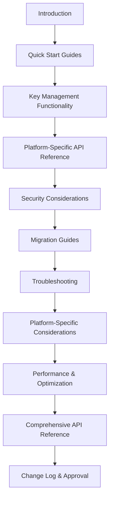

# Unified Documentation Plan: SDKs/CLI Key Management APIs (Task 10-7-1)

## Status & Logging

- **Status:** Agreed (see [`docs/delivery/10/tasks.md`](tasks.md))
- **Timestamp:** 2025-06-08T18:12:01-07:00
- **Logged by:** AI_Agent (per .cursorrules)

---

## Documentation Deliverables & Structure

### Unified Key Management API Documentation Outline

#### A. Introduction
- Purpose and scope of the documentation
- Supported platforms: JavaScript SDK, Python SDK, CLI
- Key management lifecycle overview

#### B. Quick Start Guides
- **JavaScript SDK:** Basic key generation, storage, usage
- **Python SDK:** Basic key generation, storage, usage
- **CLI:** Key management commands for common workflows

#### C. Key Management Functionality (Unified Overview)
- **Key Generation:** Ed25519 keypair creation
- **Key Storage:** Secure storage mechanisms (browser, OS keychain, file system)
- **Key Derivation:** PBKDF2/Argon2/BLAKE3-based derivation, context separation
- **Key Rotation:** Rotation workflows, backward compatibility
- **Backup & Recovery:** Encrypted export/import, backup formats, restore flows

#### D. Platform-Specific API Reference
- **JavaScript SDK**
  - API docs for all key management modules ([`docs/key-derivation-and-rotation.md`](../../js-sdk/docs/key-derivation-and-rotation.md), [`docs/storage-api.md`](../../js-sdk/docs/storage-api.md), [`docs/server-integration.md`](../../js-sdk/docs/server-integration.md))
  - Code examples (from `examples/` and tests)
  - Usage patterns and best practices
- **Python SDK**
  - API docs for all key management modules ([`docs/derivation_rotation_api.md`](../../python-sdk/docs/derivation_rotation_api.md), [`docs/storage_api.md`](../../python-sdk/docs/storage_api.md), [`docs/backup_recovery_api.md`](../../python-sdk/docs/backup_recovery_api.md), [`docs/server_integration_api.md`](../../python-sdk/docs/server_integration_api.md))
  - Code examples (from `examples/` and tests)
  - Usage patterns and best practices
- **CLI**
  - Key management commands (from [`docs/api-reference.md`](../../api-reference.md))
  - Command syntax, arguments, options, and examples
  - Usage patterns and best practices

#### E. Security Considerations
- Secure key storage and memory handling
- Zeroization and protection against leaks
- Backup encryption and integrity
- Threat models and attack surface
- Platform-specific security notes

#### F. Migration Guides
- Migrating keys between platforms (JS ↔ Python ↔ CLI)
- Handling legacy and new key formats
- Data migration and compatibility

#### G. Troubleshooting
- Common issues and error messages
- Recovery from backup/restore failures
- Platform-specific troubleshooting

#### H. Platform-Specific Considerations & Limitations
- Browser/OS support matrix
- CLI environment requirements
- Python package dependencies

#### I. Performance Characteristics & Optimization
- Key derivation and encryption performance (benchmarks, async support)
- Storage and backup performance
- Optimization tips for each platform

#### J. Comprehensive API Reference
- Function/method documentation
- Parameter and return value specs
- Error code documentation

#### K. Change Log & Approval
- Documentation versioning
- Approval and review log (per .cursorrules)

---

## Source Mapping

| Section                        | JS SDK Source Files/Docs                | Python SDK Source Files/Docs                | CLI Source/Docs                        |
|--------------------------------|-----------------------------------------|---------------------------------------------|----------------------------------------|
| Key Generation                 | `src/crypto/ed25519.ts`                 | `src/datafold_sdk/crypto/ed25519.py`        | `docs/api-reference.md`, CLI code      |
| Key Storage                    | `docs/storage-api.md`, `src/storage/`   | `docs/storage_api.md`, `src/crypto/storage.py` | CLI docs, file system notes            |
| Key Derivation                 | `docs/key-derivation-and-rotation.md`, `src/crypto/key-derivation.ts` | `docs/derivation_rotation_api.md`, `src/crypto/derivation.py` | CLI docs, code                         |
| Key Rotation                   | `docs/key-derivation-and-rotation.md`, `src/crypto/key-rotation.ts` | `docs/derivation_rotation_api.md`, `src/crypto/rotation.py` | CLI docs, code                         |
| Backup/Recovery                | `examples/backup-recovery-example.html`, `src/crypto/unified_backup.ts` | `docs/backup_recovery_api.md`, `src/crypto/backup.py` | CLI docs, code                         |
| Server Integration             | `docs/server-integration.md`            | `docs/server_integration_api.md`            | CLI docs, code                         |
| Security                       | All above, plus delivery docs (9-2, 9-3, 9-7, 9-9) | All above, plus delivery docs               | All above, plus delivery docs          |
| Migration                      | Delivery docs (9-6), SDK docs           | Delivery docs (9-6), SDK docs               | Delivery docs (9-6), CLI docs          |
| Troubleshooting                | SDK docs, test cases                    | SDK docs, test cases                        | CLI docs, test cases                   |
| Performance                    | Delivery docs (9-8), SDK docs           | Delivery docs (9-8), SDK docs               | Delivery docs (9-8), CLI docs          |

---

## Documentation Approach

- **Unify**: Present a single, cohesive document with clear cross-references for platform-specific details.
- **Reuse**: Incorporate and update existing documentation, code comments, and tested examples.
- **Tested Examples**: All code samples will be verified against the current SDK/CLI/test suite.
- **Comprehensive**: Cover all required topics per acceptance criteria and .cursorrules.
- **Ready for Publication**: Structure and language will be user-facing and ready for review/approval.

---

## Documentation Structure (Mermaid Diagram)

---

## Next Steps

- Use this plan as the blueprint for implementing the unified documentation.
- All documentation will be built to meet acceptance criteria and .cursorrules.
- After implementation, signal completion and readiness for tasks 10-7-2 and 10-7-3.