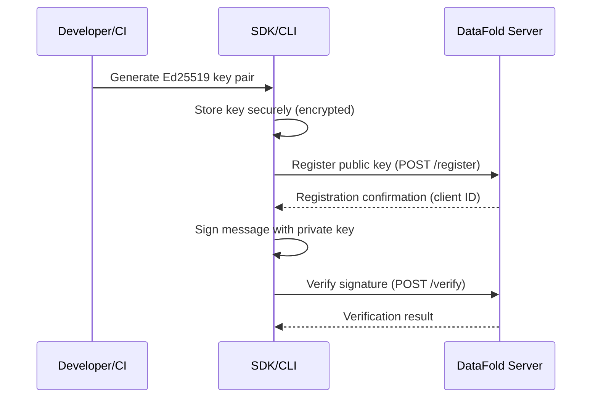

# Task 10-7-2: Integration Guides for Public Key Registration – Implementation Plan

## 1. Task Status Update Plan

- **Update**: Change status of 10-7-2 in [`docs/delivery/10/tasks.md`](docs/delivery/10/tasks.md) from "Proposed" to "Agreed".
- **Log**: Add a timestamped approval log entry, following the format:
  ```
  <!-- 2025-06-08T19:59:04-07:00: Status changed to Agreed by AI_Agent (per .cursorrules) -->
  ```
- **Location**: Place the log entry directly above the 10-7-2 task row.

---

## 2. Integration Guides Structure & Content Plan

### A. Overview

- **Purpose**: Enable developers and operations teams to integrate public key registration and signature verification with DataFold, across JavaScript SDK, Python SDK, and CLI.
- **Audience**: Developers (web, desktop, automation), DevOps, security engineers.

### B. Table of Contents

1. Introduction & Prerequisites
2. Key Generation (all platforms)
3. Secure Key Storage
4. Key Backup & Recovery
5. Public Key Registration (server integration)
6. Signature Generation & Verification
7. Practical Integration Examples
   - Web apps
   - Desktop apps
   - CI/CD pipelines
   - Automation scripts
8. Server Configuration & Deployment
9. Authentication & Authorization Patterns
10. Troubleshooting Common Issues
11. Security Best Practices
12. Performance Optimization
13. Deployment Checklists & Operational Procedures
14. Monitoring & Logging Recommendations

---

### C. Detailed Content Outline

#### 1. Introduction & Prerequisites
- Supported platforms, required versions, dependencies.
- Security context (why client-side key management, Ed25519, etc).

#### 2. Key Generation
- Step-by-step for JS SDK, Python SDK, CLI.
- Code snippets for each.
- Security notes (CSPRNG, entropy).

#### 3. Secure Key Storage
- Platform-specific storage mechanisms.
- Encryption details (AES-GCM, Scrypt, Argon2, etc).
- Metadata and access control.

#### 4. Key Backup & Recovery
- Export/import flows for all platforms.
- Standardized backup format (JSON, binary).
- Cross-platform migration.

#### 5. Public Key Registration (Server Integration)
- Registration workflow diagram (see below).
- API endpoints, required fields, error handling.
- Code examples for all platforms.

#### 6. Signature Generation & Verification
- How to sign and verify messages locally and with the server.
- Example flows for all platforms.

#### 7. Practical Integration Examples
- **Web app**: Registering a user’s key, signing requests.
- **Desktop app**: Secure storage, backup, server registration.
- **CI/CD**: Automated key registration and signature verification in pipelines.
- **Automation**: Scripting with CLI for batch operations.

#### 8. Server Configuration & Deployment
- Required server settings for key registration and verification.
- TLS, CORS, rate limiting, logging.
- Deployment topology considerations.

#### 9. Authentication & Authorization Patterns
- How to authenticate clients for registration.
- Role-based access, API tokens, client IDs.

#### 10. Troubleshooting Common Issues
- Registration failures (network, validation, duplicate keys).
- Signature verification errors.
- Storage/backup problems.
- Migration pitfalls.

#### 11. Security Best Practices
- Passphrase policies, memory clearing, file permissions.
- Threat model summary.
- Platform-specific security notes.

#### 12. Performance Optimization
- Key operation benchmarks.
- Storage and retrieval performance.
- Server-side tuning (rate limits, caching).

#### 13. Deployment Checklists & Operational Procedures
- Pre-deployment checklist (keys, backups, server config).
- Key rotation and emergency procedures.
- Backup/restore drills.

#### 14. Monitoring & Logging Recommendations
- What to log (registration attempts, failures, rotations).
- Monitoring key usage and server endpoints.
- Alerting on suspicious activity.

---

### D. Example Integration Flow Diagram (Mermaid)



---

### E. Acceptance Criteria Mapping

- **Guides published, reviewed, and approved**: Plan includes actionable, tested, and platform-specific guides.
- **Security and operational coverage**: Dedicated sections for security, deployment, monitoring, and troubleshooting.
- **Practical, actionable, and tested**: All examples are based on actual API and CLI usage, with migration and error handling.
- **Proper logging and timestamping**: Task status update and documentation change will be logged per .cursorrules.

---

## 3. Next Steps

1. Update [`docs/delivery/10/tasks.md`](docs/delivery/10/tasks.md) to set 10-7-2 to "Agreed" with timestamp/log.
2. Draft the integration guides as outlined above, referencing and building upon the API documentation.
3. Ensure all deliverables and acceptance criteria are met.
4. Signal readiness for review and for task 10-7-3.