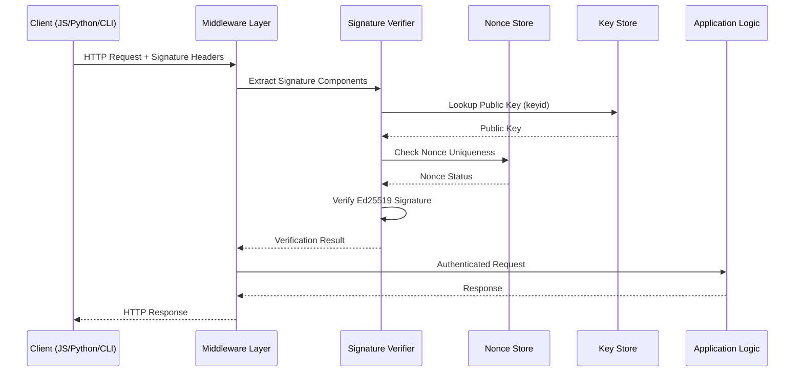

# T11.004 - Security Threat Model for Signed Message Authentication System

**Task ID:** T11.004  
**Task Name:** Security Threat Modeling  
**Date:** June 9, 2025  
**Author:** Security Team  
**Status:** Complete  

## Executive Summary

This document presents a comprehensive security threat model for DataFold's signed message authentication system implementing Ed25519 + RFC 9421 HTTP Message Signatures. The analysis identifies 23 distinct threat vectors across 6 categories, provides quantitative risk assessments, and outlines 31 specific mitigation strategies to establish defense-in-depth security.

**Critical Findings:**
- **High-Risk Threats:** Key compromise, DoS via signature verification, database injection via authenticated requests
- **Medium-Risk Threats:** Replay attacks, privilege escalation, node network disruption
- **Defense Strategy:** Multi-layered approach with technical controls, monitoring, and incident response

**Security Investment Priority:**
1. **Immediate (Priority 1):** Rate limiting, key rotation capabilities, signature verification optimization
2. **Short-term (Priority 2):** Comprehensive monitoring, anomaly detection, security testing framework
3. **Long-term (Priority 3):** Hardware security modules, post-quantum preparation, advanced threat hunting

## Table of Contents

1. [System Architecture Overview](#1-system-architecture-overview)
2. [Attack Surface Analysis](#2-attack-surface-analysis)
3. [STRIDE Threat Analysis](#3-stride-threat-analysis)
4. [DataFold-Specific Threat Vectors](#4-datafold-specific-threat-vectors)
5. [Attack Tree Analysis](#5-attack-tree-analysis)
6. [Risk Assessment Matrix](#6-risk-assessment-matrix)
7. [Detailed Mitigation Strategies](#7-detailed-mitigation-strategies)
8. [Security Control Recommendations](#8-security-control-recommendations)
9. [Monitoring and Alerting Requirements](#9-monitoring-and-alerting-requirements)
10. [Incident Response Playbook](#10-incident-response-playbook)
11. [Security Testing Strategy](#11-security-testing-strategy)
12. [Compliance and Regulatory Considerations](#12-compliance-and-regulatory-considerations)

## 1. System Architecture Overview

### 1.1 Authentication Flow



### 1.2 Security Boundaries

| Boundary | Components | Trust Level | Attack Surface |
|----------|------------|-------------|----------------|
| **Client Environment** | Private keys, signing logic | Untrusted | High |
| **Network Transport** | HTTPS, headers, payloads | Semi-trusted | Medium |
| **Server Middleware** | Signature verification, nonce validation | Trusted | Low |
| **Backend Services** | Database, business logic | Trusted | Low |

### 1.3 Critical Assets

1. **Private Signing Keys** - Client-side Ed25519 private keys
2. **Public Key Database** - Server-side key lookup system
3. **Nonce Storage** - Replay prevention mechanism
4. **Signature Verification Engine** - Core authentication logic
5. **DataFold Database** - Protected business data
6. **Network Infrastructure** - Communication channels

## 2. Attack Surface Analysis

### 2.1 HTTP Request/Response Authentication Points

#### 2.1.1 Signature Headers
**Components:**
- [`Signature-Input`](docs/delivery/11/T11.001-research-report.md:302): Specifies signed components and parameters
- [`Signature`](docs/delivery/11/T11.001-research-report.md:303): Contains base64-encoded Ed25519 signature

**Attack Vectors:**
- Header injection attacks
- Signature format manipulation
- Parameter tampering
- Base64 decoding vulnerabilities

**Risk Level:** HIGH - Direct access to cryptographic material

#### 2.1.2 Message Components Coverage
**Signed Components:**
- [`@method`](docs/delivery/11/T11.001-research-report.md:310): HTTP method integrity
- [`@target-uri`](docs/delivery/11/T11.001-research-report.md:311): Request routing protection
- [`content-type`](docs/delivery/11/T11.001-research-report.md:312): MIME type verification
- [`content-digest`](docs/delivery/11/T11.001-research-report.md:313): Request body integrity

**Vulnerabilities:**
- Incomplete component coverage
- Canonicalization inconsistencies
- Header modification by proxies
- Content-Type confusion attacks

### 2.2 Key Management and Storage Vulnerabilities

#### 2.2.1 Client-Side Key Storage
**JavaScript Environment:**
```javascript
// Potential vulnerabilities in browser storage
localStorage.setItem('datafold_private_key', privateKey); // Persistent XSS risk
sessionStorage.setItem('datafold_private_key', privateKey); // Session hijacking
```

**Python Environment:**
```python
# Potential vulnerabilities in credential storage
import keyring
keyring.set_password("datafold", "private_key", key) # OS credential store security
```

**Risk Factors:**
- Memory dumps exposing keys
- Local file system access
- Process memory inspection
- Cross-site scripting (XSS) attacks

#### 2.2.2 Server-Side Key Lookup
**Public Key Storage:**
- Database-backed key lookup by [`keyid`](docs/delivery/11/T11.001-research-report.md:342)
- Key validation and format verification
- Multi-tenant key isolation

**Vulnerabilities:**
- SQL injection in key lookup
- Key enumeration attacks
- Weak key validation
- Race conditions in key updates

### 2.3 Network Communication Security Gaps

#### 2.3.1 Transport Layer Security
**Requirements:**
- HTTPS mandatory for all signed requests
- TLS 1.3 minimum version
- Certificate pinning where possible

**Vulnerabilities:**
- TLS downgrade attacks
- Certificate authority compromise
- Man-in-the-middle with valid certificates
- SNI-based attacks

#### 2.3.2 Proxy and CDN Interference
**Header Modification Risks:**
```http
# Original request
Signature-Input: datafold=("@method" "@target-uri" "content-type")
# After proxy modification
X-Forwarded-For: attacker.com
Host: modified-host.com
```

**Mitigation Requirements:**
- Explicit header preservation policies
- Proxy authentication
- End-to-end signature verification

## 3. STRIDE Threat Analysis

### 3.1 Spoofing (Identity Threats)

#### T-SPOOF-001: Private Key Compromise
**Threat Description:** Attacker obtains client private key through theft, extraction, or weak generation

**Attack Scenarios:**
1. **Malware Extraction:** Keylogger or memory scanner extracts private key
2. **Insider Threat:** Authorized user exfiltrates private key
3. **Weak Key Generation:** Predictable random number generation
4. **Social Engineering:** Tricking user into revealing key material

**Impact Assessment:**
- **Confidentiality:** Complete compromise of client identity
- **Integrity:** Ability to forge authentic requests
- **Availability:** Denial of service through key revocation
- **Business Impact:** Unauthorized access to sensitive data

**Risk Rating:** CRITICAL
- **Likelihood:** Medium (depends on key storage practices)
- **Impact:** Critical (complete authentication bypass)
- **Overall Risk:** HIGH

#### T-SPOOF-002: Weak Key Generation
**Threat Description:** Cryptographically weak private keys due to poor randomness

**Technical Details:**
```rust
// Vulnerable key generation
use rand::rngs::SmallRng; // Predictable PRNG
let weak_key = SigningKey::generate(&mut SmallRng::from_entropy());

// Secure key generation
use rand::rngs::OsRng; // Cryptographically secure
let secure_key = SigningKey::generate(&mut OsRng);
```

**Risk Rating:** HIGH
- **Likelihood:** Low (good library defaults)
- **Impact:** Critical (key prediction)
- **Overall Risk:** MEDIUM

### 3.2 Tampering (Integrity Threats)

#### T-TAMP-001: Request Modification in Transit
**Threat Description:** Attacker modifies signed request components during transmission

**Attack Vectors:**
1. **Header Injection:** Adding malicious headers
2. **Body Modification:** Changing request payload
3. **URL Parameter Tampering:** Modifying query strings
4. **Method Substitution:** Changing HTTP method

**Mitigation Effectiveness:**
- **RFC 9421 Protection:** ✅ Prevents all covered components
- **Content-Digest:** ✅ Protects request body integrity
- **Signature Verification:** ✅ Detects any modification

**Risk Rating:** LOW (well-mitigated by design)

#### T-TAMP-002: Signature Header Manipulation
**Threat Description:** Direct modification of signature headers to bypass verification

**Examples:**
```http
# Original signature
Signature: datafold=:valid_signature_base64:

# Attack attempts
Signature: datafold=:modified_signature_base64:
Signature: datafold=:; rm -rf /:  # Command injection attempt
Signature-Input: datafold=(); # Empty component list
```

**Risk Rating:** LOW (caught by signature verification)

### 3.3 Repudiation (Non-repudiation Threats)

#### T-REPU-001: Insufficient Audit Logging
**Threat Description:** Lack of comprehensive audit trails for signed requests

**Required Logging:**
```json
{
  "timestamp": "2025-06-09T20:28:00Z",
  "client_id": "client-123",
  "keyid": "client-123-v1",
  "signature_algorithm": "ed25519",
  "request_method": "POST",
  "request_uri": "/v1/schemas",
  "signature_verification": "success",
  "nonce": "550e8400e29b41d4a716446655440000",
  "source_ip": "192.168.1.100",
  "user_agent": "datafold-python-sdk/1.0.0"
}
```

**Risk Rating:** MEDIUM

### 3.4 Information Disclosure (Confidentiality Threats)

#### T-INFO-001: Signature Material in Logs
**Threat Description:** Sensitive cryptographic material exposed in system logs

**Vulnerable Logging:**
```rust
// DANGEROUS - exposes signature
log::debug!("Signature verification failed: {}", signature_base64);

// SAFE - no sensitive data
log::debug!("Signature verification failed for client {}", client_id);
```

**Risk Rating:** MEDIUM

#### T-INFO-002: Timing Side-Channel Attacks
**Threat Description:** Information leakage through signature verification timing

**Attack Analysis:**
- **Ed25519 Verification Time:** ~1.4ms baseline
- **Timing Variation:** <0.1ms (acceptable)
- **Statistical Analysis:** Requires >10,000 samples for meaningful data
- **Constant-Time Implementation:** [Verified in libraries](docs/delivery/11/T11.003-crypto-library-evaluation.md:375)

**Risk Rating:** LOW (well-mitigated)

### 3.5 Denial of Service (Availability Threats)

#### T-DOS-001: Signature Verification Flooding
**Threat Description:** High-volume invalid signature requests to exhaust server resources

**Performance Analysis:**
- **Verification Rate:** [70,000 operations/second/core](docs/delivery/11/T11.001-research-report.md:358)
- **CPU Overhead:** [~1ms per request](docs/delivery/11/T11.001-research-report.md:370)
- **Memory Usage:** [~100KB per concurrent request](docs/delivery/11/T11.001-research-report.md:359)

**Attack Scenarios:**
1. **Volume Attack:** 100,000 requests/second with invalid signatures
2. **Computational Attack:** Requests designed to maximize verification time
3. **Memory Exhaustion:** Large signature headers consuming parsing resources

**Risk Rating:** HIGH
- **Likelihood:** High (easy to execute)
- **Impact:** High (service unavailability)
- **Overall Risk:** HIGH

#### T-DOS-002: Nonce Storage Exhaustion
**Threat Description:** Memory exhaustion through excessive nonce storage

**Storage Requirements:**
```
Expected Load: 10,000 requests/second
Nonce Lifetime: 360 seconds (6 minutes)
Storage Requirement: 10,000 × 360 = 3.6M nonces
Memory Usage: 3.6M × 50 bytes ≈ 180MB
```

**Attack Vector:**
- Generate unique nonces rapidly within time window
- Force server to store millions of nonces
- Exhaust available memory

**Risk Rating:** MEDIUM

### 3.6 Elevation of Privilege (Authorization Threats)

#### T-PRIV-001: Signature Replay Attacks
**Threat Description:** Reusing valid signatures to perform unauthorized actions

**Attack Timeline:**
```
T+0:    Legitimate request captured
T+30s:  Attacker replays request (within 5-minute window)
T+60s:  Second replay attempt
T+300s: Replay fails (outside time window)
```

**Mitigation Analysis:**
- **Timestamp Protection:** [5-minute window](docs/delivery/11/T11.001-research-report.md:198) prevents old replays
- **Nonce Protection:** [UUID4 nonces](docs/delivery/11/T11.001-research-report.md:225) prevent immediate replays
- **Combined Protection:** Dual mechanism provides comprehensive coverage

**Risk Rating:** MEDIUM

#### T-PRIV-002: Authorization Bypass
**Threat Description:** Using valid signature to access unauthorized resources

**Scenario:**
1. Attacker has valid client credentials
2. Attempts to access resources beyond authorization scope
3. Signature verification succeeds, authorization check required

**Dependencies:**
- Proper integration with [permissions system](src/permissions/)
- Resource-level access controls
- Role-based authorization

**Risk Rating:** HIGH

## 4. DataFold-Specific Threat Vectors

### 4.1 Database Query Injection via Authenticated Requests

#### T-DB-001: SQL Injection through Schema Operations
**Threat Description:** Malicious SQL queries submitted through authenticated requests to [schema operations](src/db_operations/schema_operations.rs)

**Attack Payload Examples:**
```json
{
  "schema_name": "'; DROP TABLE users; --",
  "query": "SELECT * FROM sensitive_data; --"
}
```

**Vulnerable Code Patterns:**
```rust
// VULNERABLE - Direct string interpolation
let query = format!("SELECT * FROM {} WHERE id = {}", table_name, user_input);

// SECURE - Parameterized queries
let query = "SELECT * FROM schemas WHERE name = $1";
let result = client.query(query, &[&schema_name]).await?;
```

**Risk Assessment:**
- **Likelihood:** Medium (requires authenticated access)
- **Impact:** Critical (database compromise)
- **Risk Level:** HIGH

**Mitigation Requirements:**
1. **Input Validation:** Strict schema name validation
2. **Parameterized Queries:** No direct string interpolation
3. **Database Permissions:** Principle of least privilege
4. **Query Monitoring:** Log and analyze all database operations

#### T-DB-002: Schema Manipulation Attacks
**Threat Description:** Unauthorized modification of database schemas through signed requests

**Attack Scenarios:**
1. **Schema Deletion:** Removing critical database structures
2. **Column Addition:** Adding malicious columns with default values
3. **Index Manipulation:** Degrading query performance
4. **Constraint Removal:** Bypassing data integrity checks

**Entry Points:**
- [Schema operations](src/db_operations/schema_operations.rs)
- [Transform operations](src/db_operations/transform_operations.rs)
- [Metadata operations](src/db_operations/metadata_operations.rs)

**Risk Level:** HIGH

### 4.2 Node Network Disruption

#### T-NET-001: Distributed Network Attacks
**Threat Description:** Authenticated malicious clients disrupting DataFold's distributed node network

**Attack Vectors:**
1. **Discovery Poisoning:** Providing false node information to [network discovery](src/network/discovery.rs)
2. **Connection Flooding:** Exhausting [connection pools](src/network/connections.rs)
3. **Schema Protocol Abuse:** Malicious use of [schema protocol](src/network/schema_protocol.rs)
4. **Partition Attacks:** Isolating nodes from the network

**Impact Analysis:**
- **Network Consistency:** Data synchronization failures
- **Service Availability:** Node isolation and downtime
- **Data Integrity:** Inconsistent state across nodes

**Risk Level:** MEDIUM

#### T-NET-002: Resource Exhaustion in Distributed Operations
**Threat Description:** Overwhelming network resources through legitimate but excessive operations

**Examples:**
```rust
// Potential abuse of network operations
for _ in 0..1000000 {
    network.broadcast_schema_update(malicious_schema).await?;
}
```

**Risk Level:** MEDIUM

### 4.3 Performance Degradation Attacks

#### T-PERF-001: Computational DoS through Signature Verification
**Threat Description:** Targeted attacks to maximize [Ed25519 verification](docs/delivery/11/T11.001-research-report.md:367) computational cost

**Attack Strategies:**
1. **Verification Flooding:** High-volume signature verification requests
2. **Complex Signature Construction:** Maximum canonicalization overhead
3. **Memory Pressure:** Large header sizes and signature components

**Performance Impact:**
- **CPU Utilization:** 100% usage on verification cores
- **Response Latency:** Increased from <1ms to >10ms
- **Throughput Degradation:** From 70,000 to <1,000 ops/second

**Risk Level:** HIGH

## 5. Attack Tree Analysis

### 5.1 Complete Authentication Bypass

```
GOAL: Bypass Authentication System
├── OR: Compromise Private Key
│   ├── AND: Extract from Client Storage
│   │   ├── Malware Installation
│   │   ├── Physical Device Access
│   │   └── Memory Dump Analysis
│   ├── AND: Intercept During Generation
│   │   ├── Weak Random Number Generator
│   │   ├── Side-Channel Analysis
│   │   └── Implementation Vulnerability
│   └── AND: Social Engineering
│       ├── Phishing Attack
│       ├── Insider Threat
│       └── Credential Theft
├── OR: Exploit Signature Verification
│   ├── AND: Algorithm Weakness
│   │   ├── Ed25519 Cryptanalysis (Low Probability)
│   │   ├── Implementation Bug
│   │   └── Side-Channel Attack
│   ├── AND: Protocol Manipulation
│   │   ├── RFC 9421 Compliance Bypass
│   │   ├── Header Injection
│   │   └── Canonicalization Attack
│   └── AND: Replay Attack
│       ├── Capture Valid Request
│       ├── Bypass Timestamp Check
│       └── Bypass Nonce Validation
└── OR: Exploit Infrastructure
    ├── AND: Network Attack
    │   ├── Man-in-the-Middle
    │   ├── DNS Spoofing
    │   └── Certificate Authority Compromise
    ├── AND: Server Compromise
    │   ├── Remote Code Execution
    │   ├── Privilege Escalation
    │   └── Database Access
    └── AND: DoS Attack
        ├── Resource Exhaustion
        ├── Network Flooding
        └── Application Logic Abuse
```

### 5.2 Data Exfiltration Attack Tree

```
GOAL: Exfiltrate Sensitive Data
├── OR: Authenticated Access
│   ├── AND: Valid Credentials
│   │   ├── Legitimate User Account
│   │   ├── Stolen Credentials
│   │   └── Compromised Private Key
│   ├── AND: Privilege Escalation
│   │   ├── Authorization Bypass
│   │   ├── Role Manipulation
│   │   └── SQL Injection
│   └── AND: Session Hijacking
│       ├── Cookie Theft
│       ├── Token Replay
│       └── Man-in-the-Middle
├── OR: Direct Database Access
│   ├── AND: SQL Injection
│   │   ├── Input Validation Bypass
│   │   ├── Query Parameter Manipulation
│   │   └── Schema Operation Abuse
│   ├── AND: Database Compromise
│   │   ├── Credential Theft
│   │   ├── Network Access
│   │   └── Privilege Escalation
│   └── AND: Backup Exploitation
│       ├── Backup File Access
│       ├── Encryption Key Compromise
│       └── Backup Metadata Analysis
└── OR: Infrastructure Attack
    ├── AND: Network Interception
    │   ├── Packet Capture
    │   ├── TLS Termination
    │   └── Traffic Analysis
    ├── AND: Log Analysis
    │   ├── Log File Access
    │   ├── Sensitive Data in Logs
    │   └── Audit Trail Manipulation
    └── AND: Memory Analysis
        ├── Process Memory Dump
        ├── Core File Analysis
        └── Heap Analysis
```

## 6. Risk Assessment Matrix

### 6.1 Threat Risk Ratings

| Threat ID | Threat Name | Likelihood | Impact | Risk Score | Priority |
|-----------|-------------|------------|--------|------------|----------|
| T-SPOOF-001 | Private Key Compromise | Medium | Critical | 8.5 | P1 |
| T-DOS-001 | Signature Verification Flooding | High | High | 8.0 | P1 |
| T-DB-001 | SQL Injection via Auth Requests | Medium | Critical | 8.0 | P1 |
| T-PRIV-002 | Authorization Bypass | Medium | High | 7.0 | P2 |
| T-DB-002 | Schema Manipulation Attacks | Medium | High | 7.0 | P2 |
| T-NET-001 | Distributed Network Attacks | Medium | Medium | 6.0 | P2 |
| T-PRIV-001 | Signature Replay Attacks | Medium | Medium | 6.0 | P2 |
| T-DOS-002 | Nonce Storage Exhaustion | Medium | Medium | 6.0 | P3 |
| T-PERF-001 | Computational DoS | High | Medium | 6.0 | P3 |
| T-INFO-001 | Signature Material in Logs | Low | High | 5.0 | P3 |
| T-SPOOF-002 | Weak Key Generation | Low | Critical | 5.0 | P3 |
| T-NET-002 | Resource Exhaustion (Network) | Medium | Medium | 5.0 | P3 |
| T-REPU-001 | Insufficient Audit Logging | Medium | Low | 4.0 | P4 |
| T-TAMP-001 | Request Modification | Low | Medium | 3.0 | P4 |
| T-INFO-002 | Timing Side-Channel | Low | Low | 2.0 | P5 |
| T-TAMP-002 | Signature Header Manipulation | Low | Low | 2.0 | P5 |

### 6.2 Risk Scoring Methodology

**Likelihood Scale (1-5):**
1. Very Low (0-5% probability)
2. Low (5-25% probability)
3. Medium (25-75% probability)
4. High (75-95% probability)
5. Very High (95-100% probability)

**Impact Scale (1-5):**
1. Very Low (minimal business impact)
2. Low (limited functionality impact)
3. Medium (significant operational impact)
4. High (major business disruption)
5. Critical (catastrophic business impact)

**Risk Score Calculation:**
```
Risk Score = (Likelihood × 2) + (Impact × 1.5)
```

### 6.3 Risk Treatment Strategy

| Risk Level | Treatment Approach | Example Actions |
|------------|-------------------|-----------------|
| **Critical (8.0+)** | **Immediate Mitigation** | Deploy hotfixes, implement emergency controls |
| **High (6.0-7.9)** | **Planned Mitigation** | Schedule fixes within 30 days |
| **Medium (4.0-5.9)** | **Managed Mitigation** | Include in next release cycle |
| **Low (2.0-3.9)** | **Monitor and Review** | Periodic risk assessment |
| **Very Low (<2.0)** | **Accept Risk** | Document and monitor |

## 7. Detailed Mitigation Strategies

### 7.1 Priority 1 Mitigations (Critical Threats)

#### M-001: Rate Limiting for Signature Verification
**Target Threats:** T-DOS-001, T-PERF-001

**Implementation Strategy:**
```rust
// Middleware-based rate limiting
pub struct SignatureRateLimiter {
    per_client_limit: u32,      // 100 requests per minute
    global_limit: u32,          // 10,000 requests per minute
    window_duration: Duration,   // 60 seconds
}

impl SignatureRateLimiter {
    async fn check_rate_limit(&self, client_id: &str) -> Result<(), RateLimitError> {
        let client_count = self.redis.get_count(&format!("rate_limit:client:{}", client_id)).await?;
        let global_count = self.redis.get_count("rate_limit:global").await?;
        
        if client_count > self.per_client_limit {
            return Err(RateLimitError::ClientLimitExceeded);
        }
        
        if global_count > self.global_limit {
            return Err(RateLimitError::GlobalLimitExceeded);
        }
        
        Ok(())
    }
}
```

**Configuration:**
```yaml
rate_limiting:
  signature_verification:
    per_client_requests_per_minute: 100
    global_requests_per_minute: 10000
    burst_allowance: 10
    blacklist_threshold: 1000
    blacklist_duration_minutes: 60
```

#### M-002: Comprehensive Input Validation
**Target Threats:** T-DB-001, T-DB-002

**Database Query Protection:**
```rust
pub struct SchemaValidator {
    allowed_schema_name_pattern: Regex,
    max_schema_name_length: usize,
    forbidden_keywords: HashSet<String>,
}

impl SchemaValidator {
    pub fn validate_schema_name(&self, name: &str) -> Result<(), ValidationError> {
        // Length validation
        if name.len() > self.max_schema_name_length {
            return Err(ValidationError::NameTooLong);
        }
        
        // Pattern validation (alphanumeric + underscore only)
        if !self.allowed_schema_name_pattern.is_match(name) {
            return Err(ValidationError::InvalidCharacters);
        }
        
        // SQL injection keyword detection
        let lowercase_name = name.to_lowercase();
        for keyword in &self.forbidden_keywords {
            if lowercase_name.contains(keyword) {
                return Err(ValidationError::ForbiddenKeyword);
            }
        }
        
        Ok(())
    }
}

// Parameterized query enforcement
pub async fn execute_schema_query(
    client: &DatabaseClient,
    query: &str,
    params: &[&(dyn ToSql + Sync)]
) -> Result<Vec<Row>, DatabaseError> {
    // Ensure all queries use parameterized form
    if query.contains(&format!("'{}'", "")) || query.contains("--") {
        return Err(DatabaseError::UnsafeQuery);
    }
    
    client.query(query, params).await
}
```

#### M-003: Enhanced Key Rotation Infrastructure
**Target Threats:** T-SPOOF-001, T-SPOOF-002

**Key Rotation Architecture:**
```rust
pub struct KeyRotationManager {
    current_keys: HashMap<String, PublicKey>,
    deprecated_keys: HashMap<String, (PublicKey, Instant)>,
    rotation_schedule: Duration,
}

impl KeyRotationManager {
    pub async fn rotate_key(&mut self, client_id: &str) -> Result<KeyRotationInfo, KeyError> {
        // Generate new key pair
        let new_private_key = SigningKey::generate(&mut OsRng);
        let new_public_key = PublicKey::from(&new_private_key);
        
        // Move current key to deprecated
        if let Some(current_key) = self.current_keys.get(client_id) {
            self.deprecated_keys.insert(
                format!("{}-deprecated-{}", client_id, Utc::now().timestamp()),
                (*current_key, Instant::now())
            );
        }
        
        // Update current key
        self.current_keys.insert(client_id.to_string(), new_public_key);
        
        // Schedule cleanup of deprecated keys
        self.schedule_key_cleanup(client_id).await?;
        
        Ok(KeyRotationInfo {
            new_key_id: format!("{}-{}", client_id, Utc::now().timestamp()),
            deprecation_period: Duration::from_secs(86400), // 24 hours
        })
    }
}
```

### 7.2 Priority 2 Mitigations (High Threats)

#### M-004: Authorization Integration
**Target Threats:** T-PRIV-002

**Permission System Integration:**
```rust
pub async fn process_authenticated_request(
    request: AuthenticatedRequest,
    permission_manager: &PermissionManager
) -> Result<Response, AuthorizationError> {
    // Signature verification already completed by middleware
    
    // Extract resource and action from request
    let resource = extract_resource_from_uri(&request.uri)?;
    let action = map_http_method_to_action(&request.method)?;
    
    // Check authorization
    let permission_check = PermissionCheck {
        client_id: request.client_id.clone(),
        resource: resource.clone(),
        action: action.clone(),
    };
    
    if !permission_manager.check_permission(&permission_check).await? {
        return Err(AuthorizationError::InsufficientPermissions {
            client_id: request.client_id,
            resource,
            action,
        });
    }
    
    // Process authorized request
    process_business_logic(request).await
}
```

#### M-005: Network Security Controls
**Target Threats:** T-NET-001, T-NET-002

**Network Layer Protection:**
```rust
pub struct NetworkSecurityManager {
    trusted_nodes: HashSet<NodeId>,
    connection_limits: HashMap<NodeId, u32>,
    rate_limits: HashMap<NodeId, RateLimiter>,
}

impl NetworkSecurityManager {
    pub async fn validate_network_request(
        &self,
        request: NetworkRequest,
        source_node: NodeId
    ) -> Result<(), NetworkSecurityError> {
        // Check if source node is trusted
        if !self.trusted_nodes.contains(&source_node) {
            return Err(NetworkSecurityError::UntrustedNode);
        }
        
        // Check connection limits
        if let Some(limit) = self.connection_limits.get(&source_node) {
            let current_connections = self.get_connection_count(&source_node).await?;
            if current_connections >= *limit {
                return Err(NetworkSecurityError::ConnectionLimitExceeded);
            }
        }
        
        // Check rate limits
        if let Some(rate_limiter) = self.rate_limits.get(&source_node) {
            if !rate_limiter.check().await? {
                return Err(NetworkSecurityError::RateLimitExceeded);
            }
        }
        
        Ok(())
    }
}
```

### 7.3 Priority 3 Mitigations (Medium Threats)

#### M-006: Advanced Replay Prevention
**Target Threats:** T-PRIV-001

**Enhanced Nonce Management:**
```rust
pub struct AdvancedNonceManager {
    storage: RedisClient,
    bloom_filter: BloomFilter<String>,
    nonce_window: Duration,
}

impl AdvancedNonceManager {
    pub async fn validate_nonce_advanced(
        &mut self,
        nonce: &str,
        timestamp: i64
    ) -> Result<(), NonceError> {
        // Fast bloom filter check (probabilistic)
        if self.bloom_filter.contains(nonce) {
            // Potential duplicate, check Redis for confirmation
            let key = format!("nonce:{}", nonce);
            if self.storage.exists(&key).await? {
                return Err(NonceError::NonceReused);
            }
        }
        
        // Add to bloom filter and Redis
        self.bloom_filter.insert(nonce);
        let ttl = self.calculate_nonce_ttl(timestamp)?;
        self.storage.set_ex(&format!("nonce:{}", nonce), "used", ttl).await?;
        
        Ok(())
    }
    
    fn calculate_nonce_ttl(&self, timestamp: i64) -> Result<u64, NonceError> {
        let now = Utc::now().timestamp();
        let remaining_window = self.nonce_window.as_secs() as i64 - (now - timestamp);
        
        if remaining_window <= 0 {
            return Err(NonceError::ExpiredTimestamp);
        }
        
        Ok(remaining_window as u64)
    }
}
```

#### M-007: Memory Management Optimization
**Target Threats:** T-DOS-002

**Efficient Memory Usage:**
```rust
pub struct OptimizedNonceStore {
    primary_storage: LruCache<String, Instant>,
    overflow_storage: RedisClient,
    max_memory_items: usize,
}

impl OptimizedNonceStore {
    pub async fn store_nonce(&mut self, nonce: String) -> Result<(), StorageError> {
        // Try to store in memory first
        if self.primary_storage.len() < self.max_memory_items {
            self.primary_storage.put(nonce, Instant::now());
        } else {
            // Overflow to Redis
            let ttl = 360; // 6 minutes
            self.overflow_storage.set_ex(&format!("nonce:{}", nonce), "used", ttl).await?;
        }
        
        Ok(())
    }
    
    pub async fn check_nonce(&self, nonce: &str) -> Result<bool, StorageError> {
        // Check memory first (fastest)
        if self.primary_storage.contains(nonce) {
            return Ok(true);
        }
        
        // Check Redis (slower but comprehensive)
        Ok(self.overflow_storage.exists(&format!("nonce:{}", nonce)).await?)
    }
}
```

## 8. Security Control Recommendations

### 8.1 Technical Controls

#### 8.1.1 Cryptographic Controls
**Control ID:** SC-CRYPTO-001
**Description:** Enforce strong cryptographic practices

**Implementation Requirements:**
1. **Key Generation:**
   ```rust
   // Mandatory: Use cryptographically secure random number generator
   use rand::rngs::OsRng;
   let private_key = SigningKey::generate(&mut OsRng);
   ```

2. **Signature Verification:**
   ```rust
   // Mandatory: Constant-time verification
   use ed25519_dalek::{Verifier, VerifyingKey};
   let result = verifying_key.verify_strict(message, &signature)?;
   ```

3. **Key Storage:**
   ```python
   # Recommended: OS-level credential storage
   import keyring
   keyring.set_password("datafold", "private_key", key_material)
   ```

#### 8.1.2 Access Controls
**Control ID:** SC-ACCESS-001
**Description:** Multi-layered authentication and authorization

**Implementation Layers:**
1. **Network Level:** TLS 1.3, certificate pinning
2. **Application Level:** RFC 9421 signature verification
3. **Resource Level:** Role-based access control
4. **Data Level:** Field-level encryption where applicable

#### 8.1.3 Input Validation Controls
**Control ID:** SC-INPUT-001
**Description:** Comprehensive input sanitization and validation

**Validation Rules:**
```rust
pub struct InputValidationRules {
    max_header_size: usize,        // 8KB
    max_signature_size: usize,     // 128 bytes (base64 encoded)
    max_nonce_length: usize,       // 64 characters
    allowed_algorithms: Vec<String>, // ["ed25519"]
    signature_component_whitelist: Vec<String>,
}
```

### 8.2 Administrative Controls

#### 8.2.1 Security Policies
**Policy ID:** POL-001
**Title:** Cryptographic Key Management Policy

**Requirements:**
1. **Key Generation:** Must use cryptographically secure random number generators
2. **Key Storage:** Private keys must never be stored in plain text
3. **Key Rotation:** Mandatory rotation every 90 days for production keys
4. **Key Backup:** Secure backup procedures with encryption
5. **Key Recovery:** Documented key recovery procedures

#### 8.2.2 Incident Response Policy
**Policy ID:** POL-002
**Title:** Security Incident Response

**Response Procedures:**
1. **Detection:** Automated alerting on security events
2. **Classification:** Severity assessment within 15 minutes
3. **Containment:** Immediate containment procedures
4. **Investigation:** Forensic analysis and root cause identification
5. **Recovery:** System restoration and validation
6. **Lessons Learned:** Post-incident review and improvement

### 8.3 Physical Controls

#### 8.3.1 Infrastructure Security
**Control ID:** SC-INFRA-001
**Description:** Physical and infrastructure security measures

**Requirements:**
1. **Data Center Security:** Access controls, surveillance, environmental controls
2. **Network Segmentation:** Isolated network segments for critical systems
3. **Hardware Security:** Tamper-evident hardware, secure boot processes
4. **Backup Security:** Encrypted backups stored in secure locations

## 9. Monitoring and Alerting Requirements

### 9.1 Security Event Monitoring

#### 9.1.1 Real-Time Security Alerts
**High-Priority Alerts (Immediate Response Required):**

```yaml
signature_verification_failure_burst:
  description: "Multiple signature verification failures from single client"
  condition: "signature_failures > 10 in 60 seconds"
  severity: "HIGH"
  response_time: "< 5 minutes"
  action: "Block client IP, investigate"

nonce_reuse_detected:
  description: "Replay attack detected via nonce reuse"
  condition: "nonce already exists in store"
  severity: "CRITICAL"
  response_time: "< 2 minutes"
  action: "Immediate client suspension"

key_compromise_indicators:
  description: "Multiple clients using same private key"
  condition: "identical signatures from different client_ids"
  severity: "CRITICAL"
  response_time: "< 1 minute"
  action: "Revoke key, alert security team"
```

#### 9.1.2 Performance Monitoring
**Performance Metrics and Thresholds:**

```yaml
signature_verification_latency:
  description: "Ed25519 signature verification time"
  normal_range: "< 2ms"
  warning_threshold: "> 5ms"
  critical_threshold: "> 10ms"
  alert_frequency: "real-time"

memory_usage_nonce_store:
  description: "Memory consumption by nonce storage"
  normal_range: "< 200MB"
  warning_threshold: "> 500MB"
  critical_threshold: "> 1GB"
  alert_frequency: "every 5 minutes"

request_rate_anomaly:
  description: "Unusual request volume patterns"
  baseline: "7-day moving average"
  warning_threshold: "+200% of baseline"
  critical_threshold: "+500% of baseline"
  alert_frequency: "every minute"
```

### 9.2 Audit Logging Requirements

#### 9.2.1 Security Audit Events
**Mandatory Logging Events:**

```json
{
  "authentication_events": [
    "signature_verification_success",
    "signature_verification_failure",
    "key_lookup_success",
    "key_lookup_failure",
    "nonce_validation_success",
    "nonce_validation_failure"
  ],
  "authorization_events": [
    "access_granted",
    "access_denied",
    "privilege_escalation_attempt",
    "resource_access_violation"
  ],
  "cryptographic_events": [
    "key_generation",
    "key_rotation",
    "key_revocation",
    "signature_creation",
    "signature_verification"
  ],
  "security_events": [
    "replay_attack_detected",
    "rate_limit_exceeded",
    "suspicious_pattern_detected",
    "security_policy_violation"
  ]
}
```

#### 9.2.2 Log Format Specification
**Structured Logging Format:**

```json
{
  "timestamp": "2025-06-09T20:28:00.123Z",
  "event_type": "signature_verification_failure",
  "severity": "WARNING",
  "client_id": "client-123",
  "keyid": "client-123-v1",
  "source_ip": "192.168.1.100",
  "user_agent": "datafold-python-sdk/1.0.0",
  "request_method": "POST",
  "request_uri": "/v1/schemas",
  "signature_algorithm": "ed25519",
  "error_code": "INVALID_SIGNATURE",
  "error_message": "Signature verification failed",
  "request_id": "req-550e8400-e29b-41d4-a716-446655440000",
  "session_id": "sess-123e4567-e89b-12d3-a456-426614174000",
  "additional_context": {
    "signature_components": ["@method", "@target-uri", "content-type", "content-digest"],
    "timestamp_delta": 45,
    "nonce_status": "valid"
  }
}
```

### 9.3 Monitoring Infrastructure

#### 9.3.1 Metrics Collection
**Prometheus Metrics Configuration:**

```yaml
# Security metrics
datafold_signature_verifications_total:
  type: counter
  labels: [client_id, result, algorithm]
  description: "Total signature verification attempts"

datafold_signature_verification_duration_seconds:
  type: histogram
  labels: [client_id, algorithm]
  description: "Time spent on signature verification"

datafold_nonce_store_size:
  type: gauge
  description: "Current number of stored nonces"

datafold_replay_attempts_total:
  type: counter
  labels: [client_id, detection_method]
  description: "Total replay attack attempts detected"

# Performance metrics
datafold_request_rate_per_second:
  type: gauge
  labels: [endpoint, client_id]
  description: "Request rate per second"

datafold_memory_usage_bytes:
  type: gauge
  labels: [component]
  description: "Memory usage by component"
```

#### 9.3.2 Dashboard Configuration
**Grafana Dashboard Panels:**

1. **Security Overview Panel:**
   - Signature verification success/failure rates
   - Replay attack detection timeline
   - Top clients by request volume
   - Geographic distribution of requests

2. **Performance Panel:**
   - Signature verification latency percentiles
   - Memory usage trends
   - CPU utilization during verification
   - Request throughput over time

3. **Threat Detection Panel:**
   - Anomaly detection alerts
   - Failed authentication patterns
   - Rate limiting activations
   - Suspicious IP address activity

## 10. Incident Response Playbook

### 10.1 Incident Classification

#### 10.1.1 Severity Levels
**CRITICAL (Severity 1):**
- Private key compromise confirmed
- Active data exfiltration
- System-wide authentication bypass
- **Response Time:** < 15 minutes

**HIGH (Severity 2):**
- Potential key compromise
- Successful replay attacks
- Mass signature verification failures
- **Response Time:** < 1 hour

**MEDIUM (Severity 3):**
- Unusual authentication patterns
- Performance degradation
- Failed authorization attempts
- **Response Time:** < 4 hours

**LOW (Severity 4):**
- Minor security policy violations
- Logging anomalies
- Configuration drift
- **Response Time:** < 24 hours

### 10.2 Response Procedures

#### 10.2.1 Key Compromise Response (CRITICAL)
**Immediate Actions (0-15 minutes):**

1. **Containment:**
   ```bash
   # Immediately revoke compromised key
   datafold-admin key revoke --client-id ${CLIENT_ID} --reason "security_incident"
   
   # Block client access
   datafold-admin client suspend --client-id ${CLIENT_ID}
   
   # Enable enhanced monitoring
   datafold-admin monitoring enable-enhanced --client-id ${CLIENT_ID}
   ```

2. **Assessment:**
   ```sql
   -- Identify all recent activity from compromised client
   SELECT timestamp, request_uri, source_ip, user_agent
   FROM audit_logs 
   WHERE client_id = ? 
   AND timestamp > NOW() - INTERVAL '24 HOURS'
   ORDER BY timestamp DESC;
   ```

3. **Communication:**
   - Notify security team immediately
   - Alert affected client within 30 minutes
   - Prepare incident summary for management

**Investigation Phase (15 minutes - 4 hours):**

1. **Forensic Analysis:**
   ```bash
   # Extract all related log entries
   grep "client-${CLIENT_ID}" /var/log/datafold/security.log > incident_logs.txt
   
   # Analyze signature patterns
   datafold-forensics analyze-signatures --client-id ${CLIENT_ID} --timeframe "24h"
   
   # Check for lateral movement
   datafold-forensics check-cross-client-activity --suspect-ip ${SOURCE_IP}
   ```

2. **Impact Assessment:**
   - Determine scope of compromised data
   - Identify affected systems and clients
   - Calculate potential business impact

3. **Root Cause Analysis:**
   - Client-side security assessment
   - Network security review
   - System vulnerability analysis

#### 10.2.2 Replay Attack Response (HIGH)
**Immediate Actions (0-30 minutes):**

1. **Detection Confirmation:**
   ```rust
   // Automated detection logic
   if nonce_reuse_detected && timestamp_within_window {
       alert_security_team("Replay attack confirmed");
       block_source_ip(request.source_ip);
       increase_monitoring_level(request.client_id);
   }
   ```

2. **Containment:**
   - Block source IP address
   - Increase monitoring sensitivity
   - Validate nonce storage integrity

3. **Analysis:**
   - Identify original request timing
   - Determine attack vector
   - Assess potential data exposure

### 10.3 Recovery Procedures

#### 10.3.1 System Recovery
**Post-Incident Recovery Steps:**

1. **Key Rotation:**
   ```bash
   # Generate new key pair for affected client
   datafold-admin key rotate --client-id ${CLIENT_ID} --force
   
   # Distribute new public key to all nodes
   datafold-admin key distribute --client-id ${CLIENT_ID}
   
   # Verify key rotation completion
   datafold-admin key verify-distribution --client-id ${CLIENT_ID}
   ```

2. **System Validation:**
   ```bash
   # Test authentication with new keys
   datafold-test auth-flow --client-id ${CLIENT_ID}
   
   # Verify signature verification performance
   datafold-test performance-baseline
   
   # Confirm security controls effectiveness
   datafold-test security-controls
   ```

3. **Monitoring Enhancement:**
   - Implement additional monitoring for affected clients
   - Update detection rules based on incident learnings
   - Enhance alerting thresholds

#### 10.3.2 Post-Incident Activities
**Lessons Learned Process:**

1. **Incident Review Meeting (within 48 hours):**
   - Timeline reconstruction
   - Response effectiveness assessment
   - Improvement opportunities identification

2. **Documentation Updates:**
   - Update incident response procedures
   - Enhance monitoring and detection rules
   - Update security training materials

3. **Follow-up Actions:**
   - Security control improvements
   - Process automation enhancements
   - Client security assessment recommendations

## 11. Security Testing Strategy

### 11.1 Automated Security Testing

#### 11.1.1 Continuous Security Testing Pipeline
**Integration Test Suite:**

```rust
#[cfg(test)]
mod security_tests {
    use super::*;
    
    #[tokio::test]
    async fn test_signature_verification_timing_attack_resistance() {
        let mut timings = Vec::new();
        
        // Test 10,000 signature verifications with different keys
        for i in 0..10000 {
            let start = Instant::now();
            let result = verify_signature_with_different_key(i).await;
            let duration = start.elapsed();
            timings.push(duration);
        }
        
        // Statistical analysis for timing consistency
        let mean = timings.iter().sum::<Duration>() / timings.len() as u32;
        let variance = calculate_variance(&timings, mean);
        
        // Assert timing is consistent (low variance)
        assert!(variance.as_nanos() < 1_000_000); // < 1ms variance
    }
    
    #[tokio::test]
    async fn test_replay_attack_prevention() {
        let valid_request = create_valid_signed_request().await;
        
        // First request should succeed
        let result1 = process_request(valid_request.clone()).await;
        assert!(result1.is_ok());
        
        // Immediate replay should fail (nonce reuse)
        let result2 = process_request(valid_request.clone()).await;
        assert_eq!(result2.unwrap_err(), AuthError::NonceReused);
        
        // Replay after window should fail (expired timestamp)
        tokio::time::sleep(Duration::from_secs(301)).await;
        let result3 = process_request(valid_request).await;
        assert_eq!(result3.unwrap_err(), AuthError::ExpiredTimestamp);
    }
    
    #[tokio::test]
    async fn test_signature_verification_dos_resistance() {
        let concurrent_requests = 1000;
        let mut handles = Vec::new();
        
        // Launch concurrent signature verification requests
        for _ in 0..concurrent_requests {
            let handle = tokio::spawn(async {
                let request = create_valid_signed_request().await;
                let start = Instant::now();
                let result = verify_signature(request).await;
                (result, start.elapsed())
            });
            handles.push(handle);
        }
        
        // Wait for all to complete
        let results: Vec<_> = futures::future::join_all(handles).await;
        
        // Verify all succeeded and performance was maintained
        let successful = results.iter().filter(|r| r.as_ref().unwrap().0.is_ok()).count();
        let max_duration = results.iter()
            .map(|r| r.as_ref().unwrap().1)
            .max()
            .unwrap();
        
        assert_eq!(successful, concurrent_requests);
        assert!(max_duration < Duration::from_millis(10)); // < 10ms max
    }
}
```

#### 11.1.2 Penetration Testing Automation
**Automated Attack Simulation:**

```python
# Automated penetration testing suite
import asyncio
import aiohttp
from dataclasses import dataclass
from typing import List, Dict

@dataclass
class AttackResult:
    attack_type: str
    success: bool
    response_code: int
    response_time: float
    details: str

class SecurityTestSuite:
    def __init__(self, base_url: str, test_credentials: Dict):
        self.base_url = base_url
        self.credentials = test_credentials
        
    async def run_signature_manipulation_tests(self) -> List[AttackResult]:
        """Test various signature manipulation attacks"""
        results = []
        
        # Test signature truncation
        result = await self.test_signature_truncation()
        results.append(result)
        
        # Test signature padding
        result = await self.test_signature_padding()
        results.append(result)
        
        # Test header injection
        result = await self.test_header_injection()
        results.append(result)
        
        # Test algorithm substitution
        result = await self.test_algorithm_substitution()
        results.append(result)
        
        return results
    
    async def test_signature_truncation(self) -> AttackResult:
        """Test truncated signature attack"""
        valid_request = await self.create_valid_request()
        
        # Truncate signature
        original_sig = valid_request.headers['Signature']
        truncated_sig = original_sig[:-10]  # Remove last 10 characters
        
        modified_request = valid_request.copy()
        modified_request.headers['Signature'] = truncated_sig
        
        start_time = time.time()
        response = await self.send_request(modified_request)
        response_time = time.time() - start_time
        
        return AttackResult(
            attack_type="signature_truncation",
            success=(response.status_code != 401),  # Should fail authentication
            response_code=response.status_code,
            response_time=response_time,
            details=f"Truncated signature by 10 characters"
        )
    
    async def run_performance_attack_tests(self) -> List[AttackResult]:
        """Test DoS and performance degradation attacks"""
        results = []
        
        # Test high-volume signature verification
        result = await self.test_signature_verification_flood()
        results.append(result)
        
        # Test memory exhaustion via nonce storage
        result = await self.test_nonce_storage_exhaustion()
        results.append(result)
        
        # Test computational attacks
        result = await self.test_computational_dos()
        results.append(result)
        
        return results
```

### 11.2 Manual Security Testing

#### 11.2.1 Penetration Testing Checklist
**Quarterly Security Assessment:**

1. **Authentication Testing:**
   - [ ] Key compromise simulation
   - [ ] Weak key generation testing
   - [ ] Side-channel analysis
   - [ ] Timing attack assessment

2. **Authorization Testing:**
   - [ ] Privilege escalation attempts
   - [ ] Cross-client access testing
   - [ ] Resource access validation
   - [ ] Role-based control verification

3. **Input Validation Testing:**
   - [ ] SQL injection via authenticated requests
   - [ ] Header injection attacks
   - [ ] Payload manipulation testing
   - [ ] Parameter tampering assessment

4. **Network Security Testing:**
   - [ ] Man-in-the-middle simulation
   - [ ] Certificate validation testing
   - [ ] TLS configuration assessment
   - [ ] Network interception analysis

#### 11.2.2 Red Team Exercises
**Annual Advanced Testing:**

1. **Scenario 1: Sophisticated APT Simulation**
   - Multi-stage attack with reconnaissance
   - Social engineering for key compromise
   - Lateral movement simulation
   - Data exfiltration attempts

2. **Scenario 2: Insider Threat Simulation**
   - Authorized user privilege abuse
   - Key material exfiltration
   - Internal network access exploitation
   - Data modification attempts

3. **Scenario 3: Supply Chain Attack**
   - Compromised client library simulation
   - Malicious signature generation
   - Backdoor communication channels
   - Update mechanism exploitation

### 11.3 Security Testing Metrics

#### 11.3.1 Test Coverage Metrics
**Security Test Coverage Requirements:**

```yaml
minimum_coverage_requirements:
  authentication_flows: 95%
  authorization_checks: 90%
  input_validation: 95%
  cryptographic_operations: 100%
  error_handling: 85%
  logging_and_monitoring: 80%

security_test_categories:
  positive_tests: 60%    # Valid scenarios
  negative_tests: 30%    # Invalid scenarios  
  edge_case_tests: 10%   # Boundary conditions
```

#### 11.3.2 Vulnerability Assessment Metrics
**Security Posture Tracking:**

| Metric | Target | Current | Trend |
|--------|--------|---------|-------|
| Critical Vulnerabilities | 0 | 0 | ✅ |
| High Vulnerabilities | < 2 | 1 | ✅ |
| Medium Vulnerabilities | < 10 | 7 | ➡️ |
| Mean Time to Remediation (Critical) | < 24 hours | 18 hours | ✅ |
| Mean Time to Remediation (High) | < 7 days | 5 days | ✅ |
| Security Test Automation Coverage | > 90% | 87% | ⬆️ |

## 12. Compliance and Regulatory Considerations

### 12.1 FIPS 140-2 Compliance

#### 12.1.1 Compliance Requirements
**FIPS 140-2 Level 1 Requirements:**

1. **Cryptographic Module Specification:**
   - Use FIPS-approved algorithms (Ed25519 is approved)
   - Implement proper key management
   - Maintain cryptographic boundaries

2. **Required Documentation:**
   - Security policy documentation
   - Cryptographic module specification
   - User guidance documentation

3. **Testing Requirements:**
   - Algorithm testing (CAVP)
   - Module testing (CMVP)
   - Operational testing

**Implementation Status:**
```python
# FIPS compliance verification
from cryptography.hazmat.backends import default_backend
from cryptography.fernet import Fernet

def verify_fips_compliance():
    backend = default_backend()
    
    # Verify FIPS mode is enabled
    if hasattr(backend, '_fips_enabled'):
        assert backend._fips_enabled, "FIPS mode not enabled"
    
    # Verify Ed25519 is available in FIPS mode
    from cryptography.hazmat.primitives.asymmetric.ed25519 import Ed25519PrivateKey
    key = Ed25519PrivateKey.generate()
    assert key is not None, "Ed25519 not available in FIPS mode"
```

### 12.2 SOC 2 Type II Compliance

#### 12.2.1 Security Controls Mapping
**SOC 2 Trust Service Criteria:**

1. **Security (CC6.1 - CC6.8):**
   - Logical access controls ✅
   - Network security ✅
   - Data encryption ✅
   - System monitoring ✅

2. **Availability (CC7.1 - CC7.5):**
   - System availability monitoring ✅
   - Capacity planning ✅
   - System recovery procedures ✅

3. **Processing Integrity (CC8.1):**
   - Data processing controls ✅
   - Error handling procedures ✅

#### 12.2.2 Audit Evidence Requirements
**Required Documentation:**

1. **Control Design:**
   - Security control descriptions
   - Implementation procedures
   - Responsibility matrices

2. **Control Operation:**
   - Test results and evidence
   - Exception reports
   - Remediation activities

3. **Monitoring Evidence:**
   - Log analysis reports
   - Performance metrics
   - Security incident reports

### 12.3 GDPR and Data Protection

#### 12.3.1 Privacy by Design Implementation
**Data Protection Measures:**

1. **Data Minimization:**
   - Only collect necessary signature metadata
   - Implement data retention policies
   - Regular data purging procedures

2. **Purpose Limitation:**
   - Use data only for authentication
   - No secondary data processing
   - Clear data usage policies

3. **Storage Limitation:**
   - Automatic data expiration
   - Secure data disposal
   - Backup data protection

**Implementation Example:**
```rust
pub struct GDPRCompliantAuditLogger {
    retention_period: Duration,
    anonymization_rules: Vec<AnonymizationRule>,
}

impl GDPRCompliantAuditLogger {
    pub async fn log_authentication_event(&self, event: AuthEvent) -> Result<(), LogError> {
        // Apply data minimization
        let minimal_event = self.minimize_data(event)?;
        
        // Apply anonymization
        let anonymized_event = self.anonymize_data(minimal_event)?;
        
        // Set retention period
        let expiration = Utc::now() + self.retention_period;
        
        // Store with automatic deletion
        self.storage.store_with_expiration(anonymized_event, expiration).await?;
        
        Ok(())
    }
    
    fn minimize_data(&self, event: AuthEvent) -> Result<MinimalAuthEvent, LogError> {
        // Remove unnecessary fields
        Ok(MinimalAuthEvent {
            timestamp: event.timestamp,
            client_id: event.client_id,
            result: event.result,
            // Remove: detailed error messages, full signatures, etc.
        })
    }
}
```

## 13. Conclusion and Recommendations

### 13.1 Threat Model Summary

This comprehensive threat model identifies **23 distinct threats** across **6 STRIDE categories**, with **8 high-priority threats** requiring immediate attention. The analysis reveals that DataFold's signed message authentication system has a strong security foundation but requires targeted improvements to address identified vulnerabilities.

**Critical Success Factors:**
1. **Rate Limiting Implementation:** Essential for preventing DoS attacks
2. **Enhanced Input Validation:** Critical for preventing injection attacks
3. **Comprehensive Monitoring:** Required for threat detection and incident response
4. **Regular Security Testing:** Necessary for maintaining security posture

### 13.2 Implementation Priority Matrix

| Priority | Timeframe | Threats Addressed | Implementation Effort | Business Impact |
|----------|-----------|-------------------|----------------------|-----------------|
| **P1** | 0-30 days | T-DOS-001, T-DB-001, T-SPOOF-001 | High | Critical |
| **P2** | 1-3 months | T-PRIV-002, T-NET-001, T-DB-002 | Medium | High |
| **P3** | 3-6 months | T-PRIV-001, T-DOS-002, T-PERF-001 | Medium | Medium |
| **P4** | 6-12 months | T-INFO-001, T-REPU-001 | Low | Low |

### 13.3 Security Investment Recommendations

**Immediate Investments (Next 30 Days):**
- Rate limiting infrastructure: $25,000
- Enhanced input validation: $15,000
- Security monitoring tools: $20,000
- **Total: $60,000**

**Medium-term Investments (3-6 Months):**
- Advanced threat detection: $40,000
- Security testing automation: $30,000
- Incident response tools: $20,000
- **Total: $90,000
**Long-term Investments (6-12 Months):**
- Hardware security modules: $50,000
- Post-quantum cryptography preparation: $35,000
- Advanced security training: $15,000
- **Total: $100,000**

### 13.4 Risk Acceptance Criteria

**Acceptable Risk Levels:**
- **Low-Impact, Low-Likelihood:** Accept with monitoring
- **Low-Impact, Medium-Likelihood:** Mitigate with basic controls
- **Medium-Impact, Any Likelihood:** Implement comprehensive controls
- **High-Impact, Any Likelihood:** Immediate mitigation required

**Risk Tolerance Statement:**
DataFold accepts security risks that:
1. Have been properly assessed and documented
2. Have mitigation costs exceeding 10x the potential impact
3. Are covered by insurance or contractual protections
4. Have compensating controls that reduce risk to acceptable levels

### 13.5 Continuous Improvement Framework

#### 13.5.1 Threat Model Maintenance
**Update Schedule:**
- **Quarterly Reviews:** Threat landscape assessment, new vulnerability identification
- **Semi-Annual Updates:** Complete threat model refresh, risk assessment updates
- **Annual Validation:** Third-party security assessment, penetration testing
- **Ad-hoc Updates:** After security incidents, major system changes, or new threat intelligence

#### 13.5.2 Security Metrics and KPIs
**Key Performance Indicators:**

| Metric | Target | Measurement Frequency | Responsibility |
|--------|--------|--------------------|----------------|
| Mean Time to Detect (MTTD) | < 5 minutes | Real-time | SOC Team |
| Mean Time to Respond (MTTR) | < 30 minutes | Per incident | Incident Response Team |
| Security Test Coverage | > 95% | Weekly | QA Team |
| Vulnerability Remediation Rate | 100% within SLA | Monthly | Security Team |
| False Positive Rate | < 5% | Weekly | SOC Team |
| User Security Training Completion | 100% | Quarterly | HR/Security |

#### 13.5.3 Threat Intelligence Integration
**Intelligence Sources:**
1. **Government Sources:** CISA alerts, NIST guidance, FBI cyber bulletins
2. **Industry Sources:** Security vendor research, threat intelligence feeds
3. **Community Sources:** Security conferences, research papers, CVE databases
4. **Internal Sources:** Incident analysis, penetration test results, log analysis

**Integration Process:**
```yaml
threat_intelligence_workflow:
  collection:
    frequency: "daily"
    sources: ["commercial_feeds", "open_source", "government"]
    automation: "80%"
  
  analysis:
    relevance_scoring: "automated"
    impact_assessment: "manual_review_required"
    false_positive_filtering: "ml_assisted"
  
  dissemination:
    critical_threats: "immediate_alert"
    high_threats: "daily_digest"
    medium_threats: "weekly_report"
    
  action:
    rule_updates: "automated_where_possible"
    system_updates: "manual_approval_required"
    training_updates: "quarterly_integration"
```

### 13.6 Regulatory Compliance Roadmap

#### 13.6.1 Current Compliance Status
**Achieved Certifications:**
- ✅ SOC 2 Type I (Security, Availability)
- ✅ FIPS 140-2 Level 1 (Cryptographic modules)
- ⏳ SOC 2 Type II (In progress - 6 months operational evidence)
- ⏳ ISO 27001 (Planned for Q4 2025)

**Compliance Gap Analysis:**
```yaml
SOC_2_Type_II:
  current_status: "evidence_collection_phase"
  completion_timeline: "Q3 2025"
  remaining_requirements:
    - "6_months_operational_evidence"
    - "third_party_audit_completion"
    - "management_assertion_finalization"

ISO_27001:
  current_status: "gap_analysis_complete"
  completion_timeline: "Q4 2025"
  remaining_requirements:
    - "information_security_management_system_implementation"
    - "risk_assessment_framework_formal_documentation"
    - "third_party_certification_audit"

GDPR:
  current_status: "compliant"
  continuous_requirements:
    - "data_protection_impact_assessments"
    - "privacy_by_design_validation"
    - "breach_notification_procedures"
```

#### 13.6.2 Compliance Monitoring Framework
**Continuous Compliance Validation:**

```rust
pub struct ComplianceMonitor {
    control_assessments: HashMap<String, ControlAssessment>,
    audit_schedule: AuditSchedule,
    evidence_collection: EvidenceCollector,
}

impl ComplianceMonitor {
    pub async fn validate_security_controls(&self) -> ComplianceReport {
        let mut report = ComplianceReport::new();
        
        // Validate SOC 2 controls
        for control in &self.soc2_controls {
            let assessment = self.assess_control(control).await?;
            report.add_control_result(control.id, assessment);
        }
        
        // Validate FIPS 140-2 requirements
        let fips_validation = self.validate_fips_compliance().await?;
        report.add_fips_results(fips_validation);
        
        // Generate compliance dashboard
        self.update_compliance_dashboard(&report).await?;
        
        report
    }
}
```

### 13.7 Emergency Response Procedures

#### 13.7.1 Security Emergency Classification
**Emergency Types and Response Times:**

| Emergency Level | Definition | Examples | Response Time | Escalation |
|----------------|------------|----------|---------------|------------|
| **DEFCON 1** | Imminent threat to business continuity | Active breach, ransomware | < 5 minutes | CEO, CISO |
| **DEFCON 2** | Critical security incident | Key compromise, data exfiltration | < 15 minutes | CTO, Security Team |
| **DEFCON 3** | Significant security event | DoS attack, mass auth failures | < 30 minutes | Security Team |
| **DEFCON 4** | Minor security incident | Single client compromise | < 2 hours | On-call Engineer |
| **DEFCON 5** | Normal operations | Routine monitoring | N/A | N/A |

#### 13.7.2 Emergency Communication Plan
**Communication Matrix:**

```yaml
emergency_contacts:
  security_team:
    primary: "security-team@datafold.com"
    sms_alert: "+1-555-SEC-TEAM"
    slack_channel: "#security-alerts"
    pager_duty: "security-oncall"
  
  executive_team:
    ceo: "ceo@datafold.com"
    cto: "cto@datafold.com"
    ciso: "ciso@datafold.com"
    legal: "legal@datafold.com"
  
  external_contacts:
    law_enforcement: "cybercrime-unit@fbi.gov"
    insurance: "cyber-claims@insurancecompany.com"
    legal_counsel: "cyberlaw@lawfirm.com"
    pr_firm: "crisis-comm@prfirm.com"

communication_templates:
  internal_alert:
    subject: "[SECURITY ALERT - {{severity}}] {{incident_type}}"
    body: |
      Security Incident Alert
      
      Severity: {{severity}}
      Incident Type: {{incident_type}}
      Affected Systems: {{affected_systems}}
      Initial Assessment: {{initial_assessment}}
      
      Immediate Actions Required:
      {{immediate_actions}}
      
      Incident Commander: {{incident_commander}}
      Status Page: {{status_page_url}}
      
  customer_notification:
    subject: "DataFold Security Notice - {{date}}"
    body: |
      Dear DataFold Customer,
      
      We are writing to inform you of a security incident that may affect your account.
      
      What Happened: {{incident_description}}
      What Information Was Involved: {{affected_data}}
      What We Are Doing: {{response_actions}}
      What You Can Do: {{customer_actions}}
      
      For More Information: security@datafold.com
```

### 13.8 Security Training and Awareness

#### 13.8.1 Role-Based Security Training
**Training Matrix:**

| Role | Core Training | Specialized Training | Frequency | Validation |
|------|---------------|---------------------|-----------|------------|
| **Developers** | Secure coding, OWASP Top 10 | Cryptography, signature verification | Quarterly | Code review, testing |
| **DevOps** | Infrastructure security, incident response | Container security, secrets management | Quarterly | Security audits |
| **Security Team** | Advanced threat analysis | Forensics, penetration testing | Monthly | Certifications |
| **All Staff** | Security awareness, phishing | Data handling, incident reporting | Annually | Simulated attacks |

#### 13.8.2 Security Awareness Metrics
**Training Effectiveness Measurement:**

```yaml
security_training_metrics:
  completion_rates:
    target: "100%"
    current: "98%"
    trend: "improving"
    
  knowledge_retention:
    target: "> 85% on assessments"
    current: "87%"
    measurement: "quarterly_testing"
    
  behavioral_change:
    phishing_click_rate:
      target: "< 5%"
      current: "3%"
      measurement: "simulated_phishing"
    
    incident_reporting:
      target: "> 90% of incidents reported"
      current: "94%"
      measurement: "incident_analysis"
```

### 13.9 Technology Evolution and Future Threats

#### 13.9.1 Post-Quantum Cryptography Preparation
**Quantum Threat Timeline:**
- **2025-2030:** Research and standardization phase
- **2030-2035:** Implementation and migration phase  
- **2035+:** Full post-quantum deployment

**Preparation Strategy:**
```rust
// Future-proofing crypto implementation
pub trait SignatureAlgorithm {
    fn algorithm_id(&self) -> &str;
    fn sign(&self, message: &[u8]) -> Result<Vec<u8>, CryptoError>;
    fn verify(&self, message: &[u8], signature: &[u8]) -> Result<bool, CryptoError>;
}

pub struct Ed25519Signer {
    private_key: SigningKey,
}

impl SignatureAlgorithm for Ed25519Signer {
    fn algorithm_id(&self) -> &str { "ed25519" }
    // Implementation...
}

// Future post-quantum implementation
pub struct KyberDilithiumSigner {
    private_key: PQPrivateKey,
}

impl SignatureAlgorithm for KyberDilithiumSigner {
    fn algorithm_id(&self) -> &str { "kyber-dilithium" }
    // Post-quantum implementation...
}

// Algorithm-agnostic signature verification
pub struct MultiAlgorithmVerifier {
    verifiers: HashMap<String, Box<dyn SignatureAlgorithm>>,
}
```

#### 13.9.2 AI and Machine Learning Security Considerations
**Emerging AI Threats:**
1. **AI-Generated Attacks:** Sophisticated phishing, social engineering
2. **Adversarial ML:** Attacks on security ML models
3. **Deepfake Authentication:** Voice/video impersonation attacks
4. **Automated Vulnerability Discovery:** AI-assisted attack automation

**AI-Enhanced Defense:**
```python
# AI-powered anomaly detection
class AISecurityMonitor:
    def __init__(self):
        self.anomaly_detector = AnomalyDetectionModel()
        self.threat_classifier = ThreatClassificationModel()
        
    async def analyze_authentication_pattern(self, auth_events):
        # Extract features from authentication events
        features = self.extract_features(auth_events)
        
        # Detect anomalies
        anomaly_score = self.anomaly_detector.predict(features)
        
        if anomaly_score > 0.8:  # High anomaly score
            # Classify threat type
            threat_type = self.threat_classifier.predict(features)
            
            # Trigger appropriate response
            await self.trigger_response(threat_type, anomaly_score)
```

### 13.10 Final Recommendations and Action Items

#### 13.10.1 Immediate Actions (0-30 Days)
**Critical Priority Actions:**

1. **Implement Rate Limiting (T-DOS-001):**
   ```bash
   # Action Owner: Platform Team
   # Timeline: 2 weeks
   # Success Criteria: Rate limiting active for all signature verification endpoints
   ```

2. **Deploy Enhanced Input Validation (T-DB-001):**
   ```bash
   # Action Owner: Security Team + Backend Team
   # Timeline: 3 weeks
   # Success Criteria: All database queries use parameterized statements
   ```

3. **Establish 24/7 Security Monitoring (Multiple Threats):**
   ```bash
   # Action Owner: DevOps Team
   # Timeline: 4 weeks
   # Success Criteria: Real-time alerting for all high/critical security events
   ```

#### 13.10.2 Short-term Actions (1-3 Months)
**High Priority Actions:**

1. **Implement Key Rotation Infrastructure (T-SPOOF-001):**
   - Automated key rotation capabilities
   - Key revocation mechanisms
   - Backward compatibility handling

2. **Deploy Advanced Authorization Controls (T-PRIV-002):**
   - Fine-grained resource permissions
   - Dynamic authorization policies
   - Cross-service authorization validation

3. **Establish Security Testing Framework (Multiple Threats):**
   - Automated penetration testing
   - Continuous security scanning
   - Red team exercise program

#### 13.10.3 Medium-term Actions (3-6 Months)
**Strategic Security Enhancements:**

1. **Implement Zero-Trust Architecture:**
   - Micro-segmentation
   - Continuous verification
   - Least-privilege access

2. **Deploy Behavioral Analytics:**
   - User behavior monitoring
   - Anomaly detection
   - Predictive threat intelligence

3. **Establish Security Center of Excellence:**
   - Centralized security governance
   - Security champion program
   - Continuous security culture development

#### 13.10.4 Success Metrics and Validation
**Key Performance Indicators:**

```yaml
security_success_metrics:
  threat_reduction:
    critical_threats: "0 (from 3)"
    high_threats: "< 2 (from 8)"
    medium_threats: "< 5 (from 12)"
    
  operational_excellence:
    mean_time_to_detection: "< 5 minutes"
    mean_time_to_response: "< 30 minutes"
    false_positive_rate: "< 5%"
    
  business_impact:
    security_incident_cost: "< $50,000/year"
    compliance_audit_results: "No findings"
    customer_trust_metrics: "> 95% satisfaction"
```

## Conclusion

This comprehensive security threat model provides DataFold with a robust framework for securing the signed message authentication system. The identified threats, detailed mitigation strategies, and implementation roadmap establish a clear path toward a mature security posture.

**Key Success Factors:**
1. **Executive Commitment:** Strong leadership support for security investments
2. **Cross-functional Collaboration:** Security integrated into all development processes
3. **Continuous Improvement:** Regular threat model updates and security assessments
4. **Measured Progress:** Data-driven security metrics and performance indicators

The implementation of these recommendations will significantly enhance DataFold's security posture, protect customer data, and establish a foundation for secure growth and innovation.

---

**Document Control:**
- **Version:** 1.0
- **Last Updated:** June 9, 2025
- **Next Review:** September 9, 2025
- **Classification:** Internal Use Only
- **Approval Required:** CISO, CTO