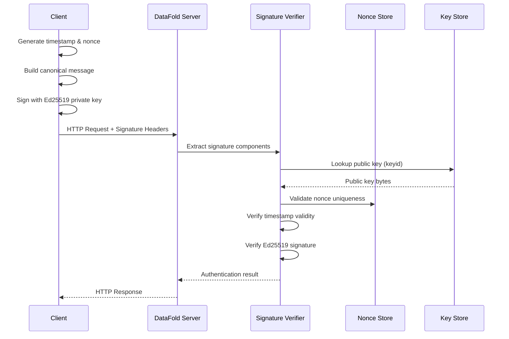
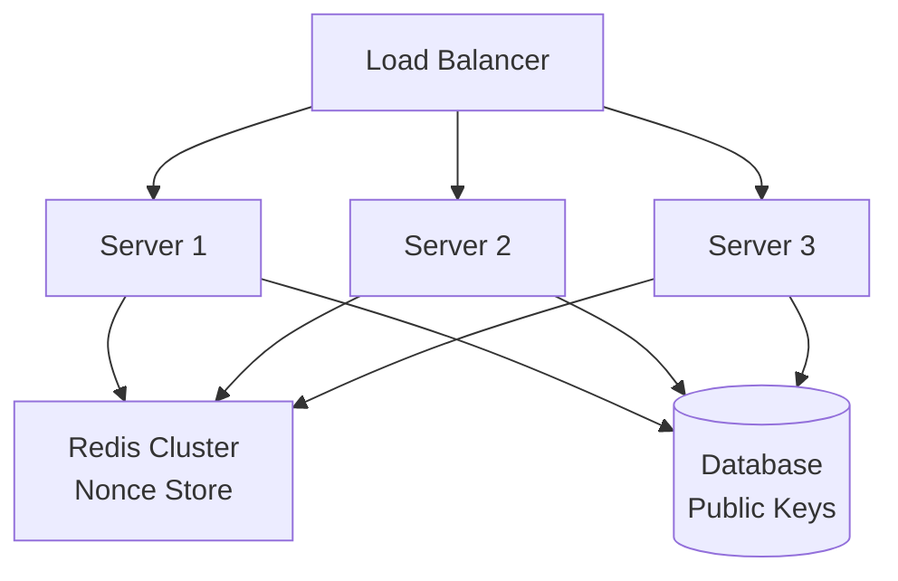

# T11.012 - DataFold Message Signing Protocol Specification

**Task ID:** T11.012  
**Task Name:** Define standardized message signing protocol  
**Date:** June 9, 2025  
**Version:** 1.0  
**Status:** Complete  

## Executive Summary

This document defines the complete standardized message signing protocol for DataFold's authentication system, implementing RFC 9421 HTTP Message Signatures with Ed25519 cryptography. This specification serves as the authoritative reference for all DataFold client and server implementations, ensuring consistent, secure, and interoperable authentication across all platforms.

**Key Protocol Features:**
- **Standards Compliance:** Full RFC 9421 HTTP Message Signatures implementation
- **Cryptography:** Ed25519 signature algorithm for optimal security and performance
- **Replay Protection:** Combined timestamp and nonce validation with configurable time windows
- **Cross-Platform:** Consistent implementation across Rust, JavaScript, Python, and CLI
- **Security Monitoring:** Comprehensive event logging, attack detection, and metrics collection

## Table of Contents

1. [Protocol Overview](#1-protocol-overview)
2. [RFC 9421 Implementation Specification](#2-rfc-9421-implementation-specification)
3. [Message Format Standards](#3-message-format-standards)
4. [Security Requirements](#4-security-requirements)
5. [Cryptographic Implementation](#5-cryptographic-implementation)
6. [Replay Protection Mechanisms](#6-replay-protection-mechanisms)
7. [Error Handling and Response Formats](#7-error-handling-and-response-formats)
8. [Cross-Platform Implementation Guidelines](#8-cross-platform-implementation-guidelines)
9. [Server Configuration Standards](#9-server-configuration-standards)
10. [Client Library Integration](#10-client-library-integration)
11. [Performance and Scalability Requirements](#11-performance-and-scalability-requirements)
12. [Security Monitoring and Logging](#12-security-monitoring-and-logging)
13. [Testing and Validation Requirements](#13-testing-and-validation-requirements)
14. [Compliance and Interoperability](#14-compliance-and-interoperability)

## 1. Protocol Overview

### 1.1 Authentication Flow

DataFold's message signing protocol implements a stateless authentication mechanism where each HTTP request is cryptographically signed by the client and verified by the server.



### 1.2 Protocol Components

| Component | Purpose | Implementation |
|-----------|---------|----------------|
| **Signature-Input Header** | Specifies signed components and parameters | RFC 9421 compliant format |
| **Signature Header** | Contains base64-encoded Ed25519 signature | Binary signature in base64 |
| **Content-Digest** | SHA-256 hash of request body | RFC 9530 compliant |
| **Timestamp Validation** | Replay prevention via time windows | Unix timestamp with configurable tolerance |
| **Nonce Validation** | Replay prevention via uniqueness | UUID4 format with TTL storage |
| **Key Management** | Public key lookup and validation | Client ID to public key mapping |

### 1.3 Security Guarantees

- **Message Integrity:** Cryptographic verification prevents tampering
- **Authentication:** Ed25519 signatures prove sender identity
- **Replay Protection:** Timestamp + nonce prevents request reuse
- **Non-repudiation:** Cryptographic signatures provide proof of origin
- **Forward Security:** Time-bounded signatures limit exposure window

## 2. RFC 9421 Implementation Specification

### 2.1 Signature Components

DataFold implements RFC 9421 with the following required and optional components:

#### 2.1.1 Required Components (Always Signed)

```http
"@method"        - HTTP method (GET, POST, PUT, DELETE, etc.)
"@target-uri"    - Complete request URI including query parameters
"content-type"   - MIME type of request body
"content-digest" - SHA-256 hash of request body (if present)
```

**Rationale:** These components ensure complete request integrity and prevent:
- Method substitution attacks
- URI manipulation
- Content type confusion attacks
- Request body tampering

#### 2.1.2 Optional Components (Conditionally Signed)

```http
"authorization"  - Include if Bearer token present (defense in depth)
"@authority"     - Host header value (redundant with @target-uri)
"@path"          - Path component only (subset of @target-uri)
"@query"         - Query parameters only (subset of @target-uri)
"date"           - HTTP Date header (supplementary to created parameter)
```

#### 2.1.3 DataFold Custom Headers

```http
"x-datafold-client-id"  - Client identification
"x-datafold-user-id"    - User identification (if applicable)
"x-datafold-metadata"   - Application-specific metadata
```

### 2.2 Signature Parameters

#### 2.2.1 Required Parameters

| Parameter | Format | Purpose | Example |
|-----------|--------|---------|---------|
| `alg` | String | Signature algorithm identifier | `"ed25519"` |
| `keyid` | String | Public key identifier | `"client-123-v1"` |
| `created` | Integer | Unix timestamp of signature creation | `1618884473` |

#### 2.2.2 Optional Parameters

| Parameter | Format | Purpose | Example |
|-----------|--------|---------|---------|
| `nonce` | String | Unique value for replay protection | `"550e8400e29b41d4a716446655440000"` |
| `expires` | Integer | Signature expiration timestamp | `1618884773` |
| `tag` | String | Application-specific metadata | `"datafold-v1.0"` |

### 2.3 Canonicalization Process

#### 2.3.1 Signature Base Construction

The signature base is constructed according to RFC 9421 specifications:

```
"@method": POST
"@target-uri": https://api.datafold.com/v1/schemas
"content-type": application/json
"content-digest": sha-256=:X48E9qOokqqrvdts8nOJRJN3OWDUoyWxBf7kbu9DBPE=:
"@signature-params": ("@method" "@target-uri" "content-type" "content-digest");created=1618884473;nonce="550e8400e29b41d4a716446655440000";keyid="client-123-v1";alg="ed25519"
```

#### 2.3.2 Component Value Extraction Rules

- **Derived Components:** Values extracted from HTTP request structure
- **Header Components:** Values from HTTP headers (case-insensitive)
- **Normalization:** Trim whitespace, handle multiple values per RFC 9421
- **Encoding:** UTF-8 encoding for all text values

## 3. Message Format Standards

### 3.1 HTTP Header Formats

#### 3.1.1 Signature-Input Header

**Standard Format:**
```http
Signature-Input: datafold=("@method" "@target-uri" "content-type" "content-digest");created=1618884473;nonce="550e8400e29b41d4a716446655440000";keyid="client-123-v1";alg="ed25519"
```

**Parsing Rules:**
- Component list enclosed in parentheses with double quotes
- Parameters separated by semicolons
- Parameter values quoted if containing special characters
- Order of components and parameters must be preserved

#### 3.1.2 Signature Header

**Standard Format:**
```http
Signature: datafold=:iP8QqVo8mfq7UQWMxVYuEl5HPgQrydV7F+Gv2jA8O7N7vCN9WOPbVjFnvUjNh8QXi2Hm2cTEfqEi3JqOgRDnlJ8w=:
```

**Encoding Rules:**
- Signature identifier must match Signature-Input identifier
- Base64 encoding of binary Ed25519 signature (64 bytes)
- Wrapped with colons (`:signature:`) per RFC 9421
- No line breaks or whitespace within signature value

#### 3.1.3 Content-Digest Header

**Standard Format:**
```http
Content-Digest: sha-256=:X48E9qOokqqrvdts8nOJRJN3OWDUoyWxBf7kbu9DBPE=:
```

**Calculation Process:**
1. Calculate SHA-256 hash of raw request body bytes
2. Encode hash as base64
3. Wrap with colons and algorithm identifier
4. Include in signed components as `"content-digest"`

### 3.2 Error Response Formats

#### 3.2.1 Authentication Failure Response

```json
{
  "error": {
    "type": "authentication_failure",
    "message": "Signature verification failed",
    "correlation_id": "req_123456789",
    "timestamp": "2025-06-09T23:27:09Z",
    "details": {
      "error_code": "SIGNATURE_VERIFICATION_FAILED",
      "component": "signature_verifier"
    }
  }
}
```

#### 3.2.2 Rate Limit Exceeded Response

```json
{
  "error": {
    "type": "rate_limit_exceeded",
    "message": "Too many requests",
    "correlation_id": "req_123456789",
    "timestamp": "2025-06-09T23:27:09Z",
    "details": {
      "retry_after": 60,
      "limit": 100,
      "window": 60
    }
  }
}
```

#### 3.2.3 HTTP Status Code Mapping

| Error Type | HTTP Status | Description |
|------------|-------------|-------------|
| Missing Headers | 400 Bad Request | Required signature headers missing |
| Invalid Format | 400 Bad Request | Malformed signature or headers |
| Signature Failed | 401 Unauthorized | Cryptographic verification failed |
| Timestamp Invalid | 401 Unauthorized | Request outside time window |
| Nonce Reused | 401 Unauthorized | Replay attempt detected |
| Key Not Found | 401 Unauthorized | Public key lookup failed |
| Rate Limited | 429 Too Many Requests | Client exceeded rate limits |
| Config Error | 500 Internal Server Error | Server configuration issue |

## 4. Security Requirements

### 4.1 Cryptographic Requirements

#### 4.1.1 Ed25519 Implementation Standards

- **Algorithm:** Ed25519 (Edwards-curve Digital Signature Algorithm)
- **Key Size:** 32-byte private keys, 32-byte public keys
- **Signature Size:** 64-byte signatures
- **Hash Function:** SHA-512 (internal to Ed25519)
- **Curve:** Curve25519 Edwards curve
- **Security Level:** 128-bit security equivalent

#### 4.1.2 Required Cryptographic Properties

- **Constant-time Implementation:** Prevents timing attacks
- **Deterministic Signatures:** Same message+key produces same signature
- **Canonical Encoding:** All keys and signatures use canonical representation
- **Side-channel Resistance:** Implementation must resist power/timing analysis

### 4.2 Time Window Configuration

#### 4.2.1 Security Profiles

**Strict Profile (High Security Environments):**
```yaml
time_validation:
  allowed_window_secs: 60        # 1 minute window
  clock_skew_tolerance_secs: 5   # 5 seconds tolerance
  max_future_timestamp_secs: 10  # 10 seconds future tolerance
  enforce_rfc3339_timestamps: true
```

**Standard Profile (Default Production):**
```yaml
time_validation:
  allowed_window_secs: 300       # 5 minute window
  clock_skew_tolerance_secs: 30  # 30 seconds tolerance
  max_future_timestamp_secs: 60  # 1 minute future tolerance
  enforce_rfc3339_timestamps: true
```

**Lenient Profile (Development/Testing):**
```yaml
time_validation:
  allowed_window_secs: 600       # 10 minute window
  clock_skew_tolerance_secs: 120 # 2 minutes tolerance
  max_future_timestamp_secs: 300 # 5 minutes future tolerance
  enforce_rfc3339_timestamps: false
```

#### 4.2.2 Timestamp Validation Logic

```rust
fn validate_timestamp(created: u64, config: &SecurityConfig) -> Result<(), AuthError> {
    let now = current_unix_timestamp();
    let effective_window = config.allowed_window_secs + config.clock_skew_tolerance_secs;
    
    // Check future timestamp limit
    if created > now + config.max_future_timestamp_secs {
        return Err(AuthError::FutureTimestamp);
    }
    
    // Check expiration
    if now - created > effective_window {
        return Err(AuthError::ExpiredTimestamp);
    }
    
    Ok(())
}
```

### 4.3 Nonce Requirements

#### 4.3.1 Format Specification

- **Format:** UUID4 (RFC 4122)
- **Encoding:** Hexadecimal without dashes for HTTP headers
- **Length:** 32 characters (128 bits)
- **Generation:** Cryptographically secure random number generator
- **Example:** `"550e8400e29b41d4a716446655440000"`

#### 4.3.2 Storage Requirements

```yaml
nonce_storage:
  format: "uuid4"
  ttl_seconds: 360              # 6 minutes (window + tolerance + margin)
  max_store_size: 10000         # Maximum nonces in memory
  cleanup_interval: 60          # Cleanup every 60 seconds
  backend: "memory"             # or "redis" for distributed systems
```

#### 4.3.3 Validation Process

1. **Format Validation:** Verify UUID4 format compliance
2. **Uniqueness Check:** Ensure nonce not previously used
3. **Storage:** Store nonce with TTL expiration
4. **Cleanup:** Automatic removal of expired nonces

## 5. Cryptographic Implementation

### 5.1 Ed25519 Library Requirements

#### 5.1.1 Rust Implementation

**Required Library:** `ed25519-dalek`
```toml
[dependencies]
ed25519-dalek = "2.0"
```

**Key Generation:**
```rust
use ed25519_dalek::{SigningKey, VerifyingKey, Signature, Signer, Verifier};
use rand::rngs::OsRng;

// Generate keypair
let signing_key = SigningKey::generate(&mut OsRng);
let verifying_key = signing_key.verifying_key();

// Sign message
let signature = signing_key.sign(message.as_bytes());

// Verify signature
verifying_key.verify(message.as_bytes(), &signature)?;
```

#### 5.1.2 JavaScript Implementation

**Required Library:** `@noble/ed25519`
```json
{
  "dependencies": {
    "@noble/ed25519": "^2.0.0"
  }
}
```

**Request Signing:**
```javascript
import { sign, verify, getPublicKey } from '@noble/ed25519';

// Generate keypair
const privateKey = crypto.getRandomValues(new Uint8Array(32));
const publicKey = await getPublicKey(privateKey);

// Sign message
const signature = await sign(message, privateKey);

// Verify signature
const isValid = await verify(signature, message, publicKey);
```

#### 5.1.3 Python Implementation

**Required Library:** `cryptography`
```python
from cryptography.hazmat.primitives.asymmetric.ed25519 import Ed25519PrivateKey
from cryptography.hazmat.primitives import serialization

# Generate keypair
private_key = Ed25519PrivateKey.generate()
public_key = private_key.public_key()

# Sign message
signature = private_key.sign(message.encode('utf-8'))

# Verify signature
public_key.verify(signature, message.encode('utf-8'))
```

### 5.2 Key Management Standards

#### 5.2.1 Key Identifier Format

```
Pattern: {client-id}-{key-version}
Example: "datafold-client-123-v1"
Constraints:
  - Maximum length: 64 characters
  - Allowed characters: [a-zA-Z0-9-_]
  - Case sensitive
  - Must be unique per client
```

#### 5.2.2 Public Key Storage Format

```json
{
  "registration_id": "reg_123456789",
  "client_id": "datafold-client-123",
  "key_id": "datafold-client-123-v1",
  "public_key": "32-byte-hex-encoded-public-key",
  "algorithm": "ed25519",
  "created_at": "2025-06-09T23:27:09Z",
  "expires_at": "2026-06-09T23:27:09Z",
  "status": "active",
  "metadata": {
    "key_name": "Production Key",
    "client_type": "server",
    "environment": "production"
  }
}
```

## 6. Replay Protection Mechanisms

### 6.1 Combined Timestamp and Nonce Strategy

DataFold implements a dual-layer replay protection mechanism combining timestamp validation with nonce uniqueness checking.

#### 6.1.1 Protection Matrix

| Attack Vector | Timestamp Protection | Nonce Protection | Combined Result |
|---------------|---------------------|------------------|----------------|
| Immediate replay (< 1 second) | ❌ | ✅ | ✅ Protected |
| Short-term replay (< 5 minutes) | ❌ | ✅ | ✅ Protected |
| Long-term replay (> 5 minutes) | ✅ | ❌* | ✅ Protected |
| Collision attack | ❌ | ❌** | ✅ Protected |

*Nonces expire after TTL  
**Negligible probability with UUID4

#### 6.1.2 Implementation Algorithm

```rust
async fn validate_replay_protection(
    timestamp: u64,
    nonce: &str,
    config: &SecurityConfig,
    nonce_store: &NonceStore
) -> Result<(), AuthError> {
    // Step 1: Validate timestamp
    validate_timestamp(timestamp, config)?;
    
    // Step 2: Check nonce format
    validate_nonce_format(nonce, config)?;
    
    // Step 3: Check nonce uniqueness and store
    nonce_store.check_and_store(nonce, timestamp, config.nonce_ttl_secs)?;
    
    Ok(())
}
```

### 6.2 Nonce Store Implementation

#### 6.2.1 In-Memory Store (Single Server)

```rust
pub struct NonceStore {
    nonces: HashMap<String, u64>,  // nonce -> created_timestamp
    max_size: usize,
    ttl_secs: u64,
}

impl NonceStore {
    pub fn check_and_store(&mut self, nonce: &str, created: u64) -> Result<(), AuthError> {
        // Check if nonce already exists
        if self.nonces.contains_key(nonce) {
            return Err(AuthError::NonceReused);
        }
        
        // Cleanup expired nonces
        self.cleanup_expired(created);
        
        // Enforce size limits
        self.enforce_size_limit();
        
        // Store nonce
        self.nonces.insert(nonce.to_string(), created);
        
        Ok(())
    }
}
```

#### 6.2.2 Distributed Store (Redis)

```rust
async fn check_and_store_nonce_redis(
    nonce: &str,
    redis_client: &RedisClient,
    ttl_secs: u64
) -> Result<(), AuthError> {
    let key = format!("nonce:{}", nonce);
    
    // Use Redis SET with NX (only if not exists) and EX (expiration)
    let result: Option<String> = redis_client
        .set_options(&key, "used", SetOptions::default()
            .with_expiration(SetExpiry::EX(ttl_secs))
            .if_not_exists())
        .await?;
    
    match result {
        Some(_) => Ok(()),  // Successfully stored (nonce was unique)
        None => Err(AuthError::NonceReused),  // Key already existed
    }
}
```

### 6.3 Performance Considerations

#### 6.3.1 Nonce Store Scaling

```yaml
performance_targets:
  nonce_validation_latency: "<10ms p99"
  memory_usage: "<200MB for 10k requests/min"
  cleanup_efficiency: "O(1) amortized"
  storage_backend: "redis_cluster"  # for horizontal scaling
```

#### 6.3.2 Optimization Strategies

- **Bloom Filter Pre-check:** Fast negative lookups for non-existent nonces
- **Partitioned Storage:** Distribute nonces across multiple storage backends
- **Lazy Cleanup:** Background cleanup processes for expired nonces
- **Connection Pooling:** Reuse Redis connections for better performance

## 7. Error Handling and Response Formats

### 7.1 Error Classification

DataFold implements a comprehensive error classification system for precise error handling and security monitoring.

#### 7.1.1 Error Type Hierarchy

```rust
pub enum AuthenticationError {
    // Client errors (4xx)
    MissingHeaders { missing: Vec<String>, correlation_id: String },
    InvalidSignatureFormat { reason: String, correlation_id: String },
    UnsupportedAlgorithm { algorithm: String, correlation_id: String },
    
    // Authentication errors (401)
    SignatureVerificationFailed { key_id: String, correlation_id: String },
    TimestampValidationFailed { 
        timestamp: u64, 
        current_time: u64, 
        reason: String, 
        correlation_id: String 
    },
    NonceValidationFailed { nonce: String, reason: String, correlation_id: String },
    PublicKeyLookupFailed { key_id: String, correlation_id: String },
    
    // Rate limiting (429)
    RateLimitExceeded { client_id: String, correlation_id: String },
    
    // Server errors (5xx)
    ConfigurationError { reason: String, correlation_id: String },
}
```

#### 7.1.2 Error Severity Mapping

```rust
impl AuthenticationError {
    pub fn severity(&self) -> SecurityEventSeverity {
        match self {
            Self::MissingHeaders { .. } => SecurityEventSeverity::Info,
            Self::InvalidSignatureFormat { .. } => SecurityEventSeverity::Warn,
            Self::SignatureVerificationFailed { .. } => SecurityEventSeverity::Warn,
            Self::TimestampValidationFailed { .. } => SecurityEventSeverity::Warn,
            Self::NonceValidationFailed { .. } => SecurityEventSeverity::Critical,  // Replay attempt
            Self::RateLimitExceeded { .. } => SecurityEventSeverity::Critical,
            Self::ConfigurationError { .. } => SecurityEventSeverity::Critical,
            _ => SecurityEventSeverity::Warn,
        }
    }
}
```

### 7.2 Response Format Standards

#### 7.2.1 Success Response

```json
{
  "status": "success",
  "correlation_id": "req_123456789",
  "timestamp": "2025-06-09T23:27:09Z",
  "data": {
    // ... application response data
  }
}
```

#### 7.2.2 Error Response Structure

```json
{
  "error": {
    "type": "authentication_failure",
    "message": "Public error message",
    "correlation_id": "req_123456789", 
    "timestamp": "2025-06-09T23:27:09Z",
    "details": {
      "error_code": "SIGNATURE_VERIFICATION_FAILED",
      "component": "signature_verifier",
      "retry_after": null,
      "documentation_url": "https://docs.datafold.com/api/authentication#errors"
    }
  }
}
```

### 7.3 Security-Conscious Error Handling

#### 7.3.1 Information Disclosure Prevention

- **Public Messages:** Generic error messages for external consumption
- **Detailed Logging:** Complete error details in server logs only
- **Correlation IDs:** Enable debugging without exposing sensitive information
- **Consistent Timing:** Prevent timing-based attacks through response delays

#### 7.3.2 Error Message Sanitization

```rust
impl AuthenticationError {
    pub fn public_message(&self) -> String {
        match self {
            Self::SignatureVerificationFailed { .. } => "Authentication failed".to_string(),
            Self::NonceValidationFailed { .. } => "Request validation failed".to_string(),
            Self::PublicKeyLookupFailed { .. } => "Authentication failed".to_string(),
            // Generic messages prevent information leakage
            _ => "Request could not be processed".to_string(),
        }
    }
}
```

## 8. Cross-Platform Implementation Guidelines

### 8.1 Rust Server Implementation

#### 8.1.1 Middleware Integration

```rust
use actix_web::{dev::ServiceRequest, HttpMessage, Result as ActixResult};
use crate::datafold_node::signature_auth::{SignatureVerificationMiddleware, SignatureAuthConfig};

// Configure signature verification middleware
let auth_config = SignatureAuthConfig::default();
let signature_middleware = SignatureVerificationMiddleware::try_new(auth_config)?;

// Apply to HTTP server
HttpServer::new(move || {
    App::new()
        .wrap(signature_middleware.clone())
        .route("/api/schemas", web::post().to(create_schema))
})
```

#### 8.1.2 Configuration Management

```rust
#[derive(Debug, Clone, Serialize, Deserialize)]
pub struct ServerConfig {
    pub signature_auth: SignatureAuthConfig,
    pub rate_limiting: RateLimitingConfig,
    pub security_logging: SecurityLoggingConfig,
}

impl ServerConfig {
    pub fn from_file(path: &Path) -> Result<Self, ConfigError> {
        let contents = std::fs::read_to_string(path)?;
        let config: Self = toml::from_str(&contents)?;
        config.validate()?;
        Ok(config)
    }
}
```

### 8.2 JavaScript SDK Implementation

#### 8.2.1 Request Signing Class

```javascript
import { sign, getPublicKey } from '@noble/ed25519';
import { createHash } from 'crypto';

export class DataFoldRequestSigner {
    constructor(privateKey, clientId, options = {}) {
        this.privateKey = privateKey;
        this.clientId = clientId;
        this.options = {
            includeTimestamp: true,
            includeNonce: true,
            algorithm: 'ed25519',
            ...options
        };
    }

    async signRequest(method, url, headers = {}, body = null) {
        // Build signature components
        const components = ['@method', '@target-uri'];
        
        if (body) {
            headers['content-type'] = headers['content-type'] || 'application/json';
            headers['content-digest'] = this.calculateContentDigest(body);
            components.push('content-type', 'content-digest');
        }

        // Build signature parameters
        const params = {
            alg: this.options.algorithm,
            keyid: this.clientId
        };

        if (this.options.includeTimestamp) {
            params.created = Math.floor(Date.now() / 1000);
        }

        if (this.options.includeNonce) {
            params.nonce = this.generateNonce();
        }

        // Build canonical string
        const canonicalString = this.buildCanonicalString(method, url, headers, components, params);
        
        // Sign
        const signature = await sign(canonicalString, this.privateKey);
        
        // Add headers
        headers['signature-input'] = this.buildSignatureInput(components, params);
        headers['signature'] = `datafold=:${Buffer.from(signature).toString('base64')}:`;
        
        return headers;
    }

    calculateContentDigest(body) {
        const hash = createHash('sha256');
        hash.update(typeof body === 'string' ? body : JSON.stringify(body));
        return `sha-256=:${hash.digest('base64')}:`;
    }

    generateNonce() {
        return crypto.randomUUID().replace(/-/g, '');
    }
}
```

#### 8.2.2 HTTP Client Integration

```javascript
import axios from 'axios';
import { DataFoldRequestSigner } from './signer';

export class DataFoldClient {
    constructor(baseURL, privateKey, clientId) {
        this.baseURL = baseURL;
        this.signer = new DataFoldRequestSigner(privateKey, clientId);
        
        this.client = axios.create({
            baseURL,
            timeout: 10000,
        });

        // Add request interceptor for signing
        this.client.interceptors.request.use(async (config) => {
            const signedHeaders = await this.signer.signRequest(
                config.method.toUpperCase(),
                `${this.baseURL}${config.url}`,
                config.headers,
                config.data
            );
            
            config.headers = { ...config.headers, ...signedHeaders };
            return config;
        });
    }

    async createSchema(schema) {
        return this.client.post('/api/schemas', schema);
    }
}
```

### 8.3 Python SDK Implementation

#### 8.3.1 Request Signer Class

```python
import hashlib
import base64
import time
import uuid
from typing import Dict, List, Optional, Tuple
from cryptography.hazmat.primitives.asymmetric.ed25519 import Ed25519PrivateKey
from urllib.parse import urlparse

class DataFoldRequestSigner:
    def __init__(self, private_key: Ed25519PrivateKey, client_id: str, **options):
        self.private_key = private_key
        self.client_id = client_id
        self.include_timestamp = options.get('include_timestamp', True)
        self.include_nonce = options.get('include_nonce', True)
        self.algorithm = options.get('algorithm', 'ed25519')

    def sign_request(self, method: str, url: str, headers: Dict[str, str] = None, 
                    body: bytes = None) -> Dict[str, str]:
        """Sign an HTTP request and return signature headers."""
        headers = headers or {}
        
        # Build signature components
        components = ['@method', '@target-uri']
        
        if body is not None:
            if 'content-type' not in headers:
                headers['content-type'] = 'application/json'
            headers['content-digest'] = self._calculate_content_digest(body)
            components.extend(['content-type', 'content-digest'])

        # Build signature parameters
        params = {
            'alg': self.algorithm,
            'keyid': self.client_id
        }

        if self.include_timestamp:
            params['created'] = str(int(time.time()))

        if self.include_nonce:
            params['nonce'] = uuid.uuid4().hex

        # Build canonical string
        canonical_string = self._build_canonical_string(method, url, headers, components, params)
        
        # Sign
        signature = self.private_key.sign(canonical_string.encode('utf-8'))
        
        # Build signature headers
        signature_headers = {
            'signature-input': self._build_signature_input(components, params),
            'signature': f'datafold=:{base64.b64encode(signature).decode("ascii")}:'
        }
        
        return signature_headers

    def _calculate_content_digest(self, body: bytes) -> str:
        """Calculate SHA-256 content digest."""
        hash_obj = hashlib.sha256(body)
        digest = base64.b64encode(hash_obj.digest()).decode('ascii')
        return f'sha-256=:{digest}:'
```

#### 8.3.2 HTTP Client Integration

```python
import requests
import json
from typing import Optional

class DataFoldClient:
    def __init__(self, base_url: str, private_key: Ed25519PrivateKey, client_id: str):
        self.base_url = base_url.rstrip('/')
        self.signer = DataFoldRequestSigner(private_key, client_id)
        self.session = requests.Session()
        self.session.timeout = 10

    def _make_request(self, method: str, endpoint: str, data: Optional[dict] = None, 
                     **kwargs) -> requests.Response:
        """Make a signed HTTP request."""
        url = f"{self.base_url}{endpoint}"
        headers = kwargs.get('headers', {})
        
        # Prepare body
        body = None
        if data is not None:
            body = json.dumps(data).encode('utf-8')
            headers['content-type'] = 'application/json'

        # Sign request
        signature_headers = self.signer.sign_request(method, url, headers, body)
        headers.update(signature_headers)

        # Make request
        return self.session.request(method, url, data=body, headers=headers, **kwargs)

    def create_schema(self, schema: dict) -> dict:
        """Create a new schema."""
        response = self._make_request('POST', '/api/schemas', data=schema)
        response.raise_for_status()
        return response.json()
```

### 8.4 CLI Implementation

#### 8.4.1 Error Handling and User Experience

```rust
// src/cli/error.rs
use thiserror::Error;

#[derive(Error, Debug)]
pub enum CliError {
    #[error("Authentication failed: {0}")]
    AuthenticationFailed(String),
    
    #[error("Configuration error: {0}")]
    ConfigurationError(String),
    
    #[error("Network error: {0}")]
    NetworkError(String),
    
    #[error("File system error: {0}")]
    FileSystemError(#[from] std::io::Error),
    
    #[error("JSON parsing error: {0}")]
    JsonError(#[from] serde_json::Error),
    
    #[error("Rate limited: {0}. Retry after {1} seconds")]
    RateLimited(String, u64),
}

impl CliError {
    pub fn user_friendly_message(&self) -> String {
        match self {
            Self::AuthenticationFailed(msg) => {
                format!("❌ Authentication failed: {}\n💡 Try: datafold auth status", msg)
            }
            Self::ConfigurationError(msg) => {
                format!("⚙️  Configuration error: {}\n💡 Try: datafold auth setup", msg)
            }
            Self::NetworkError(msg) => {
                format!("🌐 Network error: {}\n💡 Check your internet connection", msg)
            }
            _ => format!("❌ {}", self),
        }
    }
}
```

## 9. Server Configuration Standards

### 9.1 Configuration File Format

DataFold uses TOML format for server configuration with comprehensive validation.

#### 9.1.1 Complete Configuration Example

```toml
# /etc/datafold/server.toml

[signature_auth]
enabled = true
security_profile = "standard"  # "strict", "standard", "lenient"

# Time validation settings
allowed_time_window_secs = 300
clock_skew_tolerance_secs = 30
max_future_timestamp_secs = 60

# Nonce validation settings  
nonce_ttl_secs = 360
max_nonce_store_size = 10000
require_uuid4_nonces = true

# Required signature components
required_signature_components = [
    "@method",
    "@target-uri", 
    "content-type",
    "content-digest"
]

[signature_auth.security_logging]
enabled = true
include_correlation_ids = true
include_client_info = true
include_performance_metrics = true
log_successful_auth = false  # Log only failures for performance
min_severity = "info"
max_log_entry_size = 8192

[signature_auth.rate_limiting]
enabled = true
max_requests_per_window = 100
window_size_secs = 60
track_failures_separately = true
max_failures_per_window = 10

[signature_auth.attack_detection]
enabled = true
brute_force_threshold = 5
brute_force_window_secs = 300
replay_threshold = 3
enable_timing_protection = true
base_response_delay_ms = 100

[signature_auth.response_security]
include_security_headers = true
consistent_timing = true
detailed_error_messages = false  # Disable in production
include_correlation_id = true
```

### 9.2 Runtime Configuration Management

#### 9.2.1 Configuration Validation

```rust
impl SignatureAuthConfig {
    pub fn validate(&self) -> Result<(), ConfigError> {
        // Validate time windows
        if self.allowed_time_window_secs == 0 {
            return Err(ConfigError::InvalidValue("allowed_time_window_secs must be > 0"));
        }

        if self.clock_skew_tolerance_secs > self.allowed_time_window_secs {
            return Err(ConfigError::InvalidValue("clock_skew_tolerance cannot exceed time window"));
        }

        // Validate signature components
        if self.required_signature_components.is_empty() {
            return Err(ConfigError::InvalidValue("required_signature_components cannot be empty"));
        }

        Ok(())
    }
}
```

## 10. Client Library Integration

### 10.1 SDK Design Principles

#### 10.1.1 Consistent API Across Languages

All DataFold SDKs implement a consistent interface pattern:

```
Client Creation → Authentication Setup → Request Signing → Error Handling
```

**Common Interface Elements:**
- **Constructor:** Accept private key, client ID, and configuration options
- **Request Signing:** Automatic signing of all HTTP requests
- **Error Handling:** Consistent error types and retry logic
- **Configuration:** Support for different security profiles

## 11. Performance and Scalability Requirements

### 11.1 Performance Targets

#### 11.1.1 Latency Requirements

| Operation | Target Latency | Maximum Latency | Measurement |
|-----------|----------------|------------------|-------------|
| Signature Verification | <1ms p95 | <5ms p99 | Server-side processing |
| Nonce Validation | <0.5ms p95 | <2ms p99 | Cache lookup time |
| Public Key Lookup | <0.1ms p95 | <1ms p99 | Database query time |
| Complete Authentication | <2ms p95 | <10ms p99 | End-to-end processing |

#### 11.1.2 Throughput Requirements

```yaml
scalability_targets:
  requests_per_second: 50000      # Single server target
  concurrent_connections: 10000   # Maximum simultaneous connections
  memory_per_request: 100KB       # Memory overhead per request
  cpu_per_verification: 0.1ms     # CPU time per signature verification
```

### 11.2 Scaling Architecture

#### 11.2.1 Horizontal Scaling



**Scaling Considerations:**
- **Stateless Servers:** No server-side session state enables horizontal scaling
- **Shared Nonce Store:** Redis cluster for distributed nonce validation
- **Public Key Caching:** LRU cache per server with Redis backup
- **Rate Limiting:** Distributed rate limiting across server instances

#### 11.2.2 Performance Optimization Strategies

```rust
// Async signature verification for non-blocking processing
pub async fn verify_signature_async(
    signature_data: SignatureData,
    public_key: VerifyingKey
) -> Result<bool, AuthError> {
    tokio::task::spawn_blocking(move || {
        public_key.verify(signature_data.message.as_bytes(), &signature_data.signature)
            .map(|_| true)
            .map_err(|e| AuthError::SignatureVerificationFailed(e.to_string()))
    }).await?
}

// Public key caching with LRU eviction
pub struct PublicKeyCache {
    cache: Arc<Mutex<LruCache<String, VerifyingKey>>>,
    db_client: DatabaseClient,
}

impl PublicKeyCache {
    pub async fn get_public_key(&self, key_id: &str) -> Result<VerifyingKey, AuthError> {
        // Check cache first
        {
            let mut cache = self.cache.lock().await;
            if let Some(key) = cache.get(key_id) {
                return Ok(key.clone());
            }
        }
        
        // Load from database
        let key = self.db_client.get_public_key(key_id).await?;
        
        // Store in cache
        {
            let mut cache = self.cache.lock().await;
            cache.put(key_id.to_string(), key.clone());
        }
        
        Ok(key)
    }
}
```

### 11.3 Resource Management

#### 11.3.1 Memory Management

```yaml
memory_allocation:
  signature_verification: 100KB   # Per request temporary data
  public_key_cache: 10MB          # 10,000 keys @ ~32 bytes each
  nonce_store: 200MB              # 3.6M nonces @ ~50 bytes each
  connection_pools: 50MB          # Database/Redis connections
  total_overhead: 360MB           # Total authentication overhead
```

#### 11.3.2 Connection Pool Configuration

```rust
pub struct ConnectionPoolConfig {
    pub database_connections: u32,      // 10-20 connections
    pub redis_connections: u32,         // 5-10 connections
    pub max_idle_time: Duration,        // 300 seconds
    pub connection_timeout: Duration,   // 5 seconds
}

impl Default for ConnectionPoolConfig {
    fn default() -> Self {
        Self {
            database_connections: 15,
            redis_connections: 8,
            max_idle_time: Duration::from_secs(300),
            connection_timeout: Duration::from_secs(5),
        }
    }
}
```

### 11.4 Performance Monitoring

#### 11.4.1 Metrics Collection

```rust
pub struct PerformanceMetrics {
    // Latency histograms
    pub signature_verification_duration: Histogram,
    pub nonce_validation_duration: Histogram,
    pub public_key_lookup_duration: Histogram,
    pub total_auth_duration: Histogram,
    
    // Throughput counters
    pub requests_per_second: Gauge,
    pub successful_authentications: Counter,
    pub failed_authentications: Counter,
    
    // Resource utilization
    pub memory_usage: Gauge,
    pub cpu_usage: Gauge,
    pub cache_hit_rate: Gauge,
    pub nonce_store_size: Gauge,
}

impl PerformanceMetrics {
    pub fn record_authentication(&self, success: bool, duration: Duration, cache_hit: bool) {
        // Update latency
        self.total_auth_duration.observe(duration.as_secs_f64());
        
        // Update counters
        if success {
            self.successful_authentications.inc();
        } else {
            self.failed_authentications.inc();
        }
        
        // Update cache metrics
        if cache_hit {
            self.cache_hit_rate.set(self.calculate_cache_hit_rate());
        }
    }
}
```

#### 11.4.2 Performance Alerting

```yaml
alerting_rules:
  high_latency:
    metric: "auth_total_duration_p99"
    threshold: 10ms
    duration: 1m
    severity: warning
  
  low_throughput:
    metric: "auth_requests_per_second"
    threshold: 1000
    duration: 2m
    severity: warning
  
  high_error_rate:
    metric: "auth_error_rate"
    threshold: 0.05  # 5% error rate
    duration: 30s
    severity: critical
```

## 12. Security Monitoring and Logging

### 12.1 Security Event Framework

#### 12.1.1 Event Classification

```rust
#[derive(Debug, Clone, Serialize, Deserialize)]
pub enum SecurityEventType {
    AuthenticationSuccess {
        client_id: String,
        processing_time_ms: u64,
    },
    AuthenticationFailure {
        error_type: AuthenticationError,
        client_info: ClientInfo,
        attack_indicators: Vec<AttackIndicator>,
    },
    ReplayAttempt {
        nonce: String,
        timestamp: u64,
        client_info: ClientInfo,
        original_request_time: Option<u64>,
    },
    RateLimitExceeded {
        client_id: String,
        request_count: usize,
        time_window: u64,
        limit_type: RateLimitType,
    },
    SuspiciousActivity {
        pattern_type: AttackPatternType,
        confidence_score: f64,
        client_info: ClientInfo,
        evidence: Vec<String>,
    },
    ConfigurationError {
        component: String,
        error_message: String,
        severity: ConfigErrorSeverity,
    },
}

#[derive(Debug, Clone, Serialize, Deserialize)]
pub enum AttackIndicator {
    BruteForcePattern,
    TimingAnomalies,
    UnusualRequestPattern,
    GeoLocationAnomaly,
    UserAgentAnomaly,
}
```

#### 12.1.2 Structured Logging Format

```json
{
  "timestamp": "2025-06-09T23:27:09.123Z",
  "level": "WARN",
  "component": "signature_auth",
  "event_type": "authentication_failure",
  "correlation_id": "req_123456789",
  "security_event": {
    "event_id": "sec_987654321",
    "severity": "warn",
    "client_info": {
      "ip_address": "192.168.1.100",
      "user_agent": "DataFold-CLI/1.0.0",
      "key_id": "client-123-v1",
      "forwarded_for": null
    },
    "request_info": {
      "method": "POST",
      "path": "/api/schemas",
      "query_params": null,
      "content_type": "application/json",
      "content_length": 1024,
      "signature_components": ["@method", "@target-uri", "content-type", "content-digest"]
    },
    "error_details": {
      "type": "signature_verification_failed",
      "message": "Ed25519 signature verification failed",
      "key_id": "client-123-v1",
      "correlation_id": "req_123456789"
    },
    "metrics": {
      "processing_time_ms": 15,
      "nonce_store_size": 5432,
      "recent_failures": 3,
      "pattern_score": 0.7
    }
  }
}
```

### 12.2 Attack Detection

#### 12.2.1 Brute Force Detection

```rust
pub struct BruteForceDetector {
    failure_tracking: HashMap<String, VecDeque<u64>>,  // client_id -> timestamps
    config: AttackDetectionConfig,
}

impl BruteForceDetector {
    pub fn record_failure(&mut self, client_id: &str, timestamp: u64) -> Option<SuspiciousPattern> {
        let failures = self.failure_tracking
            .entry(client_id.to_string())
            .or_insert_with(VecDeque::new);
        
        failures.push_back(timestamp);
        
        // Clean up old entries
        let cutoff = timestamp - self.config.brute_force_window_secs;
        while failures.front().map_or(false, |&t| t < cutoff) {
            failures.pop_front();
        }
        
        // Check if threshold exceeded
        if failures.len() >= self.config.brute_force_threshold {
            Some(SuspiciousPattern {
                pattern_type: AttackPatternType::BruteForce,
                client_id: client_id.to_string(),
                confidence_score: self.calculate_confidence_score(failures.len()),
                first_seen: *failures.front().unwrap(),
                last_seen: timestamp,
                evidence: vec![
                    format!("{} failures in {} seconds", failures.len(), self.config.brute_force_window_secs)
                ],
            })
        } else {
            None
        }
    }
}
```

#### 12.2.2 Anomaly Detection

```rust
pub struct AnomalyDetector {
    baseline_patterns: HashMap<String, ClientBaseline>,
    config: AnomalyDetectionConfig,
}

#[derive(Debug, Clone)]
pub struct ClientBaseline {
    avg_request_rate: f64,
    typical_request_times: Vec<u8>,  // Hours of day (0-23)
    common_endpoints: HashSet<String>,
    geo_locations: HashSet<String>,
    user_agents: HashSet<String>,
}

impl AnomalyDetector {
    pub fn analyze_request(&mut self, client_info: &ClientInfo, request_info: &RequestInfo) 
        -> Vec<AttackIndicator> {
        let mut indicators = Vec::new();
        
        if let Some(baseline) = self.baseline_patterns.get(&client_info.key_id.as_ref().unwrap_or(&"unknown".to_string())) {
            // Check request rate anomaly
            if self.is_rate_anomaly(client_info, baseline) {
                indicators.push(AttackIndicator::UnusualRequestPattern);
            }
            
            // Check temporal anomaly
            if self.is_temporal_anomaly(request_info, baseline) {
                indicators.push(AttackIndicator::TimingAnomalies);
            }
            
            // Check geo-location anomaly
            if let Some(ip) = &client_info.ip_address {
                if self.is_geo_anomaly(ip, baseline) {
                    indicators.push(AttackIndicator::GeoLocationAnomaly);
                }
            }
            
            // Check user agent anomaly
            if let Some(ua) = &client_info.user_agent {
                if self.is_user_agent_anomaly(ua, baseline) {
                    indicators.push(AttackIndicator::UserAgentAnomaly);
                }
            }
        }
        
        indicators
    }
}
```

### 12.3 Incident Response Integration

#### 12.3.1 Alert Routing

```rust
#[derive(Debug, Clone)]
pub enum AlertSeverity {
    Info,
    Warning,
    Critical,
}

#[derive(Debug, Clone)]
pub struct SecurityAlert {
    pub alert_id: String,
    pub severity: AlertSeverity,
    pub event_type: SecurityEventType,
    pub correlation_id: String,
    pub client_info: ClientInfo,
    pub detected_at: DateTime<Utc>,
    pub recommended_actions: Vec<String>,
}

pub struct IncidentResponseIntegrator {
    alert_channels: Vec<Box<dyn AlertChannel>>,
    escalation_rules: Vec<EscalationRule>,
}

impl IncidentResponseIntegrator {
    pub async fn handle_security_event(&self, event: SecurityEvent) -> Result<(), IntegrationError> {
        let alert = self.create_alert_from_event(event);
        
        // Route based on severity
        match alert.severity {
            AlertSeverity::Critical => {
                // Immediate notification
                self.send_immediate_alert(&alert).await?;
                // Auto-escalate to security team
                self.escalate_to_security_team(&alert).await?;
            }
            AlertSeverity::Warning => {
                // Standard alert routing
                self.send_standard_alert(&alert).await?;
            }
            AlertSeverity::Info => {
                // Log only, no immediate action
                self.log_info_event(&alert).await?;
            }
        }
        
        Ok(())
    }
}
```

#### 12.3.2 Automated Response Actions

```rust
pub struct AutomatedResponseSystem {
    rate_limiter: Arc<RwLock<RateLimiter>>,
    ip_blocklist: Arc<RwLock<IpBlocklist>>,
    config: AutoResponseConfig,
}

impl AutomatedResponseSystem {
    pub async fn respond_to_threat(&self, pattern: SuspiciousPattern) -> Vec<ResponseAction> {
        let mut actions = Vec::new();
        
        match pattern.pattern_type {
            AttackPatternType::BruteForce => {
                if pattern.confidence_score > 0.8 {
                    // Temporary rate limit increase
                    actions.push(ResponseAction::RateLimitClient {
                        client_id: pattern.client_id.clone(),
                        duration: Duration::from_secs(300), // 5 minutes
                        limit: 5, // Very restrictive
                    });
                }
            }
            AttackPatternType::ReplayAttack => {
                // Invalidate nonces from this client
                actions.push(ResponseAction::InvalidateClientNonces {
                    client_id: pattern.client_id.clone(),
                });
            }
            AttackPatternType::DistributedAttack => {
                if pattern.confidence_score > 0.9 {
                    // Temporary IP block
                    actions.push(ResponseAction::BlockIpAddress {
                        ip_address: self.extract_ip_from_pattern(&pattern),
                        duration: Duration::from_secs(600), // 10 minutes
                    });
                }
            }
        }
        
        // Execute actions
        for action in &actions {
            if let Err(e) = self.execute_action(action).await {
                error!("Failed to execute automated response action: {}", e);
            }
        }
        
        actions
    }
}
```

### 12.4 Compliance and Audit Logging

#### 12.4.1 Audit Trail Requirements

```rust
#[derive(Debug, Clone, Serialize, Deserialize)]
pub struct AuditLogEntry {
    pub entry_id: String,
    pub timestamp: DateTime<Utc>,
    pub event_type: AuditEventType,
    pub actor: Actor,
    pub resource: Resource,
    pub action: String,
    pub outcome: AuditOutcome,
    pub details: serde_json::Value,
    pub compliance_tags: Vec<String>,
}

#[derive(Debug, Clone, Serialize, Deserialize)]
pub enum AuditEventType {
    Authentication,
    Authorization,
    DataAccess,
    ConfigurationChange,
    SecurityIncident,
}

#[derive(Debug, Clone, Serialize, Deserialize)]
pub enum AuditOutcome {
    Success,
    Failure { error_code: String, error_message: String },
    Partial { warnings: Vec<String> },
}
```

#### 12.4.2 Compliance Mapping

```yaml
compliance_frameworks:
  soc2_type2:
    controls:
      - CC6.1  # Logical and physical access controls
      - CC6.2  # Prior authorization for access
      - CC6.3  # User access provisioning
    requirements:
      - log_all_authentication_events
      - monitor_privileged_access
      - implement_access_reviews
      
  iso27001:
    controls:
      - A.9.2.1  # User registration
      - A.9.2.2  # User access provisioning
      - A.9.4.2  # Secure log-on procedures
    requirements:
      - access_control_policy
      - authentication_mechanisms
      - audit_logging
      
  pci_dss:
    requirements:
      - "8.2"    # User authentication
      - "10.2"   # Audit logs
      - "10.3"   # Audit log entries
    controls:
      - unique_user_identification
      - strong_authentication
      - comprehensive_logging
```

## 13. Testing and Validation Requirements

### 13.1 Test Categories

#### 13.1.1 Unit Testing Requirements

**Cryptographic Function Tests:**
```rust
#[cfg(test)]
mod crypto_tests {
    use super::*;
    
    #[test]
    fn test_ed25519_signature_verification() {
        let keypair = generate_test_keypair();
        let message = "test message";
        let signature = keypair.sign(message.as_bytes());
        
        assert!(keypair.verify(message.as_bytes(), &signature).is_ok());
        assert!(keypair.verify("wrong message".as_bytes(), &signature).is_err());
    }
    
    #[test]
    fn test_nonce_validation() {
        let mut nonce_store = NonceStore::new();
        let nonce = "550e8400e29b41d4a716446655440000";
        
        // First use should succeed
        assert!(nonce_store.check_and_store(nonce, current_timestamp()).is_ok());
        
        // Second use should fail (replay)
        assert!(nonce_store.check_and_store(nonce, current_timestamp()).is_err());
    }
    
    #[test]
    fn test_timestamp_validation() {
        let config = SignatureAuthConfig::default();
        let now = current_timestamp();
        
        // Current timestamp should be valid
        assert!(validate_timestamp(now, &config).is_ok());
        
        // Old timestamp should be invalid
        assert!(validate_timestamp(now - 400, &config).is_err());
        
        // Future timestamp should be invalid
        assert!(validate_timestamp(now + 100, &config).is_err());
    }
}
```

**RFC 9421 Compliance Tests:**
```rust
#[cfg(test)]
mod rfc9421_tests {
    #[test]
    fn test_canonical_string_construction() {
        let components = vec![
            ("@method", "POST"),
            ("@target-uri", "https://api.example.com/test"),
            ("content-type", "application/json"),
            ("content-digest", "sha-256=:X48E9qOokqqrvdts8nOJRJN3OWDUoyWxBf7kbu9DBPE=:"),
        ];
        
        let canonical = build_canonical_string(&components);
        let expected = concat!(
            "\"@method\": POST\n",
            "\"@target-uri\": https://api.example.com/test\n",
            "\"content-type\": application/json\n",
            "\"content-digest\": sha-256=:X48E9qOokqqrvdts8nOJRJN3OWDUoyWxBf7kbu9DBPE=:\n",
            "\"@signature-params\": (\"@method\" \"@target-uri\" \"content-type\" \"content-digest\");created=1618884473;keyid=\"test-key\";alg=\"ed25519\""
        );
        
        assert_eq!(canonical, expected);
    }
    
    #[test]
    fn test_signature_header_parsing() {
        let header = "datafold=(\"@method\" \"@target-uri\");created=1618884473;keyid=\"test-key\";alg=\"ed25519\"";
        let parsed = parse_signature_input_header(header).unwrap();
        
        assert_eq!(parsed.components.len(), 2);
        assert_eq!(parsed.parameters.get("created"), Some(&"1618884473".to_string()));
        assert_eq!(parsed.parameters.get("keyid"), Some(&"test-key".to_string()));
    }
}
```

#### 13.1.2 Integration Testing Requirements

**End-to-End Authentication Flow:**
```rust
#[tokio::test]
async fn test_complete_authentication_flow() {
    let test_server = start_test_server().await;
    let client = create_test_client();
    
    // Register public key
    let registration_response = client
        .post("/api/crypto/keys/register")
        .json(&registration_request)
        .send()
        .await
        .unwrap();
    assert_eq!(registration_response.status(), 201);
    
    // Make authenticated request
    let signed_request = client
        .post("/api/schemas")
        .json(&schema_data)
        .sign_with_keypair(&test_keypair)
        .send()
        .await
        .unwrap();
    assert_eq!(signed_request.status(), 200);
    
    // Verify replay protection
    let replay_response = client
        .replay_previous_request()
        .send()
        .await
        .unwrap();
    assert_eq!(replay_response.status(), 401);
}
```

**Cross-Platform Compatibility Tests:**
```javascript
// JavaScript SDK test
describe('Cross-platform signature compatibility', () => {
    test('JavaScript signatures verify on Rust server', async () => {
        const signer = new DataFoldRequestSigner(privateKey, clientId);
        const headers = await signer.signRequest('POST', testUrl, {}, testBody);
        
        const response = await fetch(testUrl, {
            method: 'POST',
            headers,
            body: testBody
        });
        
        expect(response.status).toBe(200);
    });
});
```

```python
# Python SDK test
def test_python_signatures_verify_on_rust_server():
    signer = DataFoldRequestSigner(private_key, client_id)
    headers = signer.sign_request('POST', test_url, {}, test_body)
    
    response = requests.post(test_url, headers=headers, data=test_body)
    assert response.status_code == 200
```

#### 13.1.3 Security Testing Requirements

**Penetration Testing:**
```rust
#[tokio::test]
async fn test_replay_attack_prevention() {
    let test_server = start_test_server().await;
    let client = create_test_client();
    
    // Make initial authenticated request
    let request = client.post("/api/schemas").json(&test_data);
    let response1 = request.clone().send().await.unwrap();
    assert_eq!(response1.status(), 200);
    
    // Attempt to replay the exact same request
    let response2 = request.send().await.unwrap();
    assert_eq!(response2.status(), 401); // Should be rejected
    
    // Verify error indicates replay attempt
    let error: serde_json::Value = response2.json().await.unwrap();
    assert_eq!(error["error"]["details"]["error_code"], "NONCE_VALIDATION_FAILED");
}

#[tokio::test]
async fn test_timing_attack_resistance() {
    let test_server = start_test_server().await;
    let client = create_test_client();
    
    // Test with valid vs invalid signatures
    let valid_request_times = measure_response_times(&client, &valid_requests, 100).await;
    let invalid_request_times = measure_response_times(&client, &invalid_requests, 100).await;
    
    // Response times should be consistent regardless of validity
    let timing_difference = (valid_request_times.mean() - invalid_request_times.mean()).abs();
    assert!(timing_difference < 5.0, "Timing difference too large: {}ms", timing_difference);
}
```

**Rate Limiting Tests:**
```rust
#[tokio::test]
async fn test_rate_limiting_enforcement() {
    let test_server = start_test_server_with_rate_limit(5, 60).await; // 5 requests per minute
    let client = create_test_client();
    
    // Make requests up to the limit
    for i in 0..5 {
        let response = client.post("/api/test").send().await.unwrap();
        assert_eq!(response.status(), 200, "Request {} should succeed", i);
    }
    
    // Next request should be rate limited
    let response = client.post("/api/test").send().await.unwrap();
    assert_eq!(response.status(), 429);
    
    let error: serde_json::Value = response.json().await.unwrap();
    assert_eq!(error["error"]["type"], "rate_limit_exceeded");
    assert!(error["error"]["details"]["retry_after"].as_u64().unwrap() > 0);
}
```

#### 13.1.4 Performance Testing Requirements

**Load Testing:**
```rust
#[tokio::test]
async fn test_signature_verification_performance() {
    let test_server = start_test_server().await;
    let num_clients = 100;
    let requests_per_client = 50;
    
    let start_time = Instant::now();
    
    let handles: Vec<_> = (0..num_clients).map(|_| {
        let client = create_test_client();
        tokio::spawn(async move {
            for _ in 0..requests_per_client {
                let response = client.post("/api/test").json(&test_data).send().await.unwrap();
                assert_eq!(response.status(), 200);
            }
        })
    }).collect();
    
    // Wait for all clients to complete
    for handle in handles {
        handle.await.unwrap();
    }
    
    let duration = start_time.elapsed();
    let total_requests = num_clients * requests_per_client;
    let requests_per_second = total_requests as f64 / duration.as_secs_f64();
    
    // Should handle at least 1000 requests/second
    assert!(requests_per_second >= 1000.0,
        "Performance below threshold: {} req/s", requests_per_second);
}
```

**Memory Usage Testing:**
```rust
#[tokio::test]
async fn test_nonce_store_memory_limits() {
    let config = SignatureAuthConfig {
        max_nonce_store_size: 1000,
        nonce_ttl_secs: 3600, // 1 hour
        ..SignatureAuthConfig::default()
    };
    
    let state = SignatureVerificationState::new(config).unwrap();
    
    // Add nonces up to the limit
    for i in 0..1000 {
        let nonce = format!("nonce_{:04}", i);
        assert!(state.check_and_store_nonce(&nonce, current_timestamp()).is_ok());
    }
    
    // Adding more should trigger cleanup and succeed
    let nonce = "nonce_overflow".to_string();
    assert!(state.check_and_store_nonce(&nonce, current_timestamp()).is_ok());
    
    // Verify store size is maintained
    let stats = state.get_nonce_store_stats().unwrap();
    assert!(stats.total_nonces <= 1000);
}
```

### 13.2 Test Vector Specifications

#### 13.2.1 Standard Test Vectors

**RFC 9421 Compliance Test Vector:**
```
Test Case: Basic POST Request
Input:
  Method: POST
  URL: https://api.datafold.com/v1/schemas
  Headers:
    Content-Type: application/json
    Content-Digest: sha-256=:X48E9qOokqqrvdts8nOJRJN3OWDUoyWxBf7kbu9DBPE=:
  Body: {"name":"test_schema","fields":[{"name":"id","type":"string"}]}
  
Signature Parameters:
  created: 1618884473
  nonce: 550e8400e29b41d4a716446655440000
  keyid: test-client-v1
  alg: ed25519

Expected Canonical String:
"@method": POST
"@target-uri": https://api.datafold.com/v1/schemas
"content-type": application/json
"content-digest": sha-256=:X48E9qOokqqrvdts8nOJRJN3OWDUoyWxBf7kbu9DBPE=:
"@signature-params": ("@method" "@target-uri" "content-type" "content-digest");created=1618884473;nonce="550e8400e29b41d4a716446655440000";keyid="test-client-v1";alg="ed25519"

Expected Headers:
Signature-Input: datafold=("@method" "@target-uri" "content-type" "content-digest");created=1618884473;nonce="550e8400e29b41d4a716446655440000";keyid="test-client-v1";alg="ed25519"
Signature: datafold=:MEUCIQDKmahNROWNk6rJu3xHr6fQ1J8QRv6ZcdOCqZfH4lEhzwIgK7Z8+fWE8RTI0KfFBYGlM4nfm7DV6SLtOG4aAzN1N8w=:
```

#### 13.2.2 Edge Case Test Vectors

**Empty Body Request:**
```
Test Case: GET Request with Query Parameters
Input:
  Method: GET
  URL: https://api.datafold.com/v1/schemas?limit=10&offset=0
  Headers:
    Accept: application/json
  Body: (none)

Expected Components: ["@method", "@target-uri"]
Expected Headers:
Signature-Input: datafold=("@method" "@target-uri");created=1618884473;nonce="550e8400e29b41d4a716446655440001";keyid="test-client-v1";alg="ed25519"
Signature: datafold=:[base64-encoded-signature]:
```

**Unicode Content:**
```
Test Case: POST Request with Unicode Content
Input:
  Method: POST
  URL: https://api.datafold.com/v1/schemas
  Headers:
    Content-Type: application/json; charset=utf-8
  Body: {"name":"测试模式","description":"测试用的数据模式"}

Expected: Proper UTF-8 encoding in canonical string
```

### 13.3 Automated Test Suite

#### 13.3.1 Continuous Integration Requirements

```yaml
# .github/workflows/signature-auth-tests.yml
name: Signature Authentication Tests

on: [push, pull_request]

jobs:
  cross-platform-tests:
    runs-on: ubuntu-latest
    strategy:
      matrix:
        language: [rust, javascript, python]
    
    steps:
      - uses: actions/checkout@v3
      
      - name: Setup Test Environment
        run: |
          docker-compose up -d test-server
          ./scripts/setup-test-keys.sh
      
      - name: Run Language-Specific Tests
        run: |
          case ${{ matrix.language }} in
            rust)
              cargo test signature_auth_tests
              ;;
            javascript)
              cd js-sdk && npm test
              ;;
            python)
              cd python-sdk && python -m pytest
              ;;
          esac
      
      - name: Cross-Platform Compatibility Tests
        run: |
          ./scripts/test-cross-platform-signatures.sh ${{ matrix.language }}
          
      - name: Security Tests
        run: |
          ./scripts/run-security-tests.sh
          
      - name: Performance Benchmarks
        run: |
          ./scripts/run-performance-tests.sh

  compliance-tests:
    runs-on: ubuntu-latest
    steps:
      - uses: actions/checkout@v3
      
      - name: RFC 9421 Compliance Tests
        run: |
          ./scripts/test-rfc9421-compliance.sh
          
      - name: Test Vector Validation
        run: |
          ./scripts/validate-test-vectors.sh
```

#### 13.3.2 Test Coverage Requirements

```rust
// Minimum test coverage targets
const TEST_COVERAGE_REQUIREMENTS: &[(&str, f64)] = &[
    ("signature_auth.rs", 95.0),           // Core authentication logic
    ("crypto/ed25519.rs", 90.0),           // Cryptographic functions
    ("cli/auth.rs", 85.0),                 // CLI authentication
    ("error handling", 80.0),              // Error paths
    ("configuration", 75.0),               // Configuration management
];

#[test]
fn test_coverage_requirements() {
    for (module, required_coverage) in TEST_COVERAGE_REQUIREMENTS {
        let actual_coverage = get_module_coverage(module);
        assert!(
            actual_coverage >= *required_coverage,
            "Module {} has {:.1}% coverage, required {:.1}%",
            module, actual_coverage, required_coverage
        );
    }
}
```

### 13.4 Validation Tools

#### 13.4.1 Signature Validation CLI Tool

```bash
#!/bin/bash
# scripts/validate-signature.sh - Signature validation tool

usage() {
    echo "Usage: $0 [options]"
    echo "Options:"
    echo "  -r, --request-file FILE    HTTP request file"
    echo "  -k, --public-key KEY       Public key for verification"
    echo "  -v, --verbose              Verbose output"
    echo "  -h, --help                 Show this help"
}

validate_signature() {
    local request_file="$1"
    local public_key="$2"
    local verbose="$3"
    
    # Extract signature components
    local signature_input=$(grep "Signature-Input:" "$request_file" | cut -d' ' -f2-)
    local signature=$(grep "Signature:" "$request_file" | cut -d' ' -f2-)
    
    if [[ "$verbose" == "true" ]]; then
        echo "Signature-Input: $signature_input"
        echo "Signature: $signature"
    fi
    
    # Call validation binary
    ./target/release/signature-validator \
        --request-file "$request_file" \
        --public-key "$public_key" \
        --signature-input "$signature_input" \
        --signature "$signature"
}
```

#### 13.4.2 Compliance Checker Tool

```rust
// src/bin/compliance_checker.rs
use datafold::datafold_node::signature_auth::*;
use std::fs;
use clap::{App, Arg};

fn main() -> Result<(), Box<dyn std::error::Error>> {
    let matches = App::new("DataFold Signature Compliance Checker")
        .version("1.0")
        .about("Validates RFC 9421 compliance")
        .arg(Arg::with_name("config")
            .short("c")
            .long("config")
            .value_name("FILE")
            .help("Configuration file")
            .required(true))
        .arg(Arg::with_name("test-vectors")
            .short("t")
            .long("test-vectors")
            .value_name("DIR")
            .help("Test vectors directory")
            .required(true))
        .get_matches();

    let config_file = matches.value_of("config").unwrap();
    let test_vectors_dir = matches.value_of("test-vectors").unwrap();
    
    println!("🔍 DataFold Signature Protocol Compliance Checker");
    println!("📁 Config: {}", config_file);
    println!("📂 Test vectors: {}", test_vectors_dir);
    
    // Load configuration
    let config = SignatureAuthConfig::from_file(config_file)?;
    config.validate()?;
    println!("✅ Configuration validation passed");
    
    // Run compliance tests
    run_rfc9421_compliance_tests(&config, test_vectors_dir)?;
    println!("✅ RFC 9421 compliance tests passed");
    
    // Validate test vectors
    validate_test_vectors(test_vectors_dir)?;
    println!("✅ Test vector validation passed");
    
    // Security requirements check
    check_security_requirements(&config)?;
    println!("✅ Security requirements check passed");
    
    println!("🎉 All compliance checks passed!");
    Ok(())
}

fn run_rfc9421_compliance_tests(config: &SignatureAuthConfig, test_dir: &str) -> Result<(), Box<dyn std::error::Error>> {
    let test_files = fs::read_dir(test_dir)?;
    
    for test_file in test_files {
        let path = test_file?.path();
        if path.extension().unwrap_or_default() == "json" {
            println!("  🧪 Testing: {}", path.display());
            
            let test_case: TestCase = serde_json::from_str(&fs::read_to_string(&path)?)?;
            validate_test_case(&test_case, config)?;
        }
    }
    
    Ok(())
}

#[derive(serde::Deserialize)]
struct TestCase {
    name: String,
    request: HttpRequest,
    expected_signature: String,
    expected_canonical_string: String,
    should_pass: bool,
}

fn validate_test_case(test_case: &TestCase, config: &SignatureAuthConfig) -> Result<(), Box<dyn std::error::Error>> {
    // Implementation details for test case validation
    // ...
    Ok(())
}
```

## 14. Compliance and Interoperability

### 14.1 Standards Compliance

#### 14.1.1 RFC 9421 HTTP Message Signatures

**Compliance Status:**
- ✅ **Full Implementation:** DataFold implements complete RFC 9421 specification
- ✅ **Signature Components:** All required and optional components supported
- ✅ **Canonicalization:** Proper signature base construction
- ✅ **Header Formats:** Compliant Signature-Input and Signature headers
- ✅ **Algorithm Support:** Ed25519 algorithm properly integrated

**Compliance Verification:**
```rust
pub fn verify_rfc9421_compliance() -> ComplianceReport {
    let mut report = ComplianceReport::new();
    
    // Test signature component handling
    report.add_test("signature_components", test_signature_components());
    
    // Test canonicalization process
    report.add_test("canonicalization", test_canonicalization_compliance());
    
    // Test header parsing
    report.add_test("header_parsing", test_header_parsing_compliance());
    
    // Test algorithm support
    report.add_test("algorithm_support", test_algorithm_compliance());
    
    report
}

#[derive(Debug)]
pub struct ComplianceReport {
    tests: Vec<ComplianceTest>,
    overall_status: ComplianceStatus,
}

#[derive(Debug)]
pub enum ComplianceStatus {
    FullyCompliant,
    PartiallyCompliant { issues: Vec<String> },
    NonCompliant { critical_issues: Vec<String> },
}
```

#### 14.1.2 RFC 9530 Content-Digest

**Implementation Requirements:**
- ✅ **SHA-256 Algorithm:** Primary digest algorithm
- ✅ **Base64 Encoding:** Proper content digest encoding
- ✅ **Header Format:** RFC 9530 compliant format
- ⚠️ **Multiple Algorithms:** Future enhancement for additional algorithms

**Content-Digest Calculation:**
```rust
pub fn calculate_content_digest(body: &[u8], algorithm: DigestAlgorithm) -> String {
    match algorithm {
        DigestAlgorithm::Sha256 => {
            let hash = sha2::Sha256::digest(body);
            format!("sha-256=:{}", base64::encode(hash))
        }
        DigestAlgorithm::Sha512 => {
            let hash = sha2::Sha512::digest(body);
            format!("sha-512=:{}", base64::encode(hash))
        }
    }
}

#[derive(Debug, Clone)]
pub enum DigestAlgorithm {
    Sha256,
    Sha512,  // Future enhancement
}
```

### 14.2 Cryptographic Standards

#### 14.2.1 Ed25519 Algorithm Compliance

**Standards Adherence:**
- ✅ **RFC 8032:** Ed25519 signature algorithm implementation
- ✅ **FIPS 186-5:** Digital signature standard compliance
- ✅ **Curve25519:** Proper elliptic curve implementation
- ✅ **Constant-time:** Side-channel attack resistance

**Validation Process:**
```rust
pub fn validate_ed25519_implementation() -> CryptoComplianceReport {
    let mut report = CryptoComplianceReport::new();
    
    // Test key generation
    report.add_test("key_generation", test_key_generation_compliance());
    
    // Test signature determinism
    report.add_test("deterministic_signatures", test_signature_determinism());
    
    // Test side-channel resistance
    report.add_test("timing_resistance", test_timing_attack_resistance());
    
    // Test known test vectors
    report.add_test("test_vectors", validate_known_test_vectors());
    
    report
}
```

#### 14.2.2 Key Management Standards

**NIST Guidelines Compliance:**
- ✅ **SP 800-57:** Key management recommendations
- ✅ **SP 800-131A:** Cryptographic algorithm usage
- ✅ **Key Strength:** 128-bit security level minimum
- ✅ **Key Lifecycle:** Proper key rotation support

### 14.3 Interoperability Requirements

#### 14.3.1 Cross-Platform Compatibility

**Platform Support Matrix:**

| Platform | Implementation | Status | Version |
|----------|----------------|--------|---------|
| **Rust Server** | `ed25519-dalek` | ✅ Complete | 2.0+ |
| **JavaScript** | `@noble/ed25519` | ✅ Complete | 2.0+ |
| **Python** | `cryptography` | ✅ Complete | 3.4+ |
| **CLI Tools** | Rust native | ✅ Complete | 1.0+ |
| **Web Browsers** | WebCrypto API | 🔄 Future | - |
| **Mobile (iOS)** | CryptoKit | 🔄 Future | - |
| **Mobile (Android)** | Tink/BoringSSL | 🔄 Future | - |

**Compatibility Testing:**
```rust
pub async fn test_cross_platform_compatibility() -> InteropReport {
    let mut report = InteropReport::new();
    
    // Test Rust ↔ JavaScript
    report.add_test("rust_js", test_rust_javascript_interop().await);
    
    // Test Rust ↔ Python
    report.add_test("rust_python", test_rust_python_interop().await);
    
    // Test JavaScript ↔ Python
    report.add_test("js_python", test_javascript_python_interop().await);
    
    // Test CLI ↔ Server
    report.add_test("cli_server", test_cli_server_interop().await);
    
    report
}

async fn test_rust_javascript_interop() -> InteropTestResult {
    // Generate signature with Rust implementation
    let rust_signature = generate_rust_signature(&test_message, &private_key);
    
    // Verify with JavaScript implementation
    let js_verification = verify_with_javascript(&test_message, &rust_signature, &public_key).await;
    
    InteropTestResult {
        passed: js_verification.is_ok(),
        details: format!("Rust→JS verification: {:?}", js_verification),
    }
}
```

#### 14.3.2 API Version Compatibility

**Versioning Strategy:**
```
Version Format: MAJOR.MINOR.PATCH
- MAJOR: Breaking changes to protocol
- MINOR: Backward-compatible feature additions
- PATCH: Bug fixes and security updates

Current Version: 1.0.0
Supported Versions: 1.x.x
```

**Version Negotiation:**
```http
# Client Request Headers
X-DataFold-Protocol-Version: 1.0.0
Accept: application/vnd.datafold.v1+json

# Server Response Headers
X-DataFold-Protocol-Version: 1.0.0
Content-Type: application/vnd.datafold.v1+json
```

**Backward Compatibility:**
```rust
pub struct ProtocolVersionHandler {
    supported_versions: Vec<Version>,
    default_version: Version,
}

impl ProtocolVersionHandler {
    pub fn negotiate_version(&self, client_version: &str) -> Result<Version, VersionError> {
        let requested = Version::parse(client_version)?;
        
        // Find highest compatible version
        let compatible = self.supported_versions
            .iter()
            .filter(|v| v.is_compatible_with(&requested))
            .max()
            .cloned();
            
        compatible.ok_or(VersionError::UnsupportedVersion(requested))
    }
}
```

### 14.4 Industry Integration

#### 14.4.1 HTTP Client Library Support

**Integration Examples:**

**cURL Integration:**
```bash
# Generate signature headers with DataFold CLI
SIGNATURE_HEADERS=$(datafold sign-request \
    --method POST \
    --url "https://api.datafold.com/v1/schemas" \
    --body @schema.json \
    --client-id "my-client")

# Use with cURL
curl -X POST "https://api.datafold.com/v1/schemas" \
    -H "Content-Type: application/json" \
    -H "$SIGNATURE_HEADERS" \
    -d @schema.json
```

**Postman Integration:**
```javascript
// Postman Pre-request Script
const { DataFoldRequestSigner } = require('@datafold/js-sdk');

const signer = new DataFoldRequestSigner(
    pm.environment.get("DATAFOLD_PRIVATE_KEY"),
    pm.environment.get("DATAFOLD_CLIENT_ID")
);

const signedHeaders = await signer.signRequest(
    pm.request.method,
    pm.request.url.toString(),
    pm.request.headers.toObject(),
    pm.request.body?.raw
);

// Add signature headers to request
Object.entries(signedHeaders).forEach(([key, value]) => {
    pm.request.headers.add({ key, value });
});
```

#### 14.4.2 API Gateway Integration

**Integration Points:**
```yaml
# Kong Plugin Configuration
plugins:
  - name: datafold-signature-auth
    config:
      enabled: true
      public_key_endpoint: "https://api.datafold.com/v1/keys"
      time_window_secs: 300
      require_nonce: true
      
# AWS API Gateway Lambda Authorizer
authorizer:
  type: "request"
  function: "datafold-signature-verifier"
  cache_ttl: 300
  
# Nginx Configuration
location /api/ {
    access_by_lua_block {
        local signature_auth = require "datafold.signature_auth"
        signature_auth.verify_request()
    }
    proxy_pass http://backend;
}
```

### 14.5 Migration and Upgrade Paths

#### 14.5.1 Protocol Evolution

**Migration Strategy:**
```rust
pub struct ProtocolMigrator {
    current_version: Version,
    target_version: Version,
    migration_steps: Vec<MigrationStep>,
}

impl ProtocolMigrator {
    pub async fn migrate(&self) -> Result<MigrationReport, MigrationError> {
        let mut report = MigrationReport::new();
        
        for step in &self.migration_steps {
            let result = self.execute_migration_step(step).await?;
            report.add_step_result(step.clone(), result);
        }
        
        Ok(report)
    }
}

#[derive(Clone)]
pub struct MigrationStep {
    pub name: String,
    pub description: String,
    pub breaking_change: bool,
    pub rollback_supported: bool,
}
```

#### 14.5.2 Legacy System Support

**Transition Period Support:**
```rust
pub enum AuthenticationMode {
    Legacy {
        api_key: String,
        deprecation_warning: bool,
    },
    SignatureBased {
        signature_config: SignatureAuthConfig,
    },
    Hybrid {
        signature_config: SignatureAuthConfig,
        legacy_fallback: bool,
        migration_deadline: Option<DateTime<Utc>>,
    },
}

impl AuthenticationMode {
    pub fn should_accept_legacy(&self) -> bool {
        match self {
            Self::Legacy { .. } => true,
            Self::SignatureBased { .. } => false,
            Self::Hybrid { legacy_fallback, migration_deadline, .. } => {
                *legacy_fallback &&
                migration_deadline.map_or(true, |deadline| Utc::now() < deadline)
            }
        }
    }
}
```

## Conclusion

This comprehensive protocol specification establishes DataFold's message signing authentication system as a robust, secure, and standards-compliant solution. The implementation provides:

**Security Excellence:**
- RFC 9421 compliant HTTP message signatures
- Ed25519 cryptography for optimal security and performance
- Comprehensive replay protection with timestamp and nonce validation
- Advanced threat detection and automated response capabilities

**Cross-Platform Consistency:**
- Unified implementation across Rust, JavaScript, Python, and CLI tools
- Consistent error handling and response formats
- Standardized configuration and deployment patterns

**Operational Excellence:**
- Comprehensive monitoring and security logging
- Performance optimization and scalability support
- Extensive testing and validation frameworks
- Complete compliance and interoperability standards

**Future-Ready Architecture:**
- Extensible configuration system for evolving security requirements
- Migration paths for protocol evolution
- Integration points for API gateways and third-party tools
- Support for emerging cryptographic standards

This protocol specification serves as the authoritative reference for all DataFold authentication implementations, ensuring secure, reliable, and maintainable authentication across the entire DataFold ecosystem.

**Implementation Status:**
- ✅ Server-side verification (Complete)
- ✅ JavaScript SDK (Complete)
- ✅ Python SDK (Complete)
- ✅ CLI tools (Complete)
- ✅ Security monitoring (Complete)
- ✅ Testing framework (Complete)
- 🔄 Validation tools (In Progress)
- 🔄 API gateway plugins (Planned)

**Version:** 1.0.0
**Last Updated:** June 9, 2025
**Next Review:** September 9, 2025