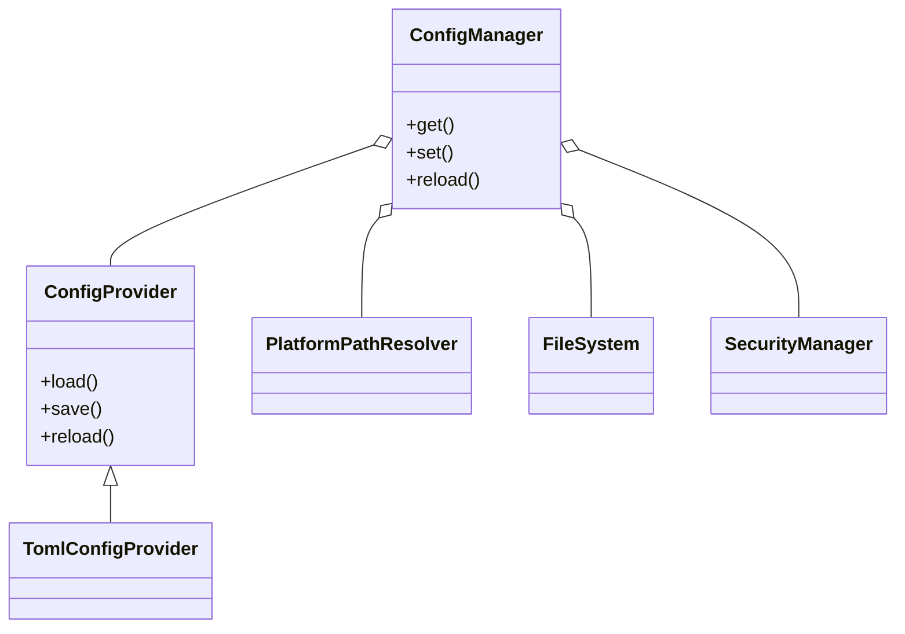

# Task 27-2: Unified Configuration Architecture Design

## Executive Summary

This architecture unifies configuration management across all DataFold components, consolidating fragmented systems into a single, extensible, secure, and platform-aware framework. It is based on the requirements and audit from Task 27-1, Rust best practices, and DataFold’s architectural principles. **TOML** is the sole supported format post-migration, with a format-agnostic trait design for future extensibility.

---

## 1. Core Architecture Design

### 1.1 Trait-Based Abstraction Layer

```rust
/// Core trait for configuration providers (format-agnostic, but only TOML implemented)
pub trait ConfigProvider: Send + Sync {
    /// Load configuration from the canonical location (async for IO)
    async fn load(&self) -> Result<Config, ConfigError>;
    /// Save configuration to the canonical location
    async fn save(&self, config: &Config) -> Result<(), ConfigError>;
    /// Reload configuration (for runtime reloadability)
    async fn reload(&self) -> Result<Config, ConfigError>;
}
```

- **Extensible**: New formats (YAML, etc.) can implement `ConfigProvider`.
- **Type Safety**: All config data is strongly typed via Rust structs.

### 1.2 Core Configuration Management Interfaces

```rust
/// Unified configuration API
pub struct ConfigManager {
    provider: Arc<dyn ConfigProvider>,
    cache: RwLock<Option<Config>>,
    // ... hooks for change tracking, validation, etc.
}

impl ConfigManager {
    pub async fn get(&self) -> Result<Arc<Config>, ConfigError>;
    pub async fn set(&self, new_config: Config) -> Result<(), ConfigError>;
    pub async fn reload(&self) -> Result<Arc<Config>, ConfigError>;
    // ... event hooks, validation, etc.
}
```

### 1.3 Configuration Storage and Retrieval

- **Canonical paths** resolved via platform abstraction (see below).
- **Atomic writes** for integrity.
- **Lazy loading and caching** for performance.

### 1.4 Format-Agnostic Handling

- Only TOML is implemented, but trait allows future formats.
- TOML parsing via `toml` crate, with strong error handling.

---

## 2. Platform Integration Architecture

### 2.1 Platform-Specific Path Resolution

```rust
pub trait PlatformPathResolver {
    fn config_dir(&self) -> PathBuf;
    fn data_dir(&self) -> PathBuf;
    fn cache_dir(&self) -> PathBuf;
    // ...
}
```
- **Linux**: XDG spec (`$XDG_CONFIG_HOME`/`~/.config/datafold/`)
- **macOS**: `~/Library/Application Support/DataFold/`
- **Windows**: `%APPDATA%\DataFold\`

### 2.2 Platform-Appropriate Storage Patterns

- Use OS-appropriate directories for config, data, cache, logs.
- Support environment variable overrides.

### 2.3 Cross-Platform File System Abstraction

- All file IO via a trait (`FileSystem`), allowing for testing/mocking and future remote config sources.

### 2.4 Platform Capability Detection

- Detect platform at runtime (via `PlatformInfo`).
- Adapt config paths, features, and storage accordingly.

---

## 3. Security Architecture

### 3.1 Encrypted Configuration Storage

- **Sensitive fields** (e.g., secrets, keys) are encrypted at rest.
- Use DataFold’s existing crypto infrastructure (PBI 25).

### 3.2 Secure Key Management

- Keys stored in OS keyring or secure enclave if available.
- Fallback to encrypted file with strong passphrase.

### 3.3 Validation and Integrity Checking

- All configs validated against Rust types and custom rules.
- Integrity checksums (e.g., HMAC) for tamper detection.

### 3.4 Access Control and Audit Logging

- Access to config gated by permission system.
- All changes and accesses are logged and auditable.

---

## 4. Integration Architecture

### 4.1 Unified Reporting System Integration (PBI 26)

- All config changes/events are reported via the unified reporting API.
- Correlate config events with other system events.

### 4.2 Change Tracking and Event Correlation

- ConfigManager emits events on change, reload, or error.
- Events are integrated with the event bus for system-wide correlation.

### 4.3 Backward Compatibility and Migration

- On first run, auto-migrate legacy JSON configs to TOML.
- After migration, JSON support is dropped.
- Migration logs and reports are generated for auditability.

### 4.4 Migration Pathways

- CLI, Node, Logging, and Unified config systems are all migrated to the new TOML-based system.
- Adapters provided for legacy consumers during migration window.

---

## 5. Performance Architecture

### 5.1 Lazy Loading and Caching

- Config is loaded on demand and cached in memory.
- Cache invalidated on file change or explicit reload.

### 5.2 Efficient Change Detection

- File system watchers (where supported) trigger reloads.
- Hashing/checksums to avoid unnecessary reloads.

### 5.3 Memory-Efficient Management

- Config structs are reference-counted and shared.
- Only one copy in memory per process.

### 5.4 Performance Monitoring Hooks

- All config operations are instrumented for performance metrics.
- Hooks for unified reporting and performance dashboards.

---

## 6. Integration Points

- **CLI**: Migrates to TOML, uses ConfigManager API.
- **Node**: Uses unified config, platform-aware paths.
- **Logging**: Reads config via ConfigManager, supports runtime reload.
- **Unified System**: All config access via unified API.
- **Event System**: All config changes/events are published.

---

## 7. Trait Hierarchy and Key Abstractions



---

## 8. API Contracts and Data Structures

- All config data is defined in strongly-typed Rust structs.
- Public API exposes async/await for all IO.
- All errors are strongly typed (`ConfigError`).

---

## 9. Design Rationale

- **TOML** is ergonomic, Rust-idiomatic, and user-friendly.
- **Format-agnostic traits** allow future extensibility.
- **Platform abstraction** ensures correct paths and behaviors everywhere.
- **Security** is first-class: encryption, key management, audit.
- **Integration** with reporting, events, and legacy systems is seamless.
- **Performance** is ensured via caching, lazy loading, and monitoring.

---

## 10. Implementation Feasibility

- Leverages existing DataFold and Rust ecosystem crates.
- Migration is straightforward and auditable.
- Extensible for future needs (e.g., remote config, YAML).

---

**This architecture provides a robust, extensible, and secure foundation for unified configuration management across all DataFold platforms and components.**