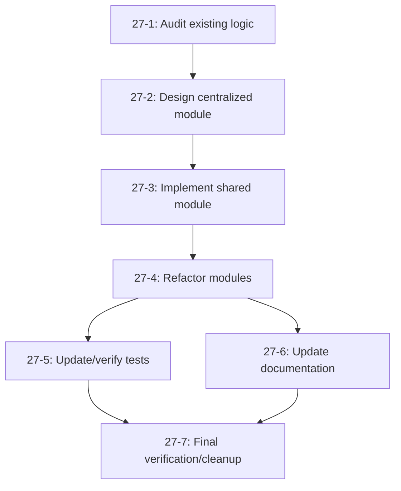

# Tasks for PBI 27: Centralize Risk/Threat Scoring and Assessment Logic

This document lists all tasks associated with PBI 27.

**Parent PBI**: [PBI 27: Centralize risk/threat scoring and assessment logic](./prd.md)

---

## Task Summary

| Task ID | Name | Mode | Description | Deliverables | Dependencies |
|---------|------|------|-------------|--------------|--------------|
| 27-1 | Audit existing risk/threat scoring logic | architect | Identify all locations and patterns of risk/threat scoring and assessment logic across the codebase. Document current implementations, usage, and any duplication/conflicts. | Audit report listing all scoring logic, usage, and issues | None |
| 27-2 | Design centralized scoring module & API | architect | Propose a shared module/interface for risk/threat scoring and assessment. Define API, data structures, and integration points. Ensure compatibility with unified enums and reporting. | Design doc, API spec, integration plan | 27-1 |
| 27-3 | Implement shared scoring module | code | Implement the centralized scoring/assessment logic as designed. Include unit tests for all scoring functions. | Shared module, unit tests | 27-2 |
| 27-4 | Refactor modules to use shared scoring | code | Update all modules to use the new centralized scoring logic. Remove duplicate/conflicting implementations. | Refactored modules, removed duplication | 27-3 |
| 27-5 | Update and verify tests | code | Update or add tests to ensure all modules work with the centralized scoring logic. Achieve full test coverage for new/changed code. | Updated/added tests, test coverage report | 27-4 |
| 27-6 | Update technical documentation | code/architect | Update developer guides, API docs, and architecture docs to reflect the new centralized logic and usage patterns. | Updated documentation | 27-4 |
| 27-7 | Final verification and cleanup | code/architect | Ensure no duplicate/conflicting logic remains, all modules and docs are up to date, and integration with reporting/security is complete. | Verification checklist, cleanup report | 27-5, 27-6 |

---

## Task Details

Each subtask should have its own markdown file (e.g., `docs/delivery/27/27-1.md`) with:

- **Objective:** What this subtask aims to achieve.
- **Scope:** What is included/excluded.
- **Deliverables:** What must be produced for the task to be considered complete.
- **Success Criteria:** How completion will be measured.
- **Dependencies:** Tasks that must be completed first.
- **Recommended Mode:** (architect, code, debug, etc.)

---

## Task Dependency Diagram

---

## Integration & Validation Considerations

- **Integration:** Ensure the new scoring module is used by all relevant modules, especially those updated in PBI 25/26.
- **Testing:** Plan for both unit and integration tests. Validate that all risk/threat assessments are consistent and correct.
- **Documentation:** Update all technical docs, API references, and developer guides.
- **Deployment:** Plan for migration if any data structures or APIs change.

---

## Success Criteria

- All risk/threat scoring logic is implemented in a shared location.
- All modules refactored to use centralized scoring functions.
- No duplicate or conflicting scoring logic remains.
- Technical documentation updated to reflect centralized logic.
- All tests pass and coverage is maintained or improved.