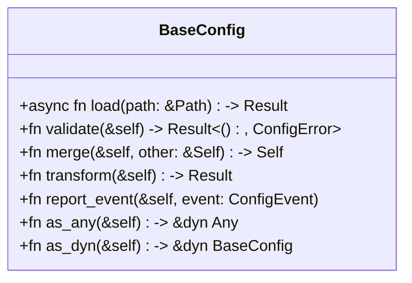
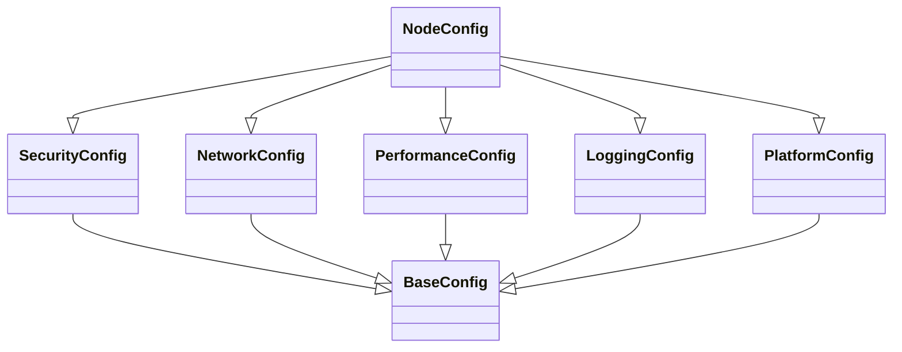

# Shared Configuration Trait Hierarchy Design (PBI 28-2)

## Overview

This document presents the comprehensive shared configuration trait hierarchy for Datafold, based on the audit and classification of configuration structures (Task 28-1) and integration requirements with PBI 26/27. The design aims to reduce >80% duplication, provide robust extensibility, and ensure seamless integration with existing and future systems.

---

## 1. Trait Hierarchy

### 1.1. Base Trait: `BaseConfig`



**Purpose:**  
- Core trait for all configuration structs, providing lifecycle, validation, merging, transformation, and reporting hooks.

**Extensibility:**  
- Associated types for error, event, and transformation target.

**Integration:**  
- `report_event` for PBI 26 unified reporting.
- `as_any`/`as_dyn` for trait object compatibility.

#### Example API

```rust
pub trait BaseConfig: Send + Sync + std::fmt::Debug {
    type Error: std::error::Error + Send + Sync + 'static;
    type Event;
    type TransformTarget;

    async fn load(path: &std::path::Path) -> Result<Self, Self::Error>
    where
        Self: Sized;

    fn validate(&self) -> Result<(), Self::Error>;

    fn merge(&self, other: &Self) -> Self;

    fn transform<T: 'static>(&self) -> Result<T, Self::Error>;

    fn report_event(&self, event: Self::Event);

    fn as_any(&self) -> &dyn std::any::Any;
    fn as_dyn(&self) -> &dyn BaseConfig;
}
```

---

### 1.2. Domain-Specific Traits

#### Security

```rust
pub trait SecurityConfig: BaseConfig {
    fn encryption_enabled(&self) -> bool;
    fn keystore_settings(&self) -> Option<&KeystoreConfig>;
    fn audit_settings(&self) -> Option<&AuditConfig>;
}
```

#### Network

```rust
pub trait NetworkConfig: BaseConfig {
    fn timeout_ms(&self) -> u64;
    fn retry_policy(&self) -> Option<&RetryPolicyConfig>;
    fn connection_settings(&self) -> Option<&ConnectionConfig>;
}
```

#### Performance

```rust
pub trait PerformanceConfig: BaseConfig {
    fn caching_enabled(&self) -> bool;
    fn memory_limit_mb(&self) -> Option<u64>;
    fn optimization_flags(&self) -> &[String];
}
```

#### Logging

```rust
pub trait LoggingConfig: BaseConfig {
    fn log_level(&self) -> &str;
    fn outputs(&self) -> &[LogOutputConfig];
    fn formatting(&self) -> &LogFormattingConfig;
}
```

#### Platform

```rust
pub trait PlatformConfig: BaseConfig {
    fn platform_paths(&self) -> &PlatformPaths;
    fn platform_optimizations(&self) -> &PlatformOptimizations;
}
```

---

### 1.3. Trait Composition and Inheritance

- **Multi-domain configs:** Use trait bounds and blanket impls for composition.
- **Associated types:** For domain-specific settings (e.g., `type Keystore: KeystoreConfig`).
- **Default implementations:** Provide default methods for common logic (e.g., `fn validate`).
- **Trait object compatibility:** All traits are object-safe; use `dyn BaseConfig` for dynamic handling.

#### Example: Composed Config

```rust
pub trait NodeConfig: SecurityConfig + NetworkConfig + PerformanceConfig + LoggingConfig + PlatformConfig {}
```

---

### 1.4. Integration Architecture

```mermaid
flowchart TD
    subgraph PBI27
        A[ConfigurationProvider]
        B[ConfigurationManager]
    end
    subgraph PBI26
        C[Unified Reporting]
    end
    D[Config Structs (impl BaseConfig + domain traits)]
    A --> B
    B --> D
    D -- report_event --> C
    D -- validate/merge --> B
```

- **PBI 27:** `ConfigurationProvider` and `ConfigurationManager` operate on `dyn BaseConfig`.
- **PBI 26:** `report_event` method hooks into unified reporting.
- **Validation:** All validation is trait-based, enabling integration with validation frameworks.
- **Backward compatibility:** Default trait impls and adapter types for legacy configs.

---

### 1.5. API Design and Extensibility

- **Method signatures:** All methods have clear contracts and error handling.
- **Associated types:** For error, event, and transformation targets.
- **Extension points:** Users can define new domain traits and compose them.
- **Macro support:** Provide macros for auto-implementing `BaseConfig` for simple structs.

#### Example Macro

```rust
#[derive(BaseConfig)]
pub struct MyConfig { ... }
```

---

## 2. Migration Strategy

1. Implement `BaseConfig` for all existing config structs.
2. Implement domain traits for relevant configs.
3. Refactor `ConfigurationManager` and `ConfigurationProvider` to use `dyn BaseConfig`.
4. Add reporting and validation hooks.
5. Provide adapters for legacy APIs.

---

## 3. Example Usage

```rust
struct MyNodeConfig { ... }
impl BaseConfig for MyNodeConfig { ... }
impl SecurityConfig for MyNodeConfig { ... }
impl NetworkConfig for MyNodeConfig { ... }
impl PerformanceConfig for MyNodeConfig { ... }
impl LoggingConfig for MyNodeConfig { ... }
impl PlatformConfig for MyNodeConfig { ... }

// Dynamic usage
let config: Arc<dyn BaseConfig> = Arc::new(MyNodeConfig::load("config.toml").await?);
config.validate()?;
config.report_event(ConfigEvent::Loaded);
```

---

## 4. Summary Table

| Trait             | Purpose                                 | Key Methods/Types                | Extensible? | Object Safe? |
|-------------------|-----------------------------------------|----------------------------------|-------------|--------------|
| BaseConfig        | Core lifecycle, validation, reporting   | load, validate, merge, transform | Yes         | Yes          |
| SecurityConfig    | Security domain                         | encryption_enabled, keystore     | Yes         | Yes          |
| NetworkConfig     | Network domain                          | timeout_ms, retry_policy         | Yes         | Yes          |
| PerformanceConfig | Performance tuning                      | caching_enabled, memory_limit    | Yes         | Yes          |
| LoggingConfig     | Logging domain                          | log_level, outputs, formatting   | Yes         | Yes          |
| PlatformConfig    | Platform-specific settings              | platform_paths, optimizations    | Yes         | Yes          |

---

## 5. Mermaid Diagram: Trait Hierarchy



---

## 6. Integration and Extensibility Notes

- All traits are designed for async/await compatibility where I/O is required.
- Associated types and trait bounds ensure type safety and compile-time guarantees.
- Macro support and default implementations reduce boilerplate and ease migration.
- The design is cross-platform and maintains backward compatibility with existing APIs and serialization patterns.

---