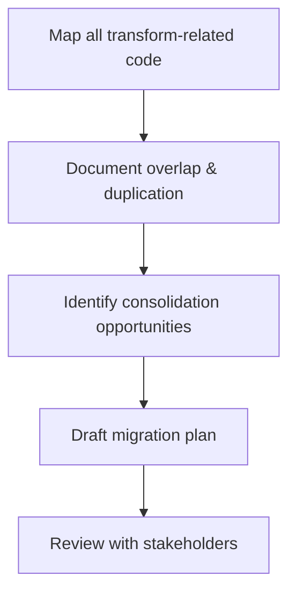

# 32-1 Analyze and document transform module overlap and duplication

## Description
Analyze the current transform-related modules in the DataFold codebase to identify overlap, duplication, and areas for consolidation. This analysis will inform the design and implementation of the unified transform execution module.

## Status History
| Timestamp           | Event         | From      | To         | Details                | User    |
|---------------------|--------------|-----------|------------|------------------------|---------|
| 2025-06-18 12:19:29 | Created      | N/A       | Proposed   | Task file created      | AI_Agent |
| 2025-06-18 12:19:44 | Status Update | Proposed  | Agreed     | Task approved and ready for work | AI_Agent |
| 2025-06-18 12:19:44 | Status Update | Agreed    | InProgress | Work started on analysis | AI_Agent |
| 2025-06-18 12:24:10 | Status Update | InProgress | Review | Analysis complete, awaiting validation | AI_Agent |

## Requirements
- Analyze all transform-related modules, including:
  - `src/fold_db_core/transform_manager/`
  - `src/db_operations/transform_operations.rs`
  - `src/fold_db_core/orchestration/transform_orchestrator.rs`
  - `src/schema/transforms.rs`
  - Any other transform-related code
- Document overlap, duplication, and consolidation opportunities
- Follow .cursorrules for status transitions and documentation

## Implementation Plan
1. Update task status to "Agreed" and "InProgress" in both this file and the tasks index, with status history entries.
2. Enumerate and analyze all transform-related modules.
3. Document findings in this file, covering:
   - Overlap Analysis
   - Architecture Review
   - Complexity Assessment
   - Consolidation Opportunities
   - Migration Considerations

## Analysis

### 1. Transform-Related Codebase Mapping

#### A. Core Modules Identified
- **Transform Manager** (`src/fold_db_core/transform_manager/`)
  - Submodules: execution, loading, manager, metrics, orchestration, persistence, registration, registry, state, types, utils
  - Key traits: `TransformRunner`
  - Key responsibilities: registration, execution, orchestration, persistence, metrics, state management

- **Transform Orchestrator** (`src/fold_db_core/orchestration/transform_orchestrator.rs`)
  - Implements `TransformOrchestrator` struct and trait
  - Handles queueing, processing, and persisting transform tasks

- **DB Operations** (`src/db_operations/transform_operations.rs`)
  - CRUD and mapping for transforms at the database layer

- **Schema Transforms** (`src/schema/transforms.rs`)
  - Functions for registering schema transforms, field-to-transform mapping

#### B. Additional Transform-Related Code
- **Widespread usage of "transform"** in:
  - `src/fold_db_core/coordinator.rs` (integration, orchestration)
  - `src/fold_db_core/infrastructure/init.rs` (initialization)
  - `src/fold_db_core/orchestration/execution_coordinator.rs` (coordinated execution)
  - `src/schema/field_factory.rs` (test helpers)
  - `src/transform/executor.rs`, `src/transform/parser/` (parsing, execution, validation)
  - `src/datafold_node/core/`, `src/datafold_node/routes/` (API endpoints, queue management)
  - `src/schema/types/field/common.rs`, `src/schema/types/transform.rs` (schema-level transform logic)
  - **Legacy modules**: registry, loading, persistence (some functionality moved but code remains)
  - **Metrics, logging, error handling**: metrics.rs, error_factory.rs, shared/error.rs

---

### 2. Overlap & Duplication Observations

#### A. Overlap
- **Execution Logic**: 
  - `execute_transform`, `execute_single_transform`, and `execute_transform_now` appear in multiple modules (manager, execution, orchestration, executor, coordinator).
- **Registration & State**:
  - Registration and state management logic is present in both manager and registration modules, with legacy code in registry.rs and loading.rs.
- **Mapping & Persistence**:
  - Field-to-transform and transform-to-field mapping logic is present in manager, state, schema/transforms, and db_operations.
- **Metrics & Logging**:
  - Logging and metrics for transform operations are spread across metrics.rs, utils/mod.rs, and event_monitor.rs.

#### B. Duplication
- **Similar function signatures** for registering, executing, and listing transforms across manager, orchestrator, and db_operations.
- **Legacy modules** (registry.rs, loading.rs, persistence.rs) contain code that has been moved but not fully removed, leading to potential confusion and technical debt.
- **Test helpers and schema utilities** replicate transform creation and registration logic for testing and schema setup.

---

### 3. Areas of High Complexity / Technical Debt
- **Multiple entry points** for transform execution and registration, increasing maintenance burden.
- **Legacy code** not fully removed or refactored, risking accidental usage or confusion.
- **State and mapping logic** duplicated between manager, state, schema, and db layers.
- **Metrics and logging** are not centralized, leading to inconsistent diagnostics.

---

### 4. Consolidation Opportunities
- **Unify execution logic**: Centralize all `execute_transform` and related methods into a single module with clear interfaces.
- **Single source of truth for registration/state**: Refactor registration, state, and mapping logic to eliminate duplication between manager, state, and schema.
- **Remove or fully refactor legacy modules**: Registry, loading, and persistence modules should be either fully removed or refactored to avoid confusion.
- **Centralize metrics/logging**: Move all transform-related logging and metrics to a dedicated diagnostics module.

---

### 5. Migration Considerations
- **Backward compatibility**: Ensure that API endpoints and integration points (e.g., coordinator, datafold_node) are updated to use the unified logic.
- **Test coverage**: Update and expand tests to cover the unified module, ensuring no loss of functionality.
- **Documentation**: Update all references and documentation to point to the new unified module.
- **Incremental migration**: Consider a phased approach to refactoring, starting with the most duplicated or risky areas.

---

### 6. Proposed Next Steps

---

## Verification
- Task status transitions are correctly logged in both this file and the tasks index.
- Analysis is comprehensive and covers all required areas.
- Documentation is clear and actionable for subsequent design tasks.

## Files Modified
- docs/delivery/32/32-1.md
- docs/delivery/32/tasks.md