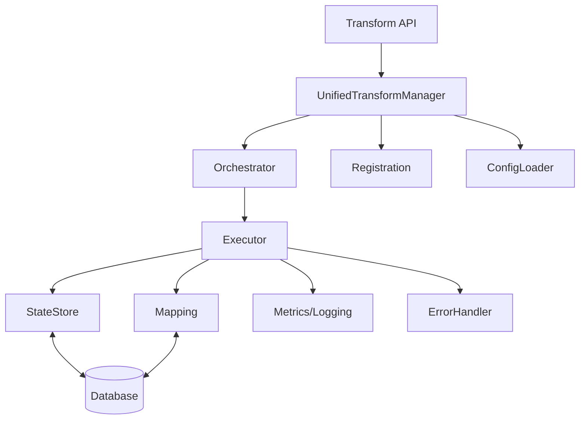

# 32-2 Design unified transform execution architecture

## Description
Design a unified transform execution architecture that consolidates duplicate and overlapping functionality identified in Task 32-1, while ensuring all existing functionality is preserved.

## Status History
| Timestamp           | Event         | From      | To         | Details                | User    |
|---------------------|--------------|-----------|------------|------------------------|---------|
| 2025-06-18 12:24:30 | Created      | N/A       | Proposed   | Task file created      | AI_Agent |
| 2025-06-18 12:24:30 | Status Update | Proposed  | Agreed     | Task approved and ready for work | AI_Agent |
| 2025-06-18 12:24:30 | Status Update | Agreed    | InProgress | Work started on architecture design | AI_Agent |
| 2025-06-18 12:26:05 | Status Update | InProgress | Review | Architecture design complete, ready for review | AI_Agent |

## Requirements
- Design a unified transform execution architecture based on the findings in 32-1.
- Cover module structure, interface design, data flow, state management, configuration, error handling, and performance.
- Document the architecture in this file.
- Provide migration strategy and implementation roadmap.
## Architecture Overview

The unified transform execution architecture is designed to centralize all transform-related logic into a single, cohesive module. This architecture eliminates duplication, streamlines execution and registration, and provides a single source of truth for state, mapping, metrics, and error handling. The design is modular, extensible, and optimized for performance and maintainability.
## Module Specifications

**UnifiedTransformManager**
- Central entry point for all transform operations (register, execute, list, update, remove)
- Delegates orchestration, registration, and configuration to submodules

**Orchestrator**
- Manages transform execution queues and scheduling
- Handles parallelism, prioritization, and retry logic
- Coordinates with Executor for actual transform runs

**Executor**
- Executes transform logic (DSL, custom, or plugin-based)
- Handles input validation, output formatting, and error propagation
- Reports execution metrics and errors

**Registration**
- Manages registration and deregistration of transforms
- Maintains registry of available transforms and their metadata
- Validates transform definitions and schema compatibility

**StateStore**
- Centralized state management for transform execution, status, and history
## Interface Definitions

**Public API (UnifiedTransformManager)**
- `register_transform(definition: TransformDefinition) -> Result<TransformId, Error>`
- `execute_transform(id: TransformId, input: TransformInput) -> Result<TransformOutput, Error>`
- `list_transforms(filter: Option<Filter>) -> Vec<TransformMetadata>`
- `update_transform(id: TransformId, update: TransformUpdate) -> Result<(), Error>`
- `remove_transform(id: TransformId) -> Result<(), Error>`
- `get_transform_state(id: TransformId) -> TransformState`
- `get_execution_history(id: TransformId, range: Option<TimeRange>) -> Vec<ExecutionRecord>`

**Orchestrator**
- `enqueue_execution(id: TransformId, input: TransformInput) -> JobId`
- `get_queue_status() -> QueueStatus`
- `retry_failed(job_id: JobId) -> Result<(), Error>`

**Executor**
- `run(transform: TransformDefinition, input: TransformInput) -> Result<TransformOutput, Error>`

**Registration**
- `validate(definition: TransformDefinition) -> Result<(), Error>`
- `get_registry() -> Vec<TransformMetadata>`
## Migration Strategy

1. **Inventory and Map Existing Functionality**
   - Catalog all current transform-related modules and their responsibilities (per 32-1 findings).
   - Identify all integration points and consumers of transform APIs.

2. **Incremental Refactoring**
   - Begin with the most duplicated/risky areas (execution logic, registration, state).
   - Introduce the UnifiedTransformManager as a façade, delegating to legacy modules initially.

3. **Centralize State, Mapping, and Metrics**
   - Migrate state and mapping logic into the new StateStore and Mapping modules.
   - Redirect metrics/logging to the new centralized diagnostics module.

## Implementation Roadmap

1. **Preparation**
   - Finalize unified architecture design and review with stakeholders.
   - Inventory all transform-related code and integration points.

2. **Phase 1: Foundation**
   - Implement UnifiedTransformManager, Orchestrator, and ConfigLoader as façade modules.
   - Set up centralized Metrics/Logging and ErrorHandler modules.

3. **Phase 2: Core Refactoring**
   - Migrate execution, registration, and state logic into unified modules.
   - Integrate Mapping and StateStore with persistent storage.
   - Redirect all new transform operations through the unified API.

4. **Phase 3: Migration and Compatibility**
   - Gradually migrate legacy consumers to the new API.
   - Maintain backward compatibility shims as needed.
   - Expand test coverage for unified and legacy paths.

5. **Phase 4: Legacy Cleanup**
   - Remove deprecated modules (registry, loading, persistence).
   - Update all documentation and references.

6. **Phase 5: Optimization and Monitoring**
   - Profile performance and optimize execution paths.
   - Enhance diagnostics, monitoring, and alerting.
   - Gather feedback and iterate on architecture as needed.

**Dependencies:**  
- Coordination with teams maintaining integration points  
- Test infrastructure for regression and migration validation  
- Documentation and communication support
4. **Deprecate and Remove Legacy Modules**
   - Gradually phase out registry, loading, and persistence modules.
   - Update all references and documentation to point to the unified module.

5. **Backward Compatibility and Testing**
   - Maintain API compatibility for external consumers during migration.
   - Expand and update tests to cover the unified module and all migration steps.

6. **Documentation and Communication**
   - Update developer documentation and migration guides.
   - Communicate changes and migration steps to all stakeholders.

**StateStore**
- `set_state(id: TransformId, state: TransformState) -> Result<(), Error>`
- `get_state(id: TransformId) -> TransformState`
- `record_execution(id: TransformId, record: ExecutionRecord) -> Result<(), Error>`

**Mapping**
- `map_field_to_transform(field: FieldId, transform: TransformId) -> Result<(), Error>`
- `get_transform_for_field(field: FieldId) -> Option<TransformId>`

**Metrics/Logging**
- `record_metric(event: MetricEvent)`
- `log(event: LogEvent)`

**ErrorHandler**
- `handle(error: Error, context: ErrorContext) -> ErrorAction`

**ConfigLoader**
- `load_config() -> TransformConfig`
- `reload_config() -> Result<(), Error>`
- Provides atomic updates and rollback support
- Exposes state query APIs for monitoring and diagnostics

**Mapping**
- Handles field-to-transform and transform-to-field mapping logic
- Supports dynamic mapping updates and schema evolution

**Metrics/Logging**
- Centralized collection of execution metrics, performance data, and logs
- Integrates with system-wide diagnostics and alerting

**ErrorHandler**
- Unified error handling, categorization, and recovery
- Supports custom error policies and escalation

**ConfigLoader**
- Loads, validates, and applies transform configuration
- Supports hot-reload and environment-specific overrides

**Database**
- Persistent storage for state, mapping, and transform metadata
- Supports migrations and schema versioning

**Principles:**
- Single entry point for all transform operations
- Clear separation of concerns between execution, registration, state, and diagnostics
- Centralized configuration and error handling
- Backward compatibility with existing integration points
- Extensible for future transform types and orchestration patterns

- Follow .cursorrules for status transitions and documentation.

## Implementation Plan
1. Update task status to "Agreed" and "InProgress" in both this file and the tasks index, with status history entries.
2. Design the unified architecture, referencing 32-1 findings.
3. Document the architecture in the required sections below.
4. Provide migration strategy and implementation roadmap.

## Architecture Overview

*To be completed: High-level system design and principles.*

## Module Specifications

*To be completed: Detailed module structure and responsibilities.*

## Interface Definitions

*To be completed: API contracts and integration points.*

## Migration Strategy

*To be completed: How existing modules will transition to the unified architecture.*

## Implementation Roadmap

*To be completed: Sequence and dependencies for implementation.*

## Verification
- Task status transitions are correctly logged in both this file and the tasks index.
- Architecture design is comprehensive and covers all required areas.
- Documentation is clear and actionable for subsequent implementation tasks.

## Files Modified
- docs/delivery/32/32-2.md
- docs/delivery/32/tasks.md