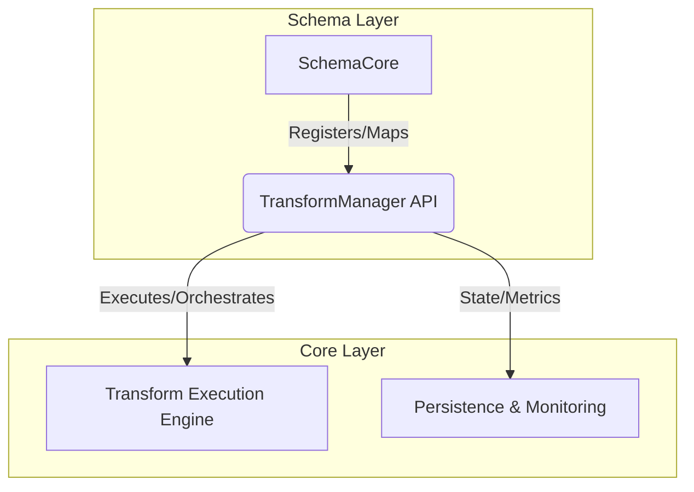

# PBI-32: Transform execution and management logic consolidation

[View in Backlog](../backlog.md#user-content-32)

## Overview
The DataFold codebase currently implements transform execution and management logic across multiple modules, including both schema and core layers. This has led to duplicated logic, fragmented responsibilities, and increased maintenance complexity. PBI-32 aims to consolidate all transform execution and management logic into a unified module with clear boundaries, reducing duplication and ensuring consistent behavior across the system.

## Problem Statement
Transform-related operations—such as registration, execution, orchestration, persistence, and mapping—are currently distributed across several modules:
- `src/fold_db_core/transform_manager/` (execution.rs, manager.rs, orchestration.rs, registration.rs, etc.)
- `src/schema/transforms.rs` and `src/schema/types/transform.rs`
- `src/fold_db_core/orchestration/transform_orchestrator.rs`

This fragmentation results in:
- Duplicated logic for registration, execution, orchestration, and mapping
- Legacy modules with partially migrated functionality
- Increased risk of inconsistent behavior and regressions
- Higher maintenance burden and onboarding complexity

## User Stories
- **As a developer**, I want a single, well-defined module for all transform execution and management so that I can implement and maintain transform features efficiently.
- **As a maintainer**, I want to eliminate duplicated logic and legacy code so that the codebase is easier to understand and less error-prone.
- **As a system integrator**, I want consistent APIs and behavior for transform operations so that integrations are reliable and predictable.

## Technical Approach
1. **Analysis & Mapping**: Catalog all transform-related logic in the codebase, identifying overlaps and points of duplication.
2. **Unified Module Design**: Architect a single module (e.g., `transform_manager`) responsible for:
   - Registration and deregistration of transforms
   - Execution and orchestration of transform tasks
   - State management, persistence, and metrics
   - Mapping between schema fields and transforms
   - Providing a clear API for other components
3. **Migration Plan**:
   - Incrementally refactor existing modules, moving logic into the unified module
   - Ensure all existing functionality is preserved and covered by tests
   - Remove legacy modules and update all call sites to use the new API
4. **Boundaries & Interfaces**:
   - The unified module should expose only necessary interfaces, encapsulating internal state and orchestration details
   - Schema-level code should delegate transform operations to the unified module, not reimplement logic
5. **Testing & Validation**:
   - Comprehensive regression testing to ensure no loss of functionality
   - Performance benchmarks to validate no degradation

### Proposed Architecture (Mermaid Diagram)

## UX/UI Considerations
- No direct end-user UI impact is expected.
- CLI or monitoring tools may need to be updated to reflect the new module boundaries and metrics endpoints.

## Acceptance Criteria
- All transform execution and management logic is consolidated into a single module with a clear API.
- No duplicated or legacy transform logic remains in schema or orchestration modules.
- All existing transform-related functionality is preserved and passes regression tests.
- Documentation is updated to reflect the new architecture and usage patterns.
- All relevant stakeholders review and approve the migration.

## Dependencies
- Existing schema and core modules
- Database and persistence layers
- Orchestration and queue management components
- Test infrastructure for regression and performance

## Open Questions
- Are there any edge cases or legacy integrations that require special handling during migration?
- What is the best strategy for incremental migration to minimize disruption?
- Are there performance optimizations in the current fragmented logic that must be preserved?
- How will this consolidation impact ongoing or planned features?

## Related Tasks
- Refactor schema and orchestration modules to delegate to the unified transform manager
- Remove legacy and duplicated code
- Update documentation and developer onboarding materials
- Comprehensive regression and performance testing