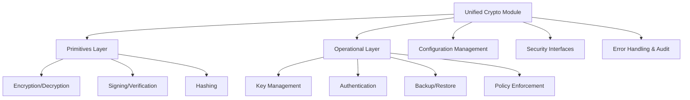

# Task 33-2: Design Unified Cryptographic Architecture

## Status History

| Date (UTC)           | Status      | Actor      | Notes                                      |
|----------------------|-------------|------------|---------------------------------------------|
| 2025-06-19T16:32:15Z | Agreed      | Architect  | Task scope and architecture plan agreed     |
| 2025-06-19T16:32:15Z | InProgress  | Architect  | Architecture design work started            |

---

## 1. Architecture Overview

The unified cryptographic architecture consolidates all cryptographic functionality into a single, authoritative module system. It is designed to eliminate duplication, enforce strict security boundaries, and provide crypto-agility, robust key management, and comprehensive auditability. The architecture separates low-level primitives from high-level operational services, ensuring clear interfaces and secure integration points.

**Security Principles:**
- Separation of primitives and operational layers
- Secure, centralized key management and rotation
- Strong access controls and security boundaries
- Crypto-agility and algorithm transition support
- Comprehensive audit and monitoring capabilities

---

## 2. Module Structure

The architecture is organized into the following layers and components:

- **Primitives Layer:** All low-level cryptographic operations (encryption, decryption, signing, verification, hashing) are consolidated here.
- **Operational Layer:** High-level services (key management, authentication, backup/restore, policy enforcement) built on top of primitives.
- **Configuration Management:** Centralized configuration for all cryptographic settings, policies, and algorithm selection.
- **Security Interfaces:** Well-defined public APIs for all cryptographic operations, with clear security boundaries and access controls.
- **Error Handling & Audit:** Unified error types and handling patterns, with integrated security audit hooks.

---

## 3. Primitives Layer

- **Responsibilities:** Provide all cryptographic primitives (AES, RSA/ECC, HMAC, SHA, etc.) with a unified API.
- **Features:**
  - Algorithm selection via configuration
  - Secure random number generation
  - Hardware acceleration support (where available)
  - Consistent error handling and input validation

---

## 4. Operational Layer

- **Responsibilities:** Expose high-level cryptographic services, including:
  - Key management (generation, storage, rotation, backup/restore)
  - Authentication and signature verification
  - Policy enforcement (e.g., key usage, rotation intervals)
  - Integration with database and CLI operations

---

## 5. Security Interfaces

- **Public APIs:** Clearly defined, versioned interfaces for all cryptographic operations.
- **Access Controls:** Enforced at API boundaries, with role-based permissions and audit logging.
- **Integration Points:** Secure adapters for database, CLI, and network modules.

---

## 6. Configuration Management

- **Centralized Config:** All cryptographic settings (algorithms, key sizes, rotation policies) managed in a single config module.
- **Validation:** Strict validation and enforcement of config at startup and runtime.
- **Dynamic Reload:** Support for safe, dynamic config reloads where feasible.

---

## 7. Key Management

- **Unified Key Lifecycle:** Single source of truth for key generation, storage, versioning, rotation, and destruction.
- **Rotation Mechanisms:** Atomic, auditable key rotation with rollback support.
- **Backup/Restore:** Secure, double-encrypted backup and restore flows.
- **Metadata:** Unified key metadata and versioning records.

---

## 8. Error Handling & Security Audit

- **Unified Error Types:** All cryptographic errors use a common hierarchy.
- **Audit Hooks:** All sensitive operations emit audit events for monitoring and compliance.
- **Security Logging:** Structured, tamper-evident logs for all key and crypto operations.

---

## 9. Performance & Optimization

- **Minimal Overhead:** Efficient primitives and operational flows.
- **Async Support:** Non-blocking operations for key management and crypto tasks.
- **Hardware Offload:** Use of hardware crypto modules where available.

---

## 10. Security Model

- **Threat Model:** Defends against key compromise, privilege escalation, and cryptographic misuse.
- **Boundaries:** Strict separation between primitives and operational logic.
- **Access Controls:** Enforced at all public interfaces.
- **Audit & Monitoring:** All critical operations are logged and monitored for anomalies.

---

## 11. Migration Strategy

- **Stepwise Migration:** 
  1. Implement unified primitives and operational layers.
  2. Adapt existing modules (DB, CLI, network) to use new interfaces.
  3. Migrate key management and config logic.
  4. Deprecate and remove legacy modules after full migration.
- **Compatibility:** Adapters provided for legacy data and key formats.
- **Validation:** Comprehensive testing and staged rollout.

---

## 12. Implementation Roadmap

1. **Primitives Layer:** Implement and validate all cryptographic primitives.
2. **Operational Layer:** Build high-level services and integrate with primitives.
3. **Adapters:** Migrate DB, CLI, and network modules to new interfaces.
4. **Key Management:** Centralize and unify all key lifecycle operations.
5. **Audit & Monitoring:** Integrate audit hooks and monitoring.
6. **Deprecation:** Remove legacy modules and finalize migration.

---

## References

- Task 33-1 Analysis: [`docs/delivery/33/33-1.md`](./33-1.md)
- Task Index: [`docs/delivery/33/tasks.md`](./tasks.md)
- .cursorrules: Project policy and workflow