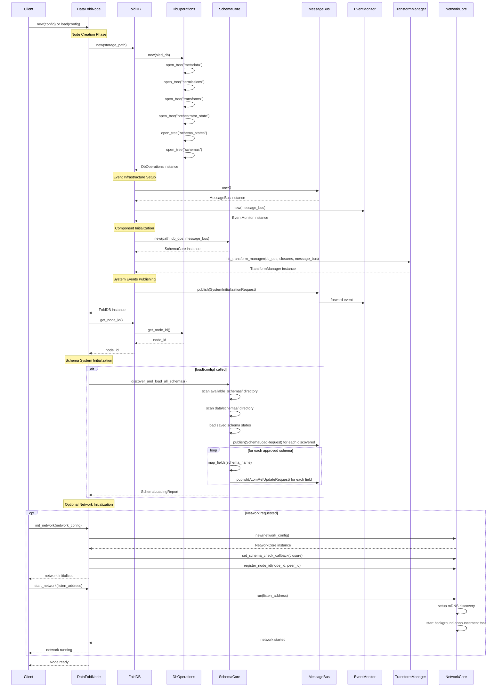
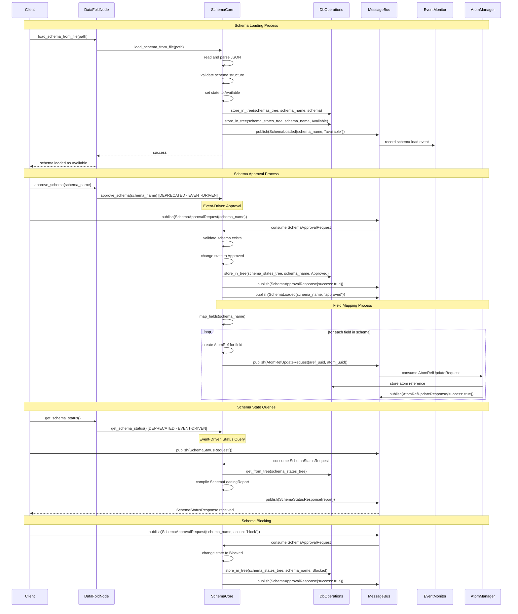
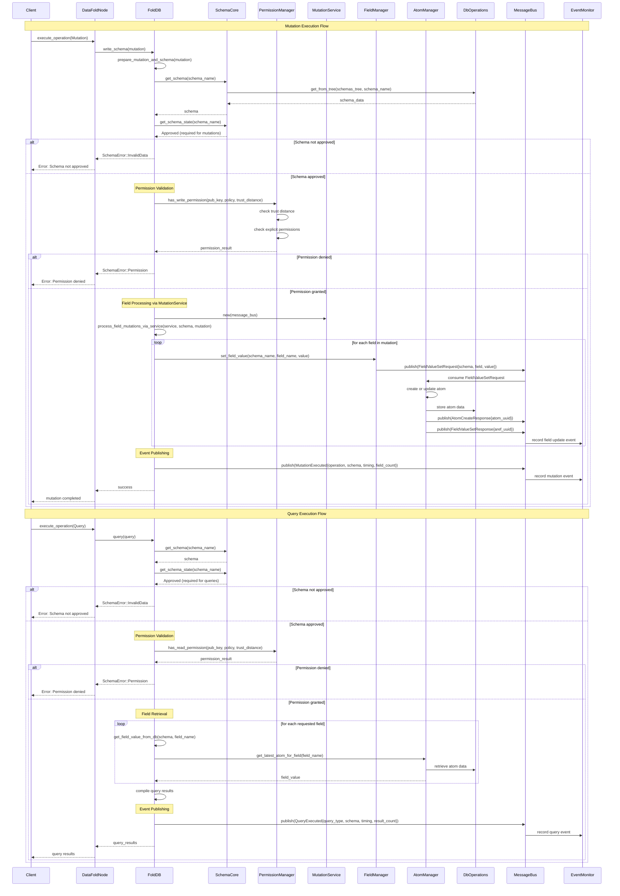
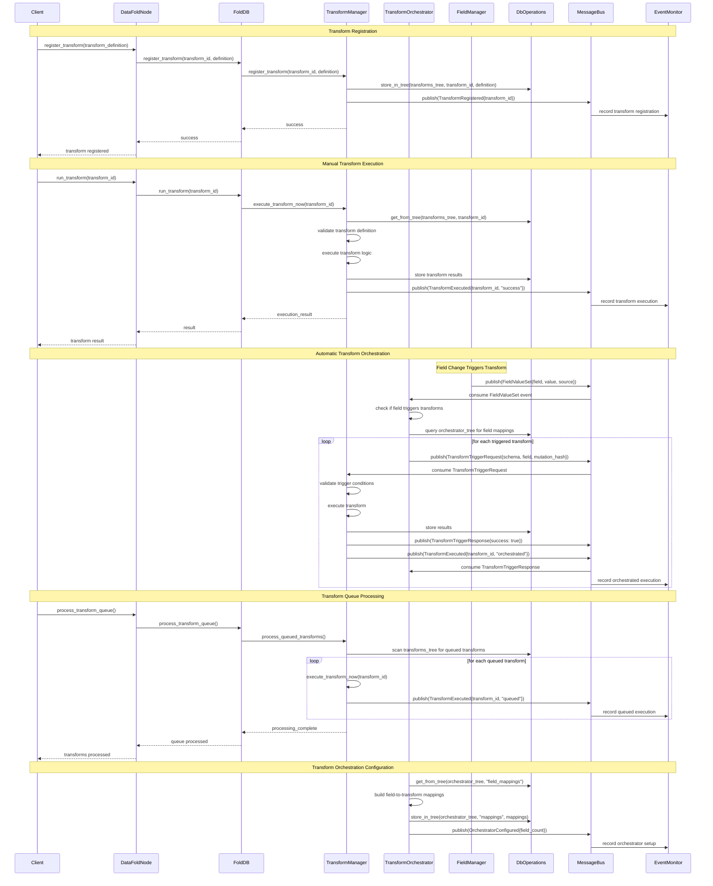
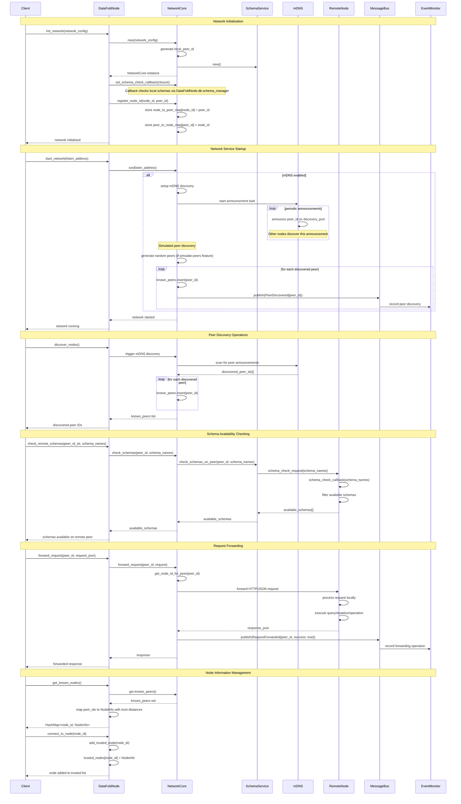
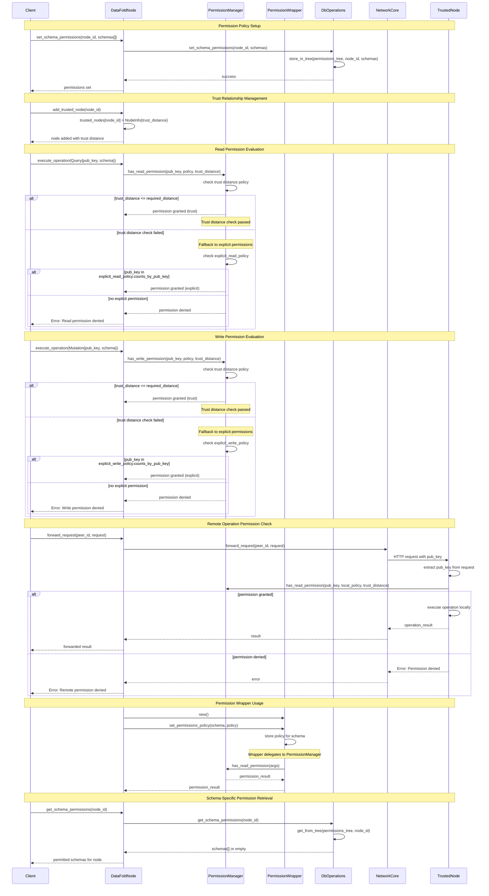

# FoldDB Execution Sequence Diagrams

This document provides comprehensive sequence diagrams showing the execution flow for all major processes in the FoldDB system. Each diagram illustrates component interactions, message passing, decision points, and event-driven patterns.

## Table of Contents

1. [Node Initialization and Configuration Process](#1-node-initialization-and-configuration-process)
2. [Schema Operations Workflow](#2-schema-operations-workflow)
3. [Database Operations (Queries and Mutations)](#3-database-operations-queries-and-mutations)
4. [Transform Operations and Orchestration](#4-transform-operations-and-orchestration)
5. [Network Operations and Discovery](#5-network-operations-and-discovery)
6. [Permission Management](#6-permission-management)
7. [Ingestion Processes](#7-ingestion-processes)
8. [Event-Driven Operations](#8-event-driven-operations)
9. [HTTP/TCP Server Operations](#9-httptcp-server-operations)

---

## 1. Node Initialization and Configuration Process

This diagram shows the complete initialization sequence when a DataFoldNode starts up, including database initialization, schema discovery, and optional network setup.



**Key Points:**
- Node initialization follows a strict sequence: DB → Events → Components → Schemas → Network
- Event infrastructure is established early to support event-driven communication
- Schema discovery happens automatically during load, scanning multiple directories
- Network initialization is optional and happens after core components are ready
- All major operations publish events for system observability

---

## 2. Schema Operations Workflow

This diagram illustrates the complete lifecycle of schema operations, from loading through approval to field mapping.



**Key Points:**
- Schema operations are transitioning from direct method calls to event-driven patterns
- Schema states: Available → Approved → (optionally) Blocked
- Field mapping happens automatically when schemas are approved
- Each AtomRef creation triggers events for system coordination
- Blocking prevents queries/mutations but preserves field mappings and transforms

---

## 3. Database Operations (Queries and Mutations)

This diagram shows the execution flow for database queries and mutations, including permission checks and event publishing.



**Key Points:**
- All database operations require schema approval and permission validation
- Mutations use event-driven field processing through MutationService
- Each field update triggers AtomRef creation/update events
- Query operations retrieve the latest atom data for each requested field
- All operations publish events for system observability and metrics

---

## 4. Transform Operations and Orchestration

This diagram illustrates the transform system, showing both manual execution and automatic orchestration triggered by field changes.



**Key Points:**
- Transforms can be executed manually or triggered automatically by field changes
- TransformOrchestrator listens to FieldValueSet events to trigger related transforms
- Transform execution is event-driven with proper response correlation
- Queued transforms provide batch processing capabilities
- All transform operations publish events for tracking and observability

---

## 5. Network Operations and Discovery

This diagram shows network initialization, peer discovery, schema checking, and request forwarding between nodes.



**Key Points:**
- Network initialization establishes peer discovery and schema checking capabilities
- mDNS provides automatic peer discovery with periodic announcements
- Schema availability checking allows nodes to query what schemas peers support
- Request forwarding enables distributed operations across trusted nodes
- Trust relationships determine which nodes can forward requests to each other

---

## 6. Permission Management

This diagram shows how permissions are evaluated for database operations using trust distance and explicit permissions.



**Key Points:**
- Permission evaluation uses hybrid model: trust distance + explicit permissions
- Trust distance provides relationship-based access control
- Explicit permissions allow fine-grained per-key access management
- Read and write permissions are evaluated separately with potentially different policies
- Remote operations require permission validation on the target node
- PermissionWrapper provides schema-specific policy management

---

## 7. Ingestion Processes

This diagram shows the data ingestion workflow, including schema generation, mutation creation, and data processing.

```mermaid
sequenceDiagram
    participant Client
    participant HttpServer
    participant IngestionRoutes
    participant IngestionCore
    parameter MutationGenerator
    participant SchemaStripper
    participant OpenRouterService
    participant DataFoldNode
    participant SchemaCore
    participant FoldDB
    participant MessageBus

    Note over Client,MessageBus: Ingestion Request Initiation
    Client->>HttpServer: POST /api/ingestion/ingest
    HttpServer->>IngestionRoutes: handle_ingest_request(payload)
    IngestionRoutes->>IngestionCore: new(config)
    IngestionCore-->>IngestionRoutes: IngestionCore instance
    
    IngestionRoutes->>IngestionCore: process_ingestion(data, schema_name, options)
    
    Note over IngestionCore,OpenRouterService: Schema Generation Phase
    alt schema_name not provided
        IngestionCore->>OpenRouterService: new(api_key, base_url)
        IngestionCore->>OpenRouterService: generate_schema_from_data(data)
        OpenRouterService->>OpenRouterService: call LLM API for schema generation
        OpenRouterService-->>IngestionCore: generated_schema_json
        IngestionCore->>IngestionCore: parse and validate generated schema
        IngestionCore->>IngestionCore: extract schema_name from generated schema
    end

    Note over IngestionCore,SchemaCore: Schema Registration
    IngestionCore->>DataFoldNode: load_schema_from_json(schema_json)
    DataFoldNode->>SchemaCore: load_schema_from_json(schema_json)
    SchemaCore->>SchemaCore: validate schema structure
    SchemaCore->>SchemaCore: set state to Available
    SchemaCore->>MessageBus: publish(SchemaLoaded{schema_name, "available"})
    SchemaCore-->>DataFoldNode: success
    DataFoldNode-->>IngestionCore: schema loaded

    Note over IngestionCore,FoldDB: Auto-approval if Enabled
    alt auto_approve enabled
        IngestionCore->>DataFoldNode: approve_schema(schema_name)
        DataFoldNode->>MessageBus: publish(SchemaApprovalRequest{schema_name})
        MessageBus->>SchemaCore: consume SchemaApprovalRequest
        SchemaCore->>SchemaCore: change state to Approved
        SchemaCore->>MessageBus: publish(SchemaApprovalResponse{success: true})
        SchemaCore-->>DataFoldNode: schema approved
    end

    Note over IngestionCore,FoldDB: Mutation Generation
    IngestionCore->>MutationGenerator: new()
    IngestionCore->>MutationGenerator: generate_mutations_from_data(data, schema_name)
    
    MutationGenerator->>MutationGenerator: analyze data structure
    MutationGenerator->>MutationGenerator: map data fields to schema fields
    loop for each data record
        MutationGenerator->>MutationGenerator: create Mutation{schema, fields_and_values}
    end
    MutationGenerator-->>IngestionCore: mutations[]

    Note over IngestionCore,FoldDB: Data Execution Phase
    loop for each mutation
        IngestionCore->>DataFoldNode: execute_operation(mutation)
        DataFoldNode->>FoldDB: write_schema(mutation)
        FoldDB->>FoldDB: validate and execute mutation
        FoldDB->>MessageBus: publish(MutationExecuted{operation, schema, timing})
        FoldDB-->>DataFoldNode: mutation_result
        DataFoldNode-->>IngestionCore: execution_result
        
        alt execution failed
            IngestionCore->>IngestionCore: record failure in batch_results
        else execution succeeded
            IngestionCore->>IngestionCore: record success in batch_results
        end
    end

    Note over IngestionCore,MessageBus: Response Compilation
    IngestionCore->>IngestionCore: compile ingestion_report{
        IngestionCore->>IngestionCore:   schema_name,
        IngestionCore->>IngestionCore:   mutations_count,
        IngestionCore->>IngestionCore:   successful_count,
        IngestionCore->>IngestionCore:   failed_count,
        IngestionCore->>IngestionCore:   execution_time_ms
        IngestionCore->>IngestionCore: }
    
    IngestionCore->>MessageBus: publish(IngestionCompleted{report})
    IngestionCore-->>IngestionRoutes: ingestion_report
    IngestionRoutes-->>HttpServer: HTTP 200 OK with report
    HttpServer-->>Client: ingestion results

    Note over Client,MessageBus: Schema Stripping for Simple Service
    alt use simple service
        Client->>HttpServer: POST /api/ingestion/simple_ingest  
        HttpServer->>IngestionRoutes: handle_simple_ingest()
        IngestionRoutes->>SchemaStripper: new()
        IngestionRoutes->>SchemaStripper: strip_schema_from_data(data)
        SchemaStripper->>SchemaStripper: extract field definitions from data
        SchemaStripper->>SchemaStripper: generate minimal schema
        SchemaStripper-->>IngestionRoutes: stripped_schema
        Note over IngestionRoutes: Continue with normal ingestion flow
    end

    Note over Client,MessageBus: Batch Processing
    Client->>HttpServer: POST /api/ingestion/batch_ingest
    HttpServer->>IngestionRoutes: handle_batch_ingest(batch_data[])
    loop for each data_item in batch
        IngestionRoutes->>IngestionCore: process_ingestion(data_item, schema, options)
        Note over IngestionCore: Same flow as single ingestion
    end
    IngestionRoutes->>IngestionRoutes: compile batch_report{total, successful, failed}
    IngestionRoutes-->>HttpServer: batch_report
    HttpServer-->>Client: batch ingestion results
```

**Key Points:**
- Ingestion supports both schema-provided and auto-generated schema workflows  
- OpenRouterService uses LLM APIs to generate schemas from raw data
- Auto-approval option allows streamlined ingestion without manual schema approval
- MutationGenerator creates appropriate mutations based on data structure analysis
- Batch processing enables efficient handling of multiple data items
- SchemaStripper provides simplified schema extraction for basic use cases

---

## 8. Event-Driven Operations

This diagram illustrates the event-driven architecture, showing event publishing, consumption, and system-wide coordination.

```mermaid
sequenceDiagram
    participant Component
    participant MessageBus
    participant Consumer1
    participant Consumer2
    participant EventMonitor
    participant AsyncMessageBus
    participant DeadLetterQueue
    participant RetryQueue

    Note over Component,RetryQueue: Event Publishing and Basic Consumption
    Component->>MessageBus: publish(FieldValueSet{field, value, source})
    MessageBus->>MessageBus: serialize event to JSON
    MessageBus->>MessageBus: route to registered consumers
    
    MessageBus->>Consumer1: send(FieldValueSet)
    MessageBus->>Consumer2: send(FieldValueSet)
    MessageBus->>EventMonitor: send(FieldValueSet)
    
    Consumer1->>Consumer1: process event
    Consumer2->>Consumer2: process event
    EventMonitor->>EventMonitor: record event statistics
    
    Note over EventMonitor: System-wide event tracking
    EventMonitor->>EventMonitor: increment event counters
    EventMonitor->>EventMonitor: update timing statistics
    EventMonitor->>EventMonitor: track event types

    Note over Component,RetryQueue: Request-Response Pattern
    Component->>MessageBus: publish(AtomCreateRequest{correlation_id, content})
    MessageBus->>Consumer1: send(AtomCreateRequest)
    Consumer1->>Consumer1: process atom creation
    Consumer1->>MessageBus: publish(AtomCreateResponse{correlation_id, success, atom_uuid})
    MessageBus->>Component: deliver response (correlation_id match)
    Component->>Component: handle creation result

    Note over Component,RetryQueue: Unified Event Type Handling
    Component->>MessageBus: publish_event(Event::SchemaLoaded(schema_event))
    MessageBus->>MessageBus: match event type
    MessageBus->>MessageBus: route to appropriate consumers
    loop for each registered consumer
        MessageBus->>Consumer1: deliver typed event
        Consumer1->>Consumer1: handle specific event type
    end

    Note over Component,RetryQueue: Asynchronous Event Processing
    Component->>AsyncMessageBus: publish_event(Event::MutationExecuted)
    AsyncMessageBus->>AsyncMessageBus: queue event for async processing
    AsyncMessageBus->>Consumer1: async deliver event
    Consumer1->>Consumer1: async process event
    Consumer1->>AsyncMessageBus: async completion signal

    Note over Component,RetryQueue: Enhanced Event Processing with Retries
    Component->>MessageBus: publish_with_retry(event, max_retries=3, source="component")
    MessageBus->>MessageBus: create RetryableEvent{event, retries_left: 3}
    MessageBus->>Consumer1: attempt delivery
    
    alt delivery successful
        Consumer1->>Consumer1: process event successfully
        Consumer1-->>MessageBus: acknowledgment
    else delivery failed
        MessageBus->>RetryQueue: add RetryableEvent{retries_left: 2}
        Note over RetryQueue: Event will be retried later
    end

    Note over Component,RetryQueue: Retry Processing
    MessageBus->>MessageBus: process_retries() (periodic)
    MessageBus->>RetryQueue: get pending retries
    loop for each retryable event
        MessageBus->>Consumer1: re-attempt delivery
        alt retry successful
            Consumer1-->>MessageBus: acknowledgment
            MessageBus->>RetryQueue: remove from retry queue
        else retry failed and retries exhausted
            MessageBus->>DeadLetterQueue: move to dead letters
            MessageBus->>EventMonitor: record dead letter event
        end
    end

    Note over Component,RetryQueue: Event History and Replay
    MessageBus->>MessageBus: record_event_history(event, source, sequence_number)
    MessageBus->>MessageBus: store EventHistoryEntry in history list
    
    Component->>MessageBus: get_event_history_since(sequence_number)
    MessageBus-->>Component: events since sequence number
    
    Component->>MessageBus: replay_events(from_sequence)
    loop for each historical event
        MessageBus->>MessageBus: re-publish historical event
        MessageBus->>Consumer1: deliver replayed event
        Consumer1->>Consumer1: process replayed event
    end

    Note over Component,RetryQueue: System Monitoring and Observability
    EventMonitor->>EventMonitor: track_event_statistics()
    EventMonitor->>EventMonitor: count events by type
    EventMonitor->>EventMonitor: measure processing latency
    EventMonitor->>EventMonitor: track consumer health
    
    Component->>EventMonitor: get_statistics()
    EventMonitor-->>Component: EventStatistics{counts, timing, health}
    
    Component->>EventMonitor: log_summary()
    EventMonitor->>EventMonitor: output comprehensive system activity log

    Note over Component,RetryQueue: Dead Letter Management
    Component->>MessageBus: get_dead_letters()
    MessageBus-->>Component: DeadLetterEvent[] list
    
    Component->>MessageBus: clear_dead_letters()
    MessageBus->>DeadLetterQueue: clear all dead letters
    MessageBus-->>Component: cleared_count

    Note over Component,RetryQueue: Queue Status Monitoring
    Component->>MessageBus: get_retry_queue_status()
    MessageBus-->>Component: (retry_queue_size, dead_letter_count)
    
    Note over Component,RetryQueue: Consumer Management
    Component->>MessageBus: subscribe<FieldValueSet>()
    MessageBus->>MessageBus: create Consumer<FieldValueSet>
    MessageBus->>MessageBus: register consumer in SubscriberRegistry
    MessageBus-->>Component: Consumer<FieldValueSet>
    
    Component->>Consumer1: try_recv()
    Consumer1-->>Component: Option<FieldValueSet>
```



**Key Points:**
- Event-driven architecture enables loose coupling between components
- MessageBus supports both synchronous and asynchronous event processing
- Request-response patterns use correlation IDs for proper response routing
- Retry mechanisms handle temporary failures with configurable retry limits
- Dead letter queues capture permanently failed events for analysis
- Event history enables system replay and debugging capabilities
- EventMonitor provides comprehensive system observability and metrics

---

## 9. HTTP/TCP Server Operations

This diagram shows the HTTP and TCP server operations, including route handling, WebSocket connections, and request processing.

```mermaid
sequenceDiagram
    participant Client
    participant HttpServer
    participant SchemaRoutes
    participant QueryRoutes
    participant SystemRoutes
    participant NetworkRoutes
    participant DataFoldNode
    participant TCPServer
    participant TCPCommandRouter
    participant WebSocket

    Note over Client,WebSocket: HTTP Server Initialization and Startup
    Client->>HttpServer: DataFoldHttpServer::new(node, bind_address)
    HttpServer->>HttpServer: initialize logging system
    HttpServer->>HttpServer: create AppState{node: Arc<Mutex<DataFoldNode>>}
    HttpServer-->>Client: HttpServer instance
    
    Client->>HttpServer: run()
    HttpServer->>HttpServer: create ActixHttpServer with routes
    HttpServer->>HttpServer: configure CORS middleware
    HttpServer->>HttpServer: setup static file serving
    HttpServer->>HttpServer: register route handlers:
    HttpServer->>HttpServer:   /api/schemas/* -> SchemaRoutes
    HttpServer->>HttpServer:   /api/query/* -> QueryRoutes  
    HttpServer->>HttpServer:   /api/system/* -> SystemRoutes
    HttpServer->>HttpServer:   /api/network/* -> NetworkRoutes
    HttpServer->>HttpServer:   /api/ingestion/* -> IngestionRoutes
    HttpServer->>HttpServer: bind to address and start
    HttpServer-->>Client: HTTP server running

    Note over Client,WebSocket: Schema Management via HTTP
    Client->>HttpServer: GET /api/schemas/list
    HttpServer->>SchemaRoutes: handle_list_schemas()
    SchemaRoutes->>DataFoldNode: list_schemas_with_state()
    DataFoldNode->>DataFoldNode: get schema states from FoldDB
    DataFoldNode-->>SchemaRoutes: HashMap<schema_name, SchemaState>
    SchemaRoutes-->>HttpServer: JSON response with schemas
    HttpServer-->>Client: 200 OK with schema list

    Client->>HttpServer: POST /api/schemas/load
    HttpServer->>SchemaRoutes: handle_load_schema(schema_json)
    SchemaRoutes->>DataFoldNode: load_schema_from_json(schema_json)
    DataFoldNode->>DataFoldNode: validate and store schema as Available
    DataFoldNode-->>SchemaRoutes: load result
    SchemaRoutes-->>HttpServer: JSON response with load status
    HttpServer-->>Client: 200 OK with load result

    Client->>HttpServer: POST /api/schemas/{schema_name}/approve
    HttpServer->>SchemaRoutes: handle_approve_schema(schema_name)
    SchemaRoutes->>DataFoldNode: approve_schema(schema_name)
    DataFoldNode->>DataFoldNode: change schema state to Approved
    DataFoldNode-->>SchemaRoutes: approval result
    SchemaRoutes-->>HttpServer: JSON response with approval status
    HttpServer-->>Client: 200 OK with approval result

    Note over Client,WebSocket: Query and Mutation Operations via HTTP
    Client->>HttpServer: POST /api/query/execute
    HttpServer->>QueryRoutes: handle_query(query_json)
    QueryRoutes->>QueryRoutes: parse Query from JSON
    QueryRoutes->>DataFoldNode: execute_operation(query)
    DataFoldNode->>DataFoldNode: validate permissions and execute query
    DataFoldNode-->>QueryRoutes: query_results
    QueryRoutes-->>HttpServer: JSON response with results
    HttpServer-->>Client: 200 OK with query results

    Client->>HttpServer: POST /api/query/mutate
    HttpServer->>QueryRoutes: handle_mutation(mutation_json)
    QueryRoutes->>QueryRoutes: parse Mutation from JSON
    QueryRoutes->>DataFoldNode: execute_operation(mutation)
    DataFoldNode->>DataFoldNode: validate permissions and execute mutation
    DataFoldNode-->>QueryRoutes: mutation_results
    QueryRoutes-->>HttpServer: JSON response with results
    HttpServer-->>Client: 200 OK with mutation results

    Note over Client,WebSocket: System Operations via HTTP
    Client->>HttpServer: GET /api/system/status
    HttpServer->>SystemRoutes: handle_system_status()
    SystemRoutes->>DataFoldNode: get_node_id()
    SystemRoutes->>DataFoldNode: get_schema_status()
    SystemRoutes->>DataFoldNode: get_network_status()
    SystemRoutes->>SystemRoutes: compile system status
    SystemRoutes-->>HttpServer: JSON response with status
    HttpServer-->>Client: 200 OK with system status

    Client->>HttpServer: POST /api/system/restart
    HttpServer->>SystemRoutes: handle_restart()
    SystemRoutes->>DataFoldNode: restart()
    DataFoldNode->>DataFoldNode: stop network, close DB, reinitialize
    DataFoldNode-->>SystemRoutes: restart result
    SystemRoutes-->>HttpServer: JSON response with restart status
    HttpServer-->>Client: 200 OK with restart result

    Note over Client,WebSocket: Network Operations via HTTP
    Client->>HttpServer: GET /api/network/peers
    HttpServer->>NetworkRoutes: handle_list_peers()
    NetworkRoutes->>DataFoldNode: get_known_nodes()
    DataFoldNode->>DataFoldNode: query network layer for known peers
    DataFoldNode-->>NetworkRoutes: HashMap<node_id, NodeInfo>
    NetworkRoutes-->>HttpServer: JSON response with peers
    HttpServer-->>Client: 200 OK with peer list

    Client->>HttpServer: POST /api/network/discover
    HttpServer->>NetworkRoutes: handle_discover_peers()
    NetworkRoutes->>DataFoldNode: discover_nodes()
    DataFoldNode->>DataFoldNode: trigger mDNS discovery
    DataFoldNode-->>NetworkRoutes: discovered_peer_ids
    NetworkRoutes-->>HttpServer: JSON response with discovery results
    HttpServer-->>Client: 200 OK with discovered peers

    Note over Client,WebSocket: TCP Server Operations
    Client->>TCPServer: connect to TCP port
    TCPServer->>TCPCommandRouter: new_connection(stream)
    TCPCommandRouter->>TCPCommandRouter: setup connection handling
    
    Client->>TCPServer: send JSON command
    TCPServer->>TCPCommandRouter: route_command(json_command)
    TCPCommandRouter->>TCPCommandRouter: parse command type
    
    alt query command
        TCPCommandRouter->>DataFoldNode: execute_operation(query)
        DataFoldNode-->>TCPCommandRouter: query_results
    else mutation command
        TCPCommandRouter->>DataFoldNode: execute_operation(mutation)
        DataFoldNode-->>TCPCommandRouter: mutation_results
    else schema command
        TCPCommandRouter->>DataFoldNode: schema_operation(command)
        DataFoldNode-->>TCPCommandRouter: schema_results
    end
    
    TCPCommandRouter->>TCPServer: send JSON response
    TCPServer-->>Client: JSON response over TCP

    Note over Client,WebSocket: WebSocket Real-time Communication
    Client->>HttpServer: WebSocket upgrade request
    HttpServer->>WebSocket: establish WebSocket connection
    WebSocket->>WebSocket: register for real-time events
    
    DataFoldNode->>DataFoldNode: execute_operation() triggers events
    DataFoldNode->>WebSocket: push real-time updates
    WebSocket-->>Client: real-time notifications
    
    Client->>WebSocket: send real-time command
    WebSocket->>DataFoldNode: execute real-time operation
    DataFoldNode-->>WebSocket: real-time response
    WebSocket-->>Client: real-time result

    Note over Client,WebSocket: Static File Serving
    Client->>HttpServer: GET / (root)
    HttpServer->>HttpServer: serve index.html from static-react/
    HttpServer-->>Client: React application HTML
    
    Client->>HttpServer: GET /static/assets/*
    HttpServer->>HttpServer: serve static assets (JS, CSS, images)
    HttpServer-->>Client: static assets

    Note over Client,WebSocket: Error Handling and Logging
    alt operation fails
        DataFoldNode-->>QueryRoutes: Error result
        QueryRoutes->>QueryRoutes: log error details
        QueryRoutes-->>HttpServer: 500 Internal Server Error
        HttpServer-->>Client: error response with details
    end
    
    HttpServer->>HttpServer: log all requests and responses
    HttpServer->>HttpServer: record timing and performance metrics
```



**Key Points:**
- HTTP server provides RESTful API endpoints for all major operations
- Route handlers delegate to DataFoldNode for business logic execution
- TCP server enables direct JSON command processing over TCP connections
- WebSocket support provides real-time communication capabilities
- Static file serving delivers the React UI application
- Comprehensive error handling and logging throughout request processing
- CORS middleware enables cross-origin requests for web applications

---

## Cross-Process Relationships

### Event Flow Dependencies
- **Schema Operations** → **Event-Driven Operations**: Schema changes trigger events
- **Database Operations** → **Transform Operations**: Field updates trigger transforms
- **Network Operations** → **Permission Management**: Remote requests require permission validation
- **Ingestion Processes** → **Schema Operations** + **Database Operations**: Creates schemas and executes mutations

### Component Interaction Patterns
- **DataFoldNode** coordinates all major processes and delegates to specialized components
- **MessageBus** provides event-driven communication across all processes
- **EventMonitor** observes and tracks activities across all system processes
- **DbOperations** provides unified data persistence for all components
- **PermissionManager** enforces access control across query, mutation, and network operations

### Initialization Dependencies
1. **DbOperations** must be initialized first (provides data persistence)
2. **MessageBus** and **EventMonitor** enable event-driven coordination
3. **SchemaCore** depends on DbOperations and MessageBus
4. **NetworkCore** is optional and initialized last
5. **HTTP/TCP servers** wrap the fully initialized DataFoldNode

This comprehensive execution flow documentation provides detailed insight into how the FoldDB system coordinates complex operations across its distributed, event-driven architecture.