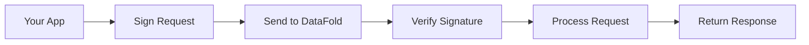

# 5-Minute DataFold Integration Tutorial

Get DataFold signature authentication working in under 5 minutes! This quick-start guide will have you making authenticated API calls before you finish your coffee.

## ⏱️ What You'll Accomplish

In 5 minutes, you'll:
- ✅ Generate an Ed25519 keypair
- ✅ Register your public key with DataFold
- ✅ Make your first authenticated API call
- ✅ Understand the basic authentication flow

## 🎯 Prerequisites

- **DataFold Server**: Access to a DataFold instance (local or hosted)
- **Development Environment**: Node.js 16+, Python 3.8+, or CLI tools
- **5 Minutes**: That's it!

## 🚀 Choose Your Platform

<details>
<summary><strong>🟨 JavaScript/TypeScript (Most Popular)</strong></summary>

### Step 1: Install the SDK
```bash
npm install @datafold/sdk
# or
yarn add @datafold/sdk
```

### Step 2: Generate Keys and Setup
```javascript
import { generateKeyPair, DataFoldClient } from '@datafold/sdk';

// Generate keypair
const keyPair = await generateKeyPair();
console.log('🔑 Keys generated!');

// Register public key with server
const response = await fetch('https://api.datafold.com/api/crypto/keys/register', {
  method: 'POST',
  headers: { 'Content-Type': 'application/json' },
  body: JSON.stringify({
    client_id: 'quick-start-client',
    public_key: keyPair.publicKey,
    key_name: 'Quick Start Key'
  })
});

const registration = await response.json();
console.log('📝 Public key registered!');

// Create authenticated client
const client = new DataFoldClient({
  serverUrl: 'https://api.datafold.com',
  clientId: registration.data.client_id,
  privateKey: keyPair.privateKey
});

// Make authenticated request
const schemas = await client.get('/api/schemas');
console.log('🎉 Success! Retrieved schemas:', schemas.data);
```

### Step 3: Verify It Works
```javascript
// Test different endpoints
const status = await client.get('/api/system/status');
console.log('Server status:', status.data);

// Create a test schema
const newSchema = await client.post('/api/schemas', {
  name: 'test_events',
  fields: [
    { name: 'id', type: 'string', required: true },
    { name: 'timestamp', type: 'datetime', required: true }
  ]
});
console.log('✨ Schema created:', newSchema.data);
```

</details>

<details>
<summary><strong>🐍 Python</strong></summary>

### Step 1: Install the SDK
```bash
pip install datafold-sdk
```

### Step 2: Generate Keys and Setup
```python
from datafold_sdk import generate_key_pair, DataFoldClient
import requests

# Generate keypair
private_key, public_key = generate_key_pair()
print('🔑 Keys generated!')

# Register public key with server
response = requests.post('https://api.datafold.com/api/crypto/keys/register', 
  json={
    'client_id': 'quick-start-client',
    'public_key': public_key.hex(),
    'key_name': 'Quick Start Key'
  }
)

registration = response.json()
print('📝 Public key registered!')

# Create authenticated client
client = DataFoldClient(
  server_url='https://api.datafold.com',
  client_id=registration['data']['client_id'],
  private_key=private_key
)

# Make authenticated request
schemas = client.get('/api/schemas')
print('🎉 Success! Retrieved schemas:', schemas.json())
```

### Step 3: Verify It Works
```python
# Test different endpoints
status = client.get('/api/system/status')
print('Server status:', status.json())

# Create a test schema
new_schema = client.post('/api/schemas', json={
  'name': 'test_events',
  'fields': [
    {'name': 'id', 'type': 'string', 'required': True},
    {'name': 'timestamp', 'type': 'datetime', 'required': True}
  ]
})
print('✨ Schema created:', new_schema.json())
```

</details>

<details>
<summary><strong>⚡ CLI Tool</strong></summary>

### Step 1: Install the CLI
```bash
# Download and install
curl -sSL https://install.datafold.com | sh

# Or via cargo
cargo install datafold-cli
```

### Step 2: Setup Authentication
```bash
# Generate keys and register in one command
datafold auth setup \
  --server-url https://api.datafold.com \
  --client-id quick-start-client \
  --key-name "Quick Start Key"

echo "🔑 Keys generated and registered!"
```

### Step 3: Make Authenticated Requests
```bash
# List schemas
datafold schemas list
echo "🎉 Success! Retrieved schemas"

# Create a test schema
datafold schemas create \
  --name test_events \
  --field id:string:required \
  --field timestamp:datetime:required

echo "✨ Schema created!"

# Check status
datafold system status
```

</details>

## 🔧 What Just Happened?

Here's the authentication flow you just completed:

1. **Key Generation**: Created an Ed25519 keypair (industry-standard cryptography)
2. **Public Key Registration**: Registered your public key with the DataFold server
3. **Request Signing**: Each API request is automatically signed with your private key
4. **Server Verification**: DataFold verifies each request using your registered public key



## 🎯 Next Steps

### 🏗️ Framework Integration
Choose your framework for a complete integration:
- **[React Integration](../frameworks/frontend/react-integration-tutorial.md)** - Build a React app with authentication
- **[Node.js/Express](../frameworks/backend/nodejs-express-tutorial.md)** - Add authentication to your Express API
- **[Python/FastAPI](../frameworks/backend/python-fastapi-tutorial.md)** - FastAPI service with authentication

### 🚢 Production Deployment
- **[Docker Integration](../deployment/docker-integration-guide.md)** - Containerize your authenticated app
- **[Environment Configuration](../development/environment-configuration.md)** - Manage keys across environments

### 🔧 Advanced Features
- **[Testing Authenticated Apps](../development/testing-authenticated-apps.md)** - Test your integration
- **[Performance Optimization](../examples/integration-recipes/performance-optimization.md)** - Speed up your requests

## 🛠️ Common Issues & Solutions

### Issue: "Public key registration failed"
```bash
# Check server connectivity
curl -v https://api.datafold.com/health

# Verify request format
curl -X POST https://api.datafold.com/api/crypto/keys/register \
  -H "Content-Type: application/json" \
  -d '{"client_id":"test","public_key":"...","key_name":"Test"}'
```

### Issue: "Signature verification failed" 
```javascript
// Ensure keys match
console.log('Public key used:', registeredPublicKey);
console.log('Private key matches:', verifyKeyPair(privateKey, publicKey));

// Check system time (signatures include timestamps)
console.log('System time:', new Date().toISOString());
```

### Issue: Network/proxy problems
```bash
# Test without authentication first
curl https://api.datafold.com/health

# Check if corporate proxy strips headers
curl -v -H "Signature: test" https://api.datafold.com/health
```

## 📊 Verification Checklist

- [ ] ✅ Keys generated successfully
- [ ] ✅ Public key registered with DataFold
- [ ] ✅ First authenticated request successful
- [ ] ✅ Can create and retrieve resources
- [ ] ✅ Error handling works correctly

## 🔗 What's Next?

**Completed the 5-minute tutorial?** Choose your next step:

### For Frontend Developers
👉 **[React Integration Tutorial](../frameworks/frontend/react-integration-tutorial.md)** - Build a complete React app

### For Backend Developers  
👉 **[Node.js/Express Tutorial](../frameworks/backend/nodejs-express-tutorial.md)** - Add authentication to your API

### For DevOps Engineers
👉 **[Docker Integration Guide](../deployment/docker-integration-guide.md)** - Containerize your setup

---

🎉 **Congratulations!** You've successfully integrated DataFold signature authentication. Your requests are now cryptographically secure and tamper-proof!

💡 **Pro Tip**: Save your private key securely - it's your application's identity. Never commit it to version control!