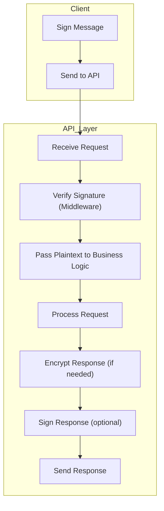

# Centralized Security Implementation Plan

## Goals
- All signature verification occurs in one place (e.g., HTTP middleware or API gateway).
- All encryption/decryption occurs in one place (e.g., a database access wrapper).
- No security logic scattered throughout business logic, schema, or storage code.

---

## Architecture Diagram

---

## Implementation Steps

1. **Signature Verification Middleware**
   - Implement a single Actix middleware (or handler wrapper) that:
     - Extracts and verifies the signature on every incoming request that requires authentication.
     - Rejects requests with invalid or missing signatures.
     - Attaches the verified identity to the request context for downstream handlers.
   - All business logic and database code can assume the request is already authenticated.

2. **Central Encryption Layer**
   - Implement a single encryption/decryption module (e.g., `EncryptedDb` or `EncryptedStore`).
   - All database reads/writes go through this module:
     - On write: encrypts data before passing to the underlying DB.
     - On read: decrypts data after fetching from the DB.
   - The rest of the codebase interacts with the database only through this wrapper.
   - No encryption logic in schema, business logic, or other modules.

3. **API Integration**
   - All API endpoints that require security:
     - Use the signature verification middleware.
     - Use the encryption layer for any sensitive data storage/retrieval.
   - Non-sensitive endpoints can bypass these layers as needed.

4. **Testing and Documentation**
   - Write integration tests to ensure:
     - Requests without valid signatures are rejected.
     - Data is always encrypted at rest and decrypted on access.
   - Document the security boundary and how to use the centralized layers.

---

## Benefits

- **Simplicity**: Security logic is easy to audit and maintain.
- **Consistency**: No risk of missing security checks in deep code paths.
- **Performance**: Only one signature verification and one encryption/decryption per request.
- **Extensibility**: Easy to swap out encryption or signature schemes in one place.

---

## Next Steps

1. Implement Actix middleware for signature verification.
2. Refactor DB access to go through a single encryption/decryption wrapper.
3. Update API endpoints to use these layers.
4. Add integration tests and update documentation.

---

This plan ensures all security is handled at the "edges" of your system, making it easy to maintain, audit, and extend.