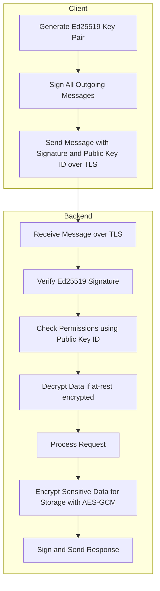

<file name=0 path=/Users/tomtang/projects/engram/datafold/docs/proposals/security_module_architecture_2025-06-20.md># Security Module Architecture Plan

**Date:** 2025-06-20

## Overview

This document outlines the architecture for a security module to be integrated into the backend. The module will provide:

- Ed25519-based client key management (client-side generation)
- Message signing and verification for all client-backend communication
- TLS for all network transport
- At-rest encryption for sensitive data in the backend (AES-GCM)
- Integration with network and permissions layers

---

## Architecture Diagram



---

## Implementation Steps

1. **Crypto Libraries**
   - Use `ed25519-dalek` for signatures.
   - Use `aes-gcm` or `ring` for at-rest encryption.
   - Use `rustls` or native TLS for transport.

2. **Client Key Management**
   - Clients generate Ed25519 key pairs locally.
   - Public key registered with backend.
   - Private key never leaves client.

3. **Message Signing**
   - All messages signed with private key.
   - Format: `{ "payload": ..., "signature": ..., "public_key_id": ... }`
   - Backend verifies signature.

4. **TLS for Transport**
   - All endpoints require TLS.

5. **At-Rest Encryption**
   - Sensitive data encrypted before storage (AES-GCM).
   - Keys managed securely on backend.

6. **Integration Points**
   - **Network Layer**: Enforce TLS, verify signatures.
   - **Permissions Layer**: Use public key ID for permissions.
   - **Storage Layer**: Encrypt/decrypt sensitive data.

7. **Documentation**
   - Example client code for key generation and signing.
   - Document message format and backend requirements.

---

## Advanced: Identity-Based Encryption Prototype

### 🔐 Identity-Based Encryption Prototype Design with Ed25519

**Overview**

This document describes how to implement encryption-at-rest tied to Ed25519-based identity without requiring cloud KMS or user passphrases. It leverages deterministic key derivation from an Ed25519 identity after signature verification, without the backend ever accessing or converting the Ed25519 private key. Key derivation is based on client identity, enabling encryption key material to be derived securely.

---

### ✅ Goals
- Authenticate requests using Ed25519 signatures from frontend
- Derive symmetric encryption keys (e.g., AES-256) without storing them
- Avoid requiring users to manage passwords
- Avoid relying on third-party KMS

---

### 🔑 Key Concepts

**Ed25519**
- Used for digital signatures (not encryption)
- Private key stays on frontend
- Backend uses public key to verify signed requests

**X25519**
- Used for ECDH (key exchange)
- Can be derived from Ed25519 private key (libsodium-compatible)

**HKDF**
- Key derivation function
- Deterministic: same inputs → same output
- Uses optional info parameter to separate key purposes

---

### 🧱 Architecture

**Frontend**
- Holds Ed25519 private key
- Signs each request body or nonce
- Sends signed message to backend

**Backend**
- Verifies Ed25519 signature using known public key
- Derives encryption key material based on authenticated client identity (e.g., via verified public key or a shared ECDH exchange)
- Uses HKDF to derive AES-256 key for encryption at rest
- Never stores or accesses client private keys — derives keys on demand only for authenticated requests

---

### 🔁 Key Derivation Pipeline

```rust
// Convert Ed25519 public identity to X25519-compatible key material (if shared secret is needed)
let x25519_sk_bytes = crypto_sign_ed25519_sk_to_curve25519(ed25519_sk.encode());

// Derive AES key using HKDF
let hkdf = HKDF::new(
    algorithm: SHA256,
    length: 32,
    salt: b"optional-salt",
    info: b"data-at-rest-key"
);
let aes_key = hkdf.derive(x25519_sk_bytes);
```

- **salt**: Optional static salt
- **info**: Context string for namespacing (e.g., `b"data-at-rest"`, `b"user-42-file-3"`)

Note: In production, the backend must not hold or convert client private keys. The frontend may perform key derivation and encrypt payloads directly, or the backend can derive per-client keys using verified public identity plus ECDH with a backend-held X25519 private key.

---

### 🔐 Security Properties

| Property | Result |
|----------|--------|
| Deterministic key derivation | ✅ Yes |
| Key stored on disk | ❌ No |
| Tied to Ed25519 identity | ✅ Yes |
| Requires passphrase | ❌ No |
| Auth required to unlock data | ✅ Yes (via signature) |
| Easy to rotate or namespace keys | ✅ Yes (via info) |

---

### 🛡️ Best Practices
- Use strong frontend key management (hardware-backed if possible)
- Use fixed, application-specific salt
- Always verify Ed25519 signature before deriving encryption key
- Lock memory if holding AES keys for any duration
- Namespace keys with info for per-file or per-user key separation

---

### 🧪 Sample Use Cases
- Encrypt per-user file vault using user's Ed25519 key
- Encrypt database rows without storing per-user keys
- Build decentralized storage encryption using identity-derived keys

---

### 🚀 Next Steps for Identity-Based Encryption
- Implement frontend Ed25519 keypair generation and storage
- Set up signature scheme for each request
- Backend: implement signature verification + X25519 conversion + HKDF
- Integrate AES-GCM/ChaCha20 encryption with derived keys

---

## Next Steps

- Implement the security module as described.
- Integrate with network, permissions, and storage layers.
- Provide developer documentation and client examples.
- Consider implementing advanced identity-based encryption for enhanced security.