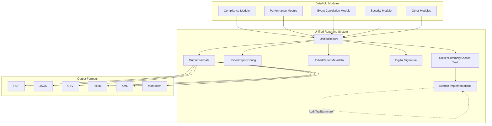

# Unified Reporting Architecture

## Overview

The DataFold Unified Reporting Architecture provides a standardized framework for generating, formatting, and distributing reports across all platform modules. This system unifies previously disparate reporting structures from security, compliance, performance, and validation modules into a cohesive, extensible architecture.

## Rationale for Unification

Prior to unification, DataFold modules maintained separate reporting structures leading to:

- **Code Duplication**: Similar report structures duplicated across modules
- **Inconsistent Formats**: Different field naming and structure conventions
- **Integration Complexity**: Difficulty in creating cross-module reports
- **Maintenance Burden**: Multiple APIs to maintain and extend

The unified architecture addresses these issues by providing:

- **Consistency**: Standardized metadata, formats, and interfaces
- **Extensibility**: Trait-based system for new section types
- **Type Safety**: Rust's type system ensures correct usage
- **Flexibility**: Dynamic section storage for module-specific data
- **Security**: Built-in digital signature support for report integrity

## Architecture Overview



## Core Components

### 1. UnifiedReport

The [`UnifiedReport`](../../src/reporting/types.rs:653) struct serves as the main container for all reports. It provides:

- **Metadata Management**: Standardized report identification and tracking
- **Configuration Control**: Flexible output and processing options
- **Section Storage**: Dynamic storage for module-specific content
- **Digital Signatures**: Optional cryptographic integrity verification

```rust
pub struct UnifiedReport {
    pub metadata: UnifiedReportMetadata,
    pub config: UnifiedReportConfig,
    pub sections: HashMap<String, serde_json::Value>,
    pub digital_signature: Option<String>,
}
```

### 2. UnifiedSummarySection Trait

The [`UnifiedSummarySection`](../../src/reporting/types.rs:404) trait provides a standardized interface for all report sections:

```rust
pub trait UnifiedSummarySection: Serialize + std::fmt::Debug + Send + Sync {
    fn section_name(&self) -> &'static str;
}
```

**Requirements:**
- Must be serializable with Serde
- Must provide unique section identifier
- Must support debugging and thread safety

### 3. Report Formats

The [`UnifiedReportFormat`](../../src/reporting/types.rs:98) enum supports multiple output formats:

| Format | Use Case | MIME Type |
|--------|----------|-----------|
| **PDF** | Executive reports, archival | `application/pdf` |
| **JSON** | API integration, data processing | `application/json` |
| **CSV** | Spreadsheet analysis, data import | `text/csv` |
| **HTML** | Web dashboards, browser display | `text/html` |
| **XML** | Enterprise system integration | `application/xml` |
| **Markdown** | Documentation, technical reports | `text/markdown` |

### 4. Report Configuration

The [`UnifiedReportConfig`](../../src/reporting/types.rs:303) controls report generation:

- **Output Formats**: Multiple format generation in single operation
- **Section Filtering**: Include specific sections only
- **Data Privacy**: Anonymization for sensitive information
- **Security Requirements**: Digital signature enforcement
- **Extension Options**: Module-specific configuration parameters

### 5. Report Metadata

The [`UnifiedReportMetadata`](../../src/reporting/types.rs:225) provides consistent tracking:

- **Unique Identification**: UUID-based report tracking
- **Type Classification**: Categorical report typing
- **Temporal Information**: Generation timestamps and periods
- **Source Attribution**: System/user identification
- **Organizational Context**: Multi-tenant support

## Design Principles

### Consistency
All reports use the same metadata structure, format options, and section interface patterns. This ensures predictable behavior across modules and simplifies integration.

### Extensibility  
New section types can be added by implementing the [`UnifiedSummarySection`](../../src/reporting/types.rs:404) trait. The trait-based design allows for unlimited module-specific extensions without core system changes.

### Type Safety
Rust's type system ensures compile-time verification of correct usage patterns. The trait system prevents runtime errors from incorrect section handling.

### Flexibility
Dynamic section storage using `HashMap<String, serde_json::Value>` allows modules to include arbitrary structured data while maintaining type safety at the section level.

### Security
Digital signature support provides cryptographic verification of report integrity. Signatures can be required per report configuration and verified independently.

## Pre-Built Section Types

The system includes several ready-to-use section implementations:

### ExecutiveSummary
High-level report overview with key findings and overall status assessment.

### SecurityIncidentSummary  
Security incident aggregation with severity/type breakdowns and threat analysis.

### AuditTrailSummary
Audit log analysis with compliance event tracking and verification statistics.

### PerformanceSummary
Performance metrics aggregation with measurement data and trend analysis.

### ComplianceSummary
Compliance status reporting with policy adherence and risk assessment.

## Benefits Achieved

### For Developers
- **Single API**: One reporting interface across all modules
- **Type Safety**: Compile-time verification of correct usage
- **Extensibility**: Easy addition of new section types
- **Consistency**: Predictable patterns and behaviors

### For Operations
- **Unified Monitoring**: Consistent report formats and metadata
- **Cross-Module Reports**: Ability to combine data from multiple modules
- **Flexible Output**: Multiple formats from single report generation
- **Audit Trail**: Complete report generation tracking

### For Security
- **Data Integrity**: Digital signature verification
- **Access Control**: Configuration-based section filtering
- **Privacy Protection**: Built-in data anonymization
- **Compliance**: Standardized audit and compliance reporting

## Migration Impact

The unified architecture has been successfully adopted across:

- **Compliance Module**: Key rotation and policy compliance reporting
- **Performance Module**: System and authentication performance metrics  
- **Event Correlation Module**: Security event analysis and correlation
- **Security Module**: Incident tracking and threat assessment

All legacy reporting structures have been migrated to use the unified system while maintaining backward compatibility for existing integrations.

## Next Steps

1. **Review Module Documentation**: Ensure all module-specific documentation references unified reporting
2. **API Documentation**: Complete comprehensive API reference documentation  
3. **Migration Guide**: Finalize migration patterns for future modules
4. **Best Practices**: Document recommended usage patterns and conventions

---

**See Also:**
- [API Reference](api.md) - Comprehensive API documentation
- [Migration Guide](migration-guide.md) - Module migration procedures  
- [Best Practices](best-practices.md) - Usage recommendations and conventions