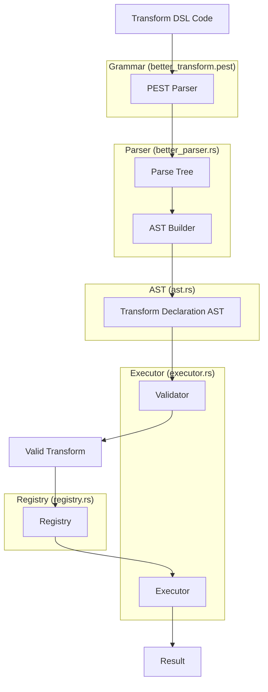
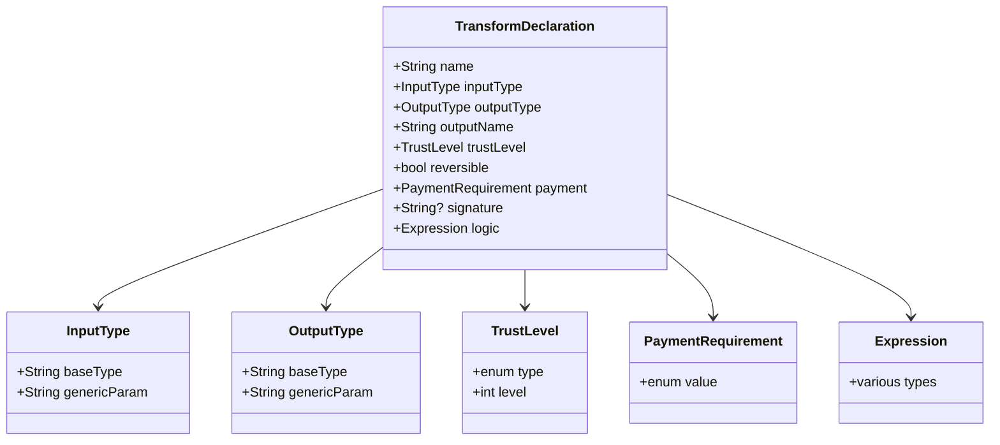

# Implementation Plan: DSL for Transforms in Datafold

This document outlines the detailed implementation plan for updating the better_parser to support the new Domain-Specific Language (DSL) for Transforms in Datafold.

## 1. Overview

The goal is to enhance the existing parser to support a declarative syntax for expressing transformations with features like:
- Static validation of trust bounds
- Reversibility checks
- Field access validation
- Auditability and signed attestations

## 2. Example DSL Syntax

```
transform calculate_risk_score {
  input: Fold<PatientVitals>
  output: Field<Float> as "risk_score"
  trust: read <= 3
  reversible: false
  payment: required
  signature: sha256sum("v1.0.3")

  logic: {
    let bmi = input.weight / (input.height ^ 2)
    let risk = 0.5 * input.blood_pressure + 1.2 * bmi
    return clamp(risk, 0, 100)
  }
}
```

## 3. Implementation Steps

### 3.1 Update the AST (ast.rs)

Add new data structures to represent the full transform declaration:

```rust
/// Represents a transform declaration in the DSL.
#[derive(Debug, Clone, PartialEq)]
pub struct TransformDeclaration {
    /// The name of the transform
    pub name: String,
    
    /// The input type (e.g., Fold<PatientVitals>)
    pub input_type: InputType,
    
    /// The output type (e.g., Field<Float>)
    pub output_type: OutputType,
    
    /// The output name (e.g., "risk_score")
    pub output_name: String,
    
    /// Whether the transform is reversible
    pub reversible: bool,
    
    /// The signature for verification
    pub signature: Option<String>,
    
    /// The transform logic
    pub logic: Expression,
}

/// Represents an input type in the DSL.
#[derive(Debug, Clone, PartialEq)]
pub struct InputType {
    /// The base type (e.g., Fold)
    pub base_type: String,
    
    /// The generic parameter (e.g., PatientVitals)
    pub generic_param: String,
}

/// Represents an output type in the DSL.
#[derive(Debug, Clone, PartialEq)]
pub struct OutputType {
    /// The base type (e.g., Field)
    pub base_type: String,
    
    /// The generic parameter (e.g., Float)
    pub generic_param: String,
}

```

### 3.2 Update the Grammar (better_transform.pest)

Extend the grammar to support the full transform declaration syntax:

```pest
// Transform declaration
transform_decl = {
    "transform" ~ identifier ~ "{" ~
    input_decl ~
    output_decl ~
    trust_decl? ~
    reversible_decl? ~
    payment_decl? ~
    signature_decl? ~
    logic_decl ~
    "}"
}

// Input declaration
input_decl = { "input" ~ ":" ~ type_expr }

// Output declaration
output_decl = { "output" ~ ":" ~ type_expr ~ "as" ~ string }

// Trust declaration
trust_decl = { "trust" ~ ":" ~ trust_expr }

// Reversible declaration
reversible_decl = { "reversible" ~ ":" ~ boolean }

// Payment declaration
payment_decl = { "payment" ~ ":" ~ payment_expr }

// Signature declaration
signature_decl = { "signature" ~ ":" ~ string_expr }

// Logic declaration
logic_decl = { "logic" ~ ":" ~ "{" ~ expr* ~ "}" }

// Type expression (e.g., Fold<PatientVitals>)
type_expr = { identifier ~ "<" ~ identifier ~ ">" }

// Trust expression (e.g., read <= 3)
trust_expr = {
    "read" ~ comp_op ~ number |
    "write" ~ comp_op ~ number |
    "unrestricted"
}

// Payment expression
payment_expr = { "required" | "optional" | "none" }

// String expression
string_expr = { string | function_call }
```

### 3.3 Update the Better Parser (better_parser.rs)

Extend the parser to handle the full transform declaration:

```rust
impl BetterParser {
    /// Parses a transform declaration.
    pub fn parse_transform(&self, input: &str) -> Result<TransformDeclaration, SchemaError> {
        // Parse the input using the transform_decl rule
        let pairs = Self::parse(Rule::transform_decl, input)
            .map_err(|e| SchemaError::InvalidField(format!("Parse error: {}", e)))?;
        
        // Get the transform declaration from the parse result
        let decl_pair = pairs.into_iter().next().unwrap();
        
        // Convert the parse tree to a TransformDeclaration
        self.build_transform_decl(decl_pair)
    }
    
    /// Builds a TransformDeclaration from a parse tree.
    fn build_transform_decl(&self, pair: Pair<Rule>) -> Result<TransformDeclaration, SchemaError> {
        // Implementation details for parsing the transform declaration
        // This will extract all the components (name, input, output, trust, etc.)
    }
    
    // Additional methods for parsing input_decl, output_decl, etc.
    fn parse_input_decl(&self, pair: Pair<Rule>) -> Result<InputType, SchemaError> {
        // Parse the input declaration
    }
    
    fn parse_output_decl(&self, pair: Pair<Rule>) -> Result<(OutputType, String), SchemaError> {
        // Parse the output declaration
    }
    
    fn parse_trust_decl(&self, pair: Pair<Rule>) -> Result<TrustLevel, SchemaError> {
        // Parse the trust declaration
    }
    
    fn parse_reversible_decl(&self, pair: Pair<Rule>) -> Result<bool, SchemaError> {
        // Parse the reversible declaration
    }
    
    fn parse_payment_decl(&self, pair: Pair<Rule>) -> Result<PaymentRequirement, SchemaError> {
        // Parse the payment declaration
    }
    
    fn parse_signature_decl(&self, pair: Pair<Rule>) -> Result<String, SchemaError> {
        // Parse the signature declaration
    }
    
    fn parse_logic_decl(&self, pair: Pair<Rule>) -> Result<Expression, SchemaError> {
        // Parse the logic declaration
    }
}
```

### 3.4 Update the Transform Struct (transform.rs)

Extend the Transform struct to include the new fields:

```rust
#[derive(Debug, Clone, Serialize, Deserialize)]
pub struct Transform {
    /// The name of the transform
    pub name: String,
    
    /// The input type (e.g., Fold<PatientVitals>)
    pub input_type: String,
    
    /// The output type (e.g., Field<Float>)
    pub output_type: String,
    
    /// The output name (e.g., "risk_score")
    pub output_name: String,
    
    /// The trust level (e.g., read <= 3)
    pub trust_level: Option<String>,
    
    /// Whether this transform is reversible
    pub reversible: bool,
    
    /// The payment requirement (required, optional, or none)
    pub payment_required: bool,
    
    /// Optional signature for verification
    pub signature: Option<String>,
    
    /// The transform logic expressed in the DSL
    pub logic: String,
    
    // Existing fields...
    #[serde(default)]
    pub input_dependencies: Vec<String>,
    
    #[serde(skip)]
    pub output_reference: Option<String>,
    
    #[serde(skip)]
    pub parsed_expr: Option<crate::schema::transform::ast::Expression>,
}

// Update constructors and methods to handle the new fields
impl Transform {
    pub fn new_with_declaration(
        declaration: TransformDeclaration,
    ) -> Self {
        // Create a new Transform from a TransformDeclaration
    }
    
    // Other methods...
}
```

### 3.5 Update the Executor (executor.rs)

Update the executor to handle the new transform structure:

```rust
impl TransformExecutor {
    // Add methods to validate trust bounds
    fn validate_trust_bounds(&self, transform: &Transform, context: &ExecutionContext) -> Result<(), SchemaError> {
        // Validate that the execution context satisfies the trust bounds
    }
    
    // Add methods to validate payment requirements
    fn validate_payment_requirements(&self, transform: &Transform, context: &ExecutionContext) -> Result<(), SchemaError> {
        // Validate that the payment requirements are satisfied
    }
    
    // Update the execute_transform method to use the new validation methods
    pub fn execute_transform(
        &self,
        transform: &Transform,
        input_values: HashMap<String, JsonValue>,
        context: &ExecutionContext,
    ) -> Result<JsonValue, SchemaError> {
        // Validate trust bounds and payment requirements
        self.validate_trust_bounds(transform, context)?;
        self.validate_payment_requirements(transform, context)?;
        
        // Execute the transform
        // ...
    }
}
```

### 3.6 Update the Registry (registry.rs)

Update the registry to handle the new transform structure:

```rust
impl TransformRegistry {
    // Update the register_transform method to handle the new transform structure
    pub fn register_transform(
        &self,
        transform_id: String,
        transform: Transform,
        input_arefs: Vec<String>,
        output_aref: String,
    ) -> Result<(), SchemaError> {
        // Validate the transform
        TransformExecutor::validate_transform(&transform)?;
        
        // Set the transform's input dependencies and output reference
        // ...
        
        // Register the transform
        // ...
    }
    
    // Add methods to query transforms by trust level, payment requirements, etc.
    pub fn get_transforms_by_trust_level(&self, trust_level: TrustLevel) -> Vec<String> {
        // Get all transforms that satisfy the given trust level
    }
    
    pub fn get_transforms_by_payment_requirement(&self, payment_requirement: PaymentRequirement) -> Vec<String> {
        // Get all transforms that satisfy the given payment requirement
    }
}
```

### 3.7 Add Tests

Add tests for the new functionality:

```rust
#[cfg(test)]
mod tests {
    use super::*;
    
    #[test]
    fn test_parse_transform_declaration() {
        // Test parsing a transform declaration
    }
    
    #[test]
    fn test_validate_trust_bounds() {
        // Test validating trust bounds
    }
    
    #[test]
    fn test_validate_payment_requirements() {
        // Test validating payment requirements
    }
    
    #[test]
    fn test_execute_transform_with_declaration() {
        // Test executing a transform with a declaration
    }
}
```

## 4. Implementation Flow



## 5. Transform Structure



## 6. Timeline and Milestones

1. **Week 1**: Update AST and Grammar
   - Define new data structures in ast.rs
   - Update grammar in better_transform.pest

2. **Week 2**: Update Parser
   - Implement parsing methods in better_parser.rs
   - Add tests for parsing

3. **Week 3**: Update Transform and Executor
   - Update Transform struct
   - Update executor to handle new transform structure
   - Add validation for trust bounds and payment requirements

4. **Week 4**: Update Registry and Integration
   - Update registry to handle new transform structure
   - Integrate all components
   - Add end-to-end tests

## 7. Conclusion

This implementation plan provides a comprehensive approach to updating the better_parser to support the new DSL for Transforms in Datafold. By following this plan, we will be able to implement a secure, auditable, and feature-rich DSL for writing transformations in the Datafold platform.